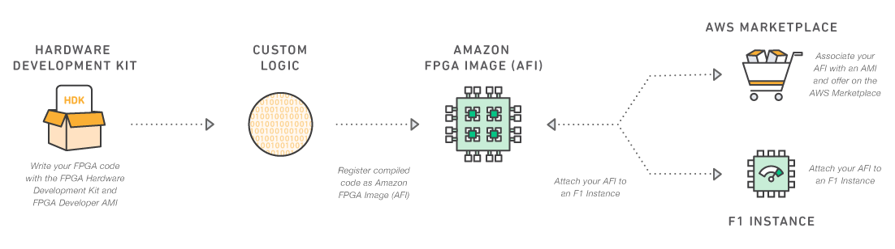

# Table of Contents

1. [Overview of AWS EC2 FPGA Development Kit](#overviewdevkit)
    - [Development environments](#overviewdevenv)
    - [Runtime enviroments](#overviewrunenv)
    - [Example applications](#overviewexapps)
    - [Development tools](#overviewdevtools)
2. [Getting Started](#gettingstarted)
3. [FPGA Developer AMI available on AWS Marketplace](#devAmi)
4. [FPGA Hardware Development Kit (HDK)](#fpgahdk)
5. [FPGA Software Development Kit (SDK)](#fpgasdk)
6. [OpenCL Development Environment with Amazon EC2 F1 FPGA Instances to accelerate your C/C++ applications](#sdaccel)
7. [Developer Support](#devSupport)

# Overview of AWS EC2 FPGA Development Kit

The AWS EC2 FPGA Development Kit is provided by AWS to support development and runtime on [AWS FPGA instances](https://aws.amazon.com/ec2/instance-types/f1/).  Amazon EC2 FPGA instances are high-performance compute instances with field programmable gate arrays (FPGAs) that are programmed to create custom hardware accelerations in EC2. F1 instances are easy to program and come with everything needed to develop, simulate, debug, compile and run hardware accelerated applications.  Using the [FPGA developer AMI](https://aws.amazon.com/marketplace/pp/B06VVYBLZZ), developers create an FPGA design. Once the FPGA design is complete, developers create the Amazon FPGA Image (AFI), and deploy it to the F1 instance in just a few clicks. AFIs are reusable, shareable and can be deployed in a scalable and secure way.  

## Overview of Development Environments

| Development Environment     | Developer Interface | Accelerator Language   | Development Tool | Debug Options| Typical Development Time |
| --------|---------|---------|-------|-------|-------|
| [Software Defined Accelerator Development - SDAccel](SDAccel/README.md) | Script or GUI | C/C++/OpenCL/Verilog/VHDL | SDx/Vivado | SW/HW Emulation, Simulation, Chipscope | Days |
| [Hardware Accelerator Development - HDK](hdk/README.md) | Script | Verilog/VHDL (RTL) | Vivado | Simulation, Virtual JTAG | Months |
| [IP Integrator (HLx)](hdk/docs/IPI_GUI_Vivado_Setup.md) | GUI | Verilog/VHDL/C | Vivado | Simulation, Virtual JTAG | Weeks |

## Overview of Runtime Enviroments

| Runtime Environment     | Hardware Interface | Host Code Language   | FPGA Tools |
| --------|---------|---------|-------|
| [C/C++ Software Defined Accelerator Development](SDAccel/README.md) | OpenCL APIs | C/C++/OpenCL | [SDK](./sdk) |
| [Hardware Accelerator Development](hdk/README.md) | XDMA Driver APIs, memcpy, peek/poke | C/C++ | [SDK](./sdk) |
| [IP Integrator (HLx)](hdk/docs/IPI_GUI_Vivado_Setup.md) | XDMA Driver APIs, memcpy, peek/poke | C/C++ | [SDK](./sdk) |

## Overview of Development Tools

| Tool     | Development/Runtime | Tool location | Description |
| --------|---------|---------|---------|
| SDx 2017.4 | Development | [FPGA developer AMI](https://aws.amazon.com/marketplace/pp/B06VVYBLZZ) | Used for [Software Defined Accelerator Development](SDAccel/README.md) |
| Vivado 2017.4 | Development | [FPGA developer AMI](https://aws.amazon.com/marketplace/pp/B06VVYBLZZ) | Used for [Hardware Accelerator Development](hdk/README.md) |
| FPGA AFI Mangement Tools | Runtime | [SDK - fpga_mgmt_tools](sdk/userspace/fpga_mgmt_tools) | Command-line tools used for FPGA management while running on the F1 instance |
| Virtual JTAG | Development (Debug) | [FPGA developer AMI](https://aws.amazon.com/marketplace/pp/B06VVYBLZZ) | Runtime debug waveform |
| wait_for_afi | Development | [wait_for_afi.py](hdk/common/scripts/wait_for_afi.py) | Helper script that notifies via email on AFI generation completion |
| notify_via_sns | Development | [notify_via_sns.py](hdk/common/scripts/notify_via_sns.py) | Notifies developer when design build process completes |
| check_create_fpga_image | Development | [check_create_fpga_image.py](hdk/common/scripts/check_create_fpga_image.py) | Helper script that monitors the S3 bucket used for AFI generation |
| AFI Management | Development | [Copy](hdk/docs/copy_fpga_image.md), [Delete](hdk/docs/delete_fpga_image.md), [Describe](hdk/docs/describe_fpga_images.md), [Attributes](hdk/docs/fpga_image_attributes.md) | AWS CLI EC2 commands for managing your AFIs |

NOTE: For on-premises development, SDx/Vivado must have the correct license and use one of the [supported versions of SDx/Vivado](./supported_vivado_versions.txt). The FPGA HDK+SDK [Release Notes](./RELEASE_NOTES.md) may contain additional information.  The following links have more information on on-premises development:  [Vivado requirements](hdk/docs/on_premise_licensing_help.md) and [SDx requirements](SDAccel/docs/On_Premises_Development_Steps.md)

## Overview of Example Applications
| Accelerator Application     | Example | Development Environment   | Description |
| --------|---------|---------|-------|
| Custom hardware | [cl_dram_dma](hdk/cl/examples/cl_dram_dma) | HDK - RTL | Demonstrates connectivity to the F1 shell and interfacing with DRAM |
| Custom hardware IP integration example using a GUI | [cl_dram_dma_hlx](hdk/cl/examples/cl_dram_dma_hlx) | HLx - Verilog  | Demonstrates connectivity to the F1 shell and interfacing with DRAM using the Vivado IP Integrator GUI |
| Digital Up-Converter using High Level Synthesis | [cl_hls_dds_hlx](hdk/cl/examples/cl_hls_dds_hlx) | HLx - C-to-RTL  | Demonstrates an example application written in C that is synthesized to RTL (Verilog) |
| Security   | [AES, RSA, SHA1](https://github.com/Xilinx/SDAccel_Examples/tree/master/security) | SDAccel - C/C++/OpenCL  | Demonstrates methods of using hardware acceleration to speed up security software algorithms  |
| Computer Vision   | [Affine, Convolve, Huffman, IDCT](https://github.com/Xilinx/SDAccel_Examples/tree/master/vision) | SDAccel - C/C++/OpenCL  | Demonstrates methods of using hardware acceleration to speed up image detection algorithms  |
| Misc Algorithms   | [Kmeans, SmithWaterman, MatrixMult](https://github.com/Xilinx/SDAccel_Examples/tree/master/acceleration) | SDAccel - C/C++/OpenCL  | Demonstrates methods of using hardware acceleration to compute, sorting and search algorithms  |
| Financial   | [Blacksholes, Heston](https://github.com/KitAway/FinancialModels_AmazonF1) | SDAccel - C/C++/OpenCL  | Demonstrates methods of using hardware acceleration on Monte Carlo financial models  |
| Custom Hardware with Software Defined Acceleration   | [RTL Kernels](https://github.com/Xilinx/SDAccel_Examples/tree/master/getting_started/rtl_kernel) | SDAccel - RTL + C/C++/OpenCL  | RTL running in the software defined development enviroment  |
| File Compression   | [GZip](https://github.com/Xilinx/Applications/tree/master/GZip) | SDAccel - C/C++/OpenCL  | FPGA based GZIP compression |
| WebP Image Compression   | [WebP](https://github.com/Xilinx/Applications/tree/master/webp) | SDAccel - C/C++/OpenCL  | FPGA accelerated WebP encoder application |

# Getting Started 

### Setting up a development environment 
The developer kit is supported for Linux operating systems only.  You have the choice to develop on AWS using the [FPGA developer AMI](https://aws.amazon.com/marketplace/pp/B06VVYBLZZ) or on-premises. Next you should execute `git clone https://github.com/aws/aws-fpga.git` to download the latest release to your EC2 Instance or local server. For an SSH connection execute `git clone git@github.com:aws/aws-fpga.git`. [To get help with connecting to Github via SSH](https://help.github.com/articles/connecting-to-github-with-ssh/).

The following examples will guide you through the first development steps:

  * For the HDK development environment use the [HDK Hello World Example](hdk/cl/examples/README.md)
  * For the Software-defined development environment use the [SW Hello World Example](SDAccel/README.md)

### Best practices
* Make sure you review the [Release Notes](./RELEASE_NOTES.md) and [Errata](./ERRATA.md) documents which cover the list of supported features, programming environments, and known issues.
* Click the "Watch" button in GitHub upper right corner to get regular updates.  Also, we recommend you will join the [AWS forum](https://forums.aws.amazon.com/forum.jspa?forumID=243) to engage with the FPGA developer community and get help when needed (both AWS and Xilinx engineers monitor this forum).

### New to AWS?
If you are new to AWS, we recommend you will start [here](https://aws.amazon.com/getting-started/), to learn how to use AWS EC2, S3 and the AWS CLI.  These services are required to start developing accelerations for AWS FPGAs. For example, executing `aws s3 <action>` and `aws ec2 create-fpga-image` require having AWS CLI installed, the server/instance has been configured with your credentials in the same AWS region as your S3 bucket via `aws configure` command line. It’s also required that your instance and the S3 bucket storing the FPGA design tarball reside in the same AWS region.  For configuration details please refer to [Getting started with AWS CLI.](http://docs.aws.amazon.com/cli/latest/userguide/cli-chap-getting-started.html)

### New to AWS FPGAs? 
Before you start our first AWS FPGA design, we recommend to go through one of the following examples:
  * Hardware developers who plan on using the AWS FPGA HDK development environment, start with  [Hello World Example - Skip to steps 4-6](hdk/cl/examples/README.md)
  * Software develoeprs who plan to use the software-defined development environment, start with [Hello World Example](SDAccel/examples/aws/helloworld_ocl_runtime/README.md)

 ### In-depth training and resources
Once you completed your hello world examples, we recommend you will dive deeper into a training workshop or application notes
 * Software-defined flow over with the [re:Invent 2017 Workshop](https://github.com/awslabs/aws-fpga-app-notes/blob/master/reInvent17_Developer_Workshop/README.md)
  * Application Notes: [Methods of interfacing the host application to the Hardware accelerator](https://github.com/awslabs/aws-fpga-app-notes)
  * Learn about how the hardware accelerator interfaces to the F1 Shell
  ** [Shell Interface](hdk/docs/AWS_Shell_Interface_Specification.md)
  ** [Shell Address Map](hdk/docs/AWS_Fpga_Pcie_Memory_Map.md)
  ** [Programmer view of the FPGA](./hdk/docs/Programmer_View.md)
  ** [Virtual JTAG](hdk/docs/Virtual_JTAG_XVC.md)

# FPGA Developer AMI

The [FPGA developer AMI](https://aws.amazon.com/marketplace/pp/B06VVYBLZZ) is packaging the tools and drivers needed for FPGA development on EC2 instances. It is available, at no software charge on AWS Marketplace. It can run on many [EC2 instance types](https://aws.amazon.com/ec2/instance-types/). Given the large size of the FPGA used inside the AWS FPGA instances, the implementation tools require 32GiB Memory (ex: c4.4xlarge, m4.2xlarge, r4.xlarge, t2.2xlarge). c4.4xlarge and c4.8xlarge would provide the fastest execution time with 30 and 60GiB of memory respectively. Developers who want to save on cost, would start coding and run simulations on low-cost instances, like t2.2xlarge, and move to the aformentioned larger instances to run the synthesis of their acceleration code. 

Currently the FPGA developer AMI supports Xilinx SDx 2017.4 and 2017.1 toolchain versions. The following compatibility table describes the mapping of developer kit version to AMI version:  

| FPGA Developer Kit Version   | Tool Version Supported     |  Compatible AMI Version     |
|-----------|-----------|------|
| 1.4.0 | 2017.4 | v1.4.0 or greater (Xilinx SDx 2017.4) |
| 1.3.0-1.3.6 | 2017.1 | v1.3.5 |
| 1.3.7 or greater | 2017.1 | v1.3.5 or greater (Xilinx SDx 2017.4) |
| 1.3.7 or greater | 2017.4 | v1.4.0 or greater (Xilinx SDx 2017.4) |

<TODO> Missing a  "Software-defined Kit" section

# Hardware Development Kit (HDK)

The [HDK directory](./hdk/README.md) contains useful information, examples, and scripts for developers wanting to start building Amazon FPGA Images (AFI).  It includes the development environment, simulation, build and AFI creation scripts.  The HDK can be installed on any on-premises server or an EC2 instance. The HDK is not required if you plan to use a pre-built AFI shared from another developer. 

# Sofware-defined Development Environment 

The software-defined development environment allows customers to compile their C/C++ code into the FPGA as kernels, and use OpenCL APIs to pass data to the FPGA. Software developers with little to no FPGA experience will find a familiar development experience and supercharge their cloud applications.

In addition, the development environment (called SDAccel) allows the integration of pre-existing RTL designs into the C/C++ based acceleration, allowing for fast prototpying using C/C++ and manual optimization of critical blocks with RTL (Similar approach that developers choose sometime to optimize time critical functions by using assembly level programming and not relaying on compilers to generate that function from C/C++ code)

This developer kit has 80+ examples to help you get started on FPGA acceleration.  To get started, review the [Software-defined development environment readme](SDAccel/README.md) file.

# Runtime Tools (SDK)

The [SDK directory](./sdk/README.md) includes the runtime environment required to run on EC2 FPGA instances. It includes the drivers and tools to manage the AFIs that are loaded on the FPGA instance slots. The SDK isn't required during the AFI development process; it is only required once an AFI is loaded onto an EC2 FPGA instance. The following resources provide further details: <TODO>

# Developer Support

The [**Amazon FPGA Development User Forum**](https://forums.aws.amazon.com/forum.jspa?forumID=243&start=0) is the first place to go to post questions, learn from other users and read announcements from the EC2 FPGA team.

* To be notified on important messages click on the “Watch Forum” button on the right side of the screen.
* In case you can't see "Your Stuff" details, you will need to logout using the logout button on the forums page and log back in again.
