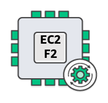

# AWS F2

## F2 FPGA Development Kit Overview

**Note**: The documentation and assets provided on this branch (and other branches prefixed with `f2`) are relevant to F2 instance type development only. F2 is the successor to F1. For F1 development, refer to [this branch](https://github.com/aws/aws-fpga/tree/master).

The F2 FPGA Development Kit is a hardware-software development kit that enables developers to create accelerators for the high-performance accelerator cards on EC2 F2 instances. Using the development kit, you can architect, simulate, optimize, and test your designs.

## F2 FPGA Development Kit Documentation

For full documentation, including a user guide, code snippets, and tutorials, see the [AWS EC2 FPGA Development Kit User Guide](./User_Guide_AWS_EC2_FPGA_Development_Kit.md)

## Support

To raise an issue or receive support, please [open an issue on the official GitHub page](https://github.com/aws/aws-fpga/issues).
