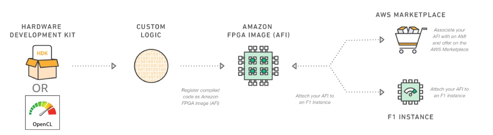

# Table of Contents

1. [Overview of AWS EC2 FPGA Development Kit](#overview-of-aws-ec2-fpga-development-kit)
    - [Developer Support](#developer-support)
    - [Development Flow](#development-flow)
    - [Development environments](#development-environments)
    - [FPGA Developer AMI](#fpga-developer-ami)
    - [FPGA Hardware Development Kit (HDK)](#hardware-development-kit-hdk)
    - [FPGA Software Development Kit (SDK)](#runtime-tools-sdk)
    - [Software Defined Development Environment](#software-defined-development-environment)
1. [Amazon EC2 F1 platform features](#amazon-ec2-f1-platform-features)
1. [Getting Started](#getting-started)
    - [Getting Familiar with AWS](#getting-familiar-with-aws)
    - [First time setup](#setting-up-development-environment-for-the-first-time)
    - [Quickstarts](#quickstarts)
    - [How To's](#how-tos)
1. [Documentation Overview](#documentation-overview)

# Overview of AWS EC2 FPGA Development Kit

AWS EC2 FPGA Development Kit is a set of development and runtime tools to develop, simulate, debug, compile and run hardware accelerated applications on [Amazon EC2 F1 instances](https://aws.amazon.com/ec2/instance-types/f1/).
It is distributed between this github repository and FPGA Developer AMI - [Centos](https://aws.amazon.com/marketplace/pp/B06VVYBLZZ)/[AL2](https://aws.amazon.com/marketplace/pp/B08NTMMZ7X) provided by AWS with no cost of development tools.

⚠️ <b>NOTE:</b> The developer kit is supported for Linux operating systems only.

## Developer Support

Opening a [GitHub Issue](https://github.com/aws/aws-fpga/issues) is the preferred method to get support with the AWS FPGA Development Kit. In addition, the [FPGA Development re:Post Tag](https://repost.aws/tags/TAc7ofO5tbQRO57aX1lBYbjA/fpga-development) is available to find FPGA-related discussion topics from the AWS community of customers, AWS customer support, and the AWS FPGA development team.

## Development Flow
After creating an FPGA design (also called CL - Custom logic), developers can create an Amazon FPGA Image (AFI) and easily deploy it to an F1 instance. AFIs are reusable, shareable and can be deployed in a scalable and secure way.



## Development Environments

| Development Environment | Description | Accelerator Language | Hardware Interface | Debug Options| Typical Developer                                                     |
| --------|---------|-------|---------|-------|-----------------------------------------------------------------------|
| Software Defined Accelerator Development using [Vitis](Vitis/README.md)/[SDAccel](SDAccel/README.md)| Development experience leverages an optimized compiler to allow easy new accelerator development or migration of existing C/C++/openCL, Verilog/VHDL to AWS FPGA instances | C/C++/OpenCL, Verilog/VHDL (RTL) | OpenCL APIs and XRT | SW/HW Emulation, Simulation, GDB, Virtual JTAG (Chipscope) | SW or HW Developer with zero FPGA experience                          |
| [Hardware Accelerator Development using Vivado](hdk/README.md) | Fully custom hardware development experience provides hardware developers with the tools required for developing AFIs for AWS FPGA instances  | Verilog/VHDL | [XDMA Driver](sdk/linux_kernel_drivers/xdma/README.md), [peek/poke](sdk/userspace/README.md) | Simulation, Virtual JTAG | HW Developer with advanced FPGA experience                            |
| [IP Integrator/High Level Design(HLx) using Vivado](hdk/docs/IPI_GUI_Vivado_Setup.md) | Graphical interface development experience for integrating IP and high level synthesis development | Verilog/VHDL/C | [XDMA Driver](sdk/linux_kernel_drivers/xdma/README.md), [peek/poke](sdk/userspace/README.md) | Simulation, Virtual JTAG | HW Developer with intermediate FPGA experience                        |
 | [On-premise development for Alveo U200 using Vitis targetted for migration to F1](Vitis/docs/Alveo_to_AWS_F1_Migration.md) | Vitis flow development using on-premise U200 platform targeted for migration to F1 |  C/C++/OpenCL, Verilog/VHDL (RTL) | OpenCL APIs and XRT | SW/HW Emulation, Simulation, GDB, JTAG (Chipscope) | SW or HW Developer with zero FPGA experience and on-premise U200 card |
 | [On-premise development for Alveo U200 using F1.A.1.4 shell](hdk/docs/U200_to_F1_migration_HDK.md) | HDK flow for on-premise U200 card using F1.A.1.4 shell targetted for migration to F1 | Verilog/VHDL | XDMA driver, peek/poke | Simulation, JTAG | HW Developer with advanced FPGA experience and on-premise U200 card   |
> For on-premise development, SDAccel/Vitis/Vivado must have the [correct license and use one of the supported tool versions](./docs/on_premise_licensing_help.md). 

## FPGA Developer AMI

The [FPGA Developer AMI](https://aws.amazon.com/marketplace/pp/B06VVYBLZZ) is available on the AWS marketplace without a software charge and includes tools needed for developing FPGA Designs to run on AWS F1. 

Given the large size of the FPGA used inside AWS F1 Instances, Xilinx tools work best with 32GiB Memory. 
z1d.xlarge/c5.4xlarge and z1d.2xlarge/c5.8xlarge instance types would provide the fastest execution time with 30GiB+ and 60GiB+ of memory respectively. 
Developers who want to save on cost, could start coding and run simulations on low-cost instances, like t2.2xlarge, and move to the aforementioned larger instances to run the synthesis of their acceleration code.

AWS marketplace offers multiple versions of the FPGA Developer AMI. The following section table describes the mapping of currently supported developer kit versions to AMI versions.

## Xilinx tool support

| Developer Kit Version | Tool Version Supported | Compatible FPGA Developer AMI Version       |
|-----------------------|------------------------|---------------------------------------------|
| 1.4.23+               | 2021.2                 | v1.12.X (Xilinx Vivado/Vitis 2021.2)        |
| 1.4.21+               | 2021.1                 | v1.11.X (Xilinx Vivado/Vitis 2021.1)        |
| 1.4.18+               | 2020.2                 | v1.10.X (Xilinx Vivado/Vitis 2020.2)        |
| 1.4.16+               | 2020.1                 | v1.9.0-v1.9.X (Xilinx Vivado/Vitis 2020.1)  |
| 1.4.13+               | 2019.2                 | v1.8.0-v1.8.X (Xilinx Vivado/Vitis 2019.2)  |
| 1.4.11+               | 2019.1                 | v1.7.0-v1.7.X (Xilinx Vivado/SDx 2019.1)    |
| 1.4.8 - 1.4.15b       | 2018.3                 | v1.6.0-v1.6.X (Xilinx Vivado/SDx 2018.3)    |
| 1.4.3 - 1.4.15b       | 2018.2                 | v1.5.0-v1.5.X (Xilinx Vivado/SDx 2018.2)    |
| ⚠️ 1.3.7 - 1.4.15b    | 2017.4                 | v1.4.0-v1.4.X (Xilinx Vivado/SDx 2017.4) ⚠️ |

⚠️ Developer kit release v1.4.16 will remove support for Xilinx 2017.4, 2018.2, 2018.3 toolsets. While developer kit release v1.4.16 onwards will not support older Xilinx tools, you can still use them using HDK releases v1.4.15b or earlier. 
Please check out [the latest v1.4.15b release tag from Github](https://github.com/aws/aws-fpga/releases/tag/v1.4.15b) to use Xilinx 2017.4, 2018.2, 2018.3 toolsets.

For deprecation notices, please check the [End of life announces](./README.md#end-of-life-announcements)

For software-defined development please look at the runtime compatibility table based on the Xilinx toolset in use:
[SDAccel](SDAccel/docs/Create_Runtime_AMI.md#runtime-ami-compatibility-table) or [Vitis](Vitis/docs/Create_Runtime_AMI.md#runtime-ami-compatibility-table)

### End of life Announcements

| Xilinx Tool version | State | Statement                                                                                                                                                                 | 
|-----------|-----------|---------------------------------------------------------------------------------------------------------------------------------------------------------------------------|
| 2017.1 | 🚫 Deprecated on 09/01/2018 | Developer kit versions prior to v1.3.7 and Developer AMI prior to v1.4 (2017.1) [reached end-of-life](https://forums.aws.amazon.com/ann.jspa?annID=6068).                 |
| 2017.4 | 🚫 Deprecated on 12/31/2021 | [Support for Xilinx 2017.4 toolsets was deprecated on 12/31/2021](https://forums.aws.amazon.com/ann.jspa?annID=8949). |
| 2020.1 and below | Discontinued on 02/2022 | Removed the ability for customers to newly subscribe to 2020.1 and below AMI versions to remove exposure to [CVE-2021-44228](https://www.cve.org/CVERecord?id=CVE-2021-44228) as these versions of tools do not have patches from xilinx |

## Hardware Development Kit (HDK)

The [HDK directory](./hdk/README.md) contains documentation, examples, simulation, build and AFI creation scripts to start building Amazon FPGA Images (AFI).  
The HDK can be installed on any on-premises server or an EC2 instance. 
The developer kit is not required if you plan to use a pre-built AFI shared from another developer.

### AWS Shells

With Amazon EC2 FPGA instances, each FPGA is divided into two partitions:

* Shell (SH) – AWS platform logic implementing the FPGA external peripherals, PCIe, DRAM, and Interrupts.

* Custom Logic (CL) – Custom acceleration logic created by an FPGA Developer.

At the end of the development process, combining the Shell and CL creates an Amazon FPGA Image (AFI) that can be loaded onto the Amazon EC2 FPGA Instances.

The following table provides the shells currently available to develop your CL with. Each shell provides specific interfaces and features and currently needs to be used with the Dev Kit branch listed in the table.

| Shell Name| Shell Version | Dev Kit Branch | Description|
|--------|--------|---------|-------|
| F1 XDMA Shell | F1.X.1.4 | [master](https://github.com/aws/aws-fpga/) | Provides all the [interfaces listed here](https://github.com/aws/aws-fpga/blob/master/hdk/docs/AWS_Shell_Interface_Specification.md), includes DMA | 
| F1 Small Shell | F1.S.1.0 | [small_shell](https://github.com/aws/aws-fpga/tree/small_shell) | Provides all the [interfaces listed here](https://github.com/aws/aws-fpga/blob/small_shell/hdk/docs/AWS_Shell_Interface_Specification.md). This shell does not include DMA engine and provides significant reduction in Shell resource usage. |

For more details, check the [FAQ](./FAQs.md#general-aws-fpga-shell-faqs)

## Software-defined Development Environment

The software-defined development environment allows customers to compile their C/C++/OpenCL code into the FPGA as kernels, and use OpenCL APIs to pass data to the FPGA. 
Software developers with no FPGA experience will find a familiar development experience that supercharges cloud applications.

In addition, this development environment allows for a mix of C/C++ and RTL accelerator designs into a C/C++ software based development environment. This method enables faster prototyping using C/C++ while supporting manual optimization of critical blocks within RTL. This approach is similar to optimizing time critical functions using software compiler optimization methods.

To get started with Xilinx SDAccel, review the [Software-defined development environment readme](SDAccel/README.md).
To get started with Xilinx Vitis, review the [Vitis unified development environment readme](Vitis/README.md).

## Runtime Tools (SDK)

The [SDK directory](./sdk/README.md) includes the runtime environment required to run on EC2 FPGA instances. It includes the drivers and tools to manage the AFIs that are loaded on the FPGA instance. The SDK isn't required during the AFI development process; it is only required once an AFI is loaded onto an EC2 FPGA instance. The following sdk resources are provided:
  * Linux Kernel Drivers - The developer kit includes three drivers:
    * [XDMA Driver](sdk/linux_kernel_drivers/xdma/README.md) - DMA interface to/from HDK accelerators.
  * [FPGA Libraries](sdk/userspace/fpga_libs) - APIs used by C/C++ host applications.
  * [FPGA Management Tools](sdk/userspace/fpga_mgmt_tools/README.md) - AFI management APIs for runtime loading/clearing FPGA image, gathering metrics and debug interface on the F1 instance.

# Amazon EC2 F1 Platform Features
* 1-8 Xilinx UltraScale+ VU9P based FPGA slots
* Per FPGA Slot, Interfaces available for Custom Logic(CL):
    * One x16 PCIe Gen 3 Interface
    * Four DDR4 RDIMM interfaces (72-bit with ECC, 16 GiB each; 64 GiB total)
    * AXI4 protocol support on all interfaces
* User-defined clock frequency driving all CL to Shell interfaces
* Multiple free running auxiliary clocks
* PCI-E endpoint presentation to Custom Logic(CL)
    * Management PF (physical function)
    * Application PF
* Virtual JTAG, Virtual LED, Virtual DIP Switches
* PCI-E interface between Shell(SH) and Custom Logic(CL).
    * SH to CL inbound 512-bit AXI4 interface
    * CL to SH outbound 512-bit AXI4 interface
    * Multiple 32-bit AXI-Lite buses for register access, mapped to different PCIe BARs
    * Maximum payload size set by the Shell
    * Maximum read request size set by the Shell
    * AXI4 error handling 
* DDR interface between SH and CL
    * CL to SH 512-bit AXI4 interface
    * 1 DDR controller implemented in the SH (always available)
    * 3 DDR controllers implemented in the CL (configurable number of implemented controllers allowed)

# Getting Started

### Getting familiar with AWS
If you have never used AWS before, we recommend you start with [AWS getting started training](https://aws.amazon.com/getting-started/), and focus on the basics of the [AWS EC2](https://aws.amazon.com/ec2/) and [AWS S3](https://aws.amazon.com/s3/) services. 
Understanding the fundamentals of these services will make it easier to work with AWS F1 and the FPGA Developer Kit.

FPGA Image generation and EC2 F1 instances are supported in the us-east-1 (N. Virginia), us-west-2 (Oregon), eu-west-1 (Ireland) and us-gov-west-1 ([GovCloud US](https://aws.amazon.com/govcloud-us/)) [regions](https://aws.amazon.com/about-aws/global-infrastructure/).

> ⚠️ <b>NOTE:</b> By default, your AWS Account will have an EC2 F1 Instance launch limit of 0. 
> Before using F1 instances, you will have to open a [Support Case](https://console.aws.amazon.com/support/home#/case/create) to increase the EC2 Instance limits to allow launching F1 instances.

### Setting up development environment for the first time 

You have the choice to develop on AWS EC2 using the [FPGA Developer AMI](https://aws.amazon.com/marketplace/pp/B06VVYBLZZ) or on-premise. 

> ℹ️ <b>INFO:</b> We suggest starting with the FPGA Developer AMI with [build instances](#fpga-developer-ami) on EC2 as it has Xilinx tools and licenses setup for you to be able to quickly get into development.

> ℹ️ <b>INFO:</b> For on-premise development, you will need to have [Xilinx tools and licenses available for you to use](./docs/on_premise_licensing_help.md)

1. Start a Build Instance first to start your development. 
    > 💡 <b>TIP:</b> This instance does not have to be an F1 instance. You only require an F1 instance to run your AFI's(Amazon FPGA Image) once you have gone through your design build and AFI creation steps.
    
    > ℹ️ <b>INFO:</b> If you need to follow GUI Development flows, please checkout our [Developer Resources](./developer_resources/README.md) where we provide Step-By-Step guides to setting up a GUI Desktop.
1. Clone the [FPGA Developer Kit](https://github.com/aws/aws-fpga) on your instance.
    ```git clone https://github.com/aws/aws-fpga.git```
1. Follow the quickstarts from the next section.

### Quickstarts
Before you create your own AWS FPGA design, we recommend that you go through one of the step-by-step Quickstart guides:

| Description | Quickstart | Next Steps |
|----|----|----|
| Software Defined Accelerator Development using Xilinx Vitis | [Vitis hello_world Quickstart](Vitis/README.md) | [60+ Vitis examples](./Vitis/examples/), [Vitis Library Examples](./docs/examples/example_list.md) |
| Software Defined Accelerator Development using Xilinx SDAccel | [SDAccel hello_world Quickstart](SDAccel/README.md) | [60+ SDAccel examples](./SDAccel/examples/) |
| Custom Hardware Development(HDK) | [HDK hello_world Quickstart](hdk/README.md) | [CL to Shell and DRAM connectivity example](./hdk/cl/examples/cl_dram_dma), [Virtual Ethernet Application](./sdk/apps/virtual-ethernet) using the [Streaming Data Engine](./hdk/cl/examples/cl_sde) |
| IP Integrator/High Level Design(HLx) | [IPI hello_world Quickstart](hdk/cl/examples/cl_hello_world_hlx/README.md) | [IPI GUI Examples](hdk/docs/IPI_GUI_Examples.md) |

ℹ️ <b>INFO:</b> For more in-depth applications and examples of using High level synthesis, Vitis Libraries, App Notes and Workshops, please refer to our [Example List](./docs/examples/example_list.md)

### How Tos
| How To                                                                                | Description                                                                            | 
|---------------------------------------------------------------------------------------|----------------------------------------------------------------------------------------|
| [Migrate Alveo U200 designs to F1 - Vitis](./Vitis/docs/Alveo_to_AWS_F1_Migration.md) | This application note shows the ease of migrating an Alveo U200 design to F1.          | 
 | [Migrate Alveo U200 designs to F1 - HDK](./hdk/docs/U200_to_F1_migration_HDK.md)      | Path to migrate from U200 vivado design flow to F1 HDK flow using AWS provided shells. |                                                                 
# Documentation Overview

Documentation is located throughout this developer kit and the table below consolidates a list of key documents to help developers find information:

| Topic | Document Name |  Description |
|-----------|-----------|------|
| AWS setup | [Setup AWS CLI and S3 Bucket](./SDAccel/docs/Setup_AWS_CLI_and_S3_Bucket.md) | Setup instructions for preparing for AFI creation |
| Developer Kit | [RELEASE NOTES](./RELEASE_NOTES.md), [Errata](./ERRATA.md) | Release notes and Errata for all developer kit features, excluding the shell  |
| Developer Kit | [Errata](./ERRATA.md) | Errata for all developer kit features, excluding the shell  |
| F1 Shell | [AWS Shell RELEASE NOTES](./hdk/docs/AWS_Shell_RELEASE_NOTES.md) | Release notes for F1 shell |
| F1 Shell | [AWS Shell ERRATA](./hdk/docs/AWS_Shell_ERRATA.md) | Errata for F1 shell |
| F1 Shell | [AWS Shell Interface Specification](./hdk/docs/AWS_Shell_Interface_Specification.md) | Shell-CL interface specification for HDK developers building AFI |
| F1 Shell - Timeout and AXI Protocol Protection | [How to detect a shell timeout](hdk/docs/HOWTO_detect_shell_timeout.md) | The shell will terminate transactions after a time period or on an illegal transaction.  This describes how to detect and gather data to help debug CL issues caused by timeouts. |
| Vitis | [Debug Vitis Kernel](./Vitis/docs/Debug_Vitis_Kernel.md) | Instructions on debugging Vitis Kernel |
| Vitis | [Create Runtime AMI](./Vitis/docs/Create_Runtime_AMI.md) | Instructions on creating a runtime AMI when using Xilinx Vitis|
| Vitis | [XRT Instructions](./Vitis/docs/XRT_installation_instructions.md) | Instructions on building, installing XRT with MPD daemon considerations for F1 |
| SDAccel | [Debug RTL Kernel](./SDAccel/docs/Debug_RTL_Kernel.md) | Instructions on debugging RTL Kernel with SDAccel |
| SDAccel | [Create Runtime AMI](./SDAccel/docs/Create_Runtime_AMI.md) | Instructions on creating a runtime AMI when using Xilinx SDAccel|
| HDK - Host Application | [Programmer View](./hdk/docs/Programmer_View.md) | Host application to CL interface specification |
| HDK - CL Debug | [Debug using Virtual JTAG](./hdk/docs/Virtual_JTAG_XVC.md) | Debugging CL using Virtual JTAG (Chipscope)  |
| HDK - Simulation | [Simulating CL Designs](./hdk/docs/RTL_Simulating_CL_Designs.md) | Shell-CL simulation specification |
| HDK - Driver | [README](./sdk/linux_kernel_drivers/xdma/README.md) | Describes the DMA driver (XDMA) used by HDK examples and includes a link to an installation guide |
| AFI | [AFI Management SDK](./sdk/userspace/fpga_mgmt_tools/README.md) | CLI documentation for managing AFI on the F1 instance |
| AFI - EC2 CLI | [copy\_fpga\_image](./hdk/docs/copy_fpga_image.md), [delete\_fpga\_image](./hdk/docs/delete_fpga_image.md), [describe\_fpga\_images](./hdk/docs/describe_fpga_images.md), [fpga\_image\_attributes](./hdk/docs/fpga_image_attributes.md) | CLI documentation for administering AFIs |
| AFI - Creation Error Codes | [create\_fpga\_image\_error\_codes](hdk/docs/create_fpga_image_error_codes.md) | CLI documentation for managing AFIs |
| AFI - Power | [FPGA Power, recovering from clock gating](./hdk/docs/afi_power.md) | Helps developers with understanding FPGA power usage, preventing power violations on the F1 instance and recovering from a clock gated slot. |
| On-premise Development | [Tools, Licenses required for on-premise development](./docs/on_premise_licensing_help.md) | Guidance for developer wanting to develop AFIs from on-premises instead of using the [FPGA Developer AMI](https://aws.amazon.com/marketplace/pp/B06VVYBLZZ) |
| PCIe Peer-2-Peer     | [P2P](https://github.com/awslabs/aws-fpga-app-notes/blob/master/Using-PCIe-Peer2Peer/README.md) | Guidance on using PCIe P2P |
| PCIe write combining | [PCIe write combine](https://github.com/awslabs/aws-fpga-app-notes/blob/master/Using-PCIe-Write-Combining/README.md) | Documentation on PCIe write combining for performance improvement |
| Frequently asked questions | [FAQ](./FAQs.md)| Q/A are added based on developer feedback and common AWS forum questions  |
