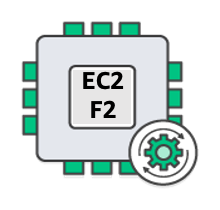

# AWS F2

## F2 FPGA Development Kit Overview

The F2 FPGA Development Kit is a hardware-software development kit that enables developers to create accelerators for the high-performance accelerator cards on EC2 F2 instances. Using the development kit, you can architect, simulate, optimize, and test your designs.

## F2 FPGA Developer Kit Documentation on ReadTheDocs

The documentation for the F2 FPGA Developer Kit including our User Guide, tutorials, code snippets, and more can now be found on [our ReadTheDocs website](https://awsdocs-fpga-f2.readthedocs-hosted.com).

## F2 FPGA Interactive Workshop

Working with FPGAs in the cloud can be challenging and FPGA & cloud development necessitates distinct domain knowledge.
[The AWS F2 FPGA Workshop](https://catalog.us-east-1.prod.workshops.aws/workshops/9391f9b2-8011-460c-ab4c-ac8ff1adcf03/en-US)
provides an interactive quick-start experience intended to familiarize engineers of all backgrounds with the AWS EC2 F2 platform.
It also provides an overview of F2's architecture, and guides the participant through loading a design and using it.

## Support

For any issues with this developer kit documentation or code, please open a [GitHub issue](https://github.com/aws/aws-fpga/issues) with all steps to reproduce.

For questions, please open a [re:Post issue with the 'FPGA Development' tag](https://repost.aws/tags/TAc7ofO5tbQRO57aX1lBYbjA/fpga-development).
