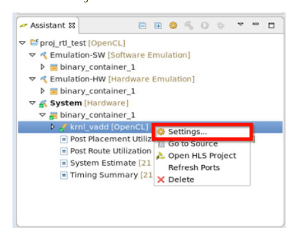
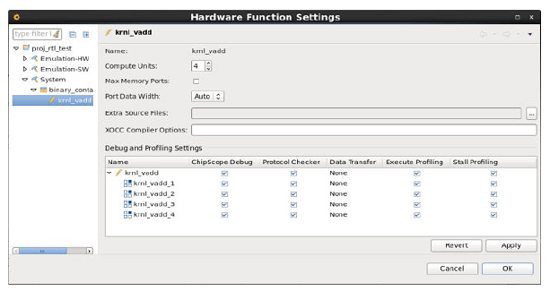

Hardware Debug of SDAccel OpenCL Kernel
======================

This file contains the following sections:

1. Overview
2. Enabling ChipScope Debug
3. Host code changes to support debugging
4. Building the executable, creating the AFI, and executing the host code
5. Start debug servers


## 1. Overview
The sections below give you a brief explanation of the steps required to debug your SDAccel OpenCL kernel.  They include enabling ChipScope debug,  pausing the execution of the host code at the appropriate stage to ensure the setup of ILA triggers, building the running the host code and starting the debug servers to debug the design in hardware.  

## 2. Enabling ChipScope Debug 

Debug cores can be added to the AXI interfaces on the kernel itself to monitor AXI transaction level activity (part of the ChipScope Debug feature of SDAccel).


Adding debug cores to the AXI interfaces on the kernel can be done in a couple of ways:

- Using the SDAccel GUI and enabling "ChipScope Debug" on the hardware function in the Hardware Function Settings window.  

  - Note: If you are building on AWS and need information on how to enable the SDAccel GUI on AWS F1, see​  [README_GUI.md](./README_GUI.md).  If you are building on premise, follow the directions in [On_Premises_Development_Steps.md](./On_Premises_Development_Steps.md).

- Using the XOCC --dk chipscope option with the compute unit name and optional interface name. 


To enable ChipScope debug using the GUI, perform the following steps:

1. In the assistant window, under System build configuration, right-click on the compute unit that you want to enable ChipScope debug on and click settings.


  

2. When the hardware function settings dialog appears, check the box for "ChipScope Debug" in the debug and profiling settings table.  By checking this box, the compute unit will now have a System ILA inserted onto it's AXI interface ports.
  


Alternatively, ChipScope debug can be enabled by adding an XOCC option to the CLFLAGS in the makefile.  This method allows the ChipScope debug feature to be enabled without invoking the SDAccel GUI.  The --dk option shown below shows the general usage:

```
--dk chipscope:<compute_unit_name>:<interface_name>
```

For example, to add ChipScope debugging to the helloworld_ocl OpenCL example , enabling chipscope debug can be accomplished by adding the following XOCC option to the CLFLAGS in the makefile:

```
--dk chipscope:krnl_vadd_1
```

For detailed usage and more examples, refer to the SDAccel Debugging Guide (UG1281 v2018.2).


## 3. Host code changes to support debugging

The application host code needs to be modified to ensure you can set up the ILA trigger conditions **prior** to  running the kernel.   


The host code shown below introduces the wait for the setup of ILA Trigger conditions and the arming of the ILA.

src/host.cpp

		void wait_for_enter(const std::string& msg)
		{
		    std::cout << msg << std::endl;
		    std::cin.ignore(std::numeric_limits<std::streamsize>::max(), '\n');
		}
	
		...
	
		cl::Program::Binaries bins = xcl::import_binary_file(binaryFile);
		devices.resize(1);
		cl::Program program(context, devices, bins);
		cl::Kernel krnl_vadd(program,"krnl_vadd_rtl");
		
		wait_for_enter("\nPress ENTER to continue after setting up ILA trigger...");
		
		//Allocate Buffer in Global Memory
		
		...
	
		//Launch the Kernel
		q.enqueueTask(krnl_vadd);


## 4. Building the executable, creating the AFI and executing the host code

- **Build the executable** in your design directory (`your_design_directory`) by running the steps below:

```
	cd your_design_directory

	make all DEVICES=$AWS_PLATFORM
```

- **Creating and registering the AFI**

Please note, the angle bracket directories need to be replaced according to the user setup.

```	
	$SDACCEL_DIR/tools/create_sdaccel_afi.sh -xclbin=your_design.hw.xilinx_aws-vu9p-f1-04261818_dynamic_5_0.xclbin -o=your_design.hw.xilinx_aws-vu9p-f1-04261818_dynamic_5_0.awsxclbin -s3_bucket=<bucket-s3_dcp_key=<f1-dcp-folder-s3_logs_key=<f1-logs>
```

- **Setup and Execute**

```
		$ sudo sh
		# source /opt/Xilinx/SDx/2017.4.rte.dyn/setup.sh
		# ./host
```
This produces the following output: 
```
			Device/Slot[0] (/dev/xdma0, 0:0:1d.0)
			xclProbe found 1 FPGA slots with XDMA driver running
			platform Name: Xilinx
			Vendor Name : Xilinx
			Found Platform
			XCLBIN File Name: vadd
			INFO: Importing ./binary_container_1.awsxclbin
			Loading: './binary_container_1.awsxclbin'
			Successfully skipped reloading of local image.
			
			Press ENTER to continue after setting up ILA trigger...
```


## 5. Start Debug Servers

#### Starting Debug Servers on Amazon F1 instance
Instructions to start the debug servers on an Amazon F1 instance can be found [here](../../hdk/docs/Virtual_JTAG_XVC.md).
Once you have setup your ILA triggers and armed the ILA core, you can now Press Enter on your host to continue execution of the application and RTL Kernel.

