# Using the SDAccel GUI on AWS F1

The SDAccel GUI allows to control all aspects of an SDAccel project. 

The guide explains how to:
1. Create an SDAccel project
1. Verify the application
1. Build the application to execute on FPGA hardware

**Note**: It is highly recommended to review the [SDAccel Guide][SDAccel_Guide] to fully understand the SDAccel flow before using the GUI.

## Cloning the aws-fpga Git repository
The AWS Github repository contains the example used in this tutorial.  

If you haven't already setup the environment, start by executing the following commands to clone the Github repository and configure the SDAccel environment:
```
    $ git clone https://github.com/aws/aws-fpga.git
    $ cd aws-fpga                                      
    $ source sdaccel_setup.sh
```

The SDAccel examples from the github are downloaded by the above steps. However, we can download SDAccel examples directly inside from SDAccel GUI as well. In order to access github examples directly from the SDX gui we need to execute the following command before launching the SDAccel GUI. 

```
    $ /usr/bin/git config --global http.proxy false
```

# 1. Setting up SDAccel project

First change directory to **helloworld_ocl** example. 
```
    $ cd <git area>/SDAccel/examples/xilinx_2017.4/getting_started/host/helloworld_ocl
```
The github examples use common header files and those needs to be copied in the local project source folder to make it easier to use. 
Type the command **make local-files** to copy all necessary files in the local directory.
```
    $ make local-files
```
The SDAccel GUI is invoked with the **sdx** command.

```
    $ sdx
```

To debug using gdb inside from SDX gui few additional commands are needed to execute before launching the SDX gui. 

```
   $ mv /usr/local/Modules/init init.bak
   $ unset –f switchml
   $ unset –f _moduleraw
   $ unset –f module
   $ sdx
```
  
We will now cover the following steps: 	
 - Set the Workspace
 - Set the Platform
 - Create a Project
 - Import the design files

## I. Set the Workspace  
Add workspace inside the current directory named "GUI_test" as shown below. A new directory **GUI_test** will be created and used to store all logfiles of our runs.  
  
  
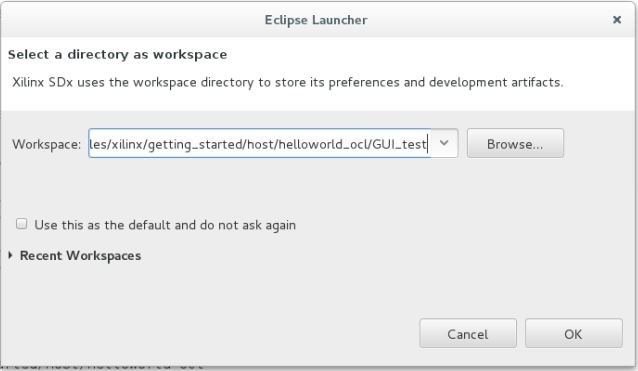  

<br>
  
## II. Set the Platform
You will get a Welcome screen. You need to set Platform path by selecting **Add custom platform** as shown below.    
  
<br> 
  
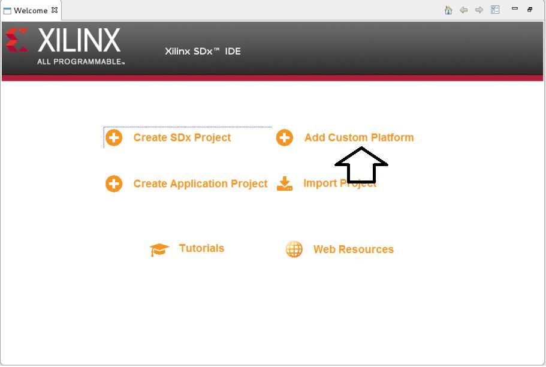  
  
  
  
Click on the **plus** sign as shown below.   
  

  
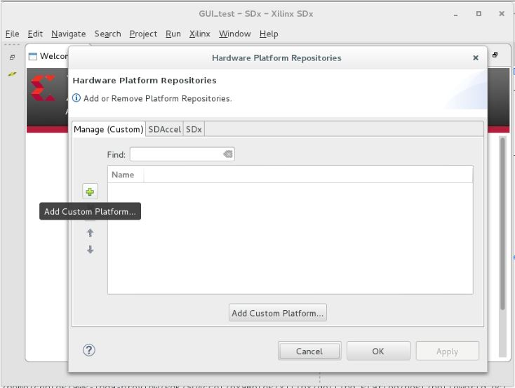  
  
  

Then browse to the \<git area\>/SDAccel/aws_platform/xilinx_aws-vu9p-f1_dynamic_5_0/ directory, select OK.  


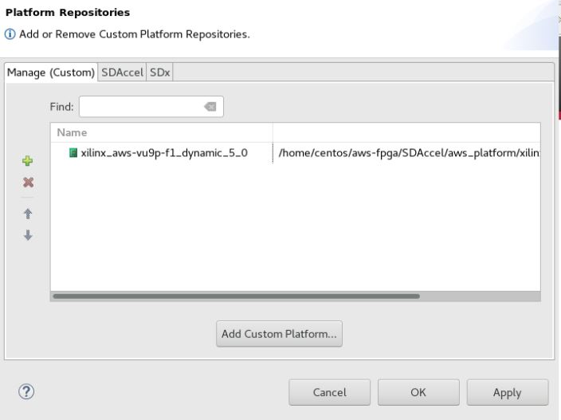  

Select **Apply** and **OK**.  

  
## III. Create a Project    
Now you are back to Welcome screen.  
  
Select **Create SDX Project**, click **Next**, keep the selection **Application Project**, click **Next**, give a project name **hello**.   
Move through the next couple screens (keeping default selection) by clicking **Next** -> **Next** -> **Next**.   
Finally Select an **Empty Application** in the **Available Templates** section, and then **Finish**.      

## IV. Import the design files  
Now with the SDX gui open, at the left hand side you can see **Project explorer** window. Right Click on **src** and then Select **Import**.   
   
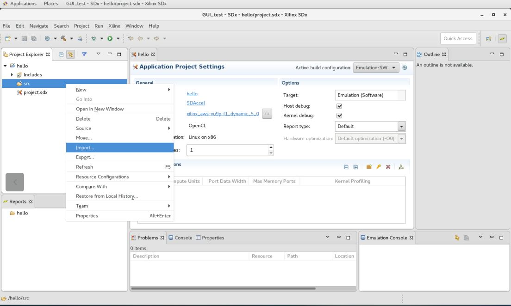 

Select **General** > **Filesystem** and then click on **Next**.  
Browse to the source file directory of the current example, **helloworld_ocl/src**
  
Select the files **host.cpp** , **xcl.c**, **xcl.h** and **vector_addition.cl** as shown below.  

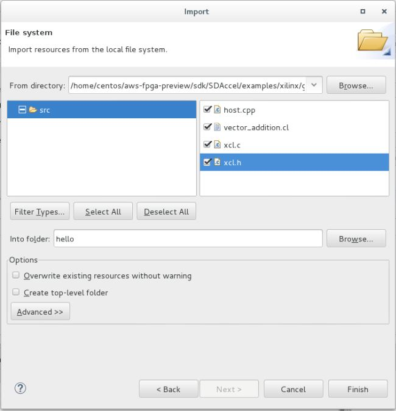


  
Your project setup is now complete and ready for verification and hardware build flow. 
  
# 2. Verify the application

The application is now ready to be verified.

We will now cover the following steps: 	
 - Specify Hardware Function(s)
 - Build and Execute for Software and Hardware Emulation

## I. Specify Hardware Function(s)    

Before verifying the application, we need to specify the hardware function or kernel function. Select the **Add hardware function** as shown below.  

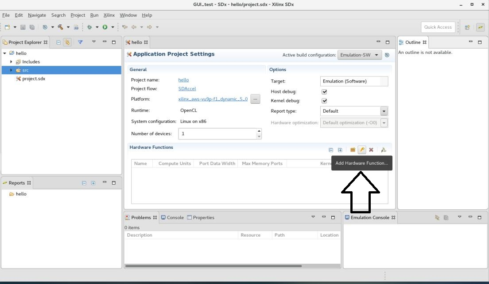  
  
This will automatically select the Kernel **vector_add**.  
  
  
## II. Build and Execute for Software and Hardware Emulation    

There are two emulation flows that can verify the application. 
- Software Emulation 
- Hardware Emulation

Set the **Active Build Configuration** to **Emulation-SW** or **Emulation-HW** to select between the Software and Hardware Emulation flow respectively.
  
Here we are showing Hardware Emulation flow only. For Software Emulation flow idential steps are needed.   
	   
Specify the emulation mode as Hardware Emulation.  

- In the SDx Project Settings, select **Emulation-HW** as the **Active Build Configuration**.  

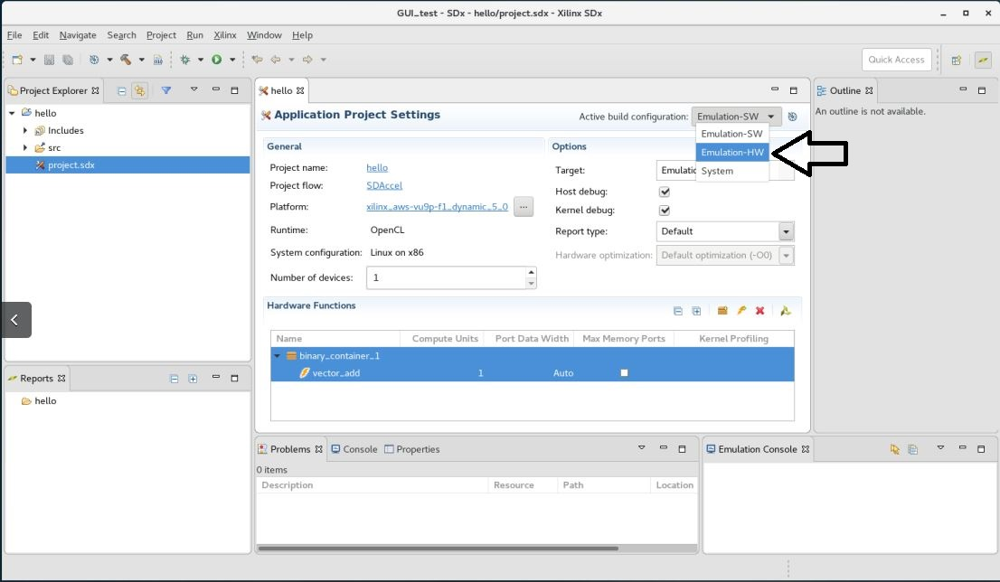


The application is now ready to build for Hardware Emulation flow. 

- Click on the **Build** toolbar button to build for HW Emulation.
 
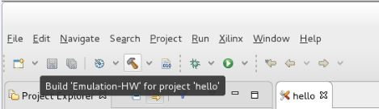

After the completion of the Build process, you can run Hardware Emulation flow by clicking on the **Run** toolbar button. 
 
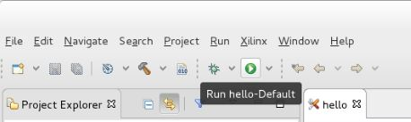

After the completion of Hardware emulation run, in the Reports tab, you can inspect various reports. 

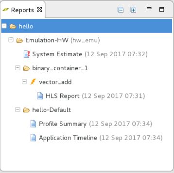


The final step of the flow is to build and run the appliction on the FPGA hardware.

# 3. Build the application to execute on FPGA hardware

To build the application for running on FPGA, please select **System** from **Active Build Configuration**.  
  
Then Click on **Build** icon (similar to Emulation flow).  
  
This process can take few hours to complete. Upon completion, you can excute the final application either through GUI (few additional steps are required) or through the command line procedure. 

For executing in the command line, please exit from the GUI and follow the instructions below:

[Instructions on how to create AFI and subsequent execution process](../README.md#createafi)

[SDAccel_Guide]: ./SDAccel_Guide_AWS_F1.md
