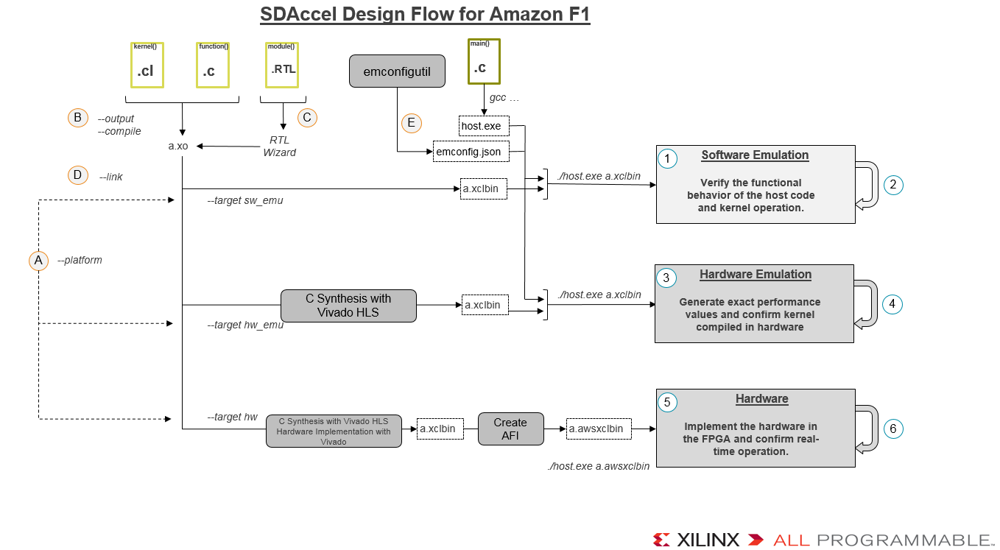

# SDAccel Guide for Amazon F1
*It is assumed that the reader has run the instructions found in the [AWS SDAccel README] successfully*

This document provides a detailed reference to the SDAccel Development Environment and its use with AWS F1 FPGA instances. 

The SDAccel environment allows kernels expressed in OpenCL or C/C++ to be accelerated by implementing them in custom FPGA hardware. The flexible SDAccel Development Environment also allows the acceleration to be performed using pre-existing RTL designs. 

This Guide provides you with the following concepts and work flows:
* [Gain an understanding of the SDAccel **Design** Flow](#design)
* [A complete **Methodology** for using the SDAccel Development Environment effectively](#methodology)
* [**Recommendations** for Acceleration](#acceleration_recommendations)

In addition, you can review the following useful documents:
* [Run a sample design on **GUI**][GUI_README]
* [Frequently Asked Questions (**FAQ**)][FAQ]
* [On Premise development][OnPremiseDev]

SDAccel uses a compiler named `xocc` which can be thought of as similar to the GNU gcc compiler -i.e. it allows you to compile source code to create Xilinx object (.xo) files and then can link said .xo files together to create an executable program; the .xo files contain an RTL representation of the accelerated kernels and the executable program is the design to be programmed onto the AWS F1 FPGA. 

When the source code is OpenCL or C/C++ the Vivado High-Level Synthesis (HLS) tool is used under-the-hood to create the RTL that implements the custom hardware to meet the required performance and then an .xo file is created using the [Vivado toolchain][Vivado_landing_page].

When the source code is RTL, the Vivado toolchain creates the .xo file directly without using Vivado HLS to generate any RTL description.

SDAccel also uses a `platform` which contains the AWS F1 Shell and a set of IPs required for the host processor to interface with the kernels. 

This document further describes the above and links to documentation or concepts discussed in the [AWS SDAccel README] and/or in the [Xilinx SDAccel documentation]. 

## SDAccel Design Flow
The figure below shows:
1. The [design flow](#design) overview on the left hand side. This overview explains the flow using the `xocc` option names. An example is documented using the [SDAccel GUI](./README_GUI.md).
1. The [methodology flow](#methodology) on the right hand side.

Figure: SDAccel Design Flow for Amazon F1

# Design Flow (left hand side of chart)

As described in the [AWS SDAccel README], the SDAccel Development Environment enables the integration of accelerator kernels into a design to be programmed on the AWS F1 FPGA instances. In this section we explain the `xocc` command line options to create the design to be programmed onto the AWS F1 FPGA.

**( A )**
First and foremost, `xocc` requires the information about the platform it is targeting. On AWS, you must always select the target hardware using `--platform  $AWS_PLATFORM`. The on-premise flow allows you to develop your application on a local machine and execute on the the AWS F1 FPGA instances and is explained in the  [SDAccel On Premise Guide][OnPremiseDev].

Furthermore, the `--target` option allows software emulation (sw\_emu), hardware emulation (hw\_emu) or hardware FPGA (hw, default) targets to be created.
- [Software Emulation target](#sw_emu_target): **Verifies the functional behavior of the host code and kernel operation via pure software execution**
- [Hardware Emulation target](#hw_emu_target): **Generates custom hardware and confirms kernel(s) performance values via RTL Simulation**
- [Hardware target](#hw_target): **Implements the RTL hardware for the AWS F1 FPGA and allows confirmation of real-time operation on FPGA**

 Further details on the targets are provided in Chapter 4 of [SDAccel Environment User Guide].
 
**( B )**
The default flow generates a fully compiled design, a Xilinx binary (.xclbin) file, that contains the FPGA bitstream and metadata to be programmed by the host code using the OCL API clCreateProgramWithBinary().  

When multiple kernels are to be implemented, the `--compile` option may be used to create multiple .xo files which are then linked into a single .xclbin file.

By default, the output files are named **a.xclbin** or **a.xo**. The `--output` option allows the output file name to be specified: a requirement when multiple kernels are present, as each .xo file requires a unique name.

**( C )**
For OpenCL and C/C++ sources, the SDAccel Environment will automatically create the .xo or .xclbin files from the source code.

For RTL sources, the RTL Kernel Wizard is used to create .xo files. Any RTL kernel used in the SDAccel Environment must meet specific interface requirements. In summary, 
- AXI Master interface(s) for data transfers to/from DDR.
- AXI-Lite interface for control by the host program.

The RTL Kernel wizard creates template RTL files with legal interfaces. These template RTL files may be used or modified to create the .xo files. Existing RTL designs must fit into the top-level interface created by RTL Kernel wizard. RTL interface requirements are explained in the [SDAccel Environment User Guide] in section "Expressing a kernel in RTL". 

**( D )**
If the `--compile` option is used to create .xo files, the `--link` option allows multiple compiled kernel .xo files to be linked into a single .xclbin executable file. This option is also used to link one or more RTL kernels (packaged .xo file).

**( E )**
For emulations targets, the Emulation Configuration utility (emconfigutil) is used to link the executable with a model of the hardware platform. This utility creates a file named **emconfig.json** which is used by the Xilinx runtime to look-up the platform target during host code execution. This file must be in the same directory as host executable. Refer to the chapter on "Running Software and Hardware Emulation in XOCC Flow" in [SDAccel Environment User Guide] for more details on emconfigutil. 

# Methodology Flow (right hand side of chart)

**( 1 )**

Software emulation confirms the functional correctness of the application. It has fast compile times - it does not create any RTL or FPGA programming files - and allows many source code optimizations to performed in a fast, productive flow.
  - Confirm the functionality is correct.
  - Review performance and implementation estimates
  - Review the API calls and data transfers in the profile summary.
  - Optimize source code for the FPGA, in a similar manner to source code optimized for CPU/GPU, in advance of running on the target hardware.
  - Most design refinements and code transformations may be done here.
  - **Note**: Software emulation does not support kernels expressed in RTL.

**( 2 )**
Iterate around the Software emulation flow to optimize the design and ensure functional correctness.
- Adapt the host code. Verify how changes in NDrange, work group size or the use of multiple Compute Units impact the performance.
- Adapt the code targeted to the FPGA for the impact to performance of changes such as, but not limited to, the caching of data, bursting to utilize optimum memory transfers, larger bus bit width for the data transfers and alternative micro-architecture explorations. 
- Continue to verify the functionality after any "host:kernel co-optimization", of the type outlined above, and ensure the optimizations did not modify the intended behavior. 

Refer the [SDAccel Environment Optimization Guide] for more details on code optimizations. 

**( 3 )**

Hardware emulation produces an RTL hardware model for the FPGA which accurately models the custom hardware. Use this step to confirm the custom hardware is functionally identical to the initial software-only implementation.  For RTL kernels, this is the first step where you can verify the complete application (host code plus kernels). 

This is also where you can review and analyze the custom hardware size (physical area on the FPGA) and performance estimates. Since hardware emulation creates an RTL model of the hardware, expect short-to-medium compile times.
- Confirm the actual hardware performance estimates through profiling
- Review the profiling report to analyze the performance of the data transfers and the kernel(s). Details on the profile report are provided in the Profiling Summary Report section of the [SDAccel Environment User Guide].
- Review detailed performance traces to determine performance bottlenecks.
- Debug application hangs or stalls by analyzing signal waveform generated from the RTL hardware model. Refer to the Application Timeline section in the [SDAccel Environment User Guide]

**( 4 )**
Perform different Hardware emulation runs to optimize the hardware or further explore trade-offs.
- Apply OpenCL attributes & SDAccel optimization directives to improve performance
- Review hardware area estimates and iterate to adapt the area of the design, if required, through the use of directives or code changes to decrease or increase hardware parallelism.
- Use the dynamic nature of Hardware Emulation to review the impact of different work group sizes and compute units, interactions between the kernels and memory etc

**(5)**

Hardware compilation target will create a bitstream to program the hardware target with fully accurate hardware implementation details. This step is used to confirm the correct operation of the application with the kernel(s) running on the FPGA. Since this stage requires the creation of both RTL and FPGA programming files, expect long compilation times.  
- Running on hardware (i.e. FPGA device and board) is the final verification step.
- Running on hardware provides the most accurate accurate profiling data. 
- Running on hardware is the fastest execution time.
- This step will highlight any hardware implementation issues: the ability to satisfy the timing requirements or routing failures.

**(6)**
You may iterate through the hardware verification to further optimize or debug the design. This is the accelerated application.
- Hardware debug/correctness
- Absolute accurate transfers and performance numbers
- Execute [Power Analysis][Power_Analysis]

# Recommendations for Acceleration

The SDAccel Environment accelerates OpenCL Kernels and C/C++ functions by implementing them custom hardware. The degree of acceleration depends on a few factors:
* [Can the kernel/function be synthesized into hardware?](#synth_code)
* [Will the kernel/function benefit from acceleration on hardware?](#data_proc)
* [Can the kernel/function be optimized with OpenCL attrbites or C/C++ directives?](#hls_opt)

## Synthesizable C Code
All kernels and functions selected for acceleration must be synthesizable. Full detailed guidelines on synthesizable code are provided in the High-Level Synthesis Coding Styles chapter of the [Vivado HLS User Guide][UG902], but in summary:

- None of the functionality can be performed by system calls to the operating system.
- The C constructs must be of a fixed or bounded size.
- The implementation of those constructs must be unambiguous.

An example of code which **does not** conform to these guidelines is the Standard Template Library. Many of the functions use dynamic allocation and unbounded recursions to implement the functionality. For a function to be implemented in hardware, the sizes need to be fixed and known at compile time, as hardware cannot dynamically change during runtime. It should be understood that some C/C++ functions or OpenCL kernels are **not suitable for implementation in hardware**.

Examples of code which **does** implement well in hardware are video processing algorithms (HEVC, VP8, etc), encryption and compression standards (Gzip,RSA2048), database acceleration algorithms (e.g. SQL) and general mathematic and linear algebra functions (GEMM). 

## Data And Computation Loads
The next factor to consider when seeking to accelerate code in hardware is the ratio of **data transferred / execution time**. There are three steps for acceleration: send data to the accelerator, compute the data, send data back to the host. A function which is ideal for acceleration will perform a lot of processing on small data sets, but it is the ratio which is important. 

Given an HD video example, 2 million pixels (1920x1080) will be sent to the accelerator, but the processing performed on video frames is generally thousands calculation (or more), the ration of **data transferred / execution time** is high and it makes sense to use an accelerator. 

On the other hand, if the processing on 2M samples is simply to add a constant value to each sample, this trivial operation would complete in 1 clock cycle on the accelerator, the ratio of **data transferred / execution time** is low, and the application would likely complete faster on the host CPU. In this case the bulk of the time is spent simply moving data to and from the accelerator. 

## Hardware Optimization
The final aspect to consider when selecting a function to accelerate is whether the function can take advantage of hardware parallelism. Custom hardware can execute many operations in parallel and all code generally benefits from hardware pipelining. However, the degree of parallelism which is possible varies. 

The logic operations expressed in the code will be implemented in parallel, data dependencies permitting. As an example, given 20 operations in the code, hardware will typically be able implement multiple operations per clock cycle and complete in 5-10 clock cycles. 

In addition, tasks (loops and sub-functions) present in the code may also be executed in parallel. For example, if one iteration of a loop takes N clock cycles and the loop requires J iterations, it will require N*J clock cycles to complete all operations in the loop. If the loop is pipelined in hardware, it will take N+J+1 iterations to complete all operations. If N=10 and J=2 Million, that is 20,000,000 vs 2,000,011. Code which has many sequential loops and sub-functions benefits from hardware acceleration.

Conversely, code which is simply a few lines of basic operations, and has no tasks (loops or sub-functions) will simply obtain acceleration due to parallel logic functions.
 
# Additional Resources

* The [AWS SDAccel README](../README.md).
* [Xilinx SDAccel GitHub repository](https://github.com/Xilinx/SDAccel_Examples)
* [Xilinx SDAccel landing page](https://www.xilinx.com/products/design-tools/legacy-tools/sdaccel.html)
* [On Premise Development steps](On_Premises_Development_Steps.md)
* [SDAccel Power Analysis](SDAccel_Power_Analysis.md)
* [FAQ](../FAQ.md)

