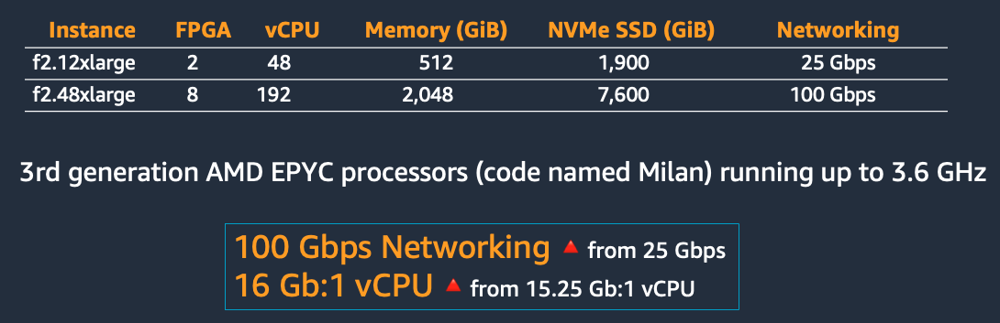
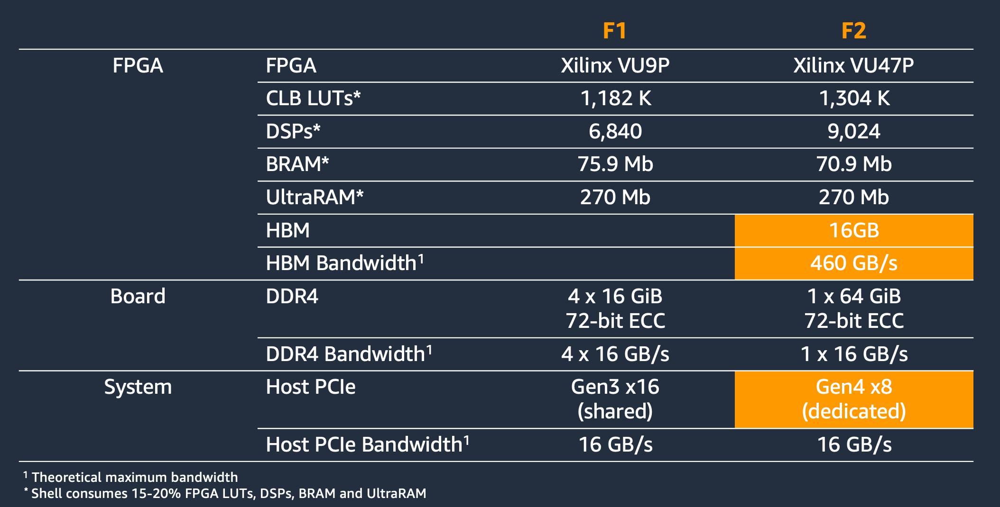
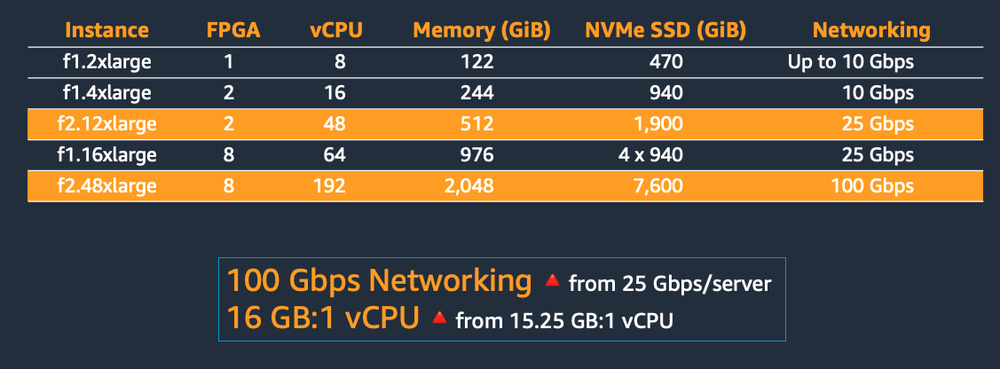

# [AWS EC2 FPGA Development Kit](https://github.com/aws/aws-fpga)

The development kit includes example designs to get you familiar with developing for AWS EC2 FPGA Instances.

- [AWS EC2 FPGA Development Kit](#aws-ec2-fpga-development-kit)
  - [AWS EC2 F2 Instance Overview](#aws-ec2-f2-instance-overview)
    - [Instance Types](#instance-types)
    - [2nd Generation On-Cloud FPGA Accelerator Card](#2nd-generation-on-cloud-fpga-accelerator-card)
    - [Comparison to F1](#comparison-to-f1)
  - [AWS EC2 F2 FPGA Development Kit](#aws-ec2-f2-fpga-development-kit)
    - [Development Environments](#development-environments)
    - [AWS Shells](#aws-shells)
    - [Hardware Development Kit (HDK)](#hardware-development-kit-hdk)
    - [Software-Defined Development Environment](#software-defined-development-environment)
      - [Hardware Emulation](#hardware-emulation)
      - [Host Application and FPGA Binary Builds](#host-application-and-fpga-binary-builds)
      - [AFI Generation](#afi-generation)
    - [Additional Vitis Documentation](#additional-vitis-documentation)
    - [FPGA Developer AMI](#fpga-developer-ami)
  - [Getting Started](#getting-started)
    - [Getting Familiar with AWS](#getting-familiar-with-aws)
    - [Customer Hardware Development](#customer-hardware-development)
  - [Next Steps](#next-steps)

## AWS EC2 F2 Instance Overview

Amazon EC2 F2 instances are Amazon’s second-generation FPGA-powered instances, purpose-built for customers to develop and deploy reconfigurable hardware in the cloud. With AMD UltraScale+ VU47P FPGAs and High Bandwidth Memory (HBM), customers can achieve orders-of-magnitude application acceleration such as 95x faster graph database analysis and 10x faster genomics secondary analysis when compared to CPU-only analysis. F2 instances provide up to 8 FPGAs paired with a 3rd-generation AMD EPYC (Milan) processor. F2 instances provide 3x more processor cores (192 vCPU), 2x more system memory (2 TiB), 2x NVMe SSDs (7.6 TiB), and 4x more networking bandwidth (100 Gbps), compared to the previous generation FPGA-based instances. The accompanying AWS FPGA Developer kit empowers developers to quickly start building with their hardware accelerations and adopting advanced technology, such as HBM, to process data at up to 460 GiB/s.

This documentation is relevant to F2 only. Therefore, it applies to all branches on the [GitHub repo](https://github.com/aws/aws-fpga) prefixed with `f2`. Any branches not prefixed f2 in their name are not referred to in this documentation.

### Instance Types

### 2nd Generation On-Cloud FPGA Accelerator Card

### Comparison to F1

## AWS EC2 F2 FPGA Development Kit

### Development Environments

This table lists the F2 development flows currently enabled and supported in the development kit.

| Development Environment | Description | Accelerator Language | Hardware Interface | Debug Options | Typical Developer |
| ------------------------|-------------|----------------------|--------------------|---------------|-------------------|
| [Hardware accelerator development using Vivado](hdk/README.md) | This environment supports the Hardware Development Kit (HDK) design flow, which empowers FPGA developers to create accelerator designs from scratch, using HDL source code and IPs.   The AMD Vivado tool synthesizes, implements, and generates the Design Check Point (DCP) file used in F2 AFI creation. AWS FPGA developers benefit from the suite of scripts supplied in the HDK that help to automate different design steps. This allows for flexibility in architecting, implementing, and optimizing accelerator designs while using the HDK.| Verilog/SystemVerilog/VHDL | User-implemented DMA engine or Streaming Data Engine (SDE) | Simulation | Hardware developers with advanced FPGA experience |
| Hardware accelerator development using Vitis | This environment supports the Vitis design flow, which enables software developers to write C++ code, which may then be compiled into RTL and used in cycle-accurate hardware simulation. After it may then be built into an accelerator design. This step is not necessary, but is encouraged. Vitis may also be used to implement accelerator designs from scratch, using HDL and IPs directly, similar to Vivado. Vitis offers additional analysis tools to aid in the refinement of designs. | Verilog/System Verilog/VHDL | XDMA Engine (coming soon) | Hardware Emulation | Advanced software developers or hardware developers with intermediate to advanced FPGA experience |

On-premise environment: Customers can set up a on-premise development environment using 2024.1 AMD tools with their own licenses. Refer to this guide [here](./hdk/docs/on_premise_licensing_help.md) for licensing requirements.

### AWS Shells

For AWS EC2 F2 FPGA instances, each FPGA is divided into two partitions:

- Shell (SH) – AWS platform logic implementing system management and external peripherals like PCIe and interrupts to the host.
- Custom Logic (CL) – Custom acceleration logic created by the FPGA developer and equipped with direct memory access (DMA) to DDR and HBM.

At the end of the development process, combining the Shell and CL creates an Amazon FPGA Image (AFI) that is then available to load onto all F2 FPGA cards on instances owned by the developer.

The HDK design flow currently supports the Small Shell. The Small Shell offers 88% usable FPGA resources. The [common interface](./hdk/docs/AWS_Shell_Interface_Specification.md) (is defined in [cl_ports.vh](./hdk/common/shell_stable/design/interfaces/cl_ports.vh)) along with the [floorplans](./hdk/docs/shell_floorplan.md) and built-in functions. CL designs must integrate with the small shell. The table below details the released shell version and its main features.

| Shell Name| Shell Version | Description |
|-----------|---------------|-------------|
| F2 Small Shell | 0x10212415 | Shell with no built-in DMA engine (40% smaller shell footprint). |

### Hardware Development Kit (HDK)

The Hardware Development Kit (HDK) comes with an `hdk_setup.sh` script to set up environment variables required for customer design development using HDL source code.

The [HDK directory structure](./hdk/README.md) contains:

- [common/shell_stable](./hdk/common/shell_stable/): All build scripts, constraints, and other directory structures required to support design builds using the supported shells.
- [common/lib](./hdk/common/lib): All common IPs used in various examples and Tcl scripts to build IPs are available here.
- [cl/examples](./hdk/cl/examples): Multiple CL examples to demonstrate connectivity between CL logic, the F2 Shell, and accelerator resources like DDR and HBM.
- Support for 3rd party simulators

The HDK currently supports the following tool versions:

| Tool                                    | Version       |
|:----------------------------------------|:--------------|
|AMD Vivado Design Suite                  | 2024.1        |
|Synopsys VCS  (Bring your own license)   | U-2023.03-SP2 |
|Siemens Questa (Bring your own license)  | 2023.3        |

Our scripts require a minimum Python version of 3.10, under `/usr/bin/env python3`:

| Tool   | Minimum Version |
|:-------|:----------------|
| Python | 3.10+           |

### Software-Defined Development Environment

The software-defined development environment allows customers to compile their C/C++/OpenCL code into AFIs and use C/C++/OpenCL APIs to interface with the accelerator, running on the FPGA. Software developers with little or no FPGA experience will be able to quickly familiarize themselves with the development experience that accelerates cloud applications. The optimized compiler, Vitis, allows easy F2 accelerator development using C/C++/OpenCL and/or Verilog/VHDL.

The F2 developer kit provides development tools for Vitis hardware emulation, example host applications, and FPGA Binary builds, followed by AFI generation.

To get started, please see the [README for a hello world accelerator example](./vitis/README.md)

### FPGA Developer AMI

A free-to-use FPGA developer AMI is available for on-cloud F2 development with AMD tools pre-installed on a variety of AWS EC2 instance types. Customers can use this AMI to design, simulate, and build their designs. The table below lists the FPGA Developer AMI(s) currently released to customers:

| FPGA Developer AMI Version | FPGA Developer AMI ID | Vivado/Vitis Version Supported | Operating System Version    |
|----------------------------|-----------------------|--------------------------------|-----------------------------|
| 1.16.0                     | [ami-0e6383ac30e23cf97](https://aws.amazon.com/marketplace/pp/prodview-f5kjsenkfkz5u) | 2024.1 | Ubuntu 20.04.6 (kernel 5.15)|

Given the large size of the FPGA used for F2, AMD tools work best with at least 4 vCPU’s and 32GiB Memory. We recommend [Compute Optimized and Memory Optimized instance types](https://aws.amazon.com/ec2/instance-types/) to successfully run the synthesis of acceleration code. Developers may start coding and run simulations on low-cost `General Purpose` [instances types](https://aws.amazon.com/ec2/instance-types/).

Note that the tools used by the HDK are only supported on x86-based EC2 instances (Graviton-based instances are not compatible with the tools).

## Getting Started

### Getting Familiar with AWS

If you have never used AWS before, we recommend you start with [AWS getting started training](https://aws.amazon.com/getting-started/), focusing on the basics of the [AWS EC2](https://aws.amazon.com/ec2/) and [AWS S3](https://aws.amazon.com/s3/) services. Understanding the fundamentals of these services will further enhance the developer experience with AWS F2 instances and the FPGA Developer Kit.

## Next Steps

Before you create your own AWS FPGA design, we recommend that you go through the [step-by-step quickstart guide for customer hardware development](./hdk/README.md).

Once developers are familiar with the F2 development kit and the HDK development environment, we recommend exploring the following contents to master all the design features and examples offered in the AWS EC2 FPGA Development Kit:

- [Run RTL simulations](./hdk/docs/RTL_Simulation_Guide_for_HDK_Design_Flow.md) provided in CL examples to learn the design verification setup in the HDK development environment.
- Familiarize with the [AWS F2 Shell-CL interfaces](./hdk/docs/AWS_Shell_Interface_Specification.md), e.g. [the HBM monitor interface](./hdk/docs/AWS_Shell_Interface_Specification.md/#hbm-monitor-interface)
- Familiarize with the [shell floorplan](./hdk/docs/shell_floorplan.md) and locations of major shell interfaces.
- Deep dive into [CL examples](./hdk/README.md#cl-examples) to explore shell-to-CL connectivity, CL resources e.g. DDR and HBM, and features e.g. [CL clock generation block](./hdk/docs/AWS_CLK_GEN_spec.md).
- Create a custom CL design using the [CL_TEMPLATE](./hdk/cl/examples/CL_TEMPLATE/README.md) example.
- Connect to a custom CL design in FPGA through [Virtual JTAG](./hdk/docs/Virtual_JTAG_XVC.md) to run hardware debug.
