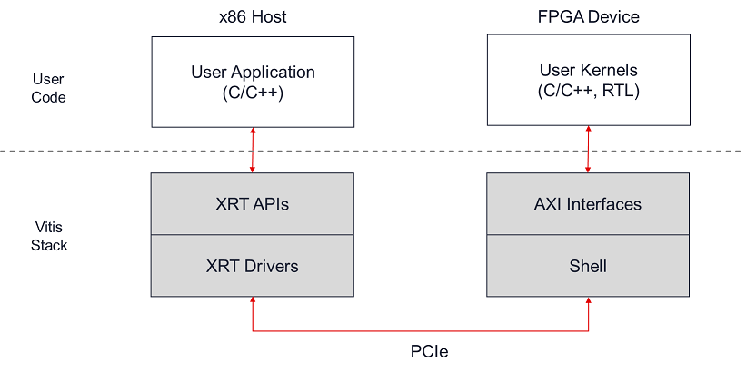
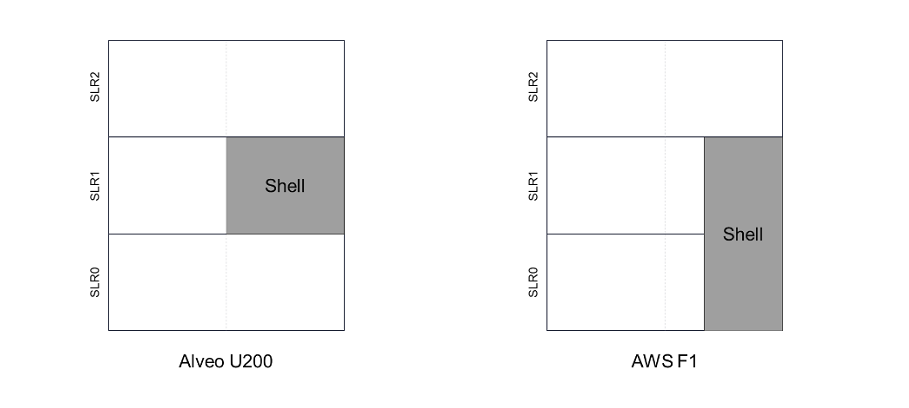

# Application Migration between Alveo U200 platform & Amazon EC2 F1 instances

The Vitis development environment provides a unified environment to develop FPGA accelerated applications across Alveo™ products and Amazon EC2 F1 instances. 
The Vitis® flow is based on standard programming languages for both software and hardware components, along with an open-source runtime library and optimizing compilation technology. 
This approach enables seamless application migration across acceleration platforms. 

Using the Vitis tool flow, Xilinx was able to seamlessly port over 40+ designs from the Alveo U200 platform to F1 instances without touching the kernel source code and making only minor cosmetic changes to application source code. 
One example is Xilinx Real-Time Anti Money Laundering Watch List Management Compute Solution that was developed with Vitis and can be deployed to Alveo U200 and F1 instances.

## Introduction to Vitis

FPGA-applications built with the Vitis flow rely on a stack of standardized software and hardware components that insulate the application from platform-specific details, as seen in the figure below. 

 


In the Vitis flow, user applications are developed in C or C++ and use standard user-space APIs to interact with accelerated functions (also known as kernels) implemented in the FPGA device. 
These APIs are implemented by the Xilinx Runtime library (XRT) and are built on top drivers that manage communication to and from the FPGA device. 
On the hardware side, a platform-specific shell is responsible for essential services such as managing the PCIe link, DMA transfers (to and from the host), and interfacing with off-chip DDR memory. 
The shell also exposes standard AXI interfaces to which the user kernels can be connected. 

With this architecture, the user’s source code (host application and acceleration kernel) remains mostly agnostic of platform-specific platform details. 
The application sees the standardized XRT APIs and AXI interfaces which are common to all Vitis acceleration platforms. 
This aspect is key to enabling application portability across similar FPGA platforms. For most designs, porting from an Alveo U200 platform to F1 instances **can be as simple as changing the --platform option when building the design with Vitis.**

More details about the Vitis programming and execution model can be found in the [Introduction](https://www.xilinx.com/html_docs/xilinx2020_1/vitis_doc/chunkbreaker1.html#ctb1559866511109) chapter of the Vitis documentation. 


## Comparison of the Alveo U200 platform and AWS EC2 F1 instances 

FPGA accelerated applications developed with Vitis are highly portable across similar acceleration platforms. 
While Vitis greatly facilitates the migration process, it is important to recognize that the features and characteristics of the acceleration platform or instance targeted will have an impact on functionality and achievable performance.

The following table contrasts the key characteristics of the Alveo U200 and AWS EC2 F1 platforms. 

|                         | **Feature**          | **AWS f1.2xlarge instance**                       | **Alveo U200 platform**     |
| ----------------------- | -------------------- | ------------------------------------------------- | --------------------------- |
| **Available resources** | SLRs                 | 3                                                 | 3                           |
|                         | LUTs                 | 895k                                              | 983k                        |
|                         | Registers            | 1790k                                             | 1966k                       |
|                         | DSP Slices           | 5640                                              | 5856                        |
|                         | URAM                 | 800*288kb = 225Mb                                 | 800*288kb = 225Mb           |
|                         | BRAM                 | 1680*36kb = 59Mb                                  | 1848*36kb = 64.9Mb          |
| **Off-chip memory**     | DDR total capacity   | 64GB (4x16GB)                                     | 64GB (4x16GB)               |
|                         | DDR Total BW         | 68GB/s                                            | 77GB/s                      |
| **Interfaces**          | PCI Express          | Gen3x16                                           | Gen3x16                     |
| **Floorplan**           | Shell Occupancy      | SLR0 and SLR1                                     | SLR1                        |
|                         | SLR0                 | DDR3                                              | DDR0                        |
|                         | SLR1                 | DDR0 (in shell)<br />  DDR2                       | DDR1 (in shell)<br />  DDR2 |
|                         | SLR2                 | DDR1                                              | DDR3                        |
| **Tool support**        | Vitis                | Yes                                               | Yes                         |
|                         | ERT                  | Disabled                                          | Available                   |
|                         | XRT                  | Full Access                                       | Full Access                 |


### FPGA Resources

FPGA resources are the key building blocks for any FPGA design. 
Resources are physically distributed across 3 different logic regions (SLRs) on both platforms, due to the nature of the FPGA architecture. 
The FPGA devices on the Alveo U200 platform and AWS F1 instance have very similar numbers of available resources and performance is expected to be comparable across both platforms.

The slight variance in resources is due to inherent differences between the shells for each platform. As shown in the figure below, the size and layout of the shell vary between the Alveo U200 platform and the AWS F1 instance. 
Physical shell differences may impact the layout of available resources across the devices. 
Developers should keep this in mind when migrating large and complex designs between the  Alveo U200 platform and the  F1 instances. 
Advanced design considerations such as timing closure techniques may need to be considered.



For FPGA designs that utilize more than 70% of the FPGA resources, portability between platforms may require additional optimizations.
Please refer to the [UltraFast Design Methodology Timing Closure Quick Reference Guide (UG1292)](https://www.xilinx.com/support/documentation/sw_manuals/xilinx2019_2/ug1292-ultrafast-timing-closure-quick-reference.pdf) for recommendations on timing closure.
 
### Clock Frequency

Both the Alveo U200 platform and F1 instances will support data clock rates up to 250MHz. 
Applications running at 250MHz and below will seamlessly port between both platforms. 
In addition, the Alveo U200 platform can support data clock rates between 250Mhz and 300MHz. 
The data clock is used to transfer data between kernels and DDR, and deltas in clock rate may impact performance.  


### Off-Chip DDR Memory

Both the Alveo U200 platform and F1 instances provide identical off-chip DDR memory: 4 banks of 16GBytes each for a total of 64GBytes. 
It is important to note that the placement and identification of DDR banks vary across platforms.
On the Alveo U200 platform, the DDR interface placed in the shell is DDR1. 
On F1 instances the equivalent DDR interface placed in the shell is DDR0. 
If the application only needs a single DDR interface, it is recommended to use the dedicated controller located in the shell.

The following table details the naming and location of DDR interfaces on the F1 instances and Alveo U200 platforms: 

|  **AWS name**   | **Vitis tag**  | **Location**                  | **U200 Equivalent**   |
| --------------- | ---------------| ----------------------------- | --------------------- |
| DDR A           | DDR[1]         | SLR2 (top SLR)                | DDR[3]                |
| DDR B           | DDR[2]         | SLR1 (mid SLR)                | DDR[2]                |
| DDR C           | DDR[0]         | SLR1 (mid SLR, shell region)  | DDR[1]                |
| DDR D           | DDR[3]         | SLR0 (bottom SLR)             | DDR[0]                |

The same information can be extracted from the platform file using the `platforminfo` Vitis utility:

```bash
# Run this after you have sourced vitis_setup.sh
platforminfo $AWS_PLATFORM
```

When building the FPGA design, the Vitis linker takes care of connecting kernel ports to DDR interfaces. 
For both the Alveo U200 and F1 instances, Vitis will default to use the DDR interface placed in the shell. 
This default behavior can be modified by using command line options to specify which DDR interfaces should be used for each connection. 
This is especially useful when the FPGA design needs to access multiple DDR banks. 
When migrating applications between the Alveo U200 platform and F1 instances updates may be required to the Vitis compilation script to achieve the desired DDR mapping. 
The example provided at the end of this document explains how to do update the Vitus scripts for DDR mapping.


## Migration Results using Vitis 2020.1

To demonstrate the seamless migration path offered by Vitis as well as the potential impact on the performance of the differences between the Alveo U200 platform and F1 instances, we ran over 40+ full system level applications across both platforms.

For the vast majority of these designs, migrating between the Alveo U200 platform and the F1 instances require zero code changes (to either the host application or the kernel code). Porting the design was as simple as changing a few command line options in the Vitis compilation scripts such as the --platform and --sp switches. See [here](https://www.xilinx.com/html_docs/xilinx2020_1/vitis_doc/vitiscommandcompiler.html#qcm1528577331870__section_N10049_N10019_N10001) and [here](https://www.xilinx.com/html_docs/xilinx2020_1/vitis_doc/vitiscommandcompiler.html#clt1568640709907__section_tfc_zxm_1jb) for more details about these options.

In a few cases, the host application relied on the XCL_MEM_TOPOLOGY flag, and this flag had to be modified to port between the Alveo 200 platform and F1 instances. This optional flag can be used to explicitly specify in which DDR bank a given buffer needs to be allocated. See [here](https://www.xilinx.com/html_docs/xilinx2020_1/vitis_doc/optimizingperformance.html#utc1504034308941) for more details about this flag.

The following table shows results for a subset of these applications and compares the performance of each kernel (CU), looking at both the duration and primary kernel clock frequency. All these applications could be easily ported between the Alveo U200 platform and F1 instances maintaining application performance.

| **TEST CASE**                                   | **KERNEL NAMEs**       | **CU Time AWS F1 (ms)** | **CU Time Alveo U200 (ms)** | **CU Clock AWS F1 (MHz)** | **CU Clock Alveo U200 (MHz)** |
| ----------------------------------------------- | ---------------------- | ----------------------- | --------------------------- | ------------------------- | ----------------------------- |
| Data Analytics (Bayes classification  training) | naiveBayesTrain_kernel | 0.5491                  | 0.5114                      | 250                       | 279                           |
| Compression (gzip)                              | xilDecompressFull      | 0.0335                  | 0.0334                      | 250                       | 231                           |
|                                                 | xilHuffmanKernel       | 0.0435                  | 0.0549                      | 250                       | 231                           |
|                                                 | xilLz77Compress        | 0.0203                  | 0.0324                      | 250                       | 231                           |
| Compression (zlib)                              | xilDecompressFull      | 0.0254                  | 0.0440                      | 245                       | 243                           |
|                                                 | xilHuffmanKernel       | 0.0440                  | 0.0535                      | 245                       | 243                           |
|                                                 | xilLz77Compress        | 0.0211                  | 0.0358                      | 245                       | 243                           |
| Database (Compound Sort)                        | SortKernel             | 1.1088                  | 1.2326                      | 250                       | 234                           |
| Quantitative Finance (BlackScholes)             | bs_kernel              | 0.0566                  | 0.0541                      | 250                       | 300                           |
| Quantitative Finance  (BlackScholesMerton)      | bsm_kernel             | 0.2469                  | 0.1984                      | 250                       | 280                           |
| Quantitative Finance (HestonFD)                 | fd_kernel              | 744.6795                | 704.1600                    | 156                       | 169                           |
| Quantitative Finance (MonteCarlo)               | mc_euro_k              | 0.1351                  | 0.1198                      | 250                       | 300                           |
| Quantitative Finance (MonteCarloDJE)            | kernel_mc_0            | 0.5365                  | 0.4587                      | 250                       | 300                           |
| Quantitative Finance  (PortfolioOptimisation)   | po_kernel              | 0.1678                  | 0.2154                      | 138                       | 115                           |
| Quantitative Finance (b76)                      | b76_kernel             | 0.5407                  | 0.4251                      | 250                       | 300                           |
| Quantitative Finance (cds)                      | CDS_kernel             | 0.0489                  | 0.0459                      | 250                       | 300                           |
| Quantitative Finance (fdbslv)                   | fd_bs_lv_kernel        | 2.3244                  | 1.8575                      | 250                       | 300                           |
| Quantitative Finance (hcf)                      | hcf_kernel             | 0.2393                  | 0.2144                      | 250                       | 300                           |
| Matrix Solver (gesvdj)                          | kernel_gesvdj_0        | 0.2579                  | 0.2595                      | 250                       | 273                           |
| Matrix Solver (gesvj)                           | kernel_gesvj_0         | 0.0201                  | 0.0377                      | 250                       | 300                           |
| Computer Vision (Color detection)               | color_detect           | 0.0785                  | 0.0755                      | 250                       | 300                           |
| Computer Vision (Pixel pipeline)                | pp_pipeline_accel      | 0.1603                  | 0.1459                      | 250                       | 300                           |
| Computer Vision (Gaussian difference)           | gaussiandiference      | 33.5225                 | 28.0049                     | 250                       | 300                           |
| Computer Vision (Letterbox)                     | letterbox_accel        | 0.0344                  | 0.0394                      | 250                       | 300                           |
| Computer Vision (Stereo vision  pipeline)       | stereopipeline_accel   | 11.6349                 | 9.7058                      | 250                       | 300                           |
| Computer Vision (Corner Tracker)                | cornerTracker          | 0.2409                  | 0.2160                      | 250                       | 300                           |

It should also be noted that these results only look at kernel performance, some of which are able to run the full clock rate available, for the F1 instances this is up to 250MHz and for the Alveo U200 platform, this is 300MHz. 
Algorithms such as Compression libraries implemented in hardware can be seen to have nearly identical performance as the maximum clock rates are not quite achievable for these libraries. 
Additional system level application advantages of either the Alveo U200 platform or F1 instances are not captured with this benchmark.
 

## Migration Example

A detailed working example walking through all the steps required to migrate an application from U200 to F1 instances can be found [here](./Alveo_to_AWS_F1_Migration/example/README.md).

In this example, the source code for the software program and the FPGA kernels remains identical whether targeting U200 or F1 instances. 
Only command line changes are necessary to port the application. 

## Summary – Migration Checklist

Because Vitis provides platform-independent APIs and interfaces to the developer, the process of migrating applications across similar FPGA acceleration cards is greatly facilitated.

The following summarizes the main requirements and techniques involved in migrating from Alveo U200 to F1 instances and can be used as a checklist to help along the process.

#### Mandatory changes
* Update the --platform option in the Vitis  compilation script – more details [here](https://www.xilinx.com/html_docs/xilinx2020_1/vitis_doc/vitiscommandcompiler.html#qcm1528577331870__section_N10049_N10019_N10001)
* Create an Amazon FPGA Image (AFI) from the FPGA binary (.xclbin)  generated by Vitis – more details [here](https://github.com/aws/aws-fpga/blob/master/Vitis/README.md#2-create-an-amazon-fpga-image-afi)

#### Design specific changes related to DDR mapping
* Use the --sp option to specify the assignment of kernel  interfaces to DDR banks – more details [here](https://www.xilinx.com/html_docs/xilinx2020_1/vitis_doc/vitiscommandcompiler.html#clt1568640709907__section_tfc_zxm_1jb)
* Use the XCL_MEM_TOPOLOGY flag in the host source code – more  details [here](https://www.xilinx.com/html_docs/xilinx2020_1/vitis_doc/optimizingperformance.html#utc1504034308941)

#### Design specific changes related to timing closure
* Use the --frequency option to override the default clock frequency defined on the hardware platform– more details [here](https://www.xilinx.com/html_docs/xilinx2020_1/vitis_doc/vitiscommandcompiler.html#qcm1528577331870__section_frk_xtr_t3b)
* Use the –slr option to map kernels to specific SLRs in the  device in order to help with timing closure – more details [here](https://www.xilinx.com/html_docs/xilinx2020_1/vitis_doc/vitiscommandcompiler.html#clt1568640709907__section_m3v_qxm_1jb)
* Apply advanced Vivado options to optimize implementation results -  more details [here](https://www.xilinx.com/html_docs/xilinx2020_1/vitis_doc/buildingdevicebinary.html#hnw1523048617934)  and [here](https://www.xilinx.com/support/documentation/sw_manuals/xilinx2019_2/ug1292-ultrafast-timing-closure-quick-reference.pdf).
