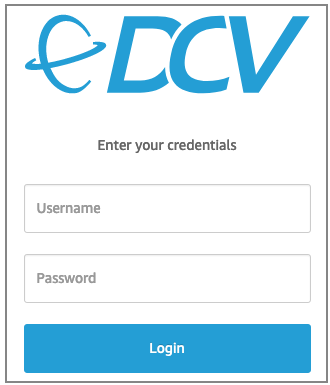
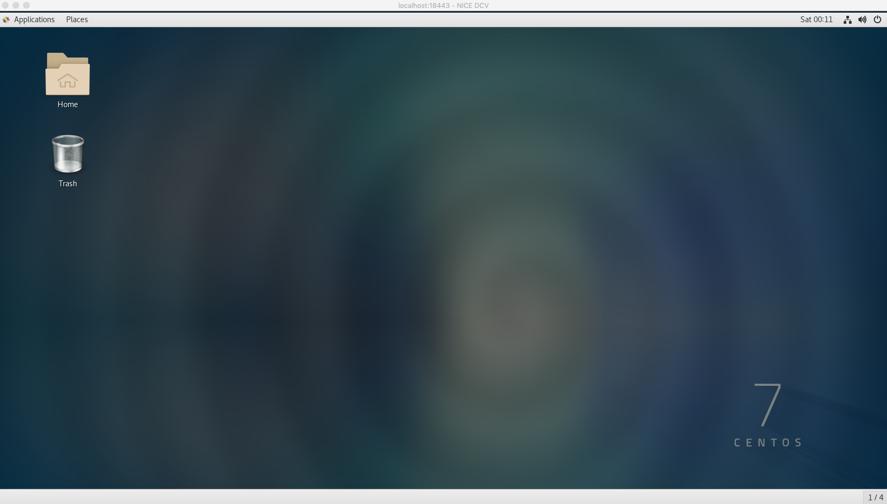

# GUI FPGA Development Environment with NICE DCV
This guide shows steps to setup a GUI FPGA Development Environment using the FPGA Developer AMI using NICE DCV
      
## Overview

[NICE DCV](https://docs.aws.amazon.com/dcv/latest/adminguide/what-is-dcv.html) can be used create a virtual desktop on your FPGA Developer AMI instance.

[NICE DCV](https://docs.aws.amazon.com/dcv/latest/adminguide/what-is-dcv.html) is a high-performance remote 
display protocol that provides customers with a secure way to deliver remote desktops and application streaming 
from any cloud or data center to any device, over varying network conditions. 

With NICE DCV and Amazon EC2, customers can run graphics-intensive applications remotely on EC2 instances
and stream the results to simpler client machines, eliminating the need for expensive dedicated workstations.
Customers across a broad range of HPC workloads use NICE DCV for their remote visualization requirements.
The NICE DCV streaming protocol is also utilized by popular services like Amazon AppStream 2.0 and AWS RoboMaker.

The [DCV Administrator guide](https://docs.aws.amazon.com/dcv/latest/adminguide/what-is-dcv.html)
and the [User guide](https://docs.aws.amazon.com/dcv/latest/userguide/getting-started.html)
are the official resources on how to configure and use DCV.

The installation process is summarized below for your convenience.

**NOTE**:
These steps may change when new versions of the DCV Server and Clients are released.
If you experience issues please refer to the [Official DCV documentation](https://docs.aws.amazon.com/dcv/latest/adminguide/what-is-dcv.html).

## Installation Process

1. [Setup your FPGA Developer AMI Instance with an IAM Role](https://docs.aws.amazon.com/dcv/latest/adminguide/setting-up-license.html#setting-up-license-ec2) that grants your instance access to NICE DCV endpoints.

    NICE DCV is available for free to use on EC2.

    The NICE DCV server automatically detects that it is running on an Amazon EC2 instance and periodically connects to an Amazon S3 bucket to determine whether a valid license is available. The IAM role enables this functionality.
    
    Please follow the steps mentioned in the above guide to attach an IAM role to your instance with the following policy:
    ```
    {
        "Version": "2012-10-17",
        "Statement": [
            {
                "Effect": "Allow",
                "Action": "s3:GetObject",
                "Resource": "arn:aws:s3:::dcv-license.region/*"
            }
        ]
    }
    ```
    **NOTE:** Without access to the DCV bucket mentioned in the [NICE DCV licensing setup guide](https://docs.aws.amazon.com/dcv/latest/adminguide/setting-up-license.html#setting-up-license-ec2), your server license is only valid of 15 days.

1. On your FPGA Developer AMI Instance [update the Instance Security Group](https://docs.aws.amazon.com/AWSEC2/latest/UserGuide/using-network-security.html#adding-security-group-rule) to allow TCP Port **8443** Ingress

1. [Install NICE DCV pre-requisites](https://docs.aws.amazon.com/dcv/latest/adminguide/setting-up-installing-linux-prereq.html)

   ```
   sudo yum -y install kernel-devel
   sudo yum -y groupinstall "GNOME Desktop"
   sudo yum -y install glx-utils
   ```

1. [Install NICE DCV Server](https://docs.aws.amazon.com/dcv/latest/adminguide/setting-up-installing-linux-server.html)

   ```
   sudo rpm --import https://d1uj6qtbmh3dt5.cloudfront.net/NICE-GPG-KEY
   wget https://d1uj6qtbmh3dt5.cloudfront.net/2021.2/Servers/nice-dcv-2021.2-11048-el7-x86_64.tgz
   tar -xvzf nice-dcv-2021.2-11048-el7-x86_64.tgz && cd nice-dcv-2021.2-11048-el7-x86_64
   sudo yum install nice-dcv-server-2021.2.11048-1.el7.x86_64.rpm
   sudo yum install nice-xdcv-2021.2.406-1.el7.x86_64.rpm

   sudo systemctl enable dcvserver
   sudo systemctl start dcvserver
   ```

1. Setup Password

   ```
   sudo passwd centos
   ```

1. Change firewall settings
   
   Options: 
   
   * Disable firewalld to allow all connections
   ```
   sudo systemctl stop firewalld
   sudo systemctl disable firewalld
   ```
   
   * Open up the firewall only for tcp port 8443
   
   ```
   sudo systemctl start firewalld
   sudo systemctl enable firewalld
   sudo firewall-cmd --zone=public --add-port=8443/tcp --permanent
   sudo firewall-cmd --reload
   ```

1. Create a virtual session to connect to    
   
   **NOTE: You will have to create a new session if you restart your instance.** 

   ```
   dcv create-session --type virtual --user centos centos --owner centos
   ```

1. Connect to the DCV Remote Desktop session

    1. **Using a web browser**
    
       * Make sure that you are using a [supported web browser](https://docs.aws.amazon.com/dcv/latest/adminguide/what-is-dcv.html#what-is-dcv-requirements).
       
       * Use the secure URL, Public IP address, and correct port (8443) to connect. For example: `https://111.222.333.444:8443`
    
          **NOTE:** When you connect make sure you use the `https` protocol to ensure a secure connection.              

    1. **Using the NICE DCV Client**
    
       * Download and install the [DCV Client](https://download.nice-dcv.com/)
       
       * Use the Public IP address, and correct port (8443) to connect

          An example login screen (for the DCV Client you will need to connect first using the IP:Port, for example `111.222.333.444:8443`):
    
          

1. Logging in should show you your new GUI Desktop:

    
