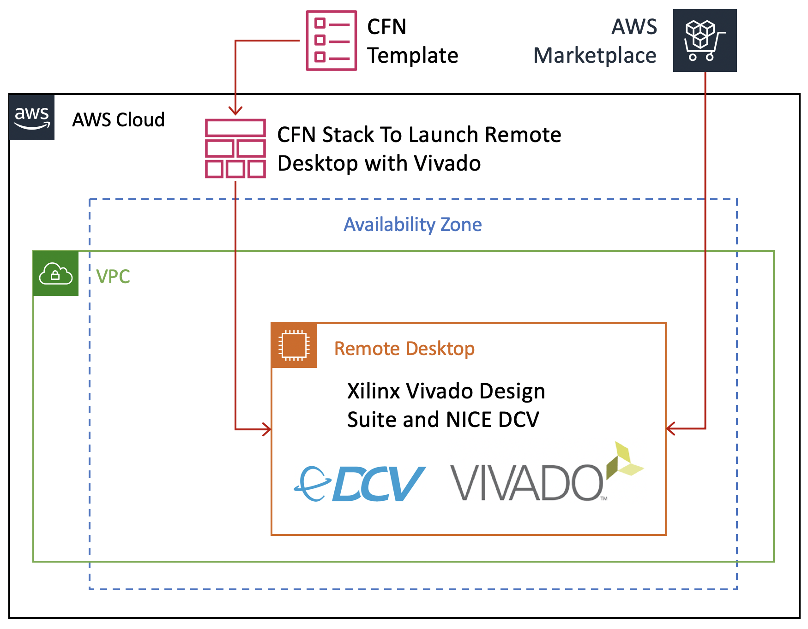
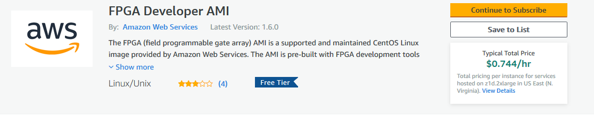
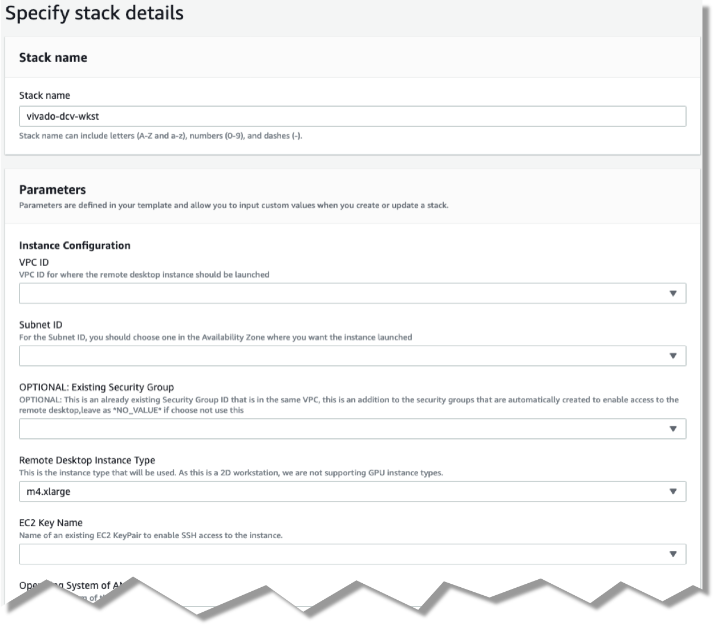
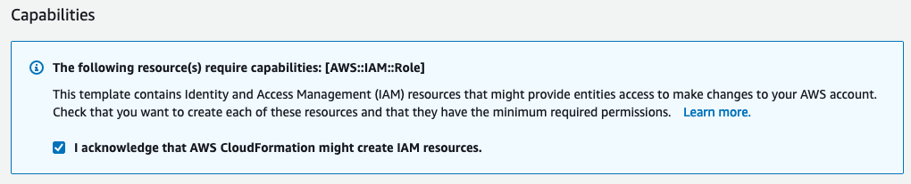
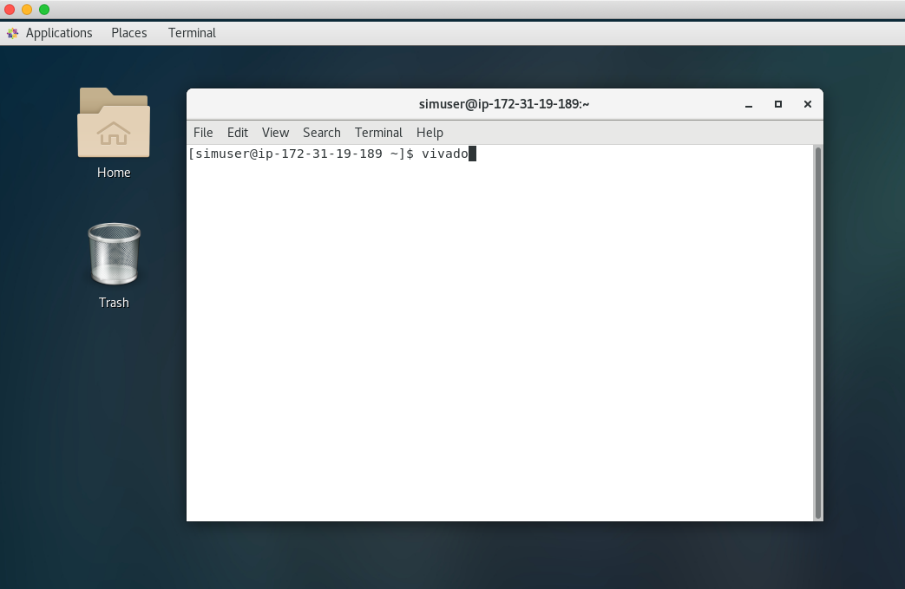
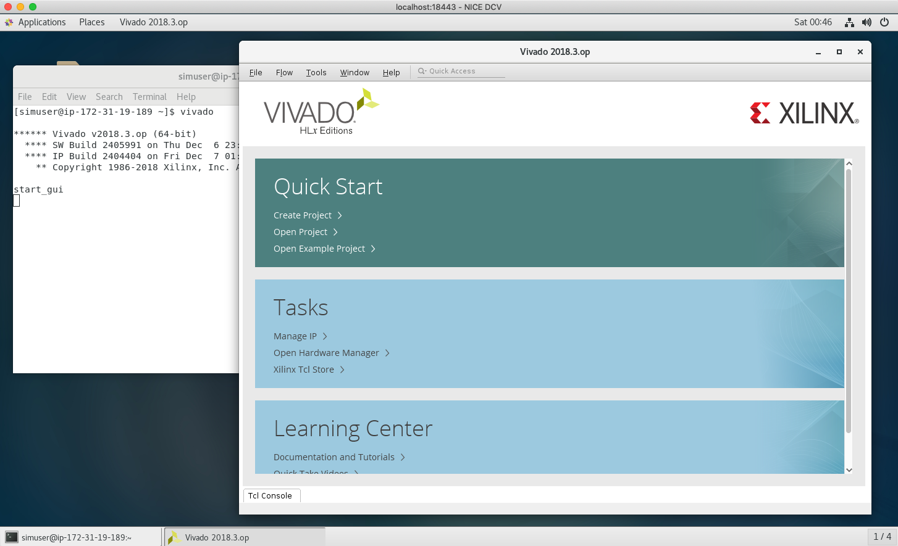

<span style="display: inline-block;">

# GUI FPGA Development Environment with NICE DCV and ParallelCluster

Deploy a CloudFormation template to Launch an EC2 instance with the FPGA Developer AMI that has DCV Remote Desktop and ParallelCluster.

## Table of Contents

  * [Overview](#overview)
  * [Requirements](#requirements)
  * [Architecture](#architecture)
  * [Cost](#cost)
  * [Duration](#duration)
  * [Step-by-step Guide](#step-by-step-guide)
     * [Subscribe to AWS FPGA Developer AMI](#subscribe-to-aws-fpga-developer-ami)
     * [Launch with CloudFormation](#launch-with-cloudformation)
     * [Connect to the DCV Remote Desktop session](#connect-to-the-dcv-remote-desktop-session)
     * [Launch Vivado](#launch-vivado)
     * [ParallelCluster Configuration](#pcluster-config)
     * [Building a DCP On ParallelCluster Using SGE](#building-a-dcp-on-parallelcluster-using-sge)
     * [Building a DCP On ParallelCluster Using Slurm](#building-a-dcp-on-parallelcluster-using-slurm)
     * [Building a DCP On ParallelCluster Using Torque](#building-a-dcp-on-parallelcluster-using-torque)
  * [FAQ](#faq)
  * [References](#references)

<a name="overview"></a>
## Overview

This tutorial shows how to launch an EC2 instance using the FPGA Developer AMI that has
[NICE DCV](https://docs.aws.amazon.com/dcv/latest/adminguide/what-is-dcv.html) and
[AWS ParallelCluster](https://docs.aws.amazon.com/parallelcluster/latest/ug/what-is-aws-parallelcluster.html)
installed and configured to enable FPGA development in a GUI environment that is high performance
and cost effective.

[NICE DCV](https://docs.aws.amazon.com/dcv/latest/adminguide/what-is-dcv.html) is a high-performance remote 
display protocol that provides customers with a secure way to deliver remote desktops and application streaming 
from any cloud or data center to any device, over varying network conditions. 

With NICE DCV and Amazon EC2, customers can run graphics-intensive applications remotely on EC2 instances
and stream the results to simpler client machines, eliminating the need for expensive dedicated workstations.
Customers across a broad range of HPC workloads use NICE DCV for their remote visualization requirements.
The NICE DCV streaming protocol is also utilized by popular services like Amazon AppStream 2.0 and AWS RoboMaker.

[AWS ParallelCluster](https://docs.aws.amazon.com/parallelcluster/latest/ug/what-is-aws-parallelcluster.html)
provides a scalable compute environment for running compute or resource intensive jobs such as DCP generation or
F1 runtime applications.
ParallelCluster can help manage costs by automatically starting and terminating instances as needed by jobs.


<a name="requirements"></a>
## Requirements
- You will need to subscribe to the [AWS FPGA Developer AMI on the AWS Marketplace](https://aws.amazon.com/marketplace/pp/B06VVYBLZZ)
- You will need a VPC that has access to the internet, either using a public subnet or NAT gateway. 
    - This is required to download all of the packages (for both DCV and OS packages) and to be able to connect to the instances.
    - ParallelCluster instances can run in either private or public subnets that have access to the internet.
    
<a name="architecture"></a>
## Architecture



<a name="cost"></a>
## Cost

There is no additional charge to use NICE DCV or ParallelCluster on Amazon EC2.

You only pay for the EC2 resources you use to run and store your workloads.

<a name="duration"></a>
## Duration

The following table shows the estimated time for the different steps in this tutorial.
The time it takes to complete each step will vary based on the instance types the instance types that use.

| **Step**                                                    | **t3-2xlarge Duration** | **c5.4xlarge Duration** | **z1d.xlarge Duration** | **m5.2xlarge Duration** | **r5.xlarge Duration** |
|-------------------------------------------------------------|-------------------------|-------------------------|-------------------------|-------------------------|------------------------|
| [Subscribe to AWS FPGA Developer AMI](#subscribe)           |  1 min                  |  1 min                  |  1 min                  |  1 min                  |  1 min                 |
| [Launch with CloudFormation](#launch)                       | 23 min                  | 18 min                  | 17 min                  | 18 min                  | 20 min                 |
| [Connect to the DCV Remote Desktop session](#connect)       |  1 min                  |  1 min                  |  1 min                  |  1 min                  |  1 min                 |
| cl_hello_world DCP on Desktop                               | 91m40s                  | 75m44s                  | 77m9s                   | 83m42s                  | 83m20s                 |

It will take ~20 minutes for CloudFormation to automatically create your GUI Desktop environment.

<a name="guide"></a>
## Step-by-step Guide

<a name="subscribe"></a>
### Subscribe to AWS FPGA Developer AMI

Before you can launch the CloudFormation stack, you will need to subscribe to the AWS FPGA Developer AMI.
There is no charge to subscribe to the AWS FPGA Developer AMI; you will only be charged for the underlying resources.

* Sign into your AWS account
* Go to the [AWS FPGA Developer AMI on the AWS Marketplace](https://aws.amazon.com/marketplace/pp/B06VVYBLZZ)
* Click on **Continue to Subscribe** button on upper right



<a name="launch"></a>
### Launch with CloudFormation

The resources used in this workshop will be launched with AWS CloudFormation. For additional information about CloudFormation please visit
[AWS CloudFormation](https://aws.amazon.com/cloudformation/).

IMPORTANT: Read through all steps below before *_clicking_* the *Launch on AWS* button.

1. Click on the *Launch on AWS* button and follow the CloudFormation prompts to begin.

   Currently available in these regions.

   TIP *_Context-click (right-click)_* the *Launch on AWS* button and open the link in a new tab or 
window to make it easy to navigate between this guide and the AWS Console.

   | *Region* | *Launch template* |
   |----------|-------------------|
   | *N. Virginia* (us-east-1) | <a href="https://console.aws.amazon.com/cloudformation/home?region=us-east-1#/stacks/new?stackName=dcv-with-pcluster&templateURL=https://aws-fpga-hdk-resources.s3.amazonaws.com/developer_resources/cfn_templates/dcv_with_pcluster.yaml"></a> |
   | *Ohio* (us-east-21) | <a href="https://console.aws.amazon.com/cloudformation/home?region=us-east-2#/stacks/new?stackName=dcv-with-pcluster&templateURL=https://aws-fpga-hdk-resources.s3.amazonaws.com/developer_resources/cfn_templates/dcv_with_pcluster.yaml"></a> |
   | *N. California* (us-west-1) | <a href="https://console.aws.amazon.com/cloudformation/home?region=us-west-1#/stacks/new?stackName=dcv-with-pcluster&templateURL=https://aws-fpga-hdk-resources.s3.amazonaws.com/developer_resources/cfn_templates/dcv_with_pcluster.yaml"></a> |
   | *Oregon* (us-west-2) | <a href="https://console.aws.amazon.com/cloudformation/home?region=us-west-2#/stacks/new?stackName=dcv-with-pcluster&templateURL=https://aws-fpga-hdk-resources.s3.amazonaws.com/developer_resources/cfn_templates/dcv_with_pcluster.yaml"></a> |
   | *Ireland* (eu-west-1) | <a href="https://console.aws.amazon.com/cloudformation/home?region=eu-west-1#/stacks/new?stackName=dcv-with-pcluster&templateURL=https://aws-fpga-hdk-resources.s3.amazonaws.com/developer_resources/cfn_templates/dcv_with_pcluster.yaml"></a> |
   | *Sydney* (ap-southeast-2) | <a href="https://console.aws.amazon.com/cloudformation/home?region=ap-southeast-2#/stacks/new?stackName=dcv-with-pcluster&templateURL=https://aws-fpga-hdk-resources.s3.amazonaws.com/developer_resources/cfn_templates/dcv_with_pcluster.yaml"></a> |
   | *Hong Kong\** (ap-east-1) | <a href="https://console.aws.amazon.com/cloudformation/home?region=ap-east-1#/stacks/new?stackName=dcv-with-pcluster&templateURL=https://aws-fpga-hdk-resources.s3.amazonaws.com/developer_resources/cfn_templates/dcv_with_pcluster.yaml"></a> |

   \**May require additional request for access*
1. Accept the defaults on the *Prerequisite - Prepare template* page and *_click_* *Next*.
1. You should see the *Stack Details* page:
   
1. *_Enter_* values for parameters.

   | *Parameter* | *Variable Name* | *Description*
   |-------------|-----------------|--------------|
   | *VPC ID*    | VPCId  | VPC ID for where the remote desktop instance should be launched.
   | *VPC CIDR Block* | VPCCidrBlock | We use this to create a security group that allows NFS access to and from the remote desktop instance. Pick the CIDR from the VPC ID Parameter above(For eg: `vpc-123abc(10.0.0.0/16)`).
   | *FPGA Developer AMI Version* | FpgaDevAmiVersion | Select the FPGA Developer AMI Version you want to launch your instances with. Picks the latest version by default.
   | *User name for DCV login* | UserName | User name for DCV remote desktop login, default is *_simuser_*
   | *Password for DCV login* | UserPass | Password for DCV remote desktop login.
   | *Subnet ID* | Subnet | Select a Subnet ID in the Availability Zone where you want the instance launched. Pick a subnet from the VPC selected above.
   | *EC2 Key Name* | EC2KeyName | Name of an existing EC2 KeyPair to enable SSH access to the instance.   
   | *Remote Desktop Instance Type* | remoteDesktopInstanceType | Select an instance type for your remote desktop.
   | *CIDR block for remote access (ports 22 and 8443)* | AccessCidr | Put the IP ranges from where you allow remote access to your remote desktop. This opens up ports 22 and 8443 for the CIDR range. We recommend setting it to the output of [Check My IP](http://checkip.amazonaws.com/). For eg: `12.34.56.78/32` so that only you can access the instance. 
   | *Project Data Size* | ProjectDataSize | Enter the size in GB for your project_data EBS volume. You can always [increase your volume size later](https://docs.aws.amazon.com/AWSEC2/latest/UserGuide/requesting-ebs-volume-modifications.html). Default is 5GB.
   | _OPTIONAL_: *Existing Security Group (e.g. sg-abcd1234efgh)*   | ExistingSecurityGroup   | *OPTIONAL:* Needs to be a SG ID, for example sg-abcd1234efgh. This is an [already existing Security Group ID that is in the same VPC](https://console.aws.amazon.com/vpc/home?#SecurityGroups), this is an addition to the security groups that are automatically created to enable access to the remote desktop, leave as NO_VALUE if you choose not use this.
   | _OPTIONAL_: *Static Private IP Address* | StaticPrivateIpAddress   | *OPTIONAL:* If you already have a private VPC address range, you can specify the private IP address to use, leave as *NO_VALUE* if you choose not use this
   | *Assign a Public IP address* | UsePublicIp   | Should a public IP address be given to the instance, this is overridden by `*CreateElasticIP = True*`
   | *Create an Elastic IP address* | CreateElasticIP | Should an Elastic IP address be created and assigned, this allows for persistent IP address assignment
   | _OPTIONAL_: *S3 bucket for read access* | S3BucketName | *OPTIONAL:* S3 bucket to allow this instance read access (List and Get), leave as *NO_VALUE* if you choose not use this
   | _OPTIONAL_: *ParallelCluster Scheduler* | Scheduler | *OPTIONAL:* Select a scheduler to setup with ParallelCluster. Only necessary if you want to deploy a compute cluster.
   | _OPTIONAL_: *ParallelCluster Subnet ID* | PclusterSubnet | *OPTIONAL:* Select a Subnet ID in the Availability Zone where you want the cluster instances launched. Pick a subnet from the VPC selected above.
   | _OPTIONAL_: *Scheduler instance type* | MasterInstanceType | *OPTIONAL:* Select an instance type you want the scheduler master to run on. This can be a small/free tier instance.
   | _OPTIONAL_: *DCP Build instance type* | DcpInstanceType | *OPTIONAL:* Select an instance type for building DCP's. z1d.xlarge, c5.4xlarge, m5.2xlarge, r5.xlarge, t3.2xlarge, t2.2xlarge are recommended.
   | _OPTIONAL_: *F1 instance type* | F1InstanceType | *OPTIONAL:* Select a runtime instance type for your Runtime queue.
   
1. After you have entered values for the parameters, *_click_* *Next*.

1. *_Accept_* the default values of the *Configure stack options* and *Advanced options* sections and *_click_* *Next*.

1. *_Review_* the CloudFormation stack settings.

1. *_Click_* all checkboxes in the blue *Capabilities* box at the bottom of the page.
   
   
1. *_Click_* *Create stack*.

    This will start the deployment process. 
    AWS CloudFormation will create all of the resources specified in the template and set them up.

1. Verify stack was created successfully

   In the *Events* tab, you should see `*CREATE_COMPLETE*` for the `AWS::CloudFormation::Stack` event Type.
   In the *Stack Info* tab, you should see `*CREATE_COMPLETE*` in the Status field.
   It will take ~20 minutes for the stack creation to complete. This is due to the large number of packages that need to be installed. Upon completion you should see the connection information (IP address) in the *Outputs* section of the stack.

<a name="connect"></a>
### Connect to the DCV Remote Desktop session

You can either use your web browser to connect to the DCV Remote Desktop session or you can use the DCV Client.

1. **Using a web browser**
   i. Make sure that you are using a [supported web browser](https://docs.aws.amazon.com/dcv/latest/adminguide/what-is-dcv.html#what-is-dcv-requirements).
   i. Use the secure URL, Public IP address, and correct port (8443) to connect

      When you connect make sure you use the https protocol, to ensure you are using a connecting connection.

      For example: `https://111.222.333.444:8443`

1. **Use the NICE DCV Client**

   * Download and install the [DCV Client](https://download.nice-dcv.com/)
   
   * Use the Public IP address, and correct port (8443) to connect

      For example: `111.222.333.444:8443`

      An example login screen (for the DCV Client you will need to connect first using the IP:Port, for example  111.222.333.444:8443):
      
      

   * After you login with the credentials you specified when creating the stack, you will see the Desktop:
   
   

<a name="launch_vivado"></a>

### Launch Vivado 

Now that your remote desktop is setup, you can launch the Vivado Design Suite (included in the AWS FPGA Developer AMI). 
   
   i. Start a terminal session, go to *_Applications -> Favorites -> Terminal_*.

   i. Type `vivado` at the command prompt and hit enter:

   

   Vivado will launch in a GUI session:

   

<a name="pcluster-config"></a>

### ParallelCluster Configuration

The template creates a ParallelCluster configuration and an AMI for the cluster instances.
If you selected a scheduler, then it will also create two ParallelCluster clusters.
If you didn't select a scheduler in the template you can still manually start a cluster.

The configuration file for ParallelCluster is found in `~/.parallelcluster/config` and the
configuration parameters are documented [here](https://docs.aws.amazon.com/parallelcluster/latest/ug/configuration.html).
It supports the following schedulers:
* sge
* slurm
* torque

The template creates a custom ParallelCluster AMI based on the FPGA Developer AMI so that they have
the Xilinx tools installed.
They also mount `~/src/project_data` from your DCV instance so that your project data is accessible
on the ParallelCluster compute nodes.

If you selected a scheduler then the template will create two ParallelCluster clusters, where
${Scheduler} is the scheduler you selected when you launched the template.

* The fpgadev-${Scheduler} cluster is for running compute intense jobs such as DCP generation.
* The fpgarun-${Scheduler} cluster is for testing your AFI on F1 instances.

If you didn't select a scheduler then you can start the clusters manually using the following commands
replacing ${Scheduler} with the scheduler you want to use.

```
pcluster create -t fpgadev-${Scheduler} fpgadev-${Scheduler}
pcluster create -t fpgarun-${Scheduler} fpgarun-${Scheduler}
```

All the clusters are configured to terminate the compute nodes if they are idle for more than one minute.
When jobs are queued the cluster will automatically launch enough compute nodes to run the jobs.
The configuration file limits the max number of compute nodes in the cluster to two nodes.
You can modify the `max_queue_size` parameter in the configuration file if you need to increase that limit.

You can check the status of the clusters using the `pcluster list` command.

```
$ pcluster list
fpgadev-sge     CREATE_IN_PROGRESS  2.4.1
fpgarun-sge     CREATE_IN_PROGRESS  2.4.1
```

If no clusters are listed then it is possible that the custom AMI isn't complete.
You can check the status of the custom AMI generation by looking in the log file
at `~/.parallelcluster/create-ami.log`.

Wait until the cluster status is *CREATE_COMPLETE*.

```
$ pcluster list
fpgadev-sge    CREATE_COMPLETE  2.4.1
fpgarun-sge    CREATE_COMPLETE  2.4.1
```

You can get information about the cluster by running the `pcluster status` command.

```
$ pcluster status fpgadev-sge
Status: CREATE_COMPLETE
MasterServer: RUNNING
MasterPublicIP: 3.95.42.219
ClusterUser: centos
MasterPrivateIP: 172.31.15.131
```

**NOTE:** All of the scheduler commands have to be executed on the scheduler's master instance.
You will use ssh to connect to the instance.

The CloudFormation template created an EC2 KeyPair, saved the private key at `~/pcluster.pem`, and added it to your ssh agent.
ParallelCluster is configured to use this key.
You can connect to the master using the following command.

```
pcluster ssh fpgadev-sge
```

Any additional arguments are passed to the ssh command.
This allows you to run commands on the master from your desktop.
For example you can check that your project data is mounted
in the cluster.

```
$ pcluster ssh fpgadev-sge ls ~/src/project_data
aws-fpga
build_cl_hello_world.sh
```

Note that the master in this tutorial is configured as a t3.micro instance so it lacks the
compute resources required for running jobs.
It's role is to manage jobs running in the cluster.

The following sections show how to run a the cl_hello_world example's DCP generation job
on ParallelCluster using the different schedulers.
The script to do the DCP generation is at `~/src/project_data/build_cl_hello_world.sh`.

<a name="building-a-dcp-on-parallelcluster-using-sge"/>

### Building a DCP On ParallelCluster Using SGE

Use the `qsub` command to submit the job on an SGE cluster.

```
$ pcluster ssh fpgadev-sge qsub ~/src/project_data/build_cl_hello_world.sh
Unable to run job: warning: ${UserName}'s job is not allowed to run in any queue
Your job 1 ("build_cl_hello_world.sh") has been submitted
Exiting.
```

The warning is because a compute node isn't available to run the job.
You can verify that the job was actually submitted using the `qstat` command.

```
$ qstat
job-ID  prior   name       user         state submit/start at     queue                          slots ja-task-ID 
-----------------------------------------------------------------------------------------------------------------
      1 0.55500 build_cl_h ${UserName}  qw    09/17/2019 18:06:38                                    1 
```

ParallelCluster will detect that the job is queued and start a new compute node to run it.
You can verify this by going to the EC2 console.

When the compute node starts, the job will transition to running state.

```
$ pcluster ssh fpgadev-sge qstat
job-ID  prior   name       user         state submit/start at     queue                          slots ja-task-ID 
-----------------------------------------------------------------------------------------------------------------
      1 0.55500 build_cl_h ${UserName}  r     09/17/2019 18:38:15 all.q@ip-172-31-12-135.ec2.int     1  
```

The output of the job is written to your home directory on the master.

```
$ pcluster ssh fpgadev-sge ls
build_cl_hello_world.sh.e1
build_cl_hello_world.sh.o1
src
```

<a name="building-a-dcp-on-parallelcluster-using-slurm"/>

### Building a DCP On ParallelCluster Using Slurm

The process for using Slurm is similar, except the scheduler commands are different.
Use the `sbatch` command to submit a job.

```
$ pcluster ssh fpgadev-slurm sbatch src/project_data/build_cl_hello_world.sh
Submitted batch job 1
```

Use the `squeue` command to check the status.

```
$ pcluster ssh fpgadev-slurm squeue
             JOBID PARTITION     NAME     USER ST       TIME  NODES NODELIST(REASON)
                 1   compute build_cl cartalla  R       0:06      1 ip-172-31-13-182
```

<a name="building-a-dcp-on-parallelcluster-using-torque"/>

### Building a DCP On ParallelCluster Using Torque

The process for using Torque is the same as sge except the output is different.
Use the `qsub` command to submit a job.

```
$ pcluster ssh fpgadev-torque qsub src/project_data/build_cl_hello_world.sh
1.ip-172-31-5-142.ec2.internal
```

Use the `qstat` command to check the status.

```
$ pcluster ssh fpgadev-torque qstat
Job ID                    Name             User            Time Use S Queue
------------------------- ---------------- --------------- -------- - -----
1.ip-172-31-5-142.ec2.interna ...ello_world.sh cartalla               0 Q batch
```

<a name="faq"></a>

## FAQ

* How do I find out if my template deployment completed?

  * In the *Events* tab, you should see `*CREATE_COMPLETE*` for the `AWS::CloudFormation::Stack` event Type.
  * In the *Stack Info* tab, you should see `*CREATE_COMPLETE*` in the Status field.

* How do I update to a new template?

    You can update your deployed stack by going to the [CloudFormation console](https://console.aws.amazon.com/cloudformation) -> Stacks -> Your Stack and selecting the `Update` button at the top.

    You have three ways of updating:

    1. Use current template
        
        This option lets you update parameters in the currently deployed stack.
        Click next after selecting this option to see the parameters, change them and go through the deployment steps as before. 
    
    1. Replace current template
        
        This option lets you select an updated template.
        
        If you want to update your stack with a new template that we have released, select this option and point to our template URL:
        `https://aws-fpga-hdk-resources.s3.amazonaws.com/developer_resources/cfn_templates/dcv_with_pcluster.yaml`
        
        This will let you get any fixes and updates that we publish to the template.
        
    1. Modify the template in the CloudFormation Designer
        
        This option lets you graphically edit the template and add parts depending on your need.
        Check the [Official CloudFormation Designer documentation](https://docs.aws.amazon.com/AWSCloudFormation/latest/UserGuide/working-with-templates-cfn-designer.html) for more details on how to get started!

* How do I terminate my instance?

    To clean up resources created by a CloudFormation stack, we strongly suggest deleting the stack instead of deleting resources individually.
    
    CloudFormation will handle the instance termination for you.
    
    To delete a stack, please follow the [CloudFormation User Guide](https://docs.aws.amazon.com/AWSCloudFormation/latest/UserGuide/cfn-console-delete-stack.html)
    
* How do I troubleshoot CloudFormation stack deployment issues?
    
    To start off, please check the [CloudFormation Troubleshooting Guide](https://docs.aws.amazon.com/AWSCloudFormation/latest/UserGuide/troubleshooting.html)
    
    Next, post a question on the [FPGA Development forum](https://forums.aws.amazon.com/forum.jspa?forumID=243&start=0) **OR** file a support ticket from the [Support Center](https://console.aws.amazon.com/support) and someone should be able to help you out!
        
<a name="references"></a>

## References

- [NICE DCV](https://docs.aws.amazon.com/dcv/latest/adminguide/what-is-dcv.html)
- [Xilinx Vivado Design Suite](https://www.xilinx.com/products/design-tools/vivado.html)
- [AWS ParallelCluster](https://docs.aws.amazon.com/parallelcluster/latest/ug/what-is-aws-parallelcluster.html)
