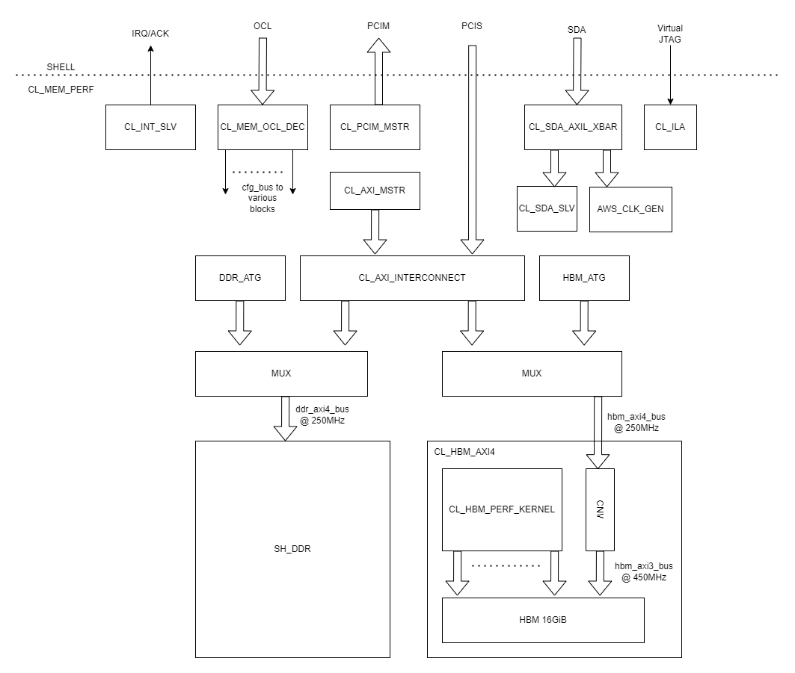
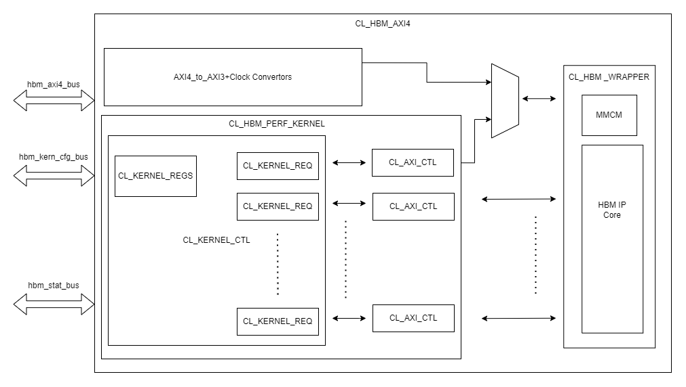

CL_MEM_PERF Custom Logic Example
================================

⚠️ **Features using XDMA engine are currently unsupported on F2 instances**

Table of Content
----------------

- `CL_MEM_PERF Custom Logic
  Example <#cl_mem_perf-custom-logic-example>`__

  - `Table of Content <#table-of-content>`__

- `Introduction <#introduction>`__
- `Architecture Overview <#architecture-overview>`__

  - `Clocks and Reset <#clocks-and-reset>`__
  - `OCL <#ocl>`__
  - `PCIM <#pcim>`__
  - `PCIS <#pcis>`__
  - `DDR <#ddr>`__
  - `HBM <#hbm>`__
  - `SDA <#sda>`__
  - `Interrupts <#interrupts>`__
  - `Virtual JTAG <#virtual-jtag>`__

- `Address Space <#address-space>`__

  - `OCL Address Space <#ocl-address-space>`__
  - `PCIS Memory Address Space <#pcis-memory-address-space>`__
  - `HBM Memory Address Space <#hbm-memory-address-space>`__
  - `CL_HBM_AXI4 Register Address
    Space <#cl_hbm_axi4-register-address-space>`__
  - `SDA Memory Address Space <#sda-memory-address-space>`__

- `Simulations <#simulations>`__
- `Software <#software>`__

  - `test_hbm_perf32.c <#test-hbm-perf32c-mem-1>`__
  - `test_dram_hbm_dma.c <#test-dram-hbm-dmac-mem-1>`__
  - `test_hbm_perf32.c <#test-hbm-perf32c-mem-2>`__
  - `test_aws_clk_gen.c <#test-aws-clk-genc>`__
  - `test_clk_freq.c <#test-clk-freqc>`__

  - `Compile and run instructions <#compile-and-run-instructions-mem-1>`__

    - `test_dram_hbm_dma_hwsw_cosim.c <#test-dram-hbm-dma-hwsw-cosimc-mem-1>`__

  - `Compile and run instructions <#compile-and-run-instructions-mem-2>`__

- `HBM Performance Tests <#hbm-performance-tests-mem-1>`__

  - `Instructions to run HBM Performance
    Test <#instructions-to-run-hbm-performance-test>`__

Introduction
============

The CL_MEM_PERF is a customer reference design for F2 where the
objective is to demonstrate fine tuned data paths to HBM and DDR to
achieve maximum throughput to the memories. The example also
demonstrates datapath connectivity between Host, AWS Shell, Custom Logic
(CL) region in the FPGA, HBM and DDR DIMM on the FPGA card. Following
are the major highlights of CL_MEM_PERF design:

1.  Datapath to 64GB DDR and 16GB HBM through Shell's PCIS Interface.
    DDR and HBM memories in the FPGFA are accessible from the Host on
    PF0-BAR4, as well as from the DMA engine in the XDMA_SHELL. Both
    these accesses show up as AXI4 transaction on PCIS interface which
    ultimately reach the targeted memory.
2.  Demonstrate the use of PCIM interface for applications where CL is
    the PCIe Requester to the Host. This can also be used to test peak
    PCIe transfer rates between Host and FPGA over PCIM interface.
3.  Register access to various blocks through Shell's OCL interface.
4.  1KB BRAM accessible through Shell's SDA interface.
5.  Supports user defined interrupts generated by the CL.
6.  Demonstrate Virtual JTAG using debug cores and AMD Integrated Logic
    Analyzers (ILA).
7.  AXI4 Traffic Generators to test peak DDR4 performance.
8.  HBM Performance Kernels to test peak HBM performance. This example
    shows how the micro-architecture to saturate all 32 Channels of HBM,
    achieve timing closure at 450MHz and achieve peak performance close
    to the theoretical number described in `AMD/Xilinx HBM Userguide
    <https://docs.xilinx.com/r/en-US/pg276-axi-hbm/Raw-Throughput-Evaluation>`__
9.  Build scripts and constraints to create or manage pblock/placement
    and timing constraints.
10. Software runtime tests to exercise max performance to the HBM, and
    other tests to exercise DMA engine in the AWS Shell to perform data
    transfers between the Host and CL.

Overall, CL_MEM_PERF enables customers to quickly integrate their CL
accelerator designs to interface with various memories on the FPGA and
to use as reference to fine tune their CL performance.

Architecture Overview
=====================

Figure below shows an architectural overview of CL_MEM_PERF design:

|cl_mem_perf|

All interfaces in this CL example are accessible from the Host on the
PF/BARs as stated in the table below. Please See the `PCIe Memory Map
<../../../docs/AWS_Fpga_Pcie_Memory_Map.html>`__ for more details on bar sizes,
and `AWS Shell Interface Specification
<../../../docs/AWS_Shell_Interface_Specification.html>`__ for available
interfaces between the Shell and the CL.

.. list-table::
  :header-rows: 1
  :class: user-guide-dev-envs-table
  :widths: 30 5 5

  * - Interface
    - PF
    - BAR
  * - OCL
    - 0
    - 0
  * - XDMA BAR (not an interface between Shell/CL)
    - 0
    - 2
  * - PCIS
    - 0
    - 4
  * - Reserved for AWS
    - 1
    - 0
  * - Virtual JTAG
    - 1
    - 2
  * - SDA
    - 1
    - 4

Clocks and Reset
----------------

- clk_main_a0 (250 MHz) from Shell for majority of the design except for
  HBM.
- rst_main_n from Shell sync'd to clk_main_a0.
- clk_hbm_ref (100 MHz) from Shell as reference clock for HBM IP.
- HBM AXI3 interface is clocked by the 450MHz clock generated from the
  `AWS_CLK_GEN <https://github.com/aws/aws-fpga/tree/f2/hdk/common/lib/aws_clk_gen.sv>`__ IP. This IP also
  generates several other clocks to match with the clock recipes supported in
  F1. Please refer to the `AWS_CLK_GEN specifiction
  <./../../../docs/AWS_CLK_GEN_spec.html>`__ for details on this block. The
  `Clock Recipes User Guide <./../../../docs/Clock_Recipes_User_Guide.html>`__
  describes various clock recipes available for F2 developers and options on
  configuring clocks dynamically. The user guide also describes porting
  of CL designs based on F1 clock recipes into F2.
- NOTE: There is a SW control register at `OCL offset
  0x300 <#hbm-memory-address-space>`__ to reset only the HBM IP core.
  This reset register does not reset the whole CL_HBM_AXI4 block.

OCL
---

The `CL_MEM_OCL_DEC <https://github.com/aws/aws-fpga/tree/f2/hdk/cl/examples/cl_mem_perf/design/cl_mem_ocl_dec.sv>`__ module converts OCL
32-bit AXI-L Interface to simple config bus interface. It consists of an
address decoder to access register space of various blocks. See `OCL
Address Space <#ocl-address-space>`__ for available ranges.

PCIM
----

The `CL_PCIM_MSTR <https://github.com/aws/aws-fpga/tree/f2/hdk/cl/examples/cl_dram_hbm_dma/design/cl_pcim_mstr.sv>`__ module
is connected to the 512-bit AXI4 PCIM interface. It consists of AXI4
Traffic Generator capable of issuing Read/Write requests to the Host
over the PCIe link. This block can also be used to test the peak PCIe
transfer rates across the PCIe link.

While this block is essentially a traffic generator, CL designers could
potentially swap this block with their custom Kernel that acts as a PCIe
Requester to the Host Memory.

PCIS
----

The PCIS is a 512-bit AXI4 interface from the Shell which can be
accessed either by Host over PF0-BAR4, or by the XDMA engine in the AWS
Shell. The PCIS interface is used in CL_MEM_PERF example to provide
datapaths to the DDR and HBM memories in the FPGA. The address range to
access DDR and HBM memories is described in `PCIS Memory Address
Space <#pcis-memory-address-space>`__.

The `CL_AXI_MSTR <https://github.com/aws/aws-fpga/tree/f2/hdk/cl/examples/cl_dram_hbm_dma/design/cl_dram_dma_axi_mstr.sv>`__
module is another simple AXI4 traffic generator whose traffic pattern
and access length can be configured using the registers. The AXI4
interface from CL_AXI_MSTR and PCIS feed to CL_AXI_INTERCONNECT which
ultimately connects to DDR and HBM based on the access address request.

There are two MUXes - one along the datapath to DDR, and another MUX
along datapath to HBM. These MUXes default to connecting
CL_AXI_INTERCONNECT's path to the target memories. However, setting
these MUXes enables traffic from the ATGs to the target memories. PCIS
path to the target memories is disabled when the MUXes are enabled.

DDR
---

AWS provides
`SH_DDR <https://github.com/aws/aws-fpga/tree/f2/hdk/common/shell_stable/design/sh_ddr/synth/sh_ddr.sv>`__
that houses the DDR4 Controller specifically configured to the DDR DIMM
on the FPGA Card. The SH_DDR is also connected to the Shell's
sh_cl_ddr_stat\_\* ports to enable Shell to manage DDR calibration upon
CL AFI loads. The SH_DDR exposes an AXI4 512-bit interface for the CL
logic to perform Read/Write data transfers into DDR. Please refer to the
`Supported DDR Modes <./../../../docs/Supported_DDR_Modes.html>`__ for
details on supported DDR configurations in ``sh_ddr.sv``.

HBM
---

F2 FPGA has on-chip HBM with a maximum capacity of 16GiB, accessible
through 32 AXI3 Channels running at a maximum clock speed of up to
450MHz. CL designs should leverage all the available channels and aim
for achieving timing closure of the interface at 450MHz to get the best
possible performance out of HBM. HBM offers theoretical max bandwidth of
460GB/s when traffic is active across all the 32 Channels with 450MHz
clock.

The `CL_HBM_AXI4 <https://github.com/aws/aws-fpga/tree/f2/hdk/cl/examples/cl_mem_perf/design/cl_mem_hbm_axi4.sv>`__ module demonstrates an
use case for HBM traffic as shown in the block diagram below:

|cl_hbm_kernel|

CL_HBM_AXI4 exposes an AXI4 512-bit interface and two configuration
interfaces clocked using the 250MHz clk_main_a0. The Host (PCIS) can
access HBM through this AXI4 Interface. The AXI4 interface then connects
to 512-to-256 bit width converter, clock crossing converters between
clk_main_a0 and HBM's AXI3 clock, and
AXI4-to-AXI3 protocol converter to ultimately connect to HBM AXI Channel#0

The hbm_stat_bus is a simple config bus that connects to CL_HBM_WRAPPER
and facilitates access to the Reset Register inside the CL_HBM_WRAPPER
(mainly to reset HBM IP and check HBM read).

The hbm_kern_cfg_bus is a simple config bus to configure the HBM
Performance Kernels (CL_HBM_PERF_KERNEL)

In addition to providing a datapath from PCIS to HBM, the CL_HBM_AXI4
block also instantiates CL_HBM_PERF_KERNEL which is designed to maximize
the available bandwidth from HBM. It demonstrates the microarchitecture
for Customer Kernels interfacing with HBM, supports multiple outstanding
transactions in the queue across all 32 channels, with AXI3 interface
running at 450MHz clock. This design provides clock domain crossing
mechanism, performance measurement counters along with floorplan and
timing constraints to achieve easier timing closure at 450 MHz.

CL_HBM_PERF_KERNEL consists of the following blocks:

- CL_KERNEL_CTL: This is the main controller for the Kernel. It is
  responsible for posting write/read requests and track pending
  transactions. The block is capable of producing write and read
  requests in parallel to saturate all the channels of HBM. Keeping the
  channels active is key for maximizing the available HBM bandwidth and
  CL_KERNEL_CTL achieves that by arbitrating and issues multiple
  outstanding requests.
- CL_KERNEL_REGS: Houses all the control and status registers including
  performance measurement counters.
- CL_KERNEL_REQ: This block is instantiated inside CL_KERNEL_CTL and is
  mainly responsible to perform Clock Domain Crossing of read/write
  requests from clk_main_a0 to clk_hbm domain. This block is replicated
  to server each channel of the HBM.
- CL_AXI_CTL: Contains the control logic and datapath required to serve
  the AXI3 read/write requests to the HBM core. This module accepts
  read/write requests from CL_KERNEL_REQ pipe and interface with HBM's
  AXI3 interface. The entire block runs on clk_hbm domain. CL_AXI_CTL is
  replicated for each HBM channel. Note that, the AXI3 interface for
  channel#0 is muxed along with the AXI4 data path from the
  hbm_axi4_bus. Users should enable this mux such that the traffic from
  CL_AXI_CTL#0 drives into HBM Channel#0. Please see description for
  details.
- While the data is produced/consumed locally in this specific design,
  customers will be able to leverage the microarchitecture by feeding
  the data to/from CL_KERNEL_REQ and interfacing it to their data
  producer/consumer logic.

CL_HBM_WRAPPER:

- The CL_HBM_WRAPPER block houses the main HBM IP configured in 16GiB
  capacity with 32- AXI3 Channels running at 450MHz clk_hbm clock.
- The hbm_stats_bus config interface provides access to reset the MMCM
  and check if the HBM is ready. See registers in CL_HBM_AXI4 Register
  Address Space for details.

Please refer to `CL_HBM_AXI4 Register Address
Space <#cl-hbm-axi4-register-address-space>`__ for details on register address
space and HBM memory address space.

SDA
---

The SDA interface is shared between two modules:

1. The `CL_SDA_SLV <https://github.com/aws/aws-fpga/tree/f2/hdk/cl/examples/cl_dram_hbm_dma/design/cl_sda_slv.sv>`__ module
   provides access to a 1KB BRAM through SDA 32-bit AXI-L Interface.
2. The `AWS_CLK_GEN <https://github.com/aws/aws-fpga/tree/f2/hdk/common/lib/aws_clk_gen.sv>`__ module
   generates all the required clocks for the design. Please refer to the
   `AWS_CLK_GEN specifiction <./../../../docs/AWS_CLK_GEN_spec.html>`__ for
   details on this block. The `Clock Recipes User
   Guide <./../../../docs/Clock_Recipes_User_Guide.html>`__ describes
   various clock recipes available for F2 developers and options on
   configuring clocks dynamically. The user guide also describes porting
   of CL designs based on F1 clock recipes into F2.

Interrupts
----------

The `CL_INT_SLV <https://github.com/aws/aws-fpga/tree/f2/hdk/cl/examples/cl_dram_hbm_dma/design/cl_int_tst.sv>`__ module
implements simple mechanism to trigger MSIX interrupts to the host over
sh_cl_apppf_irq_req/ack interface. SW can check the status of the
interrupt triggers and also configure the interrupt masks. The
``interrupt_example()`` routine in
`test_dram_hbm_dma.c <https://github.com/aws/aws-fpga/tree/f2/hdk/cl/examples/cl_mem_perf/software/runtime/test_dram_hbm_dma.c>`__
demonstrates interrupts functionality.

Virtual JTAG
------------

The `CL_ILA <https://github.com/aws/aws-fpga/tree/f2/hdk/cl/examples/cl_dram_hbm_dma/design/cl_ila.sv>`__ instantiates the
Debug Bridge IP required to support Virtual JTAG and the two example
ILAs. One ILA snoops the PCIS bus, whereas second ILA snoops DDR-AXI4
bus.

Address Space
=============

OCL Address Space
-----------------

The OCL AXI-L is decoded into following address ranges for various
design blocks:

.. list-table::
  :header-rows: 1
  :class: user-guide-dev-envs-table
  :widths: 20 20 20 40

  * - Module
    - OCL Start Address
    - OCL End Address
    - Description
  * - PCIM ATG
    - 0x0000
    - 0x00FF
    - PCIM AXI4 Traffic Generator
  * - DDR ATG
    - 0x0100
    - 0x01FF
    - DDR AXI4 Traffic Generator
  * - HBM ATG
    - 0x0200
    - 0x02FF
    - HBM AXI4 Traffic Generator
  * - HBM Status
    - 0x0300
    - 0x03FF
    - Configure the CL_HBM_WRAPPER block
  * - HBM Status
    - 0x0300
    - 0x03FF
    - Configure the CL_HBM_WRAPPER block
  * - HBM Performance Kernels
    - 0x0500
    - 0x05FF
    - CL_AXI_MSTR block
  * - Clock Frequency Measurement
    - 0x0600
    - 0x06FF
    - CL_CLK_FREQ block
  * - Interrupt Generator
    - 0x0D00
    - 0x0DFF
    - CL_INT_SLV block

PCIS Memory Address Space
-------------------------

.. list-table::
  :header-rows: 1
  :class: user-guide-dev-envs-table
  :widths: 10 10 10 10

  * - Target Memory
    - Start Address
    - End Address
    - Range
  * - DDR
    - 0x00_0000_0000
    - 0x0F_FFFF_FFFF
    - 64 GB
  * - HBM
    - 0x10_0000_0000
    - 0x13_FFFF_FFFF
    - 16 GB

**NOTE**: Accessing memory beyond DDR and HBM's range can potentially corrupt
the data in either of the memories.

HBM Memory Address Space
------------------------

HBM Memory Address Space is as shown in the `HBM User
Guide <https://docs.xilinx.com/r/en-US/pg276-axi-hbm/Port-Descriptions>`__
for 16GB capacity. Each CL_AXI_CTL instantiated in CL_HBM_PERG_KERNEL is
mapped to serve the address range defined for each channel in the HBM
user guide. For example:

- Channel#0 \| Start Address = 0x0000_0000 \| End Address = 0x1FFF_FFFF
- Channel#1 \| Start Address = 0x2000_0000 \| End Address = 0x3FFF_FFFF
  and so on...

CL_HBM_AXI4 Register Address Space
----------------------------------

The table below describes the registers available in CL_HBM_AXI4 block.
This includes registers inside CL_HBM_WRAPPER and CL_KERNEL_REGS:

.. list-table::
  :header-rows: 1
  :class: user-guide-dev-envs-table
  :widths: 15 10 5 5 5 60

  * - OCL Address offset
    - Register Name
    - Bits
    - Access
    - Default Value
    - Description
  * - 0x300
    - HBM_CTL_STATUS
    - 31:3
    - RO
    - 0x0
    - Reserved
  * -
    -
    - 2:1
    - RO
    - 0x0
    -
      - 2'b00 : No initialized stack
      - 2'b01 : HBM Stack#0 is initialized
      - 2'b10 : HBM Stack#1 is initialized
      - 2'b11 : HBM Stack#0 and Stack#1 are initialized. HBM is now ready to use.
  * -
    -
    - 0
    - RW
    - 0x0
    - 1'b1 : Reset HBM IP
  * - 0x400
    - CHANNEL_AVAIL_REG
    - 31:1
    - RW
    - 0x0
    - Reserved
  * -
    -
    - 0
    - RW
    - 0x0
    - 1'b1 : Enable HBM Channel#0 MUX to drive AXI3 traffic from CL_AXI_CTL#0
      to HBM. NOTE: This bit must be set in order to use CL_HBM_PERF_KERNEL
  * - 0x404
    - CHANNEL_AVAIL_REG
    - 31:0
    - RO
    - 0x20
    - Total number of HBM channels available for CL_HBM_PERF_KERNEL
  * - 0x408
    - NUM_OT_REG
    - 31:0
    - RO
    - 0x0
    - Number of outstanding transactions supported
  * - 0x40C
    - CHNL_SEL_REG
    - 31:0
    - RW
    - 0x0
    - Select the Channel# to measure write and read latencies. This field is
      0-based. Max Value = 31.
  * - 0x410
    - AXLEN_REG
    - 31:0
    - RW
    - 0x0
    - AWLEN/ARLEN to use. This field is 0-based and the value will be used to
      drive axi_awlen and axi_arlen signals to HBM.
  * - 0x414
    - WDATA_PATTERN_REG
    - 31:0
    - RW
    - 0x0
    - Initial 32-bit data pattern for writes
  * - 0x418
    - WR_CTL_REG
    - 31:0
    - RW
    - 0x0
    - Start write transactions on each channel. Each bit corresponds to a HBM
      channel. bit[0] = Start write transfers on HBM Channel#0. bit[1] = Start
      write transfers on HBM Channel#1 ... bit[31] = Start write transfers on
      HBM Channel#31
  * - 0x41C
    - RD_CTL_REG
    - 31:0
    - RW
    - 0x0
    - Start read transactions on each channel. Each bit corresponds to a HBM
      channel. bit[0] = Start read transfers on HBM Channel#0. bit[1] = Start
      read transfers on HBM Channel#1 ... bit[31] = Start read transfers on
      HBM Channel#31
  * - 0x430
    - WR_CYC_CNT_LO_REG
    - 31:0
    - RW
    - 0x0
    - Total number of write requests to HBM aggregated across all HBM channels.
      LSB 32 bits. SW write 0 to clear.
  * - 0x434
    - WR_CYC_CNT_HI_REG
    - 31:0
    - RW
    - 0x0
    - Total number of write requests to HBM aggregated across all HBM channels.
      MSB 32 bits. SW write 0 to WR_CYC_CNT_LO_REG to clear this reg.
  * - 0x438
    - WR_TIMER_LO_REG
    - 31:0
    - RW
    - 0x0
    - Timer during which Write requests were in progress. LSB 32 bits.
      SW write 0 to clear.
  * - 0x43C
    - WR_TIMER_HI_REG
    - 31:0
    - RW
    - 0x0
    - Timer during which Write requests were in progress. MSB 32 bits.
      SW write 0 to WR_TIMER_LO_REG to clear.
  * - 0x440
    - WR_LATENCY_REG
    - 31:0
    - RW
    - 0x0
    - Measure latency between first AW request and B-response from HBM Channel
      specified in CHNL_SEL_REG
  * - 0x444
    - WR_OT_REG
    - 31:0
    - RO
    - 0x0
    - Pending write requests in the queue.
  * - 0x448
    - BRESP_ERR_REG
    - 31:0
    - RW
    - 0x0
    - 1'b1 : Bresp error from HBM Channel# corresponding to that bit.
      SW writes 0 to clear the bit
  * - 0x450
    - RD_CYC_CNT_LO_REG
    - 31:0
    - RW
    - 0x0
    - Total number of Read requests to HBM aggregated across all HBM channels.
      LSB 32 bits. SW write 0 to clear.
  * - 0x454
    - RD_CYC_CNT_HI_REG
    - 31:0
    - RW
    - 0x0
    - Total number of Read requests to HBM aggregated across all HBM channels.
      MSB 32 bits. SW write 0 to RD_CYC_CNT_LO_REG to clear this reg.
  * - 0x458
    - RD_TIMER_LO_REG
    - 31:0
    - RW
    - 0x0
    - Timer during which Read requests were in progress. LSB 32 bits.
      SW write 0 to clear.
  * - 0x45C
    - RD_TIMER_HI_REG
    - 31:0
    - RW
    - 0x0
    - Timer during which Read requests were in progress. MSB 32 bits.
      SW write 0 to RD_TIMER_LO_REG to clear.
  * - 0x460
    - RD_LATENCY_REG
    - 31:0
    - RW
    - 0x0
    - Measure latency between first AR request and R-last response from HBM
      Channel specified in CHNL_SEL_REG
  * - 0x464
    - RD_OT_REG
    - 31:0
    - RO
    - 0x0
    - Pending Read requests in the queue.
  * - 0x468
    - RRESP_ERR_REG
    - 31:0
    - RW
    - 0x0
    - 1'b1 : Rresp error from HBM Channel# corresponding to that bit.
      SW writes 0 to clear the bit

SDA Memory Address Space
------------------------

.. list-table::
  :header-rows: 1
  :class: user-guide-dev-envs-table
  :widths: 20 20 20 40

  * - Target
    - Start Address
    - End Address
    - Notes
  * - SDA_SLV (BRAM)
    - 0x0000_0000
    - 0x0004_FFFF
    - 1KB BRAM. Upper address rolls over.
  * - AWS_CLK_GEN
    - 0x0050_0000
    - 0xFFFF_FFFF
    - `AWS_CLK_GEN specifiction <./../../../docs/AWS_CLK_GEN_spec.html>`__

Simulations
===========

Please see more details on running simulations in this
`README <./verif/README.html>`__

Software
========

DMA accesses rely on the `XDMA
driver <https://github.com/Xilinx/dma_ip_drivers>`__

The CL_MEM_PERF example includes runtime software to demonstrate working
DMA accesses. The runtime example is located `in the runtime directory <https://github.com/aws/aws-fpga/tree/f2/hdk/cl/examples/cl_mem_perf/software/runtime/test_dram_hbm_dma.c>`__

Following runtime tests are provided in the cl_mem_perf example:

.. _test-hbm-perf32c-mem-1:

test_hbm_perf32.c
-----------------

This test runs traffic and measure HBM performance aggregated across all
32 HBM Channels.

.. _test-dram-hbm-dmac-mem-1:

test_dram_hbm_dma.c
-------------------

This test runs a software test with data transfer with both DDR and HBM
enabled

.. _test-hbm-perf32c-mem-2:

test_hbm_perf32.c
-----------------

This test exercises all 32 HBM Channels using data transfers from
HBM_PERF_KERNEL. Achieves 400+ GB/s of writes and read performance.

.. _test-aws-clk-genc:

test_aws_clk_gen.c
------------------

This test uses `CL_CLK_FREQ <https://github.com/aws/aws-fpga/tree/f2/hdk/cl/examples/cl_mem_perf/design/cl_clk_freq.sv>`__ to measure the
clock frequencies from
`AWS_CLK_GEN <https://github.com/aws/aws-fpga/tree/f2/hdk/common/lib/aws_clk_gen.sv>`__ block

.. _test-clk-freqc:

test_clk_freq.c
---------------

This test uses AWS APIs to configure clock frequencies into
`AWS_CLK_GEN <https://github.com/aws/aws-fpga/tree/f2/hdk/common/lib/aws_clk_gen.sv>`__ block

.. _compile-and-run-instructions-mem-1:

Compile and run instructions
----------------------------

.. code:: bash

  cd $CL_DIR/software/runtime
  make all
  sudo ./test_dram_hbm_dma

.. _test-dram-hbm-dma-hwsw-cosimc-mem-1:

test_dram_hbm_dma_hwsw_cosim.c
~~~~~~~~~~~~~~~~~~~~~~~~~~~~~~

This test runs a software test with HW/SW co-simulation enabled with
both DDR and HBM enabled.

.. _compile-and-run-instructions-mem-2:

Compile and run instructions
----------------------------

.. code:: bash

  cd $CL_DIR/software/runtime
  make TEST=test_dram_hbm_dma_hwsw_cosim
  sudo ./test_dram_hbm_dma_hwsw_cosim

The test can be simulated with XSIM as follows.

.. code:: bash

  cd $CL_DIR/verif/scripts
  make C_TEST=test_dram_hbm_dma_hwsw_cosim

.. _hbm-performance-tests-mem-1:

HBM Performance Tests
=====================

A runtime test is provided to measure HBM performance aggregated across
all 32 HBM Channels. The runtime test should be run on a real machine
consisting of F2 FPGA loaded with CL_MEM_PERF bitstreams. The runtime
test `test_hbm_perf32.c <https://github.com/aws/aws-fpga/tree/f2/hdk/cl/examples/cl_mem_perf/software/runtime/test_hbm_perf32.c>`__
exercises `CL_HBM_PERF_KERNEL <https://github.com/aws/aws-fpga/tree/f2/hdk/cl/examples/cl_mem_perf/design/cl_hbm_perf_kernel.sv>`__ module
to generate data across all 32 channels of the HBM running at 450MHz
speeds. The test configures to run traffic across all 32 channels. There
are config registers in CL_HBM_PERF_KERNEL that keep track of the number
of write/read requests that were serviced and timers during which the
CL_HBM_PERF_KERNEL was busy servicing the AXI3 Channels of HBM. The
runtime test reads these transaction counters to compute the aggregate
HBM performance across all the channels.

Instructions to run HBM Performance Test
----------------------------------------

Run the following commands to start the runtime test

.. code:: bash

  cd $CL_DIR/software/runtime
  make all
  sudo ./test_hbm_perf32

Sample output:

.. code:: bash

  ===================================================
  Running test_hbm_perf32
  ===================================================
  slot_id     = 0
  cfg_axlen   = 0x0000000f
  cfg_wdata   = 0x12345678
  cfg_wr_ctl  = 0xffffffff
  cfg_rd_ctl  = 0xffffffff
  cfg_runtime = 0x0000001e
  ===================================================
  __INFO__: deassert_clk_resets()
  __INFO__: initialize_hbm()
  __INFO__: enable_hbm_kernl()
  __INFO__: run_hbm_write_test() for 30s
  __INFO__: run_hbm_read_test() for 30s
  __INFO__: enable_hbm_kernl()
  __INFO__: display_results()
  __INFO__: -------------------------
  __INFO__: Write Performance Results
  __INFO__: -------------------------
  __INFO__: calculate_perf()
  __INFO__: WR CycCount     = 0x00000005eaad0180
  __INFO__: WR Timer        = 0x00000001bf0a2c29
  __INFO__: WR Latency      = 172ns
  __INFO__: WR Pending Txns = 0
  __INFO__: WR RespError    = 0x00000000
  __INFO__: WR Bandwidth    = 433.69 GBytes/s
  __INFO__: -------------------------
  __INFO__: Read Performance Results
  __INFO__: -------------------------
  __INFO__: calculate_perf()
  __INFO__: RD CycCount     = 0x00000005d0cad52f
  __INFO__: RD Timer        = 0x00000001bf0a8f0e
  __INFO__: RD Latency      = 280ns
  __INFO__: RD Pending Txns = 0
  __INFO__: RD RespError    = 0x00000000
  __INFO__: RD Bandwidth    = 426.28 GBytes/s
  2023-01-24T18:13:21.555468Z, test_dram_hbm_dma, INFO, test_hbm_perf32.c +152: main(): TEST PASSED

