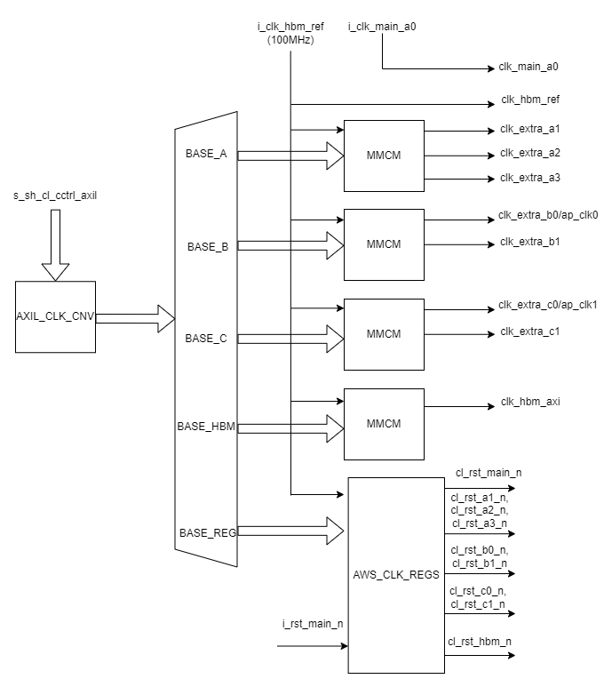

AWS_CLK_GEN - CL Clock Generator
================================

Table of Contents
-----------------

- `Introduction <#introduction>`__
- `Architecture Overview <#architecture-overview>`__
- `Clock and Reset <#clock-and-reset>`__
- `Ports Description <#ports-description>`__
- `Address Space <#address-space>`__
- `Register Definitions <#register-definitions>`__
- `Boot and Reset Sequencing <#boot-and-reset-sequencing>`__
- `Clock Recipes User Guide <#clock-recipes-user-guide>`__
- `Implementation Example <#implementation-example>`__

Introduction
------------

F2 Shell provides two clocks - ``clk_main_a0`` and ``clk_hbm_ref`` - to
the CL, enabling more efficient use of global routing resources compared
to F1. The ``clk_main_a0 is`` currently a fixed frequency 250MHz clock
(❗️ dynamic frequency scaling as in F1 using the SW APIs will be added
in a future release). The ``clk_hbm_ref`` is a fixed frequency 100MHz
clock which can be used by customers as a reference clock for their
MMCMs. This scheme provides flexibility for customers to devise their
own clocking mechanisms with the desired number of clocks.

In order to provide F1-compatible clock recipes and support Vitis
development in F2, AWS offers the Clock Generator (AWS_CLK_GEN) IP.
AWS_CLK_GEN provides various clocks to the CL design and supports
dynamic frequency scaling. The Vitis XSA for F2 relies on AWS_CLK_GEN
for all the clocking needs in the design. This document details the
Microarchitecture Specification for AWS_CLK_GEN.

⚠️ The AWS_CLK_GEN instantiation **must** be named to ``AWS_CLK_GEN``
and located in the CL top module.

⚠️ The AWS_CLK_GEN is optional for CL designs that do not require same
clocking scheme as F1. This block is not required if the CL designs use
only ``clk_main_a0`` and/or ``clk_hbm_ref``.

⚠️ If AWS_CLK_GEN is instantiated, the runtime SW must call
`aws_clkgen_deassert_resets(slot_id) <https://github.com/aws/aws-fpga/tree/f2/sdk/userspace/include/fpga_clkgen.h>`__
after AFI load to release the CL from reset.

Architecture Overview
---------------------

Figure 1 below shows an overview of the AWS_CLK_GEN IP. It primarily
consists of the following:

1. MMCMs to generate desired clocks. The clocks are grouped together and
   are generated by specific MMCM assigned to that clock group. Please
   refer to
   `PG065-Clocking-Wizard-v6.0-LogiCORE-IP-Product-Guide <https://docs.xilinx.com/r/en-US/pg065-clk-wiz/Clocking-Wizard-v6.0-LogiCORE-IP-Product-Guide>`__
   for MMCM details.

2. AWS_CLK_REGS houses few AWS specific Control and Status Registers for
   the IP. This block is also responsible for driving various resets to
   the customer design.

3. AXI-Lite address decoder.

4. AXI-Lite clock converter.

5. AXI-Lite interface to connect to the AWS Shell or user defined
   address space.

   Diagram

Clock and Reset
---------------

The AWS_CLK_GEN IP requires following primary clocks and resets as
inputs:

1. clk_hbm_ref : This is fixed frequency 100MHz clock from the Shell.
   This is used as primary clock for the entire IP block including the
   MMCMs and AWS_REGS.
2. clk_main_a0 : This is interface clock from Shell whose frequency is
   scaled by the Shell but maxes out at 250MHz.
3. rst_main_n : Active low reset from Shell.

Ports Description
-----------------

.. list-table::
   :header-rows: 1
   :widths: auto

   * - **Port Name**
     - **Direction**
     - **Description**
   * - i_clk_hbm_ref
     - input
     - HBM ref clock from the Shell. Fixed frequency of 100MHz.
   * - i_clk_main_a0
     - input
     - clk_main_a0 from the Shell
   * - i_rst_main_n
     - input
     - rst_main_n from Shell sync'ed to clk_main_a0
   * - s_sh_cl_cctrl_axil
     - AXI-L Consumer interface
     - AXI-Lite interface to access address space of the IP. Recommend connecting this interface to AXI-Lite on PF1-BAR4 from the Shell.
   * - clk_hbm_ref
     - output
     - Pass-through of input clk_hbm_ref from the Shell.
   * - clk_main_a0
     - output
     - Pass-through of input clk_main_a0 from the Shell.
   * - clk_extra_a1
     - output
     - Max frequency = 125 MHz
   * - clk_extra_a2
     - output
     - Max frequency = 375 MHz
   * - clk_extra_a3
     - output
     - Max frequency = 500 MHz
   * - clk_extra_b0
     - output
     - Max Frequency = 450 MHz: Used by Vitis as ap_clk0
   * - clk_extra_b1
     - output
     - Max Frequency = 225 MHz
   * - clk_extra_c0
     - output
     - Max Frequency = 300 MHz: used by Vitis as ap_clk1
   * - clk_extra_c1
     - output
     - Max Frequency = 400 MHz
   * - clk_hbm_axi
     - output
     - Max Frequency = 450 MHz
   * - cl_rst_main_n
     - output
     - rst_main_n sync'ed to clk_main_a0 and controlled by SYS_RST
   * - cl_rst_a1_n
     - output
     - rst_main_n sync'ed to clk_extra_a1 and controlled by SYS_RST
   * - cl_rst_a2_n
     - output
     - rst_main_n sync'ed to clk_extra_a2 and controlled by SYS_RST
   * - cl_rst_a3_n
     - output
     - rst_main_n sync'ed to clk_extra_a3 and controlled by SYS_RST
   * - cl_rst_b0_n
     - output
     - rst_main_n sync'ed to clk_extra_b0 and controlled by SYS_RST
   * - cl_rst_b1_n
     - output
     - rst_main_n sync'ed to clk_extra_b1 and controlled by SYS_RST
   * - cl_rst_c0_n
     - output
     - rst_main_n sync'ed to clk_extra_c0 and controlled by SYS_RST
   * - cl_rst_c1_n
     - output
     - rst_main_n sync'ed to clk_extra_c1 and controlled by SYS_RST
   * - cl_rst_hbm_ref_n
     - output
     - rst_main_n sync'ed to clk_hbm_ref and controlled by SYS_RST
   * - cl_rst_hbm_axi_n
     - output
     - rst_main_n sync'ed to clk_hbm_axi and controlled by SYS_RST

Address Space
-------------

The AXI-Lite address space is decoded as shown in the table below:

.. list-table::
   :header-rows: 1
   :widths: auto

   * - **Address Start**
     - **Address End**
     - **Size**
     - **Decode**
     - **Description**
   * - 0x0005_2000
     - 0x0005_2FFF
     - 4KB
     - BASE_A
     - MMCM registers for clock group A. See `Example-for-Dynamic-Reconfiguration-through-AXI4-Lite <https://docs.xilinx.com/r/en-US/pg065-clk-wiz/Example-for-Dynamic-Reconfiguration-through-AXI4-Lite>`__
   * - 0x0005_0000
     - 0x0005_0FFF
     - 4KB
     - BASE_B
     - MMCM registers for clock group B. See `Example-for-Dynamic-Reconfiguration-through-AXI4-Lite <https://docs.xilinx.com/r/en-US/pg065-clk-wiz/Example-for-Dynamic-Reconfiguration-through-AXI4-Lite>`__
   * - 0x0005_1000
     - 0x0005_1FFF
     - 4KB
     - BASE_C
     - MMCM registers for clock group C. See `Example-for-Dynamic-Reconfiguration-through-AXI4-Lite <https://docs.xilinx.com/r/en-US/pg065-clk-wiz/Example-for-Dynamic-Reconfiguration-through-AXI4-Lite>`__
   * - 0x0005_4000
     - 0x0005_4FFF
     - 4KB
     - BASE_HBM
     - MMCM registers for HBM interface clock. See `Example-for-Dynamic-Reconfiguration-through-AXI4-Lite <https://docs.xilinx.com/r/en-US/pg065-clk-wiz/Example-for-Dynamic-Reconfiguration-through-AXI4-Lite>`__
   * - 0x0005_8000
     - 0x0005_8FFF
     - 4KB
     - BASE_REG
     - Address space for AWS specific registers in AWS_CLK_REGS block.

**NOTES**:

1. Refer to the ``_clkgen`` CLIs in `FPGA Management
   Tools <./../../sdk/userspace/fpga-mgmt-tools/README.html>`__ for
   setting the output clock frequencies of AWS_CLK_GEN IP.

2. Write access to undefined address space is ignored. Reading from
   undefined address space returns 0xBAAD_DEC0. Reading from undefined
   address space within MMCM results in MMCM’s default behavior.
   AWS_CLK_GEN IP does not have any protection against illegal use of
   MMCMs. User discretion is recommended regarding such accesses.

Register Definitions
--------------------

Following registers are housed inside AWS_CLK_REGS component and are
accessible from the AXIL interface from base address = ``BASE_REG`` as
described in `Address Space <#address-space>`__

.. list-table::
   :header-rows: 1
   :widths: auto

   * - **Address Offset**
     - **Register Name**
     - **Bits**
     - **Access**
     - **Default Value**
     - **Description**
   * - 0x00
     - ID_REG
     - 31:0
     - RO
     - 0x9048_1D0F
     - 32-bit value to uniquely identify the AWS_CLK_GEN IP
   * - 0x04
     - VER_REG
     - 31:0
     - RO
     - 0x0201_0000
     - Version Register
   * - 0x08
     - BUILD_REG
     - 31:0
     - RO
     - 0x0923_2223
     - build timestamp in 0xMM_DD_YY_HH format
   * - 
     - 
     - 
     - 
     - 
     - 
   * - 0x0C
     - CLKS_AVAIL_REG
     - 31:9
     - RO
     - 0x0
     - Reserved
   * - 
     - 
     - 8
     - RO
     - 0x1
     - 1 = clk_hbm_axi available, 0 = clock unavailable
   * - 
     - 
     - 7
     - RO
     - 0x1
     - 1 = clk_extra_c1 available, 0 = clock unavailable
   * - 
     - 
     - 6
     - RO
     - 0x1
     - 1 = clk_extra_c0 available, 0 = clock unavailable
   * - 
     - 
     - 5
     - RO
     - 0x1
     - 1 = clk_extra_b1 available, 0 = clock unavailable
   * - 
     - 
     - 4
     - RO
     - 0x1
     - 1 = clk_extra_b0 available, 0 = clock unavailable
   * - 
     - 
     - 3
     - RO
     - 0x1
     - 1 = clk_extra_a3 available, 0 = clock unavailable
   * - 
     - 
     - 2
     - RO
     - 0x1
     - 1 = clk_extra_a2 available, 0 = clock unavailable
   * - 
     - 
     - 1
     - RO
     - 0x1
     - 1 = clk_extra_a1 available, 0 = clock unavailable
   * - 
     - 
     - 0
     - RO
     - 0x1
     - 1 = clk_main_a0 available, 0 = clock unavailable
   * - 
     - 
     - 
     - 
     - 
     - 
   * - 0x10
     - G_RST_REG
     - 31:0
     - RW
     - 0x0
     - Write 0xFFFF_FFFF to assert all CL-facing reset outputs (`cl_rst_*_n`). This does not reset the MMCMs — clocks continue running. Write 0x0000_0000 to release. G_RST_REG takes priority over all other reset controls.
   * - 
     - 
     - 
     - 
     - 
     - 
   * - 0x14
     - SYS_RST_REG
     - 31:10
     - RW
     - 0x3FFFFF
     - Reserved. Default value keeps all reserved bits set.
   * - 
     - 
     - 9
     - RW
     - 0x1
     - 1 = Assert reset on cl_rst_hbm_axi_n
   * - 
     - 
     - 8
     - RW
     - 0x1
     - 1 = Assert reset on cl_rst_hbm_ref_n
   * - 
     - 
     - 7
     - RW
     - 0x1
     - 1 = Assert reset on cl_rst_c1_n
   * - 
     - 
     - 6
     - RW
     - 0x1
     - 1 = Assert reset on cl_rst_c0_n
   * - 
     - 
     - 5
     - RW
     - 0x1
     - 1 = Assert reset on cl_rst_b1_n
   * - 
     - 
     - 4
     - RW
     - 0x1
     - 1 = Assert reset on cl_rst_b0_n
   * - 
     - 
     - 3
     - RW
     - 0x1
     - 1 = Assert reset on cl_rst_a3_n
   * - 
     - 
     - 2
     - RW
     - 0x1
     - 1 = Assert reset on cl_rst_a2_n
   * - 
     - 
     - 1
     - RW
     - 0x1
     - 1 = Assert reset on cl_rst_a1_n
   * - 
     - 
     - 0
     - RW
     - 0x0
     - 1 = Assert reset on cl_rst_main_n NOTE: cl_rst_main_n is deasserted by default
   * - 
     - 
     - 
     - 
     - 
     - NOTE: This register takes effect only if G_RST_REG = 0
   * - 
     - 
     - 
     - 
     - 
     - 
   * - 0x18
     - DIS_RST_MAIN_REG
     - 31:1
     - RO
     - 0x0
     - Reserved
   * - 
     - 
     - 0
     - RW
     - 0x0
     - 1 = Disable rst_main_n from asserting resets in SYS_RST block. i.e rst_main_n no longer affects the reset outputs from SYS_RST block. Useful during clock reprogramming to prevent rst_main_n transitions from interfering with the reset outputs. The combined reset output equation is: `rst_out_n[i] = ~G_RST & ~SYS_RST[i] & (DIS_RST_MAIN[0] | rst_main_n)`
   * - 
     - 
     - 
     - 
     - 
     - 
   * - 0x20
     - MMCM_LOCK_REG
     - 31:9
     - RO
     - 0x0
     - Reserved
   * - 
     - 
     - 8
     - RO
     - 0x0
     - 1 = MMCM_BASE_HBM locked
   * - 
     - 
     - 7
     - RO
     - 0x0
     - Reserved
   * - 
     - 
     - 6
     - RO
     - 0x0
     - 1 = MMCM_BASE_C locked
   * - 
     - 
     - 5
     - RO
     - 0x0
     - Reserved
   * - 
     - 
     - 4
     - RO
     - 0x0
     - 1 = MMCM_BASE_B locked
   * - 
     - 
     - 3
     - RO
     - 0x0
     - Reserved
   * - 
     - 
     - 2
     - RO
     - 0x0
     - Reserved
   * - 
     - 
     - 1
     - RO
     - 0x0
     - Reserved
   * - 
     - 
     - 0
     - RO
     - 0x0
     - 1 = MMCM_BASE_A locked

**NOTE**: The ``MMCM_LOCK_REG`` lock bits are at positions [0], [4],
[6], [8] — aligning with the ``SYS_RST_REG`` bit position of the first
clock in each MMCM group (A=0, B=4, C=6, HBM=8). When all four MMCMs are
locked, the register reads ``0x0000_0151``. This value can be used as a
lock mask to poll for all MMCMs to achieve lock before de-asserting
resets.

Boot and Reset Sequencing
-------------------------

Initial Boot State
~~~~~~~~~~~~~~~~~~

At AFI load, the AWS_CLK_GEN IP starts in the following state:

- ``SYS_RST_REG = 0xFFFF_FFFE``: All CL resets are asserted except
  ``cl_rst_main_n`` (bit 0), which is de-asserted by default to allow
  the bootstrap clock domain to operate.
- ``G_RST_REG = 0x0``: Global reset is not asserted.
- ``DIS_RST_MAIN_REG = 0x0``: Shell reset (``rst_main_n``) influences
  the reset outputs.
- MMCM clock outputs are static low until the respective MMCM PLL
  achieves lock. Once locked, the clock outputs begin oscillating at the
  configured frequency.

MMCM Clock Behavior
~~~~~~~~~~~~~~~~~~~

MMCM clock outputs (``clk_extra_a1``, ``clk_hbm_axi``, etc.) are held
static low by the MMCM until the PLL locks. Software must poll
``MMCM_LOCK_REG`` to confirm clocks are stable before releasing resets
via ``SYS_RST_REG``. Releasing resets while clocks are static low will
result in downstream IPs not seeing proper clocked reset assertion,
which can cause initialization failures.

⚠️ ``SYS_RST_REG`` must only be cleared after ``MMCM_LOCK_REG`` confirms
all enabled MMCMs are locked. Refer to the SDK ``fpga_clkgen`` library
for the recommended reset and clock programming sequences.

Clock Recipes User Guide
------------------------

The `Clock Recipes User Guide <./Clock-Recipes-User-Guide.html>`__
describes various clock recipes available for F2 developers and build
options support in the HDK development environment. The user guide also
describes porting of CL designs based on F1 clock recipes into F2.

Implementation Example
----------------------

Usage of the AWS_CLK_GEN IP is fully demonstrated in the
`cl_mem_perf <../cl/examples/cl-mem-perf/README.html>`__ example. Please
refer to that example for more details.

`Back to Home <../../index.html>`__
