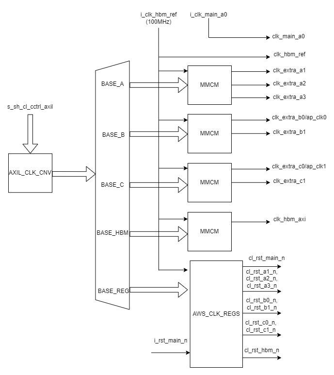

AWS_CLK_GEN - CL Clock Generator
======================================

Table of Contents
-----------------

- `AWS_CLK_GEN - CL Clock Generator <#aws_clk_gen---cl-clock-generator>`__

  - `Table of Contents <#table-of-contents>`__
  - `Introduction <#introduction>`__
  - `Architecture Overview <#architecture-overview>`__
  - `Clock and Reset <#clock-and-reset>`__
  - `Ports Description <#ports-description>`__
  - `Address Space <#address-space>`__
  - `Register Definitions <#register-definitions>`__
  - `Clock Recipes User Guide <#clock-recipes-user-guide>`__
  - `Implementation Example <#implementation-example>`__

Introduction
------------

F1 Shell provides eight clocks to the CL and supports multiple `clock
recipes <https://github.com/aws/aws-fpga/blob/master/hdk/docs/clock_recipes.csv>`__
to choose from at the time of CL builds. It also allows to scale clock
frequencies during runtime (or after AFI/bitstream is loaded into FPGA)
using
`dynamic_clock_config <https://github.com/aws/aws-fpga/blob/master/hdk/docs/dynamic_clock_config.md>`__.
While this architecture provides multiple clock choices for customer
designs, it locks up the global clock routing resources in the CL
region. This can pose limitations for customers who do not require all
the clocks provided from Shell to the CL.

Therefore, F2 Shell provides only two clocks - ``clk_main_a0`` and
``clk_hbm_ref`` - to the CL resulting in efficient use of global routing
resources. The ``clk_main_a0`` is currently a fixed frequency 250MHz
clock (❗ dynamic scaling of frequency as F1 using the SW APIs will be added
in a future release). The ``clk_hbm_ref`` is a fixed frequency 100MHz clock
which can be used by customer as a reference clock for their MMCMs. This scheme
provides flexibility for customers to devise their own clocking mechanisms with
desired number of clocks.

In order to provide F1’s clock recipes in F2, as well as support Vitis
development in F2, AWS offers the Clock Generator
(AWS_CLK_GEN) IP. AWS_CLK_GEN provides various clocks to the CL design
and supports dynamic frequency scaling. The Vitis XSA for F2 relies on
AWS_CLK_GEN for all the clocking needs in the design. This document
details the Microarchitecture Specification for AWS_CLK_GEN.

⚠️ The AWS_CLK_GEN instantiation **must** be named to
``AWS_CLK_GEN`` and located in the CL top module.

⚠️ The AWS_CLK_GEN is optional for CL designs that do not require
same clocking scheme as F1. This IP is not required if the CL designs
use only ``clk_main_a0`` and/or ``clk_hbm_ref``.

Architecture Overview
---------------------

Figure 1 below shows an overview of the AWS_CLK_GEN IP. It primarily
consists of the following:

1. MMCMs to generate desired clocks. The clocks are grouped together and
   are generated by specific MMCM assigned to that clock group. Please
   refer to
   `PG065-Clocking-Wizard-v6.0-LogiCORE-IP-Product-Guide <https://docs.xilinx.com/r/en-US/pg065-clk-wiz/Clocking-Wizard-v6.0-LogiCORE-IP-Product-Guide>`__
   for MMCM details.

2. AWS_CLK_REGS houses few AWS specific Control and Status Registers for
   the IP. This block is also responsible for driving various resets to
   the customer design.

3. AXI-Lite address decoder.

4. AXI-Lite clock converter.

5. AXI-Lite interface to connect to the AWS Shell or user defined
   address space.

|aws_clk_gen|

Clock and Reset
---------------

The AWS_CLK_GEN IP requires following primary clocks and resets as
inputs:

1. clk_hbm_ref : This is fixed frequency 100MHz clock from the Shell.
   This is used as primary clock for the entire IP including the MMCMs
   and AWS_REGS.
2. clk_main_a0 : This is interface clock from Shell whose frequency is
   scaled by the Shell but maxes out at 250MHz.
3. rst_main_n : Active low reset from Shell.

Ports Description
-----------------

.. list-table::
  :header-rows: 1
  :class: user-guide-dev-envs-table
  :widths: 20 30 50

  * - Port Name
    - Direction
    - Description
  * - i_clk_hbm_ref
    - input
    - HBM ref clock from the Shell. Fixed frequency of 100MHz.
  * - i_clk_main_a0
    - input
    - clk_main_a0 from the Shell.
  * - i_rst_main_n
    - input
    - rst_main_n from the Shell sync'ed to clk_main_a0
  * - s_sh_cl_cctrl_axil
    - AXI-L Consumer interface
    - AXI-Lite interface to access address space of the IP. Recommend connecting
      this interface to AXI-Lite on PF1-BAR4 from the Shell.
  * - clk_hbm_ref
    - output
    - Pass-through of input clk_hbm_ref from the Shell.
  * - clk_main_a0
    - output
    - Pass-through of input clk_main_a0 from the Shell.
  * - clk_extra_a1
    - output
    - Max frequency = 125 MHz
  * - clk_extra_a2
    - output
    - Max frequency = 375 MHz
  * - clk_extra_a3
    - output
    - Max frequency = 500 MHz
  * - clk_extra_b0
    - output
    - Max Frequency = 450 MHz | Used by Vitis as ap_clk0
  * - clk_extra_b1
    - output
    - Max Frequency = 225
  * - clk_extra_c0
    - output
    - Max Frequency = 300 MHz | used by Vitis as ap_clk1
  * - clk_extra_c1
    - output
    - Max Frequency = 400 MHz
  * - clk_hbm_axi
    - output
    - Max Frequency = 450 MHz
  * - cl_rst_main_n
    - output
    - rst_main_n sync'ed to clk_main_a0 and controlled by SYS_RST
  * - cl_rst_a1_n
    - output
    - rst_main_n sync'ed to clk_extra_a1 and controlled by SYS_RST
  * - cl_rst_a2_n
    - output
    - rst_main_n sync'ed to clk_extra_a2 and controlled by SYS_RST
  * - cl_rst_a3_n
    - output
    - rst_main_n sync'ed to clk_extra_a3 and controlled by SYS_RST
  * - cl_rst_b0_n
    - output
    - rst_main_n sync'ed to clk_extra_b0 and controlled by SYS_RST
  * - cl_rst_b1_n
    - output
    - rst_main_n sync'ed to clk_extra_b1 and controlled by SYS_RST
  * - cl_rst_c0_n
    - output
    - rst_main_n sync'ed to clk_extra_c0 and controlled by SYS_RST
  * - cl_rst_c1_n
    - output
    - rst_main_n sync'ed to clk_extra_c1 and controlled by SYS_RST
  * - cl_rst_hbm_ref_n
    - output
    - rst_main_n sync'ed to clk_hbm_ref and controlled by SYS_RST
  * - cl_rst_hbm_axi_n
    - output
    - rst_main_n sync'ed to clk_hbm_axi and controlled by SYS_RST

Address Space
-------------

The AXI-Lite address space is decoded as shown in the table below:

.. list-table::
  :header-rows: 1
  :class: user-guide-dev-envs-table
  :widths: 10 10 5 5 70

  * - Address Start
    - Address End
    - Size
    - Decode
    - Description
  * - 0x0005_2000
    - 0x0005_2FFF
    - 4KB
    - BASE_A
    - MMCM registers for clock group A. See
      `Example-for-Dynamic-Reconfiguration-through-AXI4-Lite <https://docs.xilinx.com/r/en-US/pg065-clk-wiz/Example-for-Dynamic-Reconfiguration-through-AXI4-Lite>`__
  * - 0x0005_0000
    - 0x0005_0FFF
    - 4KB
    - BASE_B
    - MMCM registers for clock group B. See
      `Example-for-Dynamic-Reconfiguration-through-AXI4-Lite <https://docs.xilinx.com/r/en-US/pg065-clk-wiz/Example-for-Dynamic-Reconfiguration-through-AXI4-Lite>`__
  * - 0x0005_1000
    - 0x0005_1FFF
    - 4KB
    - BASE_C
    - MMCM registers for clock group C. See
      `Example-for-Dynamic-Reconfiguration-through-AXI4-Lite <https://docs.xilinx.com/r/en-US/pg065-clk-wiz/Example-for-Dynamic-Reconfiguration-through-AXI4-Lite>`__
  * - 0x0005_4000
    - 0x0005_4FFF
    - 4KB
    - BASE_HBM
    - MMCM registers for HBM interface clock. See
      `Example-for-Dynamic-Reconfiguration-through-AXI4-Lite <https://docs.xilinx.com/r/en-US/pg065-clk-wiz/Example-for-Dynamic-Reconfiguration-through-AXI4-Lite>`__
  * - 0x0005_8000
    - 0x0005_8FFF
    - 4KB
    - BASE_REG
    - Address space for AWS specific registers in AWS_CLK_REGS.

**NOTES**:

1. Refer to the ``_clkgen`` CLIs in `FPGA Management
   Tools <./../../sdk/userspace/fpga_mgmt_tools/README.md>`__ for
   setting the output clock frequencies of AWS_CLK_GEN IP.

2. Write access to undefined address space is ignored. Reading from
   undefined address space returns 0xDEAD_DEC0. Reading from undefined
   address space within MMCM results in MMCM’s default behavior.
   AWS_CLK_GEN IP does not have any protection against illegal use of
   MMCMs. User discretion is recommended regarding such accesses.

Register Definitions
--------------------

Following registers are housed inside AWS_CLK_REGS component and are
accessible from the AXIL interface from base address = ``BASE_REG`` as
described in `Address Space <#ancAddressSpace>`__

.. list-table::
  :header-rows: 1
  :class: user-guide-dev-envs-table
  :widths: 10 10 5 5 10 60

  * - Address Offset
    - Register Name
    - Bits
    - Access
    - Default Value
    - Description
  * - 0x00
    - ID_REG
    - 31:0
    - RO
    - 0x9048_1D0F
    - 32-bit value to uniquely identify the AWS_CLK_GEN IP
  * - 0x04
    - VER_REG
    - 31:0
    - RO
    - 0x0201_0000
    - Version Register
  * - 0x08
    - BUILD_REG
    - 31:0
    - RO
    - 0x0923_2223
    - build timestamp in 0xMM_DD_YY_HH format
  * - 0x0C
    - CLKS_AVAIL_REG
    - 31:9
    - RO
    - 0x0
    - Reserved
  * -
    -
    - 8
    - RO
    - 0x1
    - 1 = clk_hbm_axi available | 0 = clock unavailable
  * -
    -
    - 7
    - RO
    - 0x1
    - 1 = clk_extra_c1 available | 0 = clock unavailable
  * -
    -
    - 6
    - RO
    - 0x1
    - 1 = clk_extra_c0 available | 0 = clock unavailable
  * -
    -
    - 5
    - RO
    - 0x1
    - 1 = clk_extra_b1 available | 0 = clock unavailable
  * -
    -
    - 4
    - RO
    - 0x1
    - 1 = clk_extra_b0 available | 0 = clock unavailable
  * -
    -
    - 3
    - RO
    - 0x1
    - 1 = clk_extra_a3 available | 0 = clock unavailable
  * -
    -
    - 2
    - RO
    - 0x1
    - 1 = clk_extra_a2 available | 0 = clock unavailable
  * -
    -
    - 1
    - RO
    - 0x1
    - 1 = clk_extra_a1 available | 0 = clock unavailable
  * -
    -
    - 0
    - RO
    - 0x1
    - 1 = clk_main_a0 available | 0 = clock unavailable
  * - 0x10
    - G_RST_REG
    - 31:0
    - RW
    - 0x0
    - Write 0xFFFF_FFFF to globally reset the AWS_CLK_GEN IP. Following blocks
      are affected:
        - Assert reset to all MMCMs.
        - Assert reset to SYS_RST and its output to CL.
      Write 0x0000_0000 to de-assert global resets
  * - 0x14
    - SYS_RST_REG
    - 31:10
    - RW
    - 0xFF
    - Reserved
  * -
    -
    - 9
    - RW
    - 0x1
    - 1 = Assert reset on cl_rst_hbm_axi_n
  * -
    -
    - 8
    - RW
    - 0x1
    - 1 = Assert reset on cl_rst_hbm_ref_n
  * -
    -
    - 7
    - RW
    - 0x1
    - 1 = Assert reset on cl_rst_c1_n
  * -
    -
    - 6
    - RW
    - 0x1
    - 1 = Assert reset on cl_rst_c0_n
  * -
    -
    - 5
    - RW
    - 0x1
    - 1 = Assert reset on cl_rst_b1_n
  * -
    -
    - 4
    - RW
    - 0x1
    - 1 = Assert reset on cl_rst_b0_n
  * -
    -
    - 3
    - RW
    - 0x1
    - 1 = Assert reset on cl_rst_a3_n
  * -
    -
    - 2
    - RW
    - 0x1
    - 1 = Assert reset on cl_rst_a2_n
  * -
    -
    - 1
    - RW
    - 0x1
    - 1 = Assert reset on cl_rst_a1_n
  * -
    -
    - 0
    - RW
    - 0x1
    - 1 = Assert reset on cl_rst_main_n. NOTE: cl_rst_main_n is deasserted by default
  * -
    -
    -
    -
    -
    - NOTE: This register takes effect only if G_RST_REG = 0
  * - 0x18
    - DIS_RST_MAIN_REG
    - 0
    - RW
    - 0x0
    - Reserved
  * -
    -
    - 31:1
    - RO
    - 0x0
    - 1 = Disable rst_main_n from asserting resets in SYS_RST block. i.e rst_main_n no longer affects the reset outputs from SYS_RST block
  * - 0x20
    - MMCM_LOCK_REG
    - 31:9
    - RO
    - 0x0
    - Reserved
  * -
    -
    - 8
    - RO
    - 0x0
    - 1 = MMCM_BASE_HBM locked
  * -
    -
    - 7
    - RO
    - 0x0
    - Reserved
  * -
    -
    - 6
    - RO
    - 0x0
    - 1 = MMCM_BASE_C locked
  * -
    -
    - 5
    - RO
    - 0x0
    - Reserved
  * -
    -
    - 4
    - RO
    - 0x0
    - 1 = MMCM_BASE_B locked
  * -
    -
    - 3
    - RO
    - 0x0
    - Reserved
  * -
    -
    - 2
    - RO
    - 0x0
    - Reserved
  * -
    -
    - 1
    - RO
    - 0x0
    - Reserved
  * -
    -
    - 0
    - RO
    - 0x0
    - 1 = MMCM_BASE_A locked

**NOTE**: Write access to undefined address space is ignored. Reading from
undefined address space returns ``0xDEAD_DEC0``.

Clock Recipes User Guide
------------------------

The `Clock Recipes User Guide <./Clock_Recipes_User_Guide.html>`__
describes various clock recipes available for F2 developers and build
options support in the HDK development environment. The user guide also
describes porting of CL designs based on F1 clock recipes into F2.

Implementation Example
----------------------

Usage of the AWS_CLK_GEN IP is fully demonstrated in the
`cl_mem_perf <../cl/examples/cl_mem_perf/README.html>`__ example. Please
refer to that example for more details.

