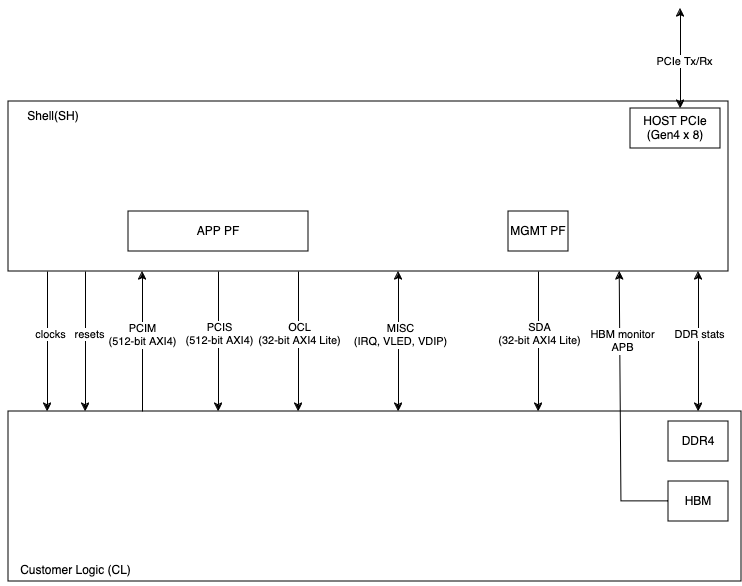

AWS Shell Interface Specification
=================================

Table of Contents
-----------------

- `AWS Shell Interface
  Specification <#aws-shell-interface-specification>`__

  - `Table of Contents <#table-of-contents>`__
  - `Overview <#overview>`__

    - `Architecture and Version <#architecture-and-version>`__
    - `Conventions <#conventions>`__

  - `Shell Interfaces <#shell-interfaces>`__
  - `External FPGA Interfaces <#external-fpga-interfaces>`__

    - `FPGA PCIe Representation to EC2
      Instance <#fpga-pcie-representation-to-ec2-instance>`__

      - `Management PF (MgmtPF) <#management-pf-mgmtpf>`__
      - `Application PF (AppPF) <#application-pf-apppf>`__

    - `DDR4 DRAM <#ddr4-dram>`__
    - `DDR4 AXI <#ddr4-axi>`__
    - `DMA <#dma>`__

  - `Interfaces between Shell and
    CL <#interfaces-between-shell-and-cl>`__

    - `CL/Shell AXI Interfaces <#cl-shell-axi-interfaces>`__
    - `Clocks and Reset <#clocks-and-reset>`__

      - `Clocks <#clocks>`__
      - `Reset <#reset>`__

    - `PCIS Interface <#pcis-interface>`__

      - `PCIS Interface Timeout
        Details <#pcis-interface-timeout-details>`__

    - `PCIM Interface <#pcim-interface>`__
    - `Outbound PCIe AXI-4 Interface
      Restrictions <#outbound-pcie-axi-4-interface-restrictions>`__
    - `Byte Enable Rules <#byte-enable-rules>`__
    - `AXI4 Error Handling for CL outbound Transactions <#axi4-error-handling-for-cl-outbound-transactions>`__
    - `OCL/SDA Interfaces for Register Access <#ocl-sda-interfaces-for-register-access>`__

      - `CL AXI Completer Error Reporting <#cl-axi-completer-error-reporting>`__

    - `Accessing Aligned/Unaligned Addresses from PCIe (Shell is Requester, CL is Completer) <#accessing-alignedunaligned-addresses-from-pcie-shell-is-requester-cl-is-completer>`__
    - `Interrupts <#interrupts>`__
    - `HBM Monitor Interface <#hbm-monitor-interface>`__
    - `Miscellaneous Signals <#miscellaneous-signals>`__

      - `Integrity Check <#integrity-check>`__
      - `General Control/Status <#general-controlstatus>`__
      - `Virtual LED/DIP <#virtual-leddip>`__
      - `Global Counters <#global-counters>`__

  - `Implementation Tips <#implementation-tips>`__

    - `Multi-SLR FPGA <#multi-slr-fpga>`__
    - `Logic Levels <#logic-levels>`__
    - `Reset <#reset-1>`__
    - `Pipeline Registers <#pipeline-registers>`__
    - `Vivado Analysis <#vivado-analysis>`__

Overview
--------

With Amazon EC2 FPGA instances, each FPGA is divided into two
partitions:

- Shell (SH) – AWS platform logic implementing the FPGA external
  peripherals, PCIe, DMA, and Interrupts.
- Custom Logic (CL) – Custom acceleration logic created by an FPGA
  Developer.

At the end of the development process, combining the Shell and CL
creates an Amazon FPGA Image (AFI) that can be loaded onto the Amazon
EC2 FPGA Instances.

This document specifies the hardware interface and functional behavior
between the SH and the CL.

Architecture and Version
~~~~~~~~~~~~~~~~~~~~~~~~

This specification applies to Xilinx Virtex Ultrascale+ platform
available on EC2 F2. Each update of the Shell is tagged with a revision
number. Note while AWS tries to keep the revision constant, sometimes it
is necessary to update the revision due to discovered issues or added
functionality. The HDK release includes the latest Shell version under
`shell_stable <./../common/shell_stable/>`__

The Shell is reconfigurable, allowing developers to select which Shell
version to create the AFI with. However, an AFI is tied to the specific
Shell version it is built with. Therefore, customers should re-build CL
design if they choose to use another version of the Shell.

Conventions
~~~~~~~~~~~

**CL –** Custom Logic: Custom design created by the developer and
integrated with AWS Shell.

**DW –** Double Word (DW): Refers to 4-byte (32-bit) data size.

`AXI-4 ARM Advanced eXtensible
Interface. <https://developer.arm.com/documentation/ihi0022/latest/>`__

`AXI-4 Stream – ARM Advanced eXtensible Stream
Interface. <https://developer.arm.com/documentation/ihi0051/latest/>`__

**M –** Typically refers to the Requester (M) side of an AXI bus.

**S –** Typically refers to the Completer (S) side of an AXI bus.

Shell Interfaces
----------------

The following diagram and table summarize the various interfaces between
the Shell and CL as defined in
`cl_ports.vh <../common/shell_stable/design/interfaces/cl_ports.vh>`__.

|F2_Shell_interface|

.. list-table::
  :header-rows: 1
  :class: user-guide-dev-envs-table
  :widths: 20 80

  * - Interface
    - Description
  * - Clocks and Resets
    - There are multiple clocks and resets provided by the Shell to the CL.
      Refer to the `Clocks and Resets <#clocks-and-reset>`__ section for more
      information.
  * - PCIM
    - The PCIe Requester (PCIM) Interface is an AXI-4 interface used for
      Outbound PCIe transactions. Refer to the `PCIM Interface <#pcim-interface>`__
      section for more information.
  * - PCIS
    - The PCIe Completer (PCIS) Interface is an AXI-4 interface used for
      Inbound PCIe transactions. Refer to the `PCIS Interface <#pcis-interface>`__
      section for more information.
  * - OCL
    - The OCL Interface is an AXI-Lite interface associated with AppPF and BAR0.
      Refer to the `OCL/SDA AXI-Lite Interfaces for Register Access <#ocl-sda-interfaces-for-register-access>`__
      session for more information.
  * - Miscellaneous
    - There are various generic signals, such as ID's, status, counters, etc.,
      between the Shell and CL that are described in the
      `Miscellaneous Signals <#miscellaneous-signals>`__ section.
  * - SDA
    - The SDA Interface is an AXI-Lite interface associated with MgmtPF and
      BAR4. Please refer to the
      `OCL/SDA AXI-Lite Interfaces for Register Access <#ocl-sda-interfaces-for-register-access>`__
      for more information.
  * - HBM MON APB
    - The HBM monitor interfaces. Customers using HBM IP are required to
      connect these interfaces to the HBM IP. Refer to the
      `HBM monitor interface <#hbm-monitor-interface>`__ for more information.
  * - DDR4 Stats
    - This is the control interface from the Shell to the DDR4 Controller in
      the CL. Shell uses this interface to calibrate the DDR core. Refer to
      the `DDR4 DRAM <#ddr4-dram>`__ section for more information.
  * - Interrupts
    - There are 16 user interrupts available. Refer to the
      `Interrupts <#interrupts>`__ section for more information.

External FPGA Interfaces
------------------------

The FPGA platform includes the following external interfaces:

- One x8 PCI Express 4.0 Interface.

- One DDR4 DIMM interfaces, 72-bit wide (including ECC).

FPGA PCIe Representation to EC2 Instance
~~~~~~~~~~~~~~~~~~~~~~~~~~~~~~~~~~~~~~~~

There are two PCIe Physical Functions (PFs) presented to the instance:

- Management PF – This PF is used for management of the FPGA. The
  Management PF provides access to various control functions like
  Virtual-LED, Virtual-DIPSwitch.

- Application PF (AppPF)– The AppPF is used for CL specific
  functionality.

Please refer to `PCI Address map <./AWS_Fpga_Pcie_Memory_Map.html>`__ for
a more detailed view of the address map.

Management PF (MgmtPF)
^^^^^^^^^^^^^^^^^^^^^^

The Management PF details are provided for reference to help
understanding the PCIe mapping from an F2 instance. This interface is
strictly used by the AWS FPGA Management Tools.

The Management PF exposes:

a) Amazon’s specific Shell Version and Revision numbers.

b) Three BARs:

  - BAR0 - 16KiB
  - BAR2 - 16KiB
  - BAR4 - 4MiB

c) A range of 32-bit addressable registers.

The Management PF is persistent throughout the lifetime of the instance,
and it will not be reset or cleared (even during the AFI Load/Clear
process).

Application PF (AppPF)
^^^^^^^^^^^^^^^^^^^^^^

The Application PF exposes:

a) PCIe BAR0 as a 64-bit prefetchable BAR sized as 64MiB. This BAR maps
to the OCL AXI-Lite interface.

b) PCIe BAR2 as a 64-bit prefetchable BAR sized as 64KiB. This BAR is
not CL visible. This BAR maps to the MSI-X tables and XDMA (if enabled).

c) PCIe BAR4 as a 64-bit prefetchable BAR sized as 128GiB. This BAR may
be used to map the entire External/Internal memory space to the instance
address space if desired, through ``mmap()`` type calls or use
``fpga_pci_lib`` APIs.

d) BusMaster capability to allow the CL to initiate transactions towards
the instance memory.

e) CL’s specific PCIe VendorID, DeviceID, VendorSystemID and SubsystemID
as registered through ``aws ec2 fpgaImageCreate``

The Developer can write drivers for the AppPF or leverage the reference
driver provided in the SDK.

The PCIe interface connecting the FPGA to the instance is in the Shell,
and the CL can access it through two AXI-4 interfaces:

- `PCI Completer
  (PCIS) <#pcis-interface>`__

- `PCI Requester
  (PCIM) <#pcim-interface>`__

DDR4 DRAM
~~~~~~~~~

FPGA card provides one DDR DIMM that can be interfaced with the CL
design. AWS offers the DDR Controller IP readily configured to suit the
DDR DIMM's configuration in the
`sh_ddr.sv <../common/shell_stable/design/sh_ddr/synth/sh_ddr.sv>`__
file which should be instantiated in the CL. The ``sh_ddr_stat_bus*``
ports in ``sh_ddr.sv`` should be connected to the respective
``sh_cl_ddr_stat*`` ports in the ``cl_ports.vh`` along with the DDR I/O
ports. It exposes a 512-bit AXI-4 interface ``cl_sh_ddr_axi_*`` for the
CL design to drive traffic requests into the DDR. The ``sh_ddr.sv`` has
been optimized to reduce resource footprint in the FPGA, yet offer max
DDR performance. It comes with all the required constraints for the
implementation, and also ensures DDR calibration upon CL AFI loads into
the FPGA.

**NOTE:** Even if DDR controller is not required in the CL design, the
``sh_ddr.sv`` block **must** be instantiated in the CL, with parameter
``DDR_PRESENT=0`` (defaults to DDR_PRESENT=1). This will automatically
remove DDR Controller IP, and instead, adds the required buffers to
properly load or terminate the I/O pins interfacing the external DDR
DIMM. **WARNING** If the CL does not instantiate the ``sh_ddr.sv``
block, then it will result in implementation errors.

DDR4 AXI
~~~~~~~~

The DDR4 Controller has an AXI-4 interface with a 512-bit data bus.

The DRAM interface is accessed via an AXI-4 interface:

- AXI-4 (CL is Requester and DRAM controller is Completer) – 512-bit
  AXI-4 interface to read/write DDR.

There is a single status signal that the DRAM interface is trained and
ready for access. DDR access should be gated when the DRAM interface is
not ready. The addressing uses ROW/COLUMN/BANK (Interleaved) mapping of
AXI address to DRAM Row/Col/BankGroup. The Read and Write channels are
serviced with round-robin arbitration (i.e. equal priority).

The DRAM interface uses the Xilinx DDR-4 Interface controller. The AXI-4
interface adheres to the Xilinx specification. Uncorrectable ECC errors
are signaled with RRESP. ECC error status can be read using AWS
Management Software APIs.

Additionally, there is a statistics interface between the Shell and CL.
If the DDR controllers are being used by the CL, then the interfaces
must be connected between the Shell and the DRAM interface controller
modules.

**WARNING:** If the stats interfaces are not connected, the DDR
controllers will not function. However, the CL developer should not
otherwise use them since they are specific to Shell management
functions. If the DDR controllers are not used by the CL, then the
interfaces should be left unconnected.

DMA
~~~

There is an integrated DMA controller inside the XDMA Shell (Xilinx DMA,
not supported at this time), which writes/reads data to/from the CL via
the sh_cl_pcis_dma bus. Because of the shared DMA/PCIS interface, this
maps to the same address space exposed by the AppPF BAR4 address. XDMA
driver is available on Xilinx
`github <https://github.com/Xilinx/dma_ip_drivers>`__.

Interfaces between Shell and CL
-------------------------------

CL/Shell AXI Interfaces
~~~~~~~~~~~~~~~~~~~~~~~~~~~~~~~~~~~~~~~~~~~~

All AXI interfaces use the AXI-4 or AXI-Lite protocol. The AXI-L buses are
for register access use cases, and can access lower speed control
interfaces that use the AXI-Lite protocol.

For bulk data transfer, wide AXI-4 buses are used. AXI-4 on the CL/Shell
interfaces have the following restrictions:

- AxBURST – Only INCR burst is supported.
- AxLOCK – Lock is not supported.
- AxCACHE – Memory type is not supported.
- AxPROT – Protection type is not supported.
- AxQOS – Quality of Service is not supported.
- AxREGION – Region identifier is not supported.

These signals are not included on the AXI-4 interfaces of the shell. If
connecting to a fabric or component that supports these signals, these
constant values should be used:

.. list-table::
  :header-rows: 1
  :class: user-guide-dev-envs-table
  :widths: 20 60
  * - Signal
    - Value
  * - AxBURST[1:0]
    - 0b01
  * - AxLOCK[1:0]
    - 0b00
  * - AxCACHE[3:0]
    - 0b000x (bit 0 is Bufferable bit and may be 0 or 1)
  * - AxPROT[2:0]
    - 0b000
  * - AxQOS[3:0]
    - 0b0000
  * - AxREGION[3:0]
    - 0b0000

Clocks and Reset
~~~~~~~~~~~~~~~~

Clocks
^^^^^^

The Shell provides 250MHz ``clk_main_a0`` and 100MHz ``hbm_ref_clk``
from shell-to-CL. Customers can use these clocks in their designs
directly or instantiate MMCMs to generate clock frequencies of interest
for their designs. All the interfaces between the CL and SH, as listed
in
`cl_ports.vh <../common/shell_stable/design/interfaces/cl_ports.vh>`__
are synchronous to ``clk_main_a0``. The CL design must perform the
required clock domain crossing when interfacing logic in another clock
domain with Shell-CL interface ports.

Please note that the extensive list of clocks and resets, as compared to
F1 shell, are removed from Shell-CL interface. This improves overall
routability for the CL designs that do not require all those multiple
clocks from the Shell. However, AWS offers
`AWS_CLK_GEN <./AWS_CLK_GEN_spec.html>`__ IP that supports multiple
clocks, resets and clock recipes similar to F1. The AWS_CLK_GEN IP can
be optionally instantiated in the CL for an easier migration of designs
from F1 involving multiple clocks.
`CL_MEM_PERF <./../cl/examples/cl_mem_perf/design/cl_mem_perf.sv>`__
demonstrates integration of `AWS_CLK_GEN
IP <../common/lib/aws_clk_gen.sv>`__ into CL design.

Please refer to the
`Clock Recipes User Guide <./Clock_Recipes_User_Guide.html>`__ for
details on supported clock recipes in F2, dynamic clock reconfiguration
and specifying clock recipes during the build time.

Similar to F1, the ``clk_main_a0`` in F2 also supports multiple clock
recipes and the frequency can be scaled using SW APIs at the time of AFI
loads (this feature is currently not available and will be added in a future
release).

Reset
^^^^^

The shell provides an active-low reset signal synchronous to
clk_main_a0: rst_main_n. This is an active low reset signal, and
combines the board reset and PCIe link-level reset conditions.

PCIS Interface
~~~~~~~~~~~~~~~~~~~~~~~~~~~~~~~~~~~~~~~~~~~~~~~~~~~~~~~~~~~~~~~~~~~~~~~~~~~~~~~~~~~~~~~~~~~~~~~~~~~~

This an 512-bit wide AXI-4 interface for Inbound PCIe Transactions (Shell is
Requester, CL is Completer). It is used for:

- PCIe transactions initiated by the instance and targeting AppPF BAR4
  (PCIS)
- DMA transactions (if enabled) (XDMA)

A read or write request on this AXI-4 bus that is not acknowledged by
the CL within a certain time window, will be internally terminated by
the Shell. If the time-out error happens on a read, the Shell will
return ``0xFFFFFFFF`` data back to the instance. This error is reported
through the Management PF and can be retrieved by the AFI Management
Tools metric reporting APIs.

The AXI ID can be used to determine the source of the transaction:

- 0x20 : PCI Interface
- 0x00 : XDMA Channel 0
- 0x01 : XDMA Channel 1
- 0x02 : XDMA Channel 2
- 0x03 : XDMA Channel 3

PCIS Interface Timeout Details
^^^^^^^^^^^^^^^^^^^^^^^^^^^^^^

The PCIS interface multiplexes the XDMA requests and PCIS requests. Each
type of request has a different timeout time:

- XDMA (DMA transactions) : 5 seconds
- PCIS (PCIe transactions initiated from the instance) : 8 us

Transactions on the PCIS interface must complete before the associated
timeout time or the SH will timeout the transactions and complete the
transactions on behalf of the CL (BVALID/RVALID). Each "issued"
transaction has an independent timeout counter. For example if 4
transactions are issued from the PCIS interface "simultaneously" (i.e.
back-to-back cycles), then all 4 must complete within 8us. A transaction
is considered "issued" when the AxVALID is asserted for the transaction
by the Timeout Detection block. AxREADY does not have to be asserted for
the transaction to be considered "issued". Note there is a 16 deep clock
crossing FIFO between the Timeout Detection block and the CL logic. So
if the CL is asserting backpressure (de-asserting AxVALID) there can
still be 16 transactions issued by the Timeout Detection block. The SH
supports a maximum of 32 transactions outstanding for each type
(read/write). It is advisable for the CL to implement enough buffering
for 32 transactions per type so that it is aware of all issued
transactions.

Once a transaction is issued, it must fully be completed within the
timeout time (Address, Data, Ready). Any transaction that does not
completed in time will be terminated by the shell. This means write data
will be accepted and thrown away, and default data ``0xFFFFFFFF`` will be
returned for reads.

If a timeout occurs, the Shell will timeout all further transactions in
16ns for a moderation time (4ms).

**WARNING**: If a timeout happens, the DMA/PCIS interface may no longer
be functional and the AFI/Shell must be re-loaded. This can be done by
adding the "-F" option to ``fpga-load-local-image``.

PCIM Interface
~~~~~~~~~~~~~~~~~~~~~~~~~~~~~~~~~~~~~~~~~~~~~~~~~~~~~~~~~~~~~~~~~~~~~~~~~~~~~~~~~~~~~~~~~~~~~~~~~~~~~

This is an 512-bit wide AXI-4 interface for Outbound PCIe Transactions (CL is
Requester, Shell is Completer). It is used by the CL to initiate cycles to the PCIe bus, for example, to push
data from the CL to instance memory, or read from the instance memory.

⚠️ **The CL must use physical addresses, and developers must be careful
not to use userspace/virtual addresses.**

The following PCIe interface configuration parameters are provided from
the Shell to the CL as informational:

- sh_cl_cfg_max_payload[1:0] – PCIe maximum payload size:

.. list-table::
  :header-rows: 1
  :class: user-guide-dev-envs-table
  :widths: 20 40

  * - Value
    - Max Payload Size
  * - 0b00
    - 128 Bytes
  * - 0b01
    - 256 Bytes (Most probable value)
  * - 0b10
    - 512 Bytes
  * - 0b11
    - Reserved

- sh_cl_cfg_max_read_req[2:0] - PCIe maximum read request size:

.. list-table::
  :header-rows: 1
  :class: user-guide-dev-envs-table
  :widths: 20 40

  * - Value
    - Max Read Request Size
  * - 0b000
    - 128 Bytes
  * - 0b001
    - 256 Bytes
  * - 0b010
    - 512 Bytes (Most probable value)
  * - 0b011
    - 1024 Bytes
  * - 0b100
    - 2048 Bytes
  * - 0b101
    - 4096 Bytes
  * - Others
    - Reserved

Outbound PCIe AXI-4 Interface Restrictions
~~~~~~~~~~~~~~~~~~~~~~~~~~~~~~~~~~~~~~~~~~

- Transfers must not violate PCIe byte enable rules (see byte enable
  rules below).
- Transfers must adhere to all AXI-4 protocol rules

Byte Enable Rules
~~~~~~~~~~~~~~~~~

All AXI-4 transactions to the PCIe interface must adhere to the PCIe
Byte Enable rules (see PCI Express Base specification). Rules are
summarized below:

- All transactions larger than two DW must have contiguous byte enables.
- Transactions that are less than two DW may have non-contiguous byte
  enables.

Note on AXI-4 byte enables are signaled using WSTRB.

AXI4 Error Handling for CL outbound Transactions
~~~~~~~~~~~~~~~~~~~~~~~~~~~~~~~~~~~~~~~~~~~~~~~~

Transactions on AXI4 interface will be terminated and reported as SLVERR
on the RRESP/BRESP signals and will not be passed to the instance in the
following cases:

- PCIe BusMaster Enable (BME) is not set in the PCIe configuration
  space.
- Illegal transaction address; i.e. addressing memory space that isn't
  supported by the instance.
- Transaction crossing 4KB boundaries violating AXI-4/PCIe
  specifications.
- Illegal byte-enable.
- Illegal length (AXI-4 write doesn't match length).
- Illegal AXI-Size (only full width 512-bit transfers, size=0b110 are
  supported)
- Timeout. Each channel must complete in 8 us or it will timeout: 1.
  Once AW is asserted, the write data must be supplied in 8us 2. Once
  RVALID is asserted, RREADY must be asserted, and all data transferred
  within 8us 3. Once BVALID is asserted, BREADY must be asserted within
  8us

⚠️ **If a timeout occurs, the PCIM bus will no longer be functional.
This can be cleared by clearing/re-loading the AFI.**

OCL/SDA AXI-Lite Interfaces for Register Access
~~~~~~~~~~~~~~~~~~~~~~~~~~~~~~~~~~~~~~~~~~~~~~~~~~~~~

There are two AXI-L requester interfaces (Shell is Requester) that can
be used for register access interfaces. Each interface is sourced from a
different PCIe PF/BAR. Breaking this into multiple interfaces allows for
different software entities to have a control interface into the CL:

- OCL AXI-L: Associated with AppPF, BAR0. If the developer is using AWS
  OpenCL runtime lib (as in SDAccel case), this interface will be used
  for OpenCL Kernel access

- SDA AXI-L: Associated with MgmtPF, BAR4. If the developer is using AWS
  OpenCL runtime Lib (as in SDAccel case), this interface will be used
  for performance monitors etc. This interface is also used for accessing the
  `AWS_CLK_GEN IP <./AWS_CLK_GEN_spec.html>`__ for CL clock management.

Please refer to `PCI Address Map <./AWS_Fpga_Pcie_Memory_Map.html>`__ for
a more detailed view of the address map.

CL AXI Completer Error Reporting
^^^^^^^^^^^^^^^^^^^^^^^^^^^^^^^^^^^^^^^^^^^^^^^^

Each AXI (AXI-4/AXI-L) transaction is terminated with a response
(BRESP/RRESP). The AXI responses may signal an error such as Completer
Error, or Decode Error. PCIe also has error reporting for non-posted
requests (Unsupported Requests/Completer Abort). The shell does not
propagate the AXI-4 error responses to the PCIe bus. All PCIe cycles are
terminated with non-error responses. The AXI-4 errors are reported
through the Management PF and can be retrieved by the AFI Management
Tools metric reporting APIs.

Accessing Aligned/Unaligned Addresses from PCIe
~~~~~~~~~~~~~~~~~~~~~~~~~~~~~~~~~~~~~~~~~~~~~~~~~~~~~~~~~~~~~~~~~~~~~~~~~~~~~~~~~~~~~

The Shell (Requester) supports DW aligned and unaligned transfers from PCIe (address
is aligned/unaligned to DW-4byte boundary)

Following are a few examples of how aligned and unaligned access from
PCIe to CL on PCIS interface work:

1. Writing 8 bytes to DW aligned address through PCIe on AXI4
   Interface (PCIS 512-bit interface):

   If the transaction on the PCIe is as follows:
     - Addr : 0x0000002000000000
     - dw_cnt : 2
     - first_be : 4’b1111
     - last_be : 4’b1111

   Then the transaction on the AXI4 interface will have the following
   AXI attributes:
    - awaddr = 64’h0000_0000_0000_0000
    - awlen = 0
    - wstrb = 64’h0000_0000_0000_00ff

2. Writing 8 bytes to DW unaligned address on AXI4 Interface(PCIS
   512-bit interface):

   If the transaction on the PCIe is as follows:
     - Addr : 0x0000002000000001
     - dw_cnt : 3
     - first_be : 4’b1110
     - last_be : 4’b0001

   Then the transaction on the AXI4 interface will have the following
   AXI attributes:
     - awaddr = 64’h0000_0000_0000_0001
     - awlen = 0
     - wstrb = 64’h0000_0000_0000_01fe

The addresses for the Read transactions will work similar to writes.

**Note**: If a transaction from PCIe is initiated on AXI-Lite (SDA/OCL)
interfaces with dw_cnt greater than 1, i.e. >32bits, the transaction is
split into multiple 32-bit transactions by the Shell.

Following are a few examples of how aligned and Unaligned access from
PCIe to CL on SDA/OCL AXI-Lite interfaces work:

1. Writing 8 bytes to DW aligned address on AXI Lite interface
   (SDA/OCL 32-bit interface):

   If the transaction on the PCIe is as follows:
     - Addr : 0x0000000002000000
     - dw_cnt : 2
     - first_be : 4’b1111
     - last_be : 4’b1111

   Then the transaction on the AXI-Lite interface will be split and will
   have the following AXI attributes: Transaction is split into 2
   transfers.

   1st transfer
     - awaddr = 32’h0000_0000
     - wstrb = 4’hf
   2nd transfer
     - awaddr = 32’h0000_0004
     - wstrb = 4’hf

2. Writing 64 bits to DW unaligned address on AXI Lite interface
   (SDA/OCL 32-bit interface):

   If the transaction on the PCIe is as follows:
     - Addr : 0x0000000002000001
     - dw_cnt : 3
     - first_be : 4’b1110
     - last_be : 4’b0001

   Transaction on AXI-Lite interface will be split and will have the
   following AXI attributes: Transaction is split into 3 transfers.

   1st transfer
     - awaddr = 32’h0000_0001
     - wstrb = 4’he

   2nd transfer
     - awaddr = 32’h0000_0004
     - wstrb = 4’hf

   3rd transfer
     - awaddr = 32’h0000_0008
     - wstrb = 4’h1

The transaction splitting and addresses for the Read transactions will
work similar to writes.

Interrupts
~~~~~~~~~~

16 user interrupt sources are supported. There is mapping logic that
maps the user interrupts to MSI-X vectors. Mapping registers in the DMA
controller map the 16 user interrupt sources to MSI-X vectors.

There are two sets of signals to generate interrupts:

- cl_sh_apppf_irq_req[15:0] (from CL to SH)
- sh_cl_apppf_irq_ack[15:0] (from SH to CL)

This interface uses single clock pulses for the req/ack. The CL asserts
(active high) cl_sh_apppf_irq_req[x] for a single clock to assert the
interrupt request to the SH. The SH will respond with a single clock
pulse on sh_cl_apppf_irq_ack[x] to acknowledge the interrupt. Once the
CL asserts a request on a particular bit[x], it should not assert a
request for the same bit[x] until it has received the ack for bit[x]
from the SH. The CL may assert requests on other bits[y] (y!=x).

HBM Monitor Interface
~~~~~~~~~~~~~~~~~~~~~

There are two sets of HBM monitor APB interfaces exposed to the CL, one
for each HBM rack. These interfaces are used by the shell to ensure the
HBM's integrity and reliability whenever the HBM IP is enabled in the
CL.

When the interfaces are connected to the HBM IP properly, the shell
monitors the HBM controller traffic and forces an HBM rack reset if any
transaction is detected accessing an address space in the IP that's not
defined in the `AMD HBM User
Guide <https://docs.amd.com/r/en-US/pg276-axi-hbm>`__.

The active-low ``hbm_apb_preset`` signal connected to each HBM rack
remains at logic-high during power-on and normal operation. This allows
the HBM to initialize and communicate with the rest of the CL logic. If
an HBM access violation (i.e., an APB transaction to an undefined
address space) occurs, the shell will pull the ``hbm_apb_preset`` signal
low to force a reset of the HBM rack. Subsequent usage of this rack is
blocked. The customer must reload the AFI to get it recovered from this
blocked state.

These steps must be followed to properly connect the monitor interfaces
to HBM:

1. Expose the HBM monitor I/Os on the HBM IP by running the following
   Tcl commands in the Vivado IP management project:

  .. code:: Tcl

    # Enable the `MON_APB` interface on the IP
    set_property CONFIG.USER_MON_APB_EN TRUE [get_ips <HBM_IP_NAME>]

    # Confirm the enabling state
    get_property CONFIG.USER_MON_APB_EN      [get_ips <HBM_IP_NAME>]
    true

  **NOTE:** This step can be skipped if the customer uses the
  ``CL_HBM`` IP from the `CL examples <./../../hdk/common/ip/cl_ip/>`__.
  This IP has the ``MON_APB`` interface enabled and is ready to be
  integrated to a customer design as-is.

2. Connect the HBM monitor interface from the shell to the HBM IP. The
   customer can leave the interface floating if the corresponding HBM
   rack is not used. For example, the ``hbm_apb_p<xx>_1`` signals can be
   left unconnected if HBM rack 1 is unused.

3. All the HBM monitor interfaces are synchronized to the 100MHz
   ``clk_hbm_ref`` clock.

4. The ``hbm_apb_preset_n_<1/0>`` signals, treated as asynchronous
   resets by the HBM IP, must be directly connected to the IP's
   ``MON_APB_<1/0>_PRESET_N`` inputs. Other APB interfaces can be
   pipelined using APB register slices for timing closure purposes.

⚠️ **Failing to connect these HBM monitor interfaces between the shell
and the HBM IP will result in an AFI creation error.**

Miscellaneous Signals
~~~~~~~~~~~~~~~~~~~~~

There are some miscellaneous generic signals between the Shell and CL.

Integrity Check
^^^^^^^^^^^^^^^

The 64-bit ch_sh_id0/id1 are used by AWS to validate the signature of
the DCP while being loaded into an FPGA in AWS.

Initial versions of the HDK and Shell used the 4-tuple: PCIe VendorID,
DeviceID, SubsystemVendorID and SubsystemID (which are used during AFI
registration via ``aws ec2 create-fpga-image`` API) as the Integrity
check mechanism, following the next mapping

- cl_sh_id0

  - [15:0] – Vendor ID
  - [31:16] – Device ID

- cl_sh_id1

  - [15:0] – Subsystem Vendor ID
  - [31:16] – Subsystem ID

In future revisions of the HDK, AWS scripts may override the
cl_sh_id0/id1 to include an integrity hash function.

General Control/Status
^^^^^^^^^^^^^^^^^^^^^^

The functionality of these signals is TBD.

- cl_sh_status0[31:0] – Placeholder for generic CL to Shell status.
- cl_sh_status1[31:0] – Placeholder for generic CL to Shell status.
- sh_cl_ctl0[31:0] – Placeholder for generic Shell to CL control
  information.
- sh_cl_ctl1[31:0] – Placeholder for generic Shell to CL control
  information.
- sh_cl_pwr_state[1:0] – This is the power state of the FPGA.

  - 0x0 – Power is normal
  - 0x1 – Power level 1
  - 0x2 – Power level 2
  - 0x3 – Power is critical and FPGA may be shutting off clocks or
    powering down

Virtual LED/DIP
^^^^^^^^^^^^^^^

There are virtual LED/DIP switches that can be used to control/monitor
CL logic. There are 16 LEDs and 16 DIP Switches. Registers exposed to
the Management PF are used to control/monitor the LED/DIP Switches.

vLED - There are 16 virtual LEDs that can be driven from the CL logic to
the SH (cl_sh_status_vled[15:0]). The value of these signals can be read
by S/W in the Instance. An API is also provided through AWS Management
Software.

vDIP - There are 16 virtual DIP switches that drive from the SH to the
CL logic (sh_cl_status_vdip[15:0]). These can be used to control logic
in the CL. The value of these signals can be written/read by S/W in the
instance. An API is also provided through AWS Management Software.

These signals are asynchronous to the CL clocks, and the following must
be done when using these signals:

- vLED: In implementation a false path should be set from the vLED
  signals. For example, in the constraints for place and route add:

  .. code:: bash

    set_false_path -from [get_cells CL/cl_sh_status_vled_reg*]

- vDIP: The vDIP signals should be synchronized to a CL clock before
  being used.

  .. code:: verilog

    always @(posedge clk_main_a0)
    begin
        pre_sync_vdip <= sh_cl_status_vdip;
        sync_vdip <= pre_sync_vdip;
    end

    my_logic = sync_vdip[0];

Global Counters
^^^^^^^^^^^^^^^

There are two global counter outputs that increment every 4ns. These can
be used to measure time inside of the CL. They are synchronized to
clk_main_a0. Note if clk_main_a0 is running slower than 250MHz, the
counters will appear to skip values. The counters are:

- sh_cl_glcount0[63:0]
- sh_cl_glcount1[63:0]

Implementation Tips
-------------------

Here are some implementation tips.

Multi-SLR FPGA
~~~~~~~~~~~~~~

The VU47P FPGA is a stacked FPGA that has 3-die stacked together. Each
Die is called a “Super Logic Region” (SLR). Crossing an SLR boundary is
expensive from a timing perspective. It is good practice to pipeline
interfaces between major blocks to allow the tool freedom to have SLR
crossings between the major blocks. Even with pipelined interfaces it is
possible the tool has sub-optimal logic to SLR mapping (i.e. a major
block is spread out over multiple SLR's). In this case you may want to
at map major blocks to specific SLRs (define the logic that should be
constrained to each SLR). Any crossing of SLR’s should have flops on
either side (or register slices for AXI).

It is ideal to place logic that interfaces to the shell in the same SLR
as the Shell logic for that interface. If this is not possible, the
first flop/register slice should be placed in the same SLR:

- TOP SLR:

  - CL_SH_DDR
  - DDR Stats
  - PCIS

- MID SLR:

  - PCIM
  - OCL
  - SDA

- MID/BOTTOM

  - HBM MON APB

Please see the `Shell Floorplan <./shell_floorplan.html>`__ for additional
details on Shell-CL interface placements in SMALL_SHELL.

For the interfaces that are in both the MID/BOTTOM the recommendation is
to use flops for pipelining, but don’t constrain to an SLR. You can
constrain logic to a particular SLR by creating PBLOCKs (one per SLR),
and assigning logic to the PBLOCKs (refer to cl_dram_hbm_dma example
`small_shell_cl_pnr_user.xdc <../cl/examples/cl_dram_hbm_dma/build/constraints/small_shell_cl_pnr_user.xdc>`__).
Dataflow should be mapped so that SLR crossing is minimized (for example
a pipeline should be organized such that successive stages are mostly in
the same SLR).

There are some good timing closure tips in this
`UltraFast Design Methodology Guide <https://docs.amd.com/r/2024.1-English/ug949-vivado-design-methodology/Introduction>`__

Logic Levels
~~~~~~~~~~~~

You can report all paths that are greater than a certain number of logic
levels. This can be used to iterate on timing in synthesis rather than
waiting for place and route. For example at 250MHz a general rule of
thumb is try to keep logic levels to around 10. The following commands
report on all paths that have more than 10 logic levels:

  .. code:: Tcl

    report_design_analysis -logic_level_distribution -of [get_timing_paths -max_paths 10000 -filter {LOGIC_LEVELS > **10**}]

    foreach gtp [get_timing_paths -max_paths 5000 ?nworst 100 -filter {LOGIC_LEVELS > **10**}] {
      puts "[get_property STARTPOINT_PIN $gtp]
      [get_property ENDPOINT_PIN $gtp] [get_property SLACK $gtp]
      [get_propert LOGIC_LEVELS $gtp]"
    }

.. _reset-1:

Reset
~~~~~

Reset fanout can be minimized in an FPGA. This helps with routing
congestion. Flops can be initialized in their declaration and generally
do not require resets:

.. code:: Verilog

  logic[3:0] my_flops = 4'ha;

  If logic must have a reset, use synchronous resets rather than
  asynchronous resets:

.. code:: Verilog

  always @(posedge clk)
    if (reset)
        my_flop <= 4'ha;
    else
        my_flop <= nxt_my_flop;

If there is still significant fanout of reset, it should be replicated
and pipelined. For example each major block could have its own pipelined
version of reset.

Pipeline Registers
~~~~~~~~~~~~~~~~~~

You have to be careful that pipeline registers do not infer a shift
register component. The shift register is placed in a single area and
does not accomplish any distance pipelining. Here is a snippet to force
the tools to not infer a shift register (shreg_extract="no" directive):

.. code:: Verilog

  (*shreg_extract="no"*) logic [WIDTH-1:0] pipe[STAGES-1:0] = '{default:'0};

Vivado Analysis
~~~~~~~~~~~~~~~

Vivado has some nice analysis capabilities:

- report_methodology (includes CDC report)
- clock interaction report (see if paths between async clocks are erroneously being timed)
- congestion heat map
- power analysis
- physical implementation analysis (placement, routing)
- linked timing/schematic/physical views

Refer to `Vivado Design Suite User Guide <https://docs.amd.com/r/en-US/ug906-vivado-design-analysis/Routing-Analysis>`__
for more information.

