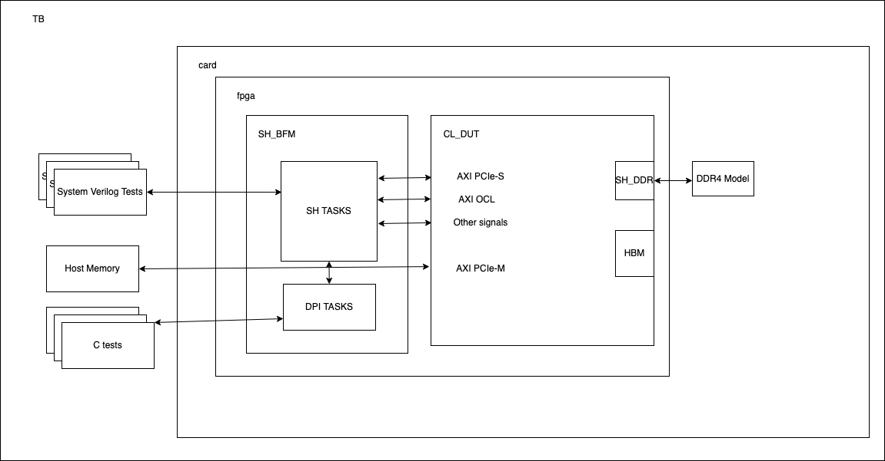

RTL Simulation Guide for HDK Design Flow
========================================

Table of Contents
-----------------

- `Introduction <#introduction>`__
- `Quick Start <#quick-start>`__

  - `Use F2 Developer AMI <#use-f2-developer-ami>`__
  - `Install the HDK and Setup
    Environment <#install-the-hdk-and-setup-environment>`__
  - `Try Out One of HDK Examples or Write Your
    Own <#try-out-one-of-hdk-examples-or-write-your-own>`__
  - `Xilinx's Library
    Compilation <#xilinxs-library-compilation-complib_dir>`__

- `Create Your Own Tests for RTL
  Simulation <#create-your-own-tests-for-rtl-simulation>`__

  - `SystemVerilog Tests <#systemverilog-tests>`__

- `Accessing Host Memory During
  Simulation <#accessing-host-memory-during-simulation>`__
- `Debugging Custom Logic using the AWS
  HDK <#debugging-custom-logic-using-the-aws-hdk>`__

  - `Protocol Checkers <#protocol-checkers>`__
  - `Re-Run Simulation to Dump
    Waves <#re-run-simulation-to-dump-waves>`__
  - `View Waves in Vivado Using Tcl <#view-waves-in-vivado-using-tcl>`__

- `SV Test API Reference <#sv-test-api-reference>`__
- `C Test API Reference <#c-test-api-reference>`__

Introduction
------------

The HDK development environment comes with a shell simulation model that
supports RTL-level simulation using Vivado XSIM, Synopsys VCS or Siemens
Questa RTL simulators. Developers can leverage this simulation model and
create test cases in SystemVerilog to verify CL design's
functionalities.

|alt tag|

Quick Start
-----------

Use F2 Developer AMI
~~~~~~~~~~~~~~~~~~~~

One easy way is to use the F2 Developer AMI that will be shared
privately with the customers. This developer AMI comes with
pre-installed Vivado tools and license.

Please refer to the `release notes <../../RELEASE_NOTES.html>`__ or the
`supported Vivado version <https://github.com/aws/aws-fpga/tree/f2/supported_vivado_versions.txt>`__ for
the exact version of Vivado tools, and the required license components.

Install the HDK and Setup Environment
~~~~~~~~~~~~~~~~~~~~~~~~~~~~~~~~~~~~~

AWS FPGA HDK can be cloned and installed on your EC2 instance or server
by calling:

.. code:: bash

   git clone https://github.com/aws/aws-fpga.git
   cd aws-fpga
   source hdk_setup.sh

Try Out One of HDK Examples or Write Your Own
~~~~~~~~~~~~~~~~~~~~~~~~~~~~~~~~~~~~~~~~~~~~~

.. code:: bash

   # $CL_DIR must be set before running simulations
   export CL_DIR=$PWD/hdk/cl/examples/cl_sde

   # Simulations are launched from the scripts subdir of the design
   cd ${CL_DIR}/verif/scripts

   # Run the default test using the VCS SIM
   export TEST_NAME=test_ddr
   make ${TEST_NAME} VCS=1

   # To view the test log files (this is defined by SIM_DIR makefile variable)
   cd ${CL_DIR}/verif/sim/vcs/${TEST_NAME}_sv
   # Compile log
   vi compile.vcs.log
   # Simulation run log file
   vi ${TEST_NAME}.log

The call of the ``make ${TEST_NAME}`` as above executes following steps.

+-------+-------------+----------------------------------------------+
| Order | Flow        | Description                                  |
+=======+=============+==============================================+
| 1st   | ``ip-gen``  | Generate Xilinx IPs. Executed only once when |
|       |             | the IPs are initially generated. \ **NOTE:** |
|       |             | An IP must be regenerated if the IP's XCI    |
|       |             | file gets updated                            |
+-------+-------------+----------------------------------------------+
| 2nd   | ``complib`` | Compile Xilinx libraries. Executed only once |
|       |             | when the libraries are initially compiled    |
+-------+-------------+----------------------------------------------+
| 3rd   | ``compile`` | compile RTL source and testbench             |
+-------+-------------+----------------------------------------------+
| 4th   | ``pre-run`` | Pre-simulation. Generate simulation input    |
|       |             | files etc                                    |
+-------+-------------+----------------------------------------------+
| 5th   | ``run``     | Run the simulation                           |
+-------+-------------+----------------------------------------------+

Xilinx's Library Compilation (``COMPLIB_DIR``)
~~~~~~~~~~~~~~~~~~~~~~~~~~~~~~~~~~~~~~~~~~~~~~

When using simulator other than Vivado SIM, the Xilinx's library will be
compiled under the ``COMPLIB_DIR``. The default ``COMPLIB_DIR`` path is
identified as below.

.. code:: bash

   COMPLIB_DIR = $CL_DIR/verif/sim/<simulator>/<simulator>_complib

Compiling the Xilinx's library is very time consuming and can take up to
2 hours to complete. User can skip this step if they already have a
pre-compiled Xilinx library that was compiled using the current Vivado
version.

Please do as below steps to setup to use the pre-compiled Xilinx library
instead of getting it to be compiled for each clean clone of aws-fpga
into a new directory.

- Set the COMPLIB_DIR environment variable pointing to the pre-compiled
  Xilinx library.

.. code:: bash

   export COMPLIB_DIR=/path/to/user/complib/dir

- Create a ``.done`` file under the ``COMPLIB_DIR`` to tell the Makefile
  system to not recompile

.. code:: bash

   touch $COMPLIB_DIR/.done

Create Your Own Tests for RTL Simulation
----------------------------------------

SystemVerilog Tests
~~~~~~~~~~~~~~~~~~~

One fast way to write your own test is to start with an example test
from one of the examples designs and customize it for your design. All
SV tests must be placed in the verif/tests sub-directory of CL design
root and use the ".sv" file extension.

.. code:: bash

       cl_my_design                 # Custom Logic (CL) design root directory
       |-- build
       |-- design
       |-- software
       |   `--runtime               # C source files and header files for simulation
       +-- verif
           |-- scripts              # Makefiles and file lists
           |-- sim                  # sim results directory
           |-- sv                   # additional CL-specific test bench source
           +-- tests                # test directory

**NOTE:** All the tests are written to run on 64-bit instances/servers
with 64-bit Linux OS. Many of the tests and reference Custom Logic (CL)
examples use 64-bit address formats

.. code:: verilog

   module test_peek_poke();

   `define WR_INSTR_INDEX 64'h1c
   `define WR_ADDR_LOW    64'h20
   `define WR_ADDR_HIGH   64'h24
   `define WR_DATA        64'h28
   `define WR_SIZE        64'h2c

   `define RD_INSTR_INDEX 64'h3c
   `define RD_ADDR_LOW    64'h40
   `define RD_ADDR_HIGH   64'h44
   `define RD_DATA        64'h48
   `define RD_SIZE        64'h4c

   `define CNTL_REG       64'h08

   `define WR_START_BIT   32'h00000001
   `define RD_START_BIT   32'h00000002

      logic [63:0] pcim_address = 64'h0000_0000_1234_0000;

      initial begin

         tb.power_up();

         tb.poke_ocl(`WR_INSTR_INDEX, 0);                   // write index
         tb.poke_ocl(`WR_ADDR_LOW, pcim_address[31:0]);     // write address low
         tb.poke_ocl(`WR_ADDR_HIGH, pcim_address[63:32]);   // write address high
         tb.poke_ocl(`WR_DATA, 32'h0000_0000);              // write data
         tb.poke_ocl(`WR_SIZE, 32'h0000_0002);              // write 32b

         tb.poke_ocl(`RD_INSTR_INDEX, 0);                   // read index
         tb.poke_ocl(`RD_ADDR_LOW, pcim_address[31:0]);     // read address low
         tb.poke_ocl(`RD_ADDR_HIGH, pcim_address[63:32]);   // read address high
         tb.poke_ocl(`RD_DATA, 32'h0000_0000);              // read data
         tb.poke_ocl(`RD_SIZE, 32'h0000_0002);              // read 32b

         tb.poke_ocl(`CNTL_REG, 32'h0003);                  // start read & write

         #500ns;   // give the hardware time to run

         ...

         tb.power_down();

         $finish;
      end

   endmodule // test_peek_poke

Once your test is written, you are ready to run a simulation. The
``/scripts`` directory is where you must launch all simulations.

.. code:: bash

   cd ${CL_DIR}/verif/scripts
   # Compile and run using XSIM by default (NOTE: Do Not include .sv)
   make TEST='<your_test_name>'
   # To view the test log files, `cd` here
   cd ${CL_DIR}/verif/sim/<simulator>/<your_test_name>

If your have Cadence and Synopsys VCS RTL simulator or Modelsim Questa,
then add ``VCS=1`` or ``QUESTA=1``.

.. code:: bash

   make TEST='<your_test_name>' VCS=1

All of the default tests include Makefile targets under
``$CL_DIR/verif/scripts/Makefile.tests``. Some tests require additional
environment variables to be set to configure the design. HBM specific
tests require ``VCS=1`` or ``QUESTA=1`` as well as ``COMPILE_HBM`` to be
defined.

Use only the SV test APIs supplied with the developer's kit to stimulate
your CL design. They were designed specifically to mimic the behavior of
the actual AWS Shell logic. If you choose to control CL signaling via
another method, proper operation with Shell logic is not guaranteed.

The AWS Shell Interface specification can be found
`here <./AWS_Shell_Interface_Specification.html>`__

Accessing Host Memory During Simulation
---------------------------------------

Your design may share data between host memory and logic within the CL.
To verify your CL is accessing host memory, the test bench includes a
host memory implemented using an associative array. The address is the
key to locate a 32-bit data value.

.. code:: verilog

      logic [31:0]        sv_host_memory[*];

If you are are using C to verify your CL, then use C domain host memory.
Allocate a memory buffer in your C code and pass the pointer to the SV
domain. The AXI BFM connected to the PCIM port will use DPI calls to
read and write the memory buffer.

Backdoor access to host memory is provided by two functions:

.. code:: c

      function void hm_put_byte(input longint unsigned addr, byte d);
      function byte hm_get_byte(input longint unsigned addr);

Use these functions when you need to access data in the host memory.
They take zero simulation time and are useful for initializing memory or
checking results stored in memory.

Debugging Custom Logic using the AWS HDK
----------------------------------------

If a simulation fails, developers can debug issues by dumping waves of
the simulation and then view them to determine the source of the
problem.

The process for dumping and viewing waves can differ depending on the
simulator being used. To dump and view waves using the Xilinx Vivado
tools included with the AWS HDK:

- Specify scope of logic for wave dump
- Re-run simulation to dump waves
- View waves in Vivado using Tcl

VCS .vpd files can be found under
``$CL_DIR/verif/sim/vcs/<TEST>_sv/<TEST>.vpd`` and viewed with DVE.

Protocol Checkers
~~~~~~~~~~~~~~~~~

Xilinx Protocol Checkers are instantiated on all AXI4 and AXIL
interfaces in Shell BFM. By default, all the tests run with protocol
checkers enabled. If there is a protocol error in any one of the AXI
interfaces, then the protocol checker will fire an error as below.

.. code:: verilog

   tb.card.fpga.sh.axl_pc_sda_slv_inst.REP   : BIT(         35) :   ERROR : Invalid state x
   tb.card.fpga.sh.axi_pc_mstr_inst_pcim.REP : BIT(         33) :   ERROR : Invalid state x
   tb.card.fpga.sh.axi_pc_mstr_inst_pcis.REP : BIT(         35) :   ERROR : Invalid state x
   tb.card.fpga.sh.axl_pc_ocl_slv_inst.REP   : BIT(         35) :   ERROR : Invalid state x

Please refer to the `protocol
checker <https://github.com/aws/aws-fpga/tree/f2/hdk/common/verif/models/xilinx_axi_pc/axi_protocol_checker_v1_1_vl_rfs.v>`__
for mapping between bit positions and the protocol errors.

Re-Run Simulation to Dump Waves
~~~~~~~~~~~~~~~~~~~~~~~~~~~~~~~

Once ``waves.tcl`` has been modified, re-run the simulation with
``make`` as shown at the top of this document.

View Waves in Vivado Using Tcl
~~~~~~~~~~~~~~~~~~~~~~~~~~~~~~

As mentioned above, all simulation results will be placed in
``sim/vivado/<test_name>``. If using the included CL examples, the waves
database should appear as ``tb.wdb``.

To view the waves, first create a Tcl file called ``open_waves.tcl``
with the following commands:

.. code:: tcl

   current_fileset
   open_wave_database tb.wdb

Then open Vivado and specify this Tcl file to execute:

.. code:: bash

   vivado -source open_waves.tcl

The design hierarchy and waves should then be visible and can be
inspected and debugged

The usage of Vivado for wave debug is beyond the scope of this document.
See the `Vivado Design Suite
Tutorials <https://www.xilinx.com/support/documentation/sw_manuals/xilinx2015_4/ug936-vivado-tutorial-programming-debugging.pdf>`__
for more details.

SV Test API Reference
---------------------

*set_virtual_dip_switch*
~~~~~~~~~~~~~~~~~~~~~~~~

Description
^^^^^^^^^^^

Writes virtual dip switches.

Declaration
^^^^^^^^^^^

task set_virtual_dip_switch(input int slot_id=0, int dip);
''''''''''''''''''''''''''''''''''''''''''''''''''''''''''

======== ========================
Argument Description
======== ========================
slot_id  Slot ID
dip      16bit dip switch setting
======== ========================

*get_virtual_dip_switch*
~~~~~~~~~~~~~~~~~~~~~~~~

.. _description-1:

Description
^^^^^^^^^^^

Reads virtual dip switches.

.. _declaration-1:

Declaration
^^^^^^^^^^^

function logic [15:0] get_virtual_dip_switch(input int slot_id=0);
''''''''''''''''''''''''''''''''''''''''''''''''''''''''''''''''''

======== ===========
Argument Description
======== ===========
slot_id  Slot ID
======== ===========

*get_virtual_led*
~~~~~~~~~~~~~~~~~

.. _description-2:

Description
^^^^^^^^^^^

Reads virtual LEDs.

.. _declaration-2:

Declaration
^^^^^^^^^^^

function logic [15:0] get_virtual_led(input int slot_id=0);
'''''''''''''''''''''''''''''''''''''''''''''''''''''''''''

======== ===========
Argument Description
======== ===========
slot_id  Slot ID
======== ===========

*kernel_reset*
~~~~~~~~~~~~~~

.. _description-3:

Description
^^^^^^^^^^^

Issues a kernel reset.

.. _declaration-3:

Declaration
^^^^^^^^^^^

.. _function-void-kernel_resetinput-int-slot_id0-logic-d--1:

function void kernel_reset(input int slot_id=0, logic d = 1);
'''''''''''''''''''''''''''''''''''''''''''''''''''''''''''''

======== ===========
Argument Description
======== ===========
slot_id  Slot ID
d        reset value
======== ===========

*poke*
~~~~~~

.. _description-4:

Description
^^^^^^^^^^^

The SV Test API task 'poke' writes 512 bits of data to the CL via the
AXI PCIeS interface.

.. _declaration-4:

Declaration
^^^^^^^^^^^

.. _task-pokeinput-int-slot_id--0-logic-630-addr-logic-5110-data-logic-50-id--6h0-datasizedata_size-size--datasizeuint32-axiportaxi_port-intf--axiportport_dma_pcis:

task poke(input int slot_id = 0, logic [63:0] addr, logic [511:0] data, logic [5:0] id = 6'h0, DataSize::DATA_SIZE size = DataSize::UINT32, AxiPort::AXI_PORT intf = AxiPort::PORT_DMA_PCIS);
'''''''''''''''''''''''''''''''''''''''''''''''''''''''''''''''''''''''''''''''''''''''''''''''''''''''''''''''''''''''''''''''''''''''''''''''''''''''''''''''''''''''''''''''''''''''''''''

======== =============
Argument Description
======== =============
slot_id  Slot ID
addr     Write Address
data     Write Data
id       AXI ID
size     Data Size
intf     AXI CL Port
======== =============

*poke_pcis*
~~~~~~~~~~~

.. _description-5:

Description
^^^^^^^^^^^

The SV Test API task 'poke_pcis' writes 512 bits of data to the CL via
the AXI PCIE interface.

.. _declaration-5:

Declaration
^^^^^^^^^^^

.. _task-poke_pcisinput-int-slot_id--0-logic-630-addr-logic-5110-data-logic-630-strb-logic-50-id--6h0:

task poke_pcis(input int slot_id = 0, logic [63:0] addr, logic [511:0] data, logic [63:0] strb, logic [5:0] id = 6'h0);
'''''''''''''''''''''''''''''''''''''''''''''''''''''''''''''''''''''''''''''''''''''''''''''''''''''''''''''''''''''''

======== =============
Argument Description
======== =============
slot_id  Slot ID
addr     Write Address
data     Write Data
strb     Write Strobe
id       AXI ID
======== =============

*poke_pcis_wc*
~~~~~~~~~~~~~~

.. _description-6:

Description
^^^^^^^^^^^

The SV Test API task 'poke' writes 64 bits of data to the CL via the AXI
PCIeS interface.

.. _declaration-6:

Declaration
^^^^^^^^^^^

.. _task-poke_pcis_wcinput-int-slot_id--0-input-logic-630-addr-logic-310-data--logic-50-id--6h0-logic-20-size--3d6:

task poke_pcis_wc(input int slot_id = 0, input logic [63:0] addr, logic [31:0] data [$], logic [5:0] id = 6'h0, logic [2:0] size = 3'd6);
'''''''''''''''''''''''''''''''''''''''''''''''''''''''''''''''''''''''''''''''''''''''''''''''''''''''''''''''''''''''''''''''''''''''''

======== =======================
Argument Description
======== =======================
slot_id  Slot ID
addr     Write Address
data [$] DW array for Write Data
id       AXI ID
size     Data Size
======== =======================

*peek*
~~~~~~

.. _description-7:

Description
^^^^^^^^^^^

The SV Test API task 'peek' reads up to 512 bits of data from the CL via
the AXI PCIeS interface.

.. _declaration-7:

Declaration
^^^^^^^^^^^

.. _task-peekinput-int-slot_id--0-input-logic-630-addr-output-logic-5110-data-input-logic-50-id--6h0-datasizedata_size-size--datasizeuint32-axiportaxi_port-intf--axiportport_dma_pcis:

task peek(input int slot_id = 0, input logic [63:0] addr, output logic [511:0] data, input logic [5:0] id = 6'h0, DataSize::DATA_SIZE size = DataSize::UINT32, AxiPort::AXI_PORT intf = AxiPort::PORT_DMA_PCIS);
''''''''''''''''''''''''''''''''''''''''''''''''''''''''''''''''''''''''''''''''''''''''''''''''''''''''''''''''''''''''''''''''''''''''''''''''''''''''''''''''''''''''''''''''''''''''''''''''''''''''''''''''

======== ============
Argument Description
======== ============
slot_id  Slot ID
addr     Read Address
data     Read Data
id       AXI ID
size     Data Size
intf     AXI CL Port
======== ============

*peek_pcis*
~~~~~~~~~~~

.. _description-8:

Description
^^^^^^^^^^^

The SV Test API function 'task peek_pcis' reads 512 bits of data from
the CL via the AXI PCIS interface.

.. _declaration-8:

Declaration
^^^^^^^^^^^

.. _task-peek_pcisinput-int-slot_id--0-logic-630-addr-output-logic-5110-data-input-logic-50-id--6h0:

task peek_pcis(input int slot_id = 0, logic [63:0] addr, output logic [511:0] data, input logic [5:0] id = 6'h0);
'''''''''''''''''''''''''''''''''''''''''''''''''''''''''''''''''''''''''''''''''''''''''''''''''''''''''''''''''

======== ============
Argument Description
======== ============
slot_id  Slot ID
addr     Read Address
data     Read Data
id       AXI ID
======== ============

*issue_flr*
~~~~~~~~~~~

.. _description-9:

Description
^^^^^^^^^^^

Issues a PCIe Function Level Reset (FLR).

.. _declaration-9:

Declaration
^^^^^^^^^^^

task issue_flr(input int slot_id=0);
''''''''''''''''''''''''''''''''''''

======== ===========
Argument Description
======== ===========
slot_id  Slot ID
======== ===========

*nsec_delay*
~~~~~~~~~~~~

.. _description-10:

Description
^^^^^^^^^^^

Wait dly nanoseconds.

.. _declaration-10:

Declaration
^^^^^^^^^^^

.. _task-nsec_delayinput-int-dly--10000:

task nsec_delay(input int dly = 10000);
'''''''''''''''''''''''''''''''''''''''

======== ====================
Argument Description
======== ====================
dly      delay in nanoseconds
======== ====================

*poke_ocl*
~~~~~~~~~~

.. _description-11:

Description
^^^^^^^^^^^

The SV Test API task 'poke_ocl' writes 32 bits of data to the CL via the
AXI OCL interface.

.. _declaration-11:

Declaration
^^^^^^^^^^^

.. _task-poke_oclinput-int-slot_id--0-logic-630-addr-logic-310-data-logic-50-id--6h0:

task poke_ocl(input int slot_id = 0, logic [63:0] addr, logic [31:0] data, logic [5:0] id = 6'h0);
''''''''''''''''''''''''''''''''''''''''''''''''''''''''''''''''''''''''''''''''''''''''''''''''''

======== =============
Argument Description
======== =============
slot_id  Slot ID
addr     Write Address
data     Write Data
id       AXI ID
======== =============

*peek_ocl*
~~~~~~~~~~

.. _description-12:

Description
^^^^^^^^^^^

The SV Test API function 'task peek_ocl' reads 64 bits of data from the
CL via the AXI OCL interface.

.. _declaration-12:

Declaration
^^^^^^^^^^^

.. _task-peek_oclinput-int-slot_id--0-logic-630-addr-output-logic-630-data-input-logic-50-id--6h0:

task peek_ocl(input int slot_id = 0, logic [63:0] addr, output logic [63:0] data, input logic [5:0] id = 6'h0);
'''''''''''''''''''''''''''''''''''''''''''''''''''''''''''''''''''''''''''''''''''''''''''''''''''''''''''''''

======== ============
Argument Description
======== ============
slot_id  Slot ID
addr     Read Address
data     Read Data
id       AXI ID
======== ============

*poke_sda*
~~~~~~~~~~

.. _description-13:

Description
^^^^^^^^^^^

The SV Test API task 'poke_sda' writes 32 bits of data to the CL via the
AXI OCL interface.

.. _declaration-13:

Declaration
^^^^^^^^^^^

.. _task-poke_sdainput-int-slot_id--0-logic-630-addr-logic-310-data-logic-50-id--6h0:

task poke_sda(input int slot_id = 0, logic [63:0] addr, logic [31:0] data, logic [5:0] id = 6'h0);
''''''''''''''''''''''''''''''''''''''''''''''''''''''''''''''''''''''''''''''''''''''''''''''''''

======== =============
Argument Description
======== =============
slot_id  Slot ID
addr     Write Address
data     Write Data
id       AXI ID
======== =============

*peek_sda*
~~~~~~~~~~

.. _description-14:

Description
^^^^^^^^^^^

The SV Test API function 'task peek_sda' reads 64 bits of data from the
CL via the AXI SDA interface.

.. _declaration-14:

Declaration
^^^^^^^^^^^

.. _task-peek_sdainput-int-slot_id--0-logic-630-addr-output-logic-630-data-input-logic-50-id--6h0:

task peek_sda(input int slot_id = 0, logic [63:0] addr, output logic [63:0] data, input logic [5:0] id = 6'h0);
'''''''''''''''''''''''''''''''''''''''''''''''''''''''''''''''''''''''''''''''''''''''''''''''''''''''''''''''

======== ============
Argument Description
======== ============
slot_id  Slot ID
addr     Read Address
data     Read Data
id       AXI ID
======== ============

*is_dma_to_cl_done*
~~~~~~~~~~~~~~~~~~~

.. _description-15:

Description
^^^^^^^^^^^

Returns non-zero if the DMA to the CL is complete.

.. _declaration-15:

Declaration
^^^^^^^^^^^

.. _function-bit-is_dma_to_cl_doneinput-int-slot_id--0-input-int-chan:

function bit is_dma_to_cl_done(input int slot_id = 0, input int chan);
''''''''''''''''''''''''''''''''''''''''''''''''''''''''''''''''''''''

======== ========================
Argument Description
======== ========================
slot_id  Slot ID
chan     DMA channel to use (0-3)
======== ========================

*is_dma_to_buffer_done*
~~~~~~~~~~~~~~~~~~~~~~~

.. _description-16:

Description
^^^^^^^^^^^

Returns non-zero if the DMA to the buffer is complete.

.. _declaration-16:

Declaration
^^^^^^^^^^^

.. _function-bit-is_dma_to_buffer_doneinput-int-slot_id--0-input-int-chan:

function bit is_dma_to_buffer_done(input int slot_id = 0, input int chan);
''''''''''''''''''''''''''''''''''''''''''''''''''''''''''''''''''''''''''

======== ========================
Argument Description
======== ========================
slot_id  Slot ID
chan     DMA channel to use (0-3)
======== ========================

*set_chk_clk_freq*
~~~~~~~~~~~~~~~~~~

.. _description-17:

Description
^^^^^^^^^^^

The SV test API function 'function void set_chk_clk_freq(input int
slot_id = 0, logic chk_freq = 1'b1);' is used to enable frequency checks
in shell model.

.. _declaration-17:

Declaration
^^^^^^^^^^^

.. _function-void-set_chk_clk_freqinput-int-slot_id--0-logic-chk_freq--1b1:

function void set_chk_clk_freq(input int slot_id = 0, logic chk_freq = 1'b1);
'''''''''''''''''''''''''''''''''''''''''''''''''''''''''''''''''''''''''''''

======== ===========
Argument Description
======== ===========
slot_id  Slot ID
chk_freq enable bit
======== ===========

*chk_prot_err_stat*
~~~~~~~~~~~~~~~~~~~

.. _description-18:

Description
^^^^^^^^^^^

The SV test API function 'function logic chk_prot_err_stat(input int
slot_id = 0);' is used to check protocol error status.

.. _declaration-18:

Declaration
^^^^^^^^^^^

.. _function-logic-chk_clk_err_cntinput-int-slot_id--0:

function logic chk_clk_err_cnt(input int slot_id = 0);
''''''''''''''''''''''''''''''''''''''''''''''''''''''

======== ===========
Argument Description
======== ===========
slot_id  Slot ID
======== ===========

*que_buffer_to_cl*
~~~~~~~~~~~~~~~~~~

.. _description-19:

Description
^^^^^^^^^^^

Queues a buffer for the DMA to send data to the CL.

.. _declaration-19:

Declaration
^^^^^^^^^^^

.. _function-void-que_buffer_to_clinput-int-slot_id--0-int-chan-logic-630-src_addr-logic-630-cl_addr-logic-270-len:

function void que_buffer_to_cl(input int slot_id = 0, int chan, logic [63:0] src_addr, logic [63:0] cl_addr, logic [27:0] len);
'''''''''''''''''''''''''''''''''''''''''''''''''''''''''''''''''''''''''''''''''''''''''''''''''''''''''''''''''''''''''''''''

======== ========================
Argument Description
======== ========================
slot_id  Slot ID
chan     DMA channel to use (0-3)
src_addr Data's Source Address
cl_addr  Custom Logic Address
len      Length of DMA in bytes
======== ========================

*que_cl_to_buffer*
~~~~~~~~~~~~~~~~~~

.. _description-20:

Description
^^^^^^^^^^^

Queues a buffer for the DMA to receive data from the CL.

.. _declaration-20:

Declaration
^^^^^^^^^^^

.. _function-void-que_cl_to_bufferinput-int-slot_id--0-int-chan-logic-630-dst_addr-logic-630-cl_addr-logic-270-len:

function void que_cl_to_buffer(input int slot_id = 0, int chan, logic [63:0] dst_addr, logic [63:0] cl_addr, logic [27:0] len);
'''''''''''''''''''''''''''''''''''''''''''''''''''''''''''''''''''''''''''''''''''''''''''''''''''''''''''''''''''''''''''''''

======== ==========================
Argument Description
======== ==========================
slot_id  Slot ID
chan     DMA channel to use (0-3)
dst_addr Data's Destination Address
cl_addr  Custom Logic Address
len      Length of DMA in bytes
======== ==========================

*start_que_to_cl*
~~~~~~~~~~~~~~~~~

.. _description-21:

Description
^^^^^^^^^^^

Starts the DMA operation to the CL.

.. _declaration-21:

Declaration
^^^^^^^^^^^

.. _function-void-start_que_to_clinput-int-slot_id--0-int-chan:

function void start_que_to_cl(input int slot_id = 0, int chan);
'''''''''''''''''''''''''''''''''''''''''''''''''''''''''''''''

======== ========================
Argument Description
======== ========================
slot_id  Slot ID
chan     DMA channel to use (0-3)
======== ========================

*start_que_to_buffer*
~~~~~~~~~~~~~~~~~~~~~

.. _description-22:

Description
^^^^^^^^^^^

Starts the DMA operation from the CL.

.. _declaration-22:

Declaration
^^^^^^^^^^^

.. _function-void-start_que_to_bufferinput-int-slot_id--0-int-chan:

function void start_que_to_buffer(input int slot_id = 0, int chan);
'''''''''''''''''''''''''''''''''''''''''''''''''''''''''''''''''''

======== ========================
Argument Description
======== ========================
slot_id  Slot ID
chan     DMA channel to use (0-3)
======== ========================

*map_host_memory*
~~~~~~~~~~~~~~~~~

.. _description-23:

Description
^^^^^^^^^^^

The SV Test API function 'task map_host_memory(input logic [63:0] addr)'
maps host memory to 64-bit address.

.. _declaration-23:

Declaration
^^^^^^^^^^^

task map_host_memory(input logic [63:0] addr);
''''''''''''''''''''''''''''''''''''''''''''''

======== ===========
Argument Description
======== ===========
addr     Address
======== ===========

*hm_put_byte*
~~~~~~~~~~~~~

.. _description-24:

Description
^^^^^^^^^^^

The SV Test API function 'function void hm_put_byte(input longint
unsigned addr, byte d)' is used to backdoor load host memory.

.. _declaration-24:

Declaration
^^^^^^^^^^^

function void hm_put_byte(input longint unsigned addr, byte d);
'''''''''''''''''''''''''''''''''''''''''''''''''''''''''''''''

======== ===========
Argument Description
======== ===========
addr     Address
d        data
======== ===========

*hm_get_byte*
~~~~~~~~~~~~~

.. _description-25:

Description
^^^^^^^^^^^

The SV Test API function 'function void hm_get_byte(input longint
unsigned addr)' is used to read data from host memory using backdoor.

.. _declaration-25:

Declaration
^^^^^^^^^^^

function void hm_get_byte(input longint unsigned addr);
'''''''''''''''''''''''''''''''''''''''''''''''''''''''

======== ===========
Argument Description
======== ===========
addr     Address
======== ===========

C Test API Reference
--------------------

*cl_poke*
~~~~~~~~~

.. _description-26:

Description
^^^^^^^^^^^

The C Test API function 'extern void cl_poke(uint64_t addr, uint32_t
data)' writes 32 bits of data to the CL via the AXI PCIeS interface.
This function calls the SV poke function via DPI calls.

.. _declaration-26:

Declaration
^^^^^^^^^^^

extern void cl_poke(uint64_t addr, uint32_t data);
''''''''''''''''''''''''''''''''''''''''''''''''''

======== =============
Argument Description
======== =============
addr     Write Address
data     Write Data
======== =============

*cl_peek*
~~~~~~~~~

.. _description-27:

Description
^^^^^^^^^^^

The C Test API function 'extern void cl_peek(uint64_t addr)' Reads 32
bits of data from the CL via the AXI PCIeS interface. This function
calls the SV peek function via DPI calls.

.. _declaration-27:

Declaration
^^^^^^^^^^^

extern void cl_peek(uint64_t addr, uint32_t data);
''''''''''''''''''''''''''''''''''''''''''''''''''

======== ============
Argument Description
======== ============
addr     Read Address
data     Read Data
======== ============

*sv_map_host_memory*
~~~~~~~~~~~~~~~~~~~~

.. _description-28:

Description
^^^^^^^^^^^

The C Test API function 'extern void sv_map_host_memory(uint8_t
\*memory)' maps host memory to memory allocated by memory buffer. This
function calls the SV map_host_memory function via DPI calls.

.. _declaration-28:

Declaration
^^^^^^^^^^^

extern void sv_map_host_memory(uint8_t \*memory);
'''''''''''''''''''''''''''''''''''''''''''''''''

======== ========================
Argument Description
======== ========================
\*memory pointer to memory buffer
======== ========================

*host_memory_putc*
~~~~~~~~~~~~~~~~~~

.. _description-29:

Description
^^^^^^^^^^^

The C Test API function 'void host_memory_putc(uint64_t addr, uint8_t
data)' is used to backdoor load host memory.

.. _declaration-29:

Declaration
^^^^^^^^^^^

void host_memory_putc(uint64_t addr, uint8_t data)
''''''''''''''''''''''''''''''''''''''''''''''''''

======== ===========
Argument Description
======== ===========
addr     Address
data     data
======== ===========

*host_memory_getc*
~~~~~~~~~~~~~~~~~~

.. _description-30:

Description
^^^^^^^^^^^

The C Test API function 'void host_memory_getc(uint64_t addr)' is used
to backdoor load host memory.

.. _declaration-30:

Declaration
^^^^^^^^^^^

.. _void-host_memory_putcuint64_t-addr-uint8_t-data-1:

void host_memory_putc(uint64_t addr, uint8_t data)
''''''''''''''''''''''''''''''''''''''''''''''''''

======== ===========
Argument Description
======== ===========
addr     Address
======== ===========

*log_printf*
~~~~~~~~~~~~

.. _description-31:

Description
^^^^^^^^^^^

The C Test API function 'void log_printf(const char \*format, ...)' is
used to print messages when running a simulation. The regular 'C' printf
will not work when running a 'C' and 'SV' mixed language simulation.
This 'C' function calls SV function sv_printf via DPI calls.

.. _declaration-31:

Declaration
^^^^^^^^^^^

.. _void-log_printfconst-char-format-:

void log_printf(const char \*format, ...);
''''''''''''''''''''''''''''''''''''''''''

======== =====================
Argument Description
======== =====================
\*format message to be printed
======== =====================

*sv_printf*
~~~~~~~~~~~

.. _description-32:

Description
^^^^^^^^^^^

The C Test API function 'extern void sv_printf(char \*msg)' is used to
send a message buffer to the SV side of simulation.

.. _declaration-32:

Declaration
~~~~~~~~~~~

extern void sv_printf(char \*msg);
^^^^^^^^^^^^^^^^^^^^^^^^^^^^^^^^^^

======== ================
Argument Description
======== ================
\*msg    Character buffer
======== ================

*sv_pause*
~~~~~~~~~~

.. _description-33:

Description
^^^^^^^^^^^

The C test API function 'extern void sv_pause(uint32_t x);' is used to
add delay to a simulation.

.. _declaration-33:

Declaration
^^^^^^^^^^^

extern void sv_pause(uint32_t x);
'''''''''''''''''''''''''''''''''

======== ======================
Argument Description
======== ======================
x        Delay in micro seconds
======== ======================

*sv_fpga_start_buffer_to_cl*
~~~~~~~~~~~~~~~~~~~~~~~~~~~~

.. _description-34:

Description
^^^^^^^^^^^

The C test API function 'extern "DPI-C" task
sv_fpga_start_buffer_to_cl;' is used to do DMA data transfer from Host
to CL.

.. _declaration-34:

Declaration
^^^^^^^^^^^

extern void sv_fpga_start_buffer_to_cl(uint32_t slot_id, uint32_t chan, uint32_t buf_size, const char \*wr_buffer, uint64_t cl_addr);
'''''''''''''''''''''''''''''''''''''''''''''''''''''''''''''''''''''''''''''''''''''''''''''''''''''''''''''''''''''''''''''''''''''

========= ======================
Argument  Description
========= ======================
slot_id   Slot ID
chan      DMA channel
buf_size  Size of the buffer
wr_buffer Data to be transferred
cl_addr   Destination CL address
========= ======================

*sv_fpga_start_cl_to_buffer*
~~~~~~~~~~~~~~~~~~~~~~~~~~~~

.. _description-35:

Description
^^^^^^^^^^^

The C test API function 'extern "DPI-C" task
sv_fpga_start_cl_to_buffer;' is used to do DMA data transfer from Host
to CL.

.. _declaration-35:

Declaration
^^^^^^^^^^^

extern void sv_fpga_start_cl_to_buffer(uint32_t slot_id, uint32_t chan, uint32_t buf_size, uint64_t cl_addr);
'''''''''''''''''''''''''''''''''''''''''''''''''''''''''''''''''''''''''''''''''''''''''''''''''''''''''''''

========= ======================
Argument  Description
========= ======================
slot_id   Slot ID
chan      DMA channel
buf_size  Size of the buffer
wr_buffer Data to be transferred
cl_addr   Destination CL address
========= ======================

*get_global_counter_0*
~~~~~~~~~~~~~~~~~~~~~~

.. _description-36:

Description
^^^^^^^^^^^

The SV test API function 'function logic [63:0]
get_global_counter_0(input int slot_id = 0);' is used to get global
counter_0 value.

.. _declaration-36:

Declaration
^^^^^^^^^^^

.. _function-logic-630-get_global_counter_0input-int-slot_id--0:

function logic [63:0] get_global_counter_0(input int slot_id = 0);
''''''''''''''''''''''''''''''''''''''''''''''''''''''''''''''''''

======== ===========
Argument Description
======== ===========
slot_id  Slot ID
======== ===========

*get_global_counter_1*
~~~~~~~~~~~~~~~~~~~~~~

.. _description-37:

Description
^^^^^^^^^^^

The SV test API function 'function logic [63:0]
get_global_counter_1(input int slot_id = 0);' is used to get global
counter_1 value.

.. _declaration-37:

Declaration
^^^^^^^^^^^

.. _function-logic-630-get_global_counter_1input-int-slot_id--0:

function logic [63:0] get_global_counter_1(input int slot_id = 0);
''''''''''''''''''''''''''''''''''''''''''''''''''''''''''''''''''

======== ===========
Argument Description
======== ===========
slot_id  Slot ID
======== ===========

