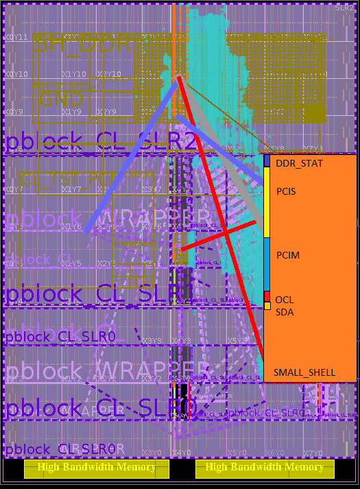

Shell Floorplan Reference
=========================

This document provides the floorplan of Small Shell

Small Shell
-----------

|Small_shell_floorplan|

Recommendations
---------------

- PCIS bus is physically located in SLR1 in SMALL_SHELL. Any customer
  logic interfacing with this bus should reside in SLR1.

