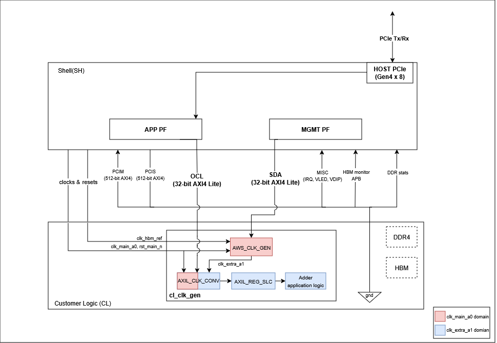

# CL_CLK_GEN

## Table of Contents

1. [Overview](#overview)
2. [Block Diagram](#block-diagram)
3. [Functional Description](#functional-description)
4. [RTL Simulation](#rtl-simulation)
5. [Software Runtime](#software-runtime)
6. [Related Documentation](#related-documentation)

## Overview

The goal of cl_clk_gen is to demonstrate:
1. Integrating [AWS_CLK_GEN](https://github.com/aws/aws-fpga/blob/f2/hdk/docs/AWS_CLK_GEN_spec.md) into a CL design to generate custom clock frequencies
2. Running application logic on the generated clock (`clk_extra_a1` at 15.625 MHz with Clock Recipe A2)
3. Using `cl_axi_clock_converter_light` for clock domain crossing (CDC) of an AXI-Lite interface into the generated clock domain

The adder logic in this example can be replaced with the user's own application code.

## Block Diagram



## Functional Description

### AWS_CLK_GEN

AWS_CLK_GEN is instantiated in the CL top-level and connected to the SDA AXI-Lite interface (PF1-BAR4) from the Shell.

> ⚠️ **Important:**
> 1. The AWS_CLK_GEN instantiation must be named `AWS_CLK_GEN` and located in the CL top module.
> 2. AWS_CLK_GEN must be connected to the SDA interface. The SDK software APIs (`aws_clkgen_set_recipe`, `aws_clkgen_get_dynamic`, etc.) communicate with AWS_CLK_GEN through SDA (PF1-BAR4). If this connection is missing, the software APIs will not function properly.
>
> To read more about AWS_CLK_GEN, see the [AWS_CLK_GEN Specification](https://github.com/aws/aws-fpga/blob/f2/hdk/docs/AWS_CLK_GEN_spec.md).

In this example, only Clock Group A is enabled (`CLK_GRP_A_EN=1`). This module requires three inputs from the Shell: `clk_main_a0` (250 MHz system clock), `rst_main_n` (active-low reset), and `clk_hbm_ref` (100 MHz reference clock used internally by the MMCMs). The AXI-Lite control interface (`s_axil_ctrl_*`) is connected to the SDA port from the Shell, allowing runtime software to configure AWS_CLK_GEN MMCMs and control resets. The module outputs generated clocks (`o_clk_extra_*`) and their corresponding synchronized resets (`o_cl_rst_*`). See the full instantiation below:

```systemverilog
aws_clk_gen #(
  .CLK_GRP_A_EN (1), // Only Clock Group A enabled
  .CLK_GRP_B_EN (0),
  .CLK_GRP_C_EN (0),
  .CLK_HBM_EN   (0)
) AWS_CLK_GEN (
  .i_clk_main_a0       (clk_main_a0     ),  // 250 MHz main clock from Shell
  .i_rst_main_n        (rst_main_n      ),  // Active-low reset from Shell
  .i_clk_hbm_ref       (clk_hbm_ref     ),  // 100 MHz reference clock from Shell

  // SDA AXI-Lite control interface (PF1-BAR4)
  .s_axil_ctrl_awaddr  (sda_cl_awaddr   ),
  .s_axil_ctrl_awvalid (sda_cl_awvalid  ),
  .s_axil_ctrl_awready (cl_sda_awready  ),
  .s_axil_ctrl_wdata   (sda_cl_wdata    ),
  .s_axil_ctrl_wstrb   (sda_cl_wstrb    ),
  .s_axil_ctrl_wvalid  (sda_cl_wvalid   ),
  .s_axil_ctrl_wready  (cl_sda_wready   ),
  .s_axil_ctrl_bresp   (cl_sda_bresp    ),
  .s_axil_ctrl_bvalid  (cl_sda_bvalid   ),
  .s_axil_ctrl_bready  (sda_cl_bready   ),
  .s_axil_ctrl_araddr  (sda_cl_araddr   ),
  .s_axil_ctrl_arvalid (sda_cl_arvalid  ),
  .s_axil_ctrl_arready (cl_sda_arready  ),
  .s_axil_ctrl_rdata   (cl_sda_rdata    ),
  .s_axil_ctrl_rresp   (cl_sda_rresp    ),
  .s_axil_ctrl_rvalid  (cl_sda_rvalid   ),
  .s_axil_ctrl_rready  (sda_cl_rready   ),

  // Generated clock outputs
  .o_clk_hbm_ref       (gen_clk_hbm_ref ),  // Pass-through 100 MHz
  .o_clk_main_a0       (gen_clk_main_a0 ),  // Pass-through 250 MHz
  .o_clk_extra_a1      (gen_clk_extra_a1),  // Group A clock 1
  .o_clk_extra_a2      (gen_clk_extra_a2),  // Group A clock 2
  .o_clk_extra_a3      (gen_clk_extra_a3),  // Group A clock 3
  .o_clk_extra_b0      (gen_clk_extra_b0),  // Group B clock 0 (disabled in this example)
  .o_clk_extra_b1      (gen_clk_extra_b1),  // Group B clock 1 (disabled in this example)
  .o_clk_extra_c0      (gen_clk_extra_c0),  // Group C clock 0 (disabled in this example)
  .o_clk_extra_c1      (gen_clk_extra_c1),  // Group C clock 1 (disabled in this example)
  .o_clk_hbm_axi       (gen_clk_hbm_axi),  // HBM AXI clock (disabled in this example)

  // Synchronized resets (one per clock output)
  .o_cl_rst_main_n     (gen_rst_main_n  ),
  .o_cl_rst_a1_n       (gen_rst_a1_n    ),
  .o_cl_rst_a2_n       (gen_rst_a2_n    ),
  .o_cl_rst_a3_n       (gen_rst_a3_n    ),
  .o_cl_rst_b0_n       (gen_rst_b0_n    ),
  .o_cl_rst_b1_n       (gen_rst_b1_n    ),
  .o_cl_rst_c0_n       (gen_rst_c0_n    ),
  .o_cl_rst_c1_n       (gen_rst_c1_n    ),
  .o_cl_rst_hbm_axi_n (gen_rst_hbm_axi_n),
  .o_cl_rst_hbm_ref_n (gen_rst_hbm_ref_n)
);
```

Each clock output has a corresponding synchronized reset (e.g., `o_cl_rst_a1_n` for `o_clk_extra_a1`). These resets are synchronized to their respective clock domains and controlled by AWS_CLK_GEN's internal reset logic.

At runtime, the software programs the MMCM to Clock Recipe A2 using `aws_clkgen_set_recipe()`, which produces:

| Clock | Frequency |
|-------|-----------|
| clk_extra_a1 | 15.625 MHz |
| clk_extra_a2 | 125 MHz |
| clk_extra_a3 | 62.5 MHz |

### Clock Domain Crossing

All interfaces between the CL and Shell, as listed in `cl_ports.vh`, are synchronous to `clk_main_a0` (250 MHz). The CL design must perform the required clock domain crossing when interfacing logic in another clock domain with [Shell-CL interface ports](https://github.com/aws/aws-fpga/blob/f2/hdk/docs/AWS_Shell_Interface_Specification.md#clocks).

This example uses `cl_axi_clock_converter_light` to bridge the OCL AXI-Lite bus from `clk_main_a0` (250 MHz) into the generated clock domain (`clk_extra_a1` at 15.625 MHz).

An `axi_register_slice_light` follows the clock converter to ensure AXI-Lite signals are properly registered before reaching the application logic.

A stable reset (`cc_rst_n`), synchronized from `rst_main_n` via `xpm_cdc_async_rst`, is used for the converter's master side. This prevents the clock converter's internal FIFOs from being flushed during MMCM reconfiguration (when `gen_rst_a1_n` toggles).

### Clock Constraints

Users do not need to manually create or update clock constraint files for clocks generated by AWS_CLK_GEN. The build system automatically handles MMCM clock constraints through `aws_gen_clk_constraints.tcl`. When building with `--clock_recipe_a A2`, the correct timing constraints are generated automatically.

### Application Logic

The adder module (`cl_axil_adder`) in this example is a simple AXI-Lite register-based adder running on `clk_extra_a1`. Users can replace this module with their own application logic. For details on the adder's register map and operation, refer to the [cl_axil_reg_access README](../cl_axil_reg_access/README.md).

## RTL Simulation

For detailed descriptions of all simulation tests and how to run them, refer to [verif/README.md](verif/README.md).

## Software Runtime

The runtime examples are located in the `software/runtime` directory. To compile and run a test:

```bash
cd software/runtime
make all
sudo ./test_clk_adder
```

The runtime test:
1. Programs MMCM to Clock Recipe A2 using `aws_clkgen_set_recipe()` from the SDK `fpga_clkgen` library
2. Verifies all Clock Group A frequencies match expected values
3. Performs adder operations across the clock domain crossing and validates results

### FPGA API Functions

Programming the clock recipe via SDA (PF1-BAR4):

```c
// Set Clock Recipe A2 for Group A (15.625 MHz on clk_extra_a1)
rc = aws_clkgen_set_recipe(slot_id, /*recipe_a=*/2, /*recipe_b=*/0, /*recipe_c=*/0, /*recipe_hbm=*/0, /*reset=*/0);
```

Reading back clock frequencies:

```c
struct fpga_clkgen_info info;
rc = aws_clkgen_get_dynamic(slot_id, &info);
// info.clock_group_a.clocks[0] = clk_extra_a1 frequency in MHz
```

### Build

```bash
cd build/scripts
./aws_build_dcp_from_cl.py -c cl_clk_gen -m small_shell --aws_clk_gen --clock_recipe_a A2
```

## Related Documentation

- [AWS_CLK_GEN Specification](https://github.com/aws/aws-fpga/blob/f2/hdk/docs/AWS_CLK_GEN_spec.md)
- [Clock Recipes User Guide](https://github.com/aws/aws-fpga/blob/f2/hdk/docs/Clock_Recipes_User_Guide.md)
- [cl_axil_reg_access](../cl_axil_reg_access/) (adder application logic details)
