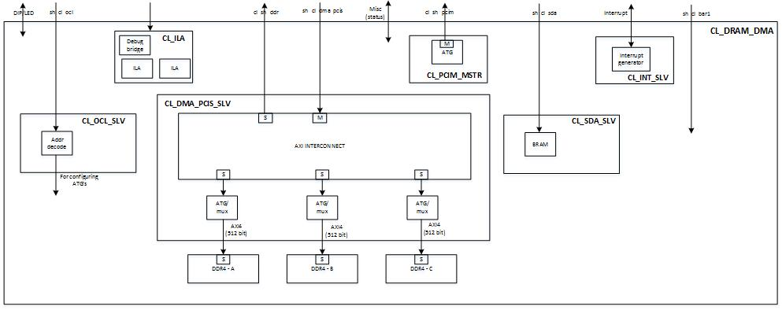

# CL_DRAM_DMA CustomLogic Example

## :exclamation:  NOTE: If this is your first time using F1, you should read [How To Create an Amazon FPGA Image (AFI) From One of The CL Examples: Step-by-Step Guide](./../README.md) first!!

## Table of Content

1. [Overview](#overview)
2. [Functional Description of the example RTL](#functionalDescription)
3. [Software](#software)
4. [DRAM DMA Example Metadata](#metadata)

# Overview  

The CL_DRAM_DMA example demonstrates the use and connectivity for many of the Shell/CL interfaces and functionality, including:

1) Register Access over ocl\_ AXI-Lite interfaces

2) Mapping of the external four DRAM channel to instance memory via PCIe AppPF BAR4, and the 512-bit pcis_dma_ AXI4 bus

3) Virtual JTAG and Xilinx Integrated Logic Analyzer cores

4) User-defined interrupts

5) pcim_ AXI4 traffic for host memory accesses from CL

### System diagram  

  

# Functional Description

### DRAM Interfaces

All four DRAM channels are used.

The DRAM space is 64GiB, and is mapped to the sh_cl_dma_pcis AXI4 bus.

### dma_pcis AXI4 bus

sh\_cl\_dma\_pcis exposes a address windows of 128GiB matching AppPF BAR4.

This memory space is mapped to the 64GiB DRAM space (the upper half of the 128GiB will just wrap around to the lower half).
An [axi_crossbar_0](../../../common/shell_v071417d3/design/ip/cl_axi_interconnect/hdl/cl_axi_interconnect.v)
will interleave inbound addresses according to DDR_A (base_addr=0x0_0000_00000, range=16GB),
DDR_B(base_addr=0x4_0000_0000, range=16GB), DDR_C(base_addr=0x8_0000_0000, range=16GB),
DDR_D(base_addr=0xC_0000_0000, range=16GB).

### ocl\_ AXI-Lite

The cl_ocl\_ AXI-Lite bus is connected to [cl_ocl_slv.sv](design/cl_ocl_slv.sv) module, and is used for register access to the Automatic Test Generator (ATG) etc.

The valid address map is found [cl_ocl_address_map.xlsx](design/address_map.xlsx).

Any access invalid address with return 32'hdeadbeef

### sda\_ AXI-Lite

The sh_cl_sda\_ AXI-Lite bus is connected to [cl_sda_slv.sv](design/cl_sda_slv.sv) module, which provides 1KiB of scratch RAM.

Address bits [9:0] will be used to access the location of the RAM, but the upper bits of the address are ignored.

### pcim\_ AXI4

The cl_sh_pcim\_  AXI4 bus is driven by Automatic Test Generator (ATG) and connected to [cl_pcim_mstr.sv](design/cl_pcim_mstr.sv). It can be used to read/write from the host memory. 

### irq/ack
[cl_int_slv.sv](design/cl_int_slv.sv) provides an example for generating the IRQ requests and checks if ACK has been received.

### FPGA to FPGA communication over PCIe

This example does not use FPGA to FPGA PCIe communication

### FPGA to FPGA communication over Ring

This example does not use FPGA to FPGA Ring

### Virtual JTAG

2 ILA cores are integrated, one to monitoring the sh\_c_dma\_pcis bus and the other to monitor the AXI4 signals on DDR_A. An example usage is provided in [cl_ila.sv](design/cl_ila.sv).
An example usage for Xilinx VIO is provided in [cl_vio.sv](design/cl_vio.sv)

### Clocks

CL_DRAM_DMA uses the main `clk_main_a0`.  It's frequency is set in the cl_clk under `build/constraints/cl_clocks.xdc`.

`clk_xtra_a1` is used by the Virtual JTAG

### Reset

flr_reset is ignored in this design
  

## Runtime software
DMA accesses rely on the edma driver- see the [edma driver readme](../../../../sdk/linux_kernel_drivers/edma/README.md)

The DRAM DMA example includes runtime software to demonstate working DMA accesses. The runtime example is located [in the runtime directory](software/runtime/test_dram_dma.c)
  

## DRAM DMA Example Metadata
The following table displays information about the CL that is required to register it as an AFI with AWS.
Alternatively, you can directly use a pre-generated AFI for this CL.

| Key   | Value     |
|-----------|------|
| Shell Version | 0x071417d3 |
| PCI Device ID | 0xF001 |
| PCI Vendor ID | 0x1D0F (Amazon) |
| PCI Subsystem ID | 0x1D51 |
| PCI Subsystem Vendor ID | 0xFEDC |
| Pre-generated AFI ID | afi-0233d4b4e175518ba |
| Pre-generated AGFI ID | agfi-08f98fa67671454fe |

