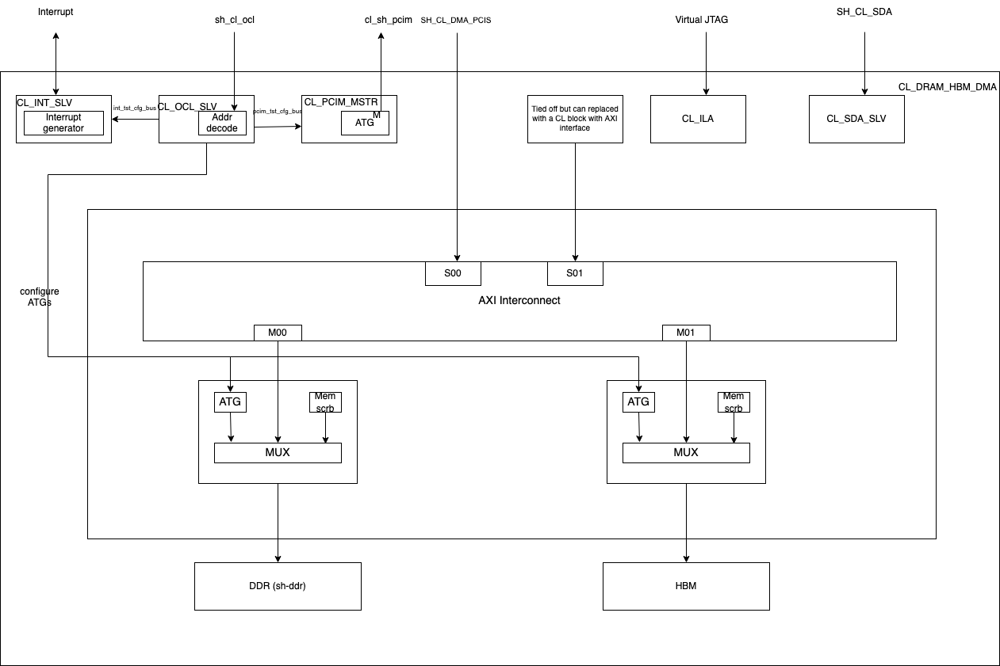

# CL_DRAM_HBM_DMA CustomLogic Example

:warning:***Features using XDMA engine are currently unsupported on F2 instances***

## Table of Content

1. [Overview](#overview)
2. [Functional Description](#functionalDescription)
3. [Software](#software)


<a name="overview"></a>
# Overview

The CL_DRAM_HBM_DMA example demonstrates the use and connectivity for many of the Shell/CL interfaces and functionality, including:

1) Register Access over OCL AXI-Lite interface

2) Mapping of the external DRAM channel to instance memory via PCIe AppPF BAR4, and the 512-bit `sh_cl_dma_pcis_*` AXI4 bus

3) Mapping of HBM memory to instance memory via PCIe AppPF BAR4, and the 512-bit `sh_cl_dma_pcis_*` AXI4 bus

4) Virtual JTAG (**Virtual JTAG is not currently supported**) and Xilinx Integrated Logic Analyzer cores

5) User-defined interrupts

6) `cl_sh_pcim_*` AXI4 traffic for host memory accesses from CL


### System diagram




<a name="functionalDescription"></a>
# Functional Description

### Memory Interface
The cl_dram_hbm_dma demonstrates accessing 64GiB of DDR memory and 16GiB of single channel HBM memory over `sh_cl_dma_pcis` AXI4 bus.

The CL provides access to the DDR memory through `sh_ddr.sv` which consists of the DDR controller required to interact with the external DDR DIMM on the FPGA card. The `sh_ddr.sv` is also connected to the Shell's `sh_cl_ddr_stat_*` ports to enable Shell to manage DDR calibration upon CL AFI loads.

The CL also provides access to the on-chip HBM available in the FPGA. The HBM IP is configured for dual stack 16GiB capacity which exposes 32 AXI3 (not AXI4) channels running on 450MHz clock. However, only one HBM channel is being used in this example design to demonstrate datapath connection to the HBM. The [cl_hbm_axi4.sv](./design/cl_hbm_axi4.sv) does the AXI4-to-AXI3 conversion, crosses clock domain between `clk_main_a0` and HBM's 450 MHz `axi_clk` for the datapath and feeds the `cl_hbm_wrapper.sv`. The [cl_hbm_wrapper.sv](./design/cl_hbm_wrapper.sv) instantiates the HBM IP, houses MMCM to generate 450MHz interface clock, and connects the datapath to Channel#0 of the HBM IP core.

**NOTE:** Since the CL utilizes only one HBM Channel which is fed by data source running at 250MHz clock, it does not accomplish the max available bandwidth from HBM. AWS will provide another example design to demonstrate max performance from HBM.

### Design Changes

Individual controllers (DDR, HBM) can be enabled and disabled by simply updating the appropriate defines in the [cl_dram_hbm_dma_defines.vh](design/cl_dram_dma_defines.vh) file. The [sh_ddr.sv](../../../common/shell_stable/design/sh_ddr/sim/sh_ddr.sv) file contains the necessary logic to remove and tie-off appropriate interfaces when the DDR controller is disabled.

For the cl_dram_hbm_dma example memory ranges have been allocated for DDR and HBM. So, if a particular memory is disabled, then the developer should take care to handle transactions to that addresss range since there will be no controller to respond to the request. The address ranges for each controller is described below in the [dma_pcis AXI4 bus section](#dma_pcis).

### Test Changes

If a particular controller is disabled, make sure that the test is not accessing address space for that controller.

Please look at [dma_pcis AXI4 bus section](#dma_pcis) for address ranges.

If DDR is enabled, make sure that the DDRs are initialized using the poke_stat commands below.

eg:
To initialize DDR

tb.poke_stat(.addr(8'h0c), .ddr_idx(0), .data(32'h0000_0000));

Make sure that the Host to Card and Card to Host DMA transfers only access enabled DDR controller address space.

<a name="dma_pcis"></a>
### dma_pcis AXI4 bus

sh\_cl\_dma\_pcis exposes a address windows of 128GiB matching AppPF BAR4.


This memory space is mapped to the 64GiB DRAM space and 16GiB HBM space.
An axi_crossbar interconnects the incomming addres requests to the target memories as shown below:
* DDR base_addr=0x00_0000_0000 | range=64GiB
* HBM base_addr=0x10_0000_0000 | range=16GiB

**NOTE**: Please refer to [Supported_DDR_Modes.md](./../../../docs/Supported_DDR_Modes.md) for details on supported DDR configurations in `sh_ddr.sv`.

### ocl\_ AXI-Lite


The cl_ocl\_ AXI-Lite bus is connected to [cl_ocl_slv.sv](design/cl_ocl_slv.sv) module, and is used for register access to the Automatic Test Generator (ATG) etc.


The valid address map is as shown below:
| Module     | OCL Start Address | OCL End Address | Description                                                                                      |
|------------|-------------------|-----------------|--------------------------------------------------------------------------------------------------|
| PCIM ATG   | 0x0000            | 0x00FF          | PCIM Traffic Generator (refer to cl_tst.sv)                                                      |
| DDR ATG    | 0x0100            | 0x01FF          | DDR Traffic Generator                                                                            |
| HBM ATG    | 0x0200            | 0x02FF          | HBM Traffic Generator                                                                            |
| HBM Status | 0x0300            | 0x0300          | bit[31:3] - Reserved (RO) \|bit[2:1] - HBM Initialized \|bit[0] - SW Reset for HBM. (1 = Reset HBM) |

Any access to invalid address shall return 32'hdeadbeef


### sda\_ AXI-Lite

The sh_cl_sda\_ AXI-Lite bus is connected to [cl_sda_slv.sv](design/cl_sda_slv.sv) module, which provides 1KiB of scratch RAM.


Address bits [9:0] will be used to access the location of the RAM, but the upper bits of the address are ignored.


### pcim\_ AXI4


The cl_sh_pcim\_  AXI4 bus is driven by Automatic Test Generator (ATG) and connected to [cl_pcim_mstr.sv](design/cl_pcim_mstr.sv). It can be used to read/write from the host memory.

### irq/ack
[cl_int_slv.sv](design/cl_int_slv.sv) provides an example for generating the IRQ requests and checks if ACK has been received.

### Virtual JTAG

3 ILA cores are integrated, one to monitoring the sh\_c_dma\_pcis bus, one to monitor the AXI4 signals on DDR and the third to monitor the AXI4 signals on HBM. An example usage is provided in [cl_ila.sv](design/cl_ila.sv).
An example usage for Xilinx VIO is provided in [cl_vio.sv](design/cl_vio.sv)


### Clocks

CL_DRAM_HBM_DMA uses the main `clk_main_a0`. It's frequency is set in [cl_clocks_aws.xdc](./build/constraints/cl_clocks_aws.xdc)


<a name="software"></a>
## Software
DMA accesses rely on the [XDMA driver](https://github.com/Xilinx/dma_ip_drivers)

The DRAM_HBM DMA example includes runtime software to demonstrate working DMA accesses. The runtime example is located [in the runtime directory](software/runtime/test_dram_dma.c)

There are three example tests in cl_dram_hbm_dma example.

#### test_dram_dma.c

This test runs a software test with data transfer with DDR enabled.

#### test_hbm_dma.c

This test runs a software test with data transfer with HBM enabled.

#### test_dram_hbm_dma.c

This test runs a software test with data transfer with both DDR and HBM enabled

### Compile and run instructions

```bash
cd ${CL_DIR}/software/runtime

make all

sudo ./test_dram_hbm_dma
```

#### test_dram_hbm_dma_hwsw_cosim.c

This test runs a software test with HW/SW co-simulation enabled with both DDR and HBM enabled.

### Compile and run instructions

```bash
cd ${CL_DIR}/software/runtime

make TEST=test_dram_hbm_dma_hwsw_cosim

sudo ./test_dram_hbm_dma_hwsw_cosim
```

The test can be simulated with XSIM as follows.

```bash
cd ${CL_DIR}/verif/scripts

make C_TEST=test_dram_hbm_dma_hwsw_cosim
```
