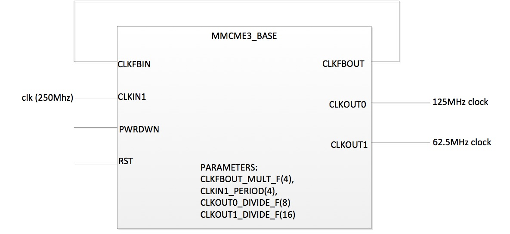

## Revision History

2016/11/28   -   Initial public release with HDK release version
                          
                          

# Overview

The AWS FPGA instance provides FPGA acceleration capability to AWS
compute instances. Each FPGA is divided into two partitions:

-   Shell (SH) – AWS platform logic responsible for taking care of the FPGA external peripherals, PCIe, and Interrupts.

-   Customer Logic (CL) – Custom acceleration logic created by an FPGA Developer

At the end of the development process, the Shell and CL will become an Amazon FPGA Image (AFI)

This document specifies the hardware interface and functional behavior between the Shell and the CL.

While there could be multiple versions and multiple generations of the FPGA-accelerated EC2 instances, the rest of this document focuses on the Shell design for xvu9p architecture used in EC2 F1 instance.

Full details of the available FPGA enabled instances are [here](https://aws.amazon.com/ec2/instance-types)

## Architecture and Version

This specification applies to  Xilinx Virtex Ultrascale Plus platform, referred to in AWS APIs and the HDK release as `FpgaImageArchitecture=xvu9p`.

The Shell is tagged with a revision number. Note while AWS tries to keep the revision constant, sometimes it is necessary to update the revision due to discovered issues or added functionality. The HDK release includes the latest Shell version under `/hdk/common/shell_latest`

New shell versions require updated CL implementation and regenerating the AFI.

## Convention

**CL –** Custom’s Logic: the Logic to be provided by the developer and integrated with AWS Shell.

**DW –** Doubleword: referring to 4-byte (32-bit) data size.

**AXI-4** ARM Advanced eXtensible Interface.

**AXI-4 Stream –** ARM Advanced eXtensible Stream Interface.

**M –** Typically refers to the Master side of an AXI bus.

**S –** Typical refers to the Slave side of AXI bus.

# Shell Interfaces (for xvu9p architecture as in EC F1 instances)

The F1 FPGA platform includes the following interfaces available to the
CL:

-   One x16 PCIe Gen 3 Interface.

-   Four DDR4 RDIMM interfaces (with ECC).

## CL/Shell Interfaces (AXI-4)

All interfaces except the inter-FPGA links uses the AXI-4 protocol. The AXI-4 interfaces in the Shell have the following restrictions:

-   AxSIZE – All transfers must be the entire width of the bus. While byte-enables bitmap are supported, it must adhere to the interface
    protocol (i.e. PCIe contiguous byte enables on all transfers larger than 64-bits).

-   AxBURST – Only INCR burst is supported.

-   AxLOCK – Lock is not supported.

-   AxCACHE – Memory type is not supported.

-   AxPROT – Protection type is not supported.

-   AxQOS – Quality of Service is not supported.

-   AxREGION – Region identifier is not supported.

### External Memory Interfaces implemented in CL

Some of the DRAM interface controllers are implemented in the CL rather than the Shell for optimized resource utilization of the FPGA. For those interfaces, the designs and the constrains are provided by AWS and must be instantiated in the CL (by including the `sh_ddr.sv`). 

There are four DRAM interfaces labeled A, B, C, and D. Interfaces A, B, and D are in the CL while interface C is implemented in the Shell. A design block (sh_ddr.sv) instantiates the three DRAM interfaces in the CL (A, B, D).

For DRAM interface controllers that are implemented in the CL, the AXI-4 interfaces do not connect into the Shekk, but connect locally inside the CL to the AWS provided blocks. There are also statistics interfaces that must be connected from Shell to the DRAM interface controller modules.

**NOTE:** *There is no performance or frequency difference between the four DRAM controllers regardless whether anyone of them resides in the CL or the Shell logic*

**NOTE:** *The HDK will offer an option to build a CL without one or more of the 3 DRAM controllers for optimizing FPGA resource *

### Clocking/Reset

A single 250MHz clock, and associated asynchronous reset is provided to the CL. All Shell interfaces are synchronous to the 250MHz clock. The CL can derive clocks off of the 250MHz clock.

+The Xilinx Mixed Mode Clock Manager (MMCM) IP can be used to generate slower clocks off of the 250MHz clock.

The reset signal combines the board reset and PCIe reset conditions. Please refer to the Xilinx documentation (ug974) for more information.

### Function Level Reset

FLR is supported for the Application Physical Function using a separate FLRinterface:

-   sh_cl_flr_assert – Level signal that is asserted when FLR has
    been requested

-   cl_sh_flr_done – Asserted for a single clock to acknowledge
    the FLR. This must be asserted in response to sh_cl_flr_assert.
    Note due to pipeline delays it is possible sh_cl_flr_assert is
    asserted for some number of clocks after cl_sh_flr_done.

## PCIe Endpoint Presentation to Instance

There are two PCIe Physical Functions (PFs) presented to the F1 instance:

-   Management PF – This PF allows for management of the FPGA using the [FPGA Management Tools](../../sdk/management/management_tools/README.md) , including tracking FPGA state and loading CL images onto the FPGA.

-   Application PF – The PF for the Custom Logic (CL) specific functionality

### Management PF

The management PF is a separate PF from the CL PF. Details are provided for reference for understanding the PCIe mapping from an F1 instance. This interface is strictly for AWS FPGA Management Tools, and does not support any interface with the CL code. 

The Management PF exposes:

a)  Amazon’s specific and fixed PCIe VendorID (0x1D05) and DeviceID.

b)  Two BARs with 4KB size

c)  Single MSI-X interrupt.

d)  No BusMaster support.

e)  A range of 32-bit addressable registers.

The Management PF is persistent throughout the lifetime of the instance, and it will not be reset or cleared (even during the AFI attach/detach process).

### Application PF (AppPF)

The Application PF exposes the following:

a)  PCIe BAR0 as a 64-bit prefetchable BAR sized as 128MB (*note the BAR size is subject to change, goal is 64GB, but will be no smaller
    than 128MB)*. This BAR may be used to map the entire External/Internal memory space to the instance address space if desired, through `mmap()` type calls.

b)  PCIe BAR2 as a 64-bit prefetchable BAR sized as 4KB for the MSI-X interrupt tables.

c)  FLR capability that will reset the CL.

d)  BusMaster capability to allow the CL to master transactions towards the instance memory.
    
e)  CL’s specific PCIe VendorID, DeviceID, VendorSystemID and SubsystemID as registered through `aws ec2 fpgaImageCreate` [*Available soon*]

The Developer can write drivers for the App PF or can leverage the reference driver provided in the SDK (With plan to include the driver included in Amazon Linux by default).

### PCIe Interface between Shell and CL

The PCIe interface between the Shell and CL is accessed over two AXI-4 interfaces:

#### AXI-4 for Inbound PCIe Transactions (Shell is master, CL is slave) 

This AXI-4 bus is for PCIe transactions mastered by the instance and targeting AppPF BAR0.

It is a 512-bit wide AXI-4 interface that supports 32-bit transactions only. *Future revisions this interface will support larger burst sizes (up to the Maximum Payload Size)*.

A read or write request on this AXI-4 bus that is not acknowledged by the CL within a certain time window, will be internally terminated by the Shell [*May not be supported in early releases*]. If the time-out error happens on a read, the Shell will return 0`xDEADBEEF` data back to the instance. This error is reported through the Management PF and could be retrieved by FPGA Management Tools metric.

#### AXI-4 for Outbound PCIe Transactions (CL is master, Shell is slave) 

This is a 512-bit wide AXI-4 Interface for the CL to master cycles to the PCIe bus. This is used, for example, to DMA data to/from instance memory.

The following PCIe interface configuration parameters are provided from the Shell to the CL, and the CL logic must respect these maximum limits:

-   sh_cl_cfg_max_payload[1:0] – PCIe max payload size:
    -   2’b00 – 128 Byte
    -   2’b01 – 256 Byte (Most probable value)
    -   2’b10 – 512 Byte
    -   2’b11 – Reserved

-   sh_cl_cfg_max_read_req[2:0]
    -   3’b000 – 128 Byte
    -   3’b001 – 256 Byte
    -   3’b010 – 512 Byte (Most probable value)
    -   3’b011 – 1024 Byte
    -   3’b100 – 2048 Byte
    -   3’b101 – 4096 Byte

The PCIe CL to Shell AXI-4 interfaces **MUST** implement “USER” bits on the address channels (`AxUSER[18:0]`).

-   AxUSER[10:0] – DW length of the request. This is 1-based (0: zero DW, 1: one DW, 2: two DW, etc…)
-   AxUSER[14:11] – First DW's Byte enable for the Request
-   AxUSER[18:15] – Last DW's Byte enable for the Request

##### Outbound PCIe AXI-4 Interface Restrictions:

-   Transfers must not violate PCIe byte enable rules (see byte enables below).
-   Transfers must not cross a 4Kbyte address boundary (PCIe restriction).
-   Transfers must not violate Max Payload Size.
-   Read requests must not violate Max Read Request Size.
-   A read request transaction must not be issued using the same ARID (AXI4 Read ID), if that ARID is already outstanding. **NOTE:** *The Shell does not enforce ordering between individual read transactions and read response could could in arbiterary order*.
-   The PCIe interface supports 5-bit ARID (32 outstanding read transactions maximum), as PCIe extended tag is not supported on the PCIe interface.
-   The address on the AXI-4 interface must reflect the correct byte address of the transfer. The Shell does not support using a 64-bit
    aligned address, and using STRB to signal the actual starting DW.
-   The first/last byte enables are determined from the AxUSER bits. In addition, for writesm the WSTRB signal must be correct and reflect the appropriate valid bytes on the WDATA bus even if it was provided on AxUSER. 

##### Byte Enable Rules

All PCIe transactions must adhere to the PCIe Byte Enable rules (see PCI Express Base specification). Rules are summarized below:

-   All transactions larger than two DW must have contiguous byte enables
-   Transactions that are less than two DW may have non-contiguous byte enables

### AXI4 Error handling 

Transaction on AXI4 interface will be terminated and reported as SLVERR on the RRESP/BRESP signals and will not passed to the instance in the following cases:

-   PCIe BME (BusMaster Enable) is not set in the PCIe configuration space

-   Illegal transaction address (Addressing memory space that’s not supported by the instance)

-   Transaction crossing 4KB boundaries violating PCIe specifications

-   Illegal byte-masking

-   Illegal length

-   Illegal ARID (ARID is already been used for an outstanding read transaction)

**NOTE** Pre-GA versions of the Shell and the FPGA Magagement tools many not have some of these checks and associated metrics exposed to the developers.

### Interrupts (Future)

Interrupts are not supported in the current version of the Shell. Future
versions of the Shell will have support for at least 16 interrupt
sources.

## DDR4 DRAM Interface

Each DRAM interface is accessed via an AXI-4 interface:

-   AXI-4 (CL Master and DRAM controller is slave) – 512-bit AXI-4 interface to read/write DDR

There is a single status signal that the DRAM interface is trained and ready for access. The addressing uses ROW/COLUMN/BANK mapping of AXI address to DRAM Row/Col/BankGroup. The Read and Write channels are serviced with roundrobin priority (equal priority).

The DRAM interface uses  Xilinx DDR-4 Interface controller. The AXI-4 interface adheres to the Xilinx specification. User bits are added to the read data channel to signal ECC errors with the read data.

In the current version of the CL, the four DRAM interfaces are not optional and have to be instanced in order to successfully place and route the CL. In future versions, the CL will be able to choose the number of DDR controllers (A/B/D). If the DDR interfaces are not used, the AXI-4 interfaces of the sh_ddr.sv should be tied-off.

### DRAM Content Preservation between AFI Loads (Future)

In future Shell versions a DRAM content preservation feature will be implemented. This feature allows the DDR state to be preserved when dynamically changing CL logic. The current Shell version will not guarantee preservation of DRAM contents if the CL logic is re-loaded.

#### Miscellaneous signals

There are some miscellaneous generic signals between Shell and CL.

### PCIe IDs

Some signals must include the PCIe IDs of the CL. A Developer’s specific PCIe VendorID, DeviceID, SubsystemVendorID and SubsystemID are registered through `aws ec2 fpgaImageCreate` command to reserve the PCIe IDs of the CL for mapping of the device into an F1 instance when the AFI is loaded.

-   cl_sh_id0

    -   [15:0] – Vendor ID

    -   [31:16] – Device ID

-   cl_sh_id1

    -   [15:0] – Subsystem ID

    -  [31:16] – Subsystem Vendor ID

### General control/status

The functionality of these signals is TBD.

-   cl_sh_status0[31:0] – Placeholder for generic CL to Shell status

-   cl_sh_status1[31:0] – Placeholder for generic CL to Shell status

-   sh_cl_ctl0[31:0] – Placeholder for generic Shell to CL control information

-   sh_cl_ctl1[31:0] – Placeholder for generic Shell to CL control information

-   sh_cl_pwr_state[1:0] – This is the power state of the FPGA. 0x0

    -   0x0 – Power is normal

    -   0x1 – Power level 1

    -   0x2 – Power level 2

    -   0x3 – Power is critical and FPGA is subject to shutting off clocks or powering down
