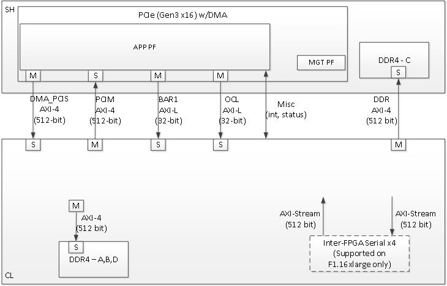

# AWS Shell Interface Specification

## Revision History

2016/11/28   -   Initial public release with HDK release version

2016/12/06   -   Added capability to remove DDR controllers in the CL through parameters in `sh_ddr.sv`

2017/02/02   -   Major updates for Feb/2017 Shell, that includes interrupts, wider and more buses,  DMA, Virtual LED and other. (Please refer to [Release Notes](../../RELEASE_NOTES.md) for details)
                          
  
# Table of Contents:

1. [Overview](#overview)

   1a. [Architecture and Version](#arch_ver)

   1b. [Conventions](#conventions)

2. [Shell/CL Interfaces](#ShellInterfaces)

   2a. [CL/Shell AXI Interfaces](#cl_shell_axi_interfaces)

   2b. [External Memory Interfaces implemented in CL](#external_memory_interfaces_implemented_in_cl)

3. [EC2 Instance view of FPGA PCIe](#pciPresentation)
   
   3a. [Management PF](#management_pf)

   3b. [Application PF](#application_pf)

4. [Clocks and Resets](#ClocksNReset)

   4a. [Clocks](#Clocks)
   
   4b. [Reset](#Reset)

5. [Interfaces between Shell and CL](#interfaces_between_shell_and_cl)
   
   5a. [CL Interface to PCIe Interface via Shell](#cl_interface_to_pcie_interface_via_shell)

   5b. [AXI-Lite interfaces for register access](#axi_lite_interfaces_for_register_access)

   5c. [Interrupts](#interrupts)
  
   5d. [DDR4 DRAM Interfaces](#ddr)
  
   5e. [Miscellanous Interfaces(vLED, vDIP..)](#misc)


  

<a name="overview"></a>
# Overview

With F1, each FPGA is divided into two partitions:

-   Shell (SH) – AWS platform logic responsible for taking care of the FPGA external peripherals, PCIe, DRAM, and Interrupts.

-   Custom Logic (CL) – Custom acceleration logic created by an FPGA Developer.

At the end of the development process, combining the Shell and CL creates an Amazon FPGA Image (AFI)

This document specifies the hardware interface and functional behavior between the SH and the CL; specifically the Shell design for xvu9p architecture used in EC2 F1 instance.
  
  
<a name="arch_ver"></a>
## Architecture and Version

This specification applies to  Xilinx Virtex Ultrascale Plus platform available on EC2 F1, each update of the Shell 
 is tagged with a revision number. Note while AWS tries to keep the revision constant, sometimes it is necessary to update the revision due to discovered issues or added functionality. The HDK release includes the latest Shell version under `/hdk/common/shell_latest`

New shell versions will require updated CL implementation and regenerating the AFI.
  
  
<a name="conventions"></a>
## Conventions
  
**CL –** Custom Logic: the Logic to be provided by the developer and integrated with AWS Shell.

**DW –** Doubleword: referring to 4-byte (32-bit) data size.

[**AXI-4** ARM Advanced eXtensible Interface.](http://infocenter.arm.com/help/index.jsp?topic=/com.arm.doc.set.amba/index.html)

[**AXI-4 Stream –** ARM Advanced eXtensible Stream Interface.](http://infocenter.arm.com/help/index.jsp?topic=/com.arm.doc.set.amba/index.html)

**M –** Typically refers to the Master side of an AXI bus.

**S –** Typical refers to the Slave side of AXI bus.  
  
  
<a name="ShellInterfaces"></a>
# Shell Interfaces


The F1 FPGA platform includes the following interfaces available to the
CL:

-   One x16 PCI Express 3.0 Interface.

-   Four DDR4 RDIMM interfaces, each interface is 72-bit wide including ECC.


<a name="cl_shell_axi_interfaces"></a>
## CL/Shell AXI Interfaces (AXI-4 and AXI-Lite)

All interfaces except the inter-FPGA links use the AXI-4 or AXI-Lite protocol.  The AXI-L buses are for register access use cases, and can run off lower speed control interfaces that use the AXI-Lite protocol. 

For bulk data transfer, wide AXI-4 buses are used. AXI-4 on the CL/Shell interfaces have the following restrictions:

-   AxBURST – Only INCR burst is supported.

-   AxLOCK – Lock is not supported.

-   AxCACHE – Memory type is not supported.

-   AxPROT – Protection type is not supported.

-   AxQOS – Quality of Service is not supported.

-   AxREGION – Region identifier is not supported.

These signals are not included on the AXI-4 interfaces of the shell.  If connecting to a fabric or component that supports these signals, these vaules should be used:

| Signal       | Value      |
|:-------------|:-----------|
|AxBURST[1:0]  | 0b01       |
|AxLOCK[1:0]   | 0b00       |
|AxCACHE[3:0]  | 0b000x (bit 0 is Bufferable bit and may be 0 or 1) |
|AxPROT[2:0]   | 0b000      |
|AxQOS[3:0]    | 0b0000     |
|AxREGION[3:0] | 0b0000     |




<a name="external_memory_interfaces_implemented_in_cl"></a>
## External Memory Interfaces implemented in CL

Some of the DRAM interface controllers are implemented in the CL rather than the Shell for optimized resource utilization of the FPGA (Allowing higher utilization for the CL place and route region to maximize usable FPGA resources). For those interfaces, the designs and the constraints are provided by AWS and must be instantiated in the CL (by instantiating `sh_ddr.sv` in the CL design). 

There are four DRAM interfaces labeled A, B, C, and D. Interfaces A, B, and D are in the CL while interface C is implemented in the Shell. A design block (sh_ddr.sv) instantiates the three DRAM interfaces in the CL (A, B, D).

For DRAM interface controllers that are implemented in the CL, the AXI-4 interfaces do not connect into the Shell, but connect locally inside the CL to the AWS provided blocks. There are also statistics interfaces that must be connected from Shell to the DRAM interface controller modules.  **WARNING** if the stats interface is not hooked up, the DDR controllers will not function.

All CL's **must** instantiate sh_ddr.sv, regardless of the number of DDR's that should be implemented.  There are three parameters (all default to '1') that define which DDR controllers are implemented:
  - DDR_A_PRESENT
  - DDR_B_PRESENT
  - DDR_D_PRESENT
  
These parameters are used to control which DDR controllers are impemented in the CL design.  An example instantiation:
 ```   
    sh_ddr #(.DDR_A_PRESENT(1),
           .DDR_B_PRESENT(1),
           .DDR_D_PRESENT(0))
           SH_DDR (
              .clk(clk),
              ...
 ```   
 

**NOTE:** *There is no performance or frequency difference between the four DRAM controllers regardless whether they resides in the CL or the Shell logic*

<a name="pciPresentation"></a>
# FPGA PCIe Representation to EC2 Instance

There are two PCIe Physical Functions (PFs) presented to the F1 instance:

-   Management PF – This PF is used for management of the FPGA using the [FPGA Management Tools](../../sdk/userspace/fpga_mgmt_tools/README.md), [FPGA Management Libraries](../../sdk/userspace/include/), and various control functions like Virtual-LED, Virtual-DIPSwitch, [Virtual JTAG](./Virtual_JTAG_XVC.md), and including monitoring FPGA metrics and performing AFI management actions.

-   Application PF (AppPF)– The AppPF is used for CL specific functionality.

The [Software Programmers' View](./Programmer_View.md) provides the intended software programmer's view and associated software modules and libraries around the two before mentioned PFs. 

Please refer to [PCI Address map](./AWS_Fpga_Pcie_Memory_Map.md) for a more detailed view of the address map.

<a name="management_pf"></a>
## Management PF (MgmtPF)

The Management PF details are provided for reference to help understanding the PCIe mapping from an F1 instance. This interface is strictly used for [AWS FPGA Management Tools](../../sdk/userspace/fpga_mgmt_tools/README.md) linux shell commands, and [FPGA Management Library](../../sdk/userspace/include/) for integration with C/C++ application, as well as [AWS OpenCL Runtime ICD/HDL](./TBD), and does not support any interface with the CL code. 

The Management PF exposes:

a)  Amazon’s specific and fixed PCIe VendorID (0x1D0F) and DeviceID.

b)  Three BARs:

      - BAR0 - 16KiB
      - BAR2 - 16KiB
      - BAR4 - 4MiB  

c)  No BusMaster support.

d)  A range of 32-bit addressable registers.

The Management PF is persistent throughout the lifetime of the instance, and it will not be reset or cleared (even during the AFI Load/Clear process).  


<a name="application_pf"></a>
## Application PF (AppPF)

The Application PF exposes:

a)  PCIe BAR0 as a 32-bit non-prefetchable BAR sized as 32MiB.  This BAR maps to the the OCL AXI-Lite interface.

b)  PCIe BAR1 as a 32-bit non-prefetchable BAR sized as 2MiB.  This BAR maps to the the BAR1 AXI-Lite interface.

c)  PCIe BAR2 as a 64-bit prefetchable BAR sized as 64KiB. This BAR is not CL visible.  This BAR maps to the MSI-X tables and XDMA (if enabled).

d)  PCIe BAR4 as a 64-bit prefetchable BAR sized as 128GiB. This BAR may be used to map the entire External/Internal memory space to the instance address space if desired, through `mmap()` type calls or use `fpga_pci_lib` APIs.

c)  FLR capability that will reset the CL.

d)  BusMaster capability to allow the CL to master transactions towards the instance memory.
    
e)  CL’s specific PCIe VendorID, DeviceID, VendorSystemID and SubsystemID as registered through `aws ec2 fpgaImageCreate`

The Developer can write drivers for the AppPF or can leverage the reference driver provided in the SDK.

<a name="ClocksNReset"></a>
# Clocks and Reset

<a name="Clocks"></a>
## Clocks

There are multiple clocks provided by the Shell to the CL, grouped in 3 groups marked \_a, \_b and \_c suffix: 

   - clk_main_a0
   - clk_extra_a1
   - clk_extra_a2
   - clk_extra_a3

   - clk_extra_b0
   - clk_extra_b1

   - clk_extra_c0
   - clk_extra_c1

**clk_main_a0** is the main clock and used, since all interfaces between CL and SH are clocked with clk_main_a0.

The clocks within each group are generated from a common VCO/PLL, which restrict what combinations of frequencies are allowed within a group.

The maximum frequency on clk_main_a0 is 250MHz.

** *Note: The Developer must NOT assume frequency lock or alignment between clocks from different groups, even if they are set for same frequencies * **  


### Defining Clock frequencies by Developer

There Developer can select among a set of available frequencies, provided in the [clock recipe table](./clock_recipes.csv), and recipe names are called Ax, By, Cz  for group A recipe x, group B recipe y and group C recipe z respectively.

Group A recipe must be defined in the [AFI Manifest](./AFI_Manifest.md), which would be included in the tar file passed to `aws ec2 create-fpga-image` AFI registration API.  Group B and C recipes are optional in the manifest file, and if they are missing, the recipe B0 and/or C0 are used as default.

<a name="Reset"></a>
## Reset

The shell provides an active_low reset signal synchronous to clk_main_a0: rst_main_n.  This is an active low reset signal, and combines the board reset and PCIe link-level reset conditions.

### PCIe Function Level Reset (FLR)

PCIe FLR is supported for the Application Physical Function (PF) using a separate FLR signal:

-   sh_cl_flr_assert – Active-high Level signal that is asserted when FLR has been requested

-   cl_sh_flr_done – Asserted (active-high) for a single clock to acknowledge the FLR. This must be asserted ** within 4 miliseconds ** in response to sh_cl_flr_assert. Note due to pipeline delays it is possible sh_cl_flr_assert is asserted for some number of clocks after cl_sh_flr_done. 

A failure to respond to flr_assert with flr_done with 4 millisecond will leave the CL in an unknown state.


<a name="interfaces_between_shell_and_cl"></a>
# Interfaces between Shell and CL

<a name="cl_interface_to_pcie_interface_via_shell"></a>
## CL Interface to PCIe Interface via Shell  

The PCIe interface connecting the FPGA to the instance is in the Shell, and the CL can access it through two AXI-4 interfaces:
  
  
### AXI-4 for Inbound PCIe Transactions (Shell is Master, CL is Slave, 512-bit) -- DMA_PCIS interface 

This AXI-4 bus is used for PCIe transactions mastered by the instance and targeting AppPF BAR4.

It is a 512-bit wide AXI-4 interface. 

A read or write request on this AXI-4 bus that is not acknowledged by the CL within a certain time window, will be internally terminated by the Shell. If the time-out error happens on a read, the Shell will return `0xDEADBEEF` data back to the instance. This error is reported through the Management PF and can be retrieved by the AFI Management Tools metric reporting APIs.

If DMA is enabled this interface also has DMA traffic targeting the CL.

Currently, this interface only supports a read data interleaving depth of 2. All the transactions targeting AppPF BAR4 will have the same AXI ID and all the DMA traffic targeting the CL will have the same AXI ID. So the read data interleaving depth of 2 should be good.

The AXI ID can be used to determine the source of the transaction:
- 0x20 : PCI Interface
- 0x00 : XDMA Channel 0
- 0x01 : XDMA Channel 1
- 0x02 : XDMA Channel 2
- 0x03 : XDMA Channel 3

### AXI-4 for Outbound PCIe Transactions (CL is Master, Shell is Slave, 512-bit)  -- PCIM interface

This is a 512-bit wide AXI-4 interface for the CL to master cycles to the PCIe bus. This can be used, for example, to push data from the CL to instance memory, or read from the instance memory. The same bus is used for FPGA to FPGA communication over PCIe.

__** NOTE: The CL must use Physical Addresses, and developers must be careful not to use userspace/virtual address.** __

The following PCIe interface configuration parameters are provided from the Shell to the CL as informational:

-   sh_cl_cfg_max_payload[1:0] – PCIe maximum payload size:

| Value     | Max Payload Size |
|:----------|:-----------------|
| 0b00      | 128 Bytes |  
| 0b01      | 256 Bytes (Most probable value) |  
| 0b10      | 512 Bytes |  
| 0b11      | Reserved |  

-   sh_cl_cfg_max_read_req[2:0]i - PCIe maximum read request size:

| Value     | Max Read Request Size |
|:----------|:----------|
| 0b000     | 128 Bytes |
| 0b001     | 256 Bytes |
| 0b010     | 512 Bytes (Most probable value) |
| 0b011     | 1024 Bytes |
| 0b100     | 2048 Bytes |
| 0b101     | 4096 Bytes |
| Others    | Reserved |

##### Outbound PCIe AXI-4 Interface Restrictions:

-   Transfers must not violate PCIe byte enable rules (see byte enable rules below).
-   Transfers must adhere to all AXI-4 protocol rules


##### Byte Enable Rules

All AXI-4 transactions to the PCIe interface must adhere to the PCIe Byte Enable rules (see PCI Express Base specification). Rules are summarized below:

-   All transactions larger than two DW must have contiguous byte enables.
-   Transactions that are less than two DW may have non-contiguous byte enables.

Note on AXI-4 byte enables are signaled using WSTRB.

#### AXI4 Error Handling for CL outbound transactions 

Transactions on AXI4 interface will be terminated and reported as SLVERR on the RRESP/BRESP signals and will not be passed to the instance in the following cases:

-   PCIe BusMaster Enable (BME) is not set in the PCIe configuration space.

-   Illegal transaction address; i.e. addressing memory space that isn't supported by the instance.

-   Transaction crossing 4KB boundaries violating AXI-4/PCIe specifications.

-   Illegal byte-enable.

-   Illegal length (AXI-4 write doesn't match length).


<a name="axi_lite_interfaces_for_register_access"></a>
## AXI-Lite interfaces for register access -- (SDA, OCL, BAR1)

There are three AXI-L master interfaces (Shell is master) that can be used for register access interfaces.  Each interface is sourced from a different PCIe PF/BAR.  Breaking this info multiple interfaces allows for different software entities to have a control interface into the CL:

-   SDA AXI-L: Associated with MgmtPF, BAR4.  If the developer is using AWS OpenCL runtime Lib (As in SDAccel case), this interface will be used for performance monitors etc.
-   OCL AXI-L: Associated with AppPF, BAR0. If the developer is using AWS OpenCL runtime lib(As in SDAccel case), this interface will be used for openCL Kernel access
-   BAR1 AXI-L: Associated with AppPF, BAR1.

Please refer to [PCI Address map](./AWS_Fpga_Pcie_Memory_Map.md) for a more detailed view of the address map.

#### AXI Slave (AXI-Lite/PCIS) CL Error reporting

Each AXI-4 transaction is terminated with a response (BRESP/RRESP).  The AXI-4 responses may signal an error such as Slave Error, or Decode Error.  PCIe also has error reporting for non-posted requests (Unsupported Requests/Completer Abort).  The shell does not propagate the AXI-4 error responses to the PCIe bus.  All PCIe cycles are terminated with non-errored responses.  The AXI-4 errors are reported through the Management PF and can be retrieved by the AFI Management Tools metric reporting APIs.

### Accessing Aligned/Unaligned addresses from PCIe (Shell is Master, CL is Slave):

Shell supports DW aligned and unaligned transfers from PCIe (address is aligned/not aligned to DW-4byte boundary)

Following are a few examples of how aligned and Unaligned access from PCIe to CL on DMA_PCIS interface work: 

 1) Writing 8 bytes to DW aligned address through PCIe on AXI4 Interface(DMA_PCIS- 512 bit interface):
 
    If the transaction on the pcie is as follows:                                                              
    Addr      : 0x0000002000000000
    dw_cnt    : 2
    first_be  : 4’b1111
    last_be   : 4’b1111

    Then the transaction on the AXI4 interface will have the following axi attributes:
    awaddr     64’h0000_0000_0000_0000
    awlen     = 0
    wstrb     = 64’h0000_0000_0000_00ff

 2) Writing 8 bytes to DW un-aligned address on AXI4 Interface(DMA_PCIS- 512 bit interface):
 
    If the transaction on the pcie is as follows:                                                          
    Addr      : 0x0000002000000001
    dw_cnt    : 3
    first_be  : 4’b1110
    last_be   : 4’b0001

    Then the transaction on the AXI4 interface will have the following axi attributes:
    awddr    = 64’h0000_0000_0000_0001
    awlen    = 0
    wstrb    = 64’h0000_0000_0000_01fe

The addresses for the Read transactions will work similar to writes.

**Note**:
If a transaction from PCIe is initiated on AXI-Lite (SDA/OCL/BAR1) interfaces with dw_cnt greater than 1, i.e. >32bits,
the transaction is split into multipe 32 bit transactions by the Shell.

Following are a few examples of how aligned and Unaligned access from PCIe to CL on SDA/OCL/BAR1 AXI-Lite interfaces work: 

 1) Writing 8 bytes to DW aligned address on AXI Lite Interface(SDA/OCL/BAR1- 32 bit interface): 
 
    If the transaction on the pcie is as follows:     
    Addr      : 0x0000000002000000
    dw_cnt    : 2
    first_be  : 4’b1111
    last_be   : 4’b1111
 
    Then the transaction on the AXI-Lite interface will be split and will have the following axi attributes:
    Transaction is split into 2 transfers.
 
    1st transfer awaddr = 32’h0000_0000
    wstrb = 4’hf
 
    2nd  transfer awaddr = 32’h0000_0004
    wstrb = 4’hf

  2) Writing 64 bits to DW un aligned address on AXI Lite Interface(SDA/OCL/BAR1- 32 bit interface):
  
     If the transaction on the pcie is as follows:     
      Addr      : 0x0000000002000001
      dw_cnt    : 3
      first_be  : 4’b1110
      last_be   : 4’b0001

     Transaction on AXI-Lite interface will be split and will have the following axi attributes:
     Transaction is split into 3 transfers.
 
     1st transfer awaddr = 32’h0000_0001
     wstrb = 4’he
 
     2nd  transfer awaddr = 32’h0000_0004
     wstrb = 4’hf
 
     3rd  transfer awaddr = 32’h0000_0008
     wstrb = 4’h1

 The transaction splitting and addresses for the Read transactions will work similar to writes.

<a name="interrupts"></a>
## Interrupts 

16 user interrupt source are supported.  There is mapping logic that maps the user interrupts to MSI-X vectors.  Mapping registers int he DMA controller map the 16 user interrupt sources to MSI-X vectors.  

There are two sets of signals to generate interrupts:

-   cl_sh_apppf_irq_req\[15:0\] (from CL to SH)
-   sh_cl_apppf_irq_ack\[15:0\] (from SH to CL)

The CL asserts (active high) cl_sh_apppf_irq_req\[x\], and holds it asserted until the SH responds with sh_cl_apppf_irq_ack[x].

<a name="ddr"></a>
## DDR4 DRAM Interface

Each DRAM interface is accessed via an AXI-4 interface:

-   AXI-4 (CL Master and DRAM controller is slave) – 512-bit AXI-4 interface to read/write DDR.

There is a single status signal that the DRAM interface is trained and ready for access. The addressing uses ROW/COLUMN/BANK mapping of AXI address to DRAM Row/Col/BankGroup. The Read and Write channels are serviced with round-robin arbitration (i.e. equal priority).

The DRAM interface uses Xilinx DDR-4 Interface controller. The AXI-4 interface adheres to the Xilinx specification. User bits are added to the read data channel to signal ECC errors with the read data.

**NOTE:** even if no DDR4 controllers are desired in the CL, the `sh_ddr.sv` block must be instantiated in the CL (parameters are used to remove DDR controllers).  If the `sh_ddr.sv` module is not instantiated the design will have build errors.
  
  
### DRAM Content Preservation between AFI Loads (Future)
  
  
In future Shell versions a DRAM content preservation feature will be implemented. This feature allows the DDR state to be preserved when dynamically changing CL logic. The current Shell version will not guarantee preservation of DRAM contents if the CL logic is re-loaded.
  
<a name="misc"></a>
## Miscellaneous signals

There are some miscellaneous generic signals between the Shell and CL.

### Integrity Check

The 64-bit ch_sh_id0/id1 are used by AWS to validate the signature of the DCP while being loaded into an FPGA in AWS.

Initial versions of the HDK and Shell used the 4-tuple: PCIe VendorID, DeviceID, SubsystemVendorID and SubsystemID (which are used during AFI registration via `aws ec2 create-fpga-image` API) as the Integrity check mechanism, following the next mapping

-   cl_sh_id0

    -   \[15:0\] – Vendor ID

    -   \[31:16\] – Device ID

-   cl_sh_id1

    -   \[15:0\] – Subsystem Vendor ID

    -  \[31:16\] – Subsystem ID
    
In future revisions of the HDK, AWS scripts may override the cl_sh_id0/id1 to include an integrity hash function.

### General Control/Status

The functionality of these signals is TBD.

-   cl_sh_status0[31:0] – Placeholder for generic CL to Shell status.

-   cl_sh_status1[31:0] – Placeholder for generic CL to Shell status.

-   sh_cl_ctl0[31:0] – Placeholder for generic Shell to CL control information.

-   sh_cl_ctl1[31:0] – Placeholder for generic Shell to CL control information.

-   sh_cl_pwr_state[1:0] – This is the power state of the FPGA. 

    -   0x0 – Power is normal

    -   0x1 – Power level 1

    -   0x2 – Power level 2

    -   0x3 – Power is critical and FPGA may be shutting off clocks or powering down

### Virtual LED/DIP

There are virtual LED/DIP switches that can be used to control/monitor CL logic.  There are 16 LEDs and 16 DIP Switches.  Registers exposed to the Management PF are used to control/monitor the LED/DIP Switches.

vLED - There are 16 virtual LEDs that can be driven from the CL logic to the SH (cl_sh_status_vled[15:0]).  The value of these signals can be read by S/W in the Instance.  An API is also provided through AWS Management Software.

vDIP - There are 16 virtual DIP switches that drive from the SH to the CL logic (sh_cl_status_vdip[15:0]).  These can be used to control logic in the CL.  The value of these signals can be written/read by S/W in the instance.  An API is also provided through AWS Management Software.

These signals are asynchronous to the CL clocks, and the following must be done when using these signals:

- vLED: In implementation a false path should be set from the vLED signals.  For example in the constraints for place and route add:
   ```
      set_false_path -from [get_cells CL/cl_sh_status_vled_reg*]
   ```

- vDIP: The vDIP signals should be synchronized to a CL clock before being used.

   ```
      always @(posedge clk_main_a0)
       begin
          pre_sync_vdip <= sh_cl_status_vdip;
          sync_vdip <= pre_sync_vdip;
       end


       my_logic = sync_vdip[0];
   ```
   

### DMA

There is an integrated DMA controller inside the Shell, and writes/reads data to/from the CL via the sh_cl_pcis_dma bus, and maps to the same address space exposed by the AppPF BAR4 address.

### Global Counters

There are two global counter outputs that increment every 4ns.  These can be used to measure time inside of the CL.  They are synchronized to clk_main_a0.  Note if clk_main_a0 is running slower than 250MHz, the counters will appear to skip values.  The counters are:

   - sh_cl_glcount0[63:0]
   - sh_cl_glcount1[63:0]

