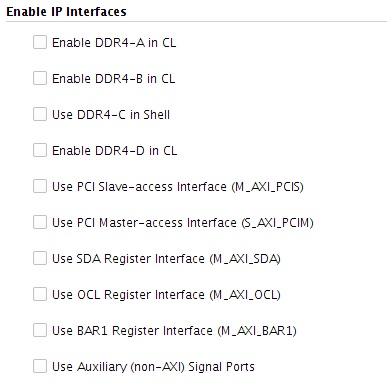
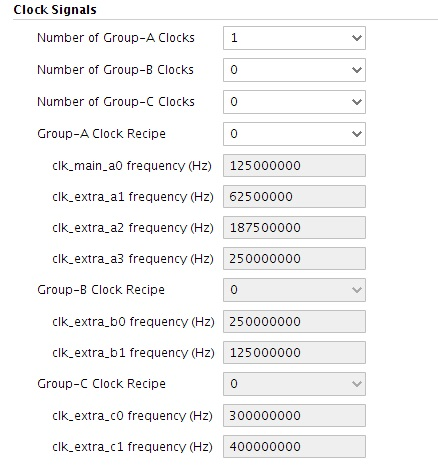

# AWS FPGA IP for IP Integrator Overview

## Table of Content

1. [AWS IP Overview](#ipover)

# AWS FPGA IP Overview

To configure the AWS IP, double click on the AWS IP in the Block Diagram (BD) after the IP Integrator Block Diagram is created.  This is discussed in the [Vivado HLx AWS Tutorials and Examples](./IPI_GUI_Examples.md).

When the Re-customize IP GUI appears, four categories appear for IP configuration.

## Enable IP Interfaces

Select the Box to enable an interface.  When enabling interfaces the block diagram on the left will be updated based upon interfaces/ports/clocks.

See [AWS Shell Interface Specification](./AWS_Shell_Interface_Specification.md) on information about AXI Interfaces and ports.

Enable DDR4-A in CL

Enable DDR4-B in CL

Use DDR4-C in Shell

Enable DDR4-D in CL

Use PCI Slave-access Interface (M\_AXI\_PCIS)

Use PCI Master-access Interface (S\_AXI\_PCIM)

Use SDA Register Interface (M\_AXI\_SDA)

Use OCL Register Interface (M\_AXI\_OCL)

Use BAR1 Register Interface (M\_AXI\_BAR1)

Use Auxiliary (non-AXI) Signal Ports - (VLED,IRQ,VDIP,GLCOUNT,FLR ports)

## Clock Signals

Review the clock recipes listed in [clock_recipes.csv](./clock_recipes.csv) to configure clocks based upon the design.
 
Select the number of clocks(highest extra clock number needed) used based upon clock recipe for Group-A, Group-B, Group-C.

Note if needing _a3 clock, this value would be set to 4 for Group-A

Configure the Clock Recipe for Group-A, Group-B, Group-C.

Note Group-A Clock Recipe of 0 would be A0 based upon the clock_recipes.csv

Values of generated clocks are seen in the GUI.

## CL Partition ID

The Vendor ID, Device ID, Subsystem Vendor ID, Subsystem ID can be configured.

For now these default values match typically AWS examples and shouldn't be modified at this time.

Shell Version is a read only value that matches the version supported by the AWS IP.

## Advanced
Number of pipeline stages - Range is between 1-4 pipeline stages for the stats interface for DDR4 in the CL. Number of pipelines depends on the size/complexity of the design.
