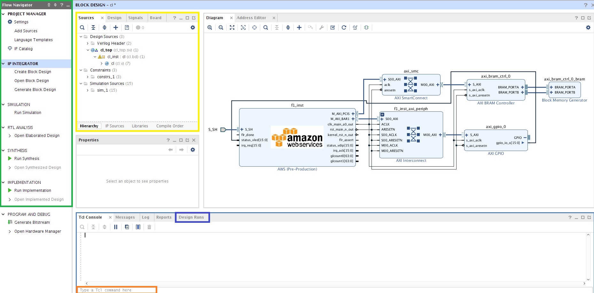
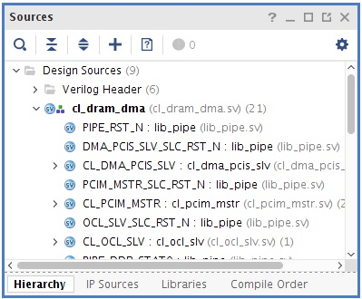
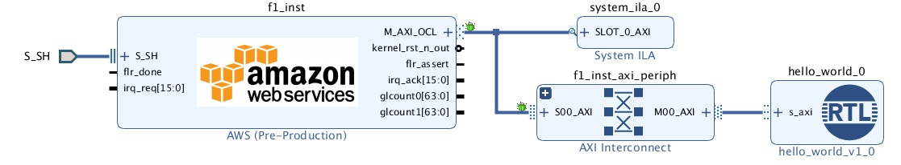
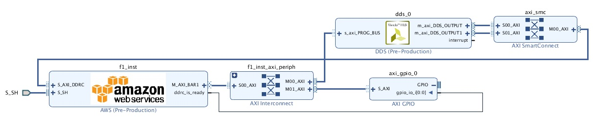

# IP Integrator Setup

## Table of Content

1. [Overview](#overview)
2. [Linux Install](#hlxinst_lin)
3. [Windows Install](#hlxinst_win)
4. [Vivado Overview](#vivado) 
5. [Vivado Flows Overview](#projover)
6. [Summary](#summary)

# Overview  

This document assumes you have cloned the developer kit and sourced the hdk setup.  However, the Windows instructions below do cover how to clone the developer kit and source scripts for hdk setup.  It is highly recommended that you get familar with the F1 FPGA development by building/running the [customer examples](../cl/examples/README.md) prior to using the Vivado GUI or IP Integrator. 

Once you are familar with building an example AFI and running on F1, the [IP Integrator Tutorials and Examples](./IPI_GUI_Examples.md) documentation will help you get started on example designs, new designs, and additional tutorials.

# Linux Install

Open the following file in a text editor ~/.Xilinx/Vivado/init.tcl or ~/.Xilinx/Vivado/Vivado_init.tcl

If either of these files do not exist, change directories into ~/.Xilinx/Vivado and use the following command to create the file.

touch Vivado_init.tcl

Get the absolute path of the $HDK\_SHELL\_DIR with the following command.

echo $HDK\_SHELL\_DIR

If your $HDK\_SHELL\_DIR is empty or does not list <path>/$HDK\_SHELL\_DIR/<shell dir>, then you may need to source the [hdk_setup](../README.md).

In init.tcl or Vivado\_init.tcl, add the following line based upon the $HDK\_SHELL\_DIR path.

source <output from echo $HDK\_SHELL\_DIR>/hlx/hlx_setup.tcl

Everytime Vivado is loaded, this script will always be sourced and IP integrator features will be automatically loaded. Remove this line if you no longer wish to use HLx Flow. 

# Windows Install

Download, install, and configure the license for Vivado SDx 2017.1 or Vivado 2017.4 for Windows.  More information is provided at:

[On Premise Licensing Help](./on_premise_licensing_help.md)

Clone the `https://github.com/aws/aws-fpga` repository either through Github Desktop or Download ZIP and extract to a new folder location on the Windows machine.  This is the install location.

Launch Vivado and determine the path where vivado\_init.tcl or init.tcl is sourced which is found as a INFO message at the top of the Tcl Console.

Open vivado\_init.tcl or init.tcl in a text editor and add the following lines at the top of the file.  Note aws-fpga could have a slightly different name like aws-fpga-master.

`set AWSINSTALL "C:/<replace with install location>/aws-fpga"`

`source $AWSINSTALL/hdk/common/shell_v071417d3/hlx/hlx_setup.tcl`

Copy these lines into the TCL console to ensure paths are correct.

An error message will occur either in the TCL console or in a tab about DDR4 models.  Source the following command which only needs to be run once after cloning the github repository.  Note aws-fpga could have a slightly different name like aws-fpga-master.

`source C:/<replace with install location>/aws-fpga/hdk/common/verif/scripts/hdk_initsh.tcl`

Before installing the DDR4 models, another critical warning appeared dealing with the SH\_CL\_BB\_routed.dcp.  Download the DCP into the following install location from a web browser.  Note aws-fpga could have a slightly different name like aws-fpga-master.

`https://s3.amazonaws.com/aws-fpga-hdk-resources/hdk/shell_v071417d3/build/checkpoints/from_aws/SH_CL_BB_routed.dcp`

`C:/<replace with install location>/aws-fpga/hdk/common/shell_v071417d3/build/checkpoints/from_aws/`

Download the following executable from a web browser to the following HLx directory.  Note aws-fpga could have a slightly different name like aws-fpga-master.

`http://www.labtestproject.com/files/sha256sum/sha256sum.exe`

`C:/<replace with install location>/aws-fpga/hdk/common/shell_v071417d3/hlx/build/scripts`

Close Vivado and launch Vivado, the HLx environment is now setup and will always be sourced and IP integrator features will be automatically loaded.

Amazon CLI for Windows can be used for access to S3 to upload .tar and ingestion flow.

# Vivado Overview

This section is a basic overview of the Vivado GUI.  The GUI environment enables developers at all experience levels to quickly set project options and strategies to meet their design requirements,  enables interactive reports and design views to help quickly close any issues with timing or area.   

IP Integrator is a design entry tool in the Vivado HLx Design Suite.  It lets developers connect IPs at a block level and generates a "what you see is what you get" Register Transfer Language (RTL) file, either in VHDL or Verilog format.  The IP Integrator flow enhances the standard RTL flow and gives the developer access to designer assistance features which include:

- Simplified connectivity of IPs through interface based connections

- Block automation that adds helper IPs like Interconnects, DMAs, or other support blocks based upon an IP’s configuration

- Connectivity automation to route interfaces, clocks and resets between blocks

- Design Rule Checks (DRCs) to ensure proper interface connectivity and clock domain crossing

- Advanced hardware debug capabilities that enable the developer to debug at a transaction level

For more detailed information and methodology design guidelines refer to the following documentation:

- <a href="https://www.xilinx.com/support/documentation/sw_manuals/xilinx2017_2/ug892-vivado-design-flows-overview.pdf">ug892-vivado-design-flows-overview.pdf</a>
- <a href="https://www.xilinx.com/support/documentation/sw_manuals/xilinx2017_2/ug994-vivado-ip-subsystems.pdf">ug994-vivado-ip-subsystems.pdf</a>
- <a href="https://www.xilinx.com/support/documentation/sw_manuals/xilinx2017_2/ug949-vivado-design-methodology.pdf">ug949-vivado-design-methodology.pdf</a>

To open the GUI, run command `vivado`.  Once Vivado is loaded, you can create an empty project, by selecting Create New Project and advancing through the menus until you see a blank canvas.  The sections below will describe the tabs/menus and refer to the screenshot below.  Feel free to interact with the tabs and menus using your blank project.    

## Sources Tab

The box in yellow contains the design sources.

### Sources:Hierarchy Tab

Sources are divided into three different categories.

1. Design Sources folder is for synthesis/implementation sources
2. Constraints folder is for timing constraints (XDC)
3. Simulation Sources folder is for simulation only sources

Clicking on a particular file will provide information in the Properties tab (under Sources).  In properties tab, the developer can change how the file is used in the design flow.

For RTL/IP sources can be marked for synthesis/implementation/simulation or synthesis/implementation and/or simulation only.  XDCs can be marked for synthesis/implementation or synthesis only or implementation only.

The FPGA Developer AMI includes a test example.  To explore the source file properties further as described, add /home/centos/src/test/counter/Sources/hdl/counter.v by selecting clicking on the plus (+) and add design sources.

### Sources:IP Sources

When IP has been created in your project, the "IP Sources" tab will be visable.  This tab will contain imported  IP sources and expanding the IP/Instantiation Template, developers can add the IP into the RTL.  Synthesis options on the IP should be global only.

## Flow Navigator

The Flow Navigator is in the green box and can be used to launch predefined design flow steps, such as synthesis and implementation.

### PROJECT MANAGER

PROJECT MANAGER section allows to Add Sources like RTL/IP/XDC sources, Language Templates for common RTL constructs/XDCs/DEBUG, and IP Catalog to add IPs to the project.  This portion of the flow targets the RTL flow.

When invoking IP Catalog, the developers can search for a particular IP or look through the different categories of IP and it’s the responsibility of the developer to add and connect the IP into the developer's RTL.  

### IP INTEGRATOR

This section allows the developer to open and modify the Block Design and the Generate Block Design after the design is validated.  The framework of the Block Design with the AWS IP and board are already created with the HLx flow so Create Block Design isn’t necessary.

Double clicking on any IP in the BD brings up the Re-customize IP Dialog Box where IP settings can be reviewed or modified.  When connecting designs, Connection Automation is available to automatically connect interfaces.

### SIMULATION

This section allows the developer to change simulation settings by right clicking on SIMULATION and invoking simulations by clicking Run Simulation->Run Behavioral Simulation. 

### RTL ANALYSIS

By clicking on Open Elaborate Design, the RTL files in the design are analyzed where the develop can check RTL structures and syntax before the synthesis stage.

### SYNTHESIS

By right clicking on SYNTHESIS, the develop is able to view Synthesis Settings and Launch Synthesis.  After synthesis stage is complete, clicking on Open Synthesized Design will open the post synthesis checkpoint for analysis.  This stage is necessary for developing timing constraints for the CL.

### IMPLEMENTATION

By right clicking on IMPLEMENTATION, the developer is able to view Implementation Settings and Launch Implementation.  After implementation stage is complete, clicking on Open Implementation Design will open the post implementation checkpoint for analysis of the SH/CL.

## TCL Commands

The orange box is where TCL commands are entered.  The TCL Console Tab above the orange box reports the output of the TCL command.

## Design Runs Tab

The blue box is where the Design Runs are located with similar functionality as the Flow Navigator/SYNTHESIS and Flow Navigator/IMPLEMENTATION sections. The examples and tutorials mention how to use synth\_1 and impl\_1 to build the design.

# Vivado Flows Overview

The Vivado HLx environment supports IP Integrator, RTL, HLS flows in Vivado and this section will discuss these
flows from a top level. 

## RTL

Developers can add in existing AWS RTL from examples, new AWS template CL files from the AWS RTL flow and custom generated Verilog/System Verilog/VHDL files.

For using IPs, at this time global mode is only supported and Out of context (OOC) is not supported at this time.

## IP Integrator

Developers can add in Vivado IP into the block diagram to create/stitch a full design easily. RTL module referencing flow using developer RTL can be used to add custom IP to the block diagram.

## HLS

Developers can add developed/generated HLS IPs in either RTL/IP Integrator flows using an IP Repository.

## General Environment

### Design Constraints in Project

Timing analysis and setting timing constraints/floorplans is discussed in the timing closure documentation.

The following top level clocks from the Shell (MMCM in the Shell to the CL) are generated dynamically based upon clock recipe’s used with the AWS flow.
The developer can’t modify these constraints as they are dynamically created before synthesis.

cl\_clocks\_aws.xdc – Top level clock constraints for the CL.

The following .xdc file is only available with the RTL flow provided by the AWS env for synthesis.  This file should be disabled in the vivado project
if DDR4 memories are not in the CL design(critical warnings could show up).

cl\_synth\_aws.xdc - Timing constraints between sh_ddr module and DDR4 IP.

The following .xdc files are available to the developer.

cl\_synth\_user.xdc – Timing constraints in the CL(I.E creating new clock structures with clock generator/using clocks in different Shell MMCM).

cl\_pnr\_user.xdc – Timing constraints between the CL/SH.  Floorplanning is done in this xdc if necessary.

### Synthesis/Implementation

Timing analysis and setting appropriate synthesis settings/implementation directives are discussed in the timing closure documentation.

By default, synthesis is using Default directive and -max\_uram\_cascade\_height is set to 1. The developer can set max\_uram\_cascade\_height in the More Options section of Design Run Settings Tab by right clicking on Synth\_1->Open Run.

By default, all implementation steps are using the Explore directive.

If needing to change implementation settings, only change the tool directives in the Design Run Settings tab by right clicking on Impl_1->Change Run Settings… .
Change only directives for opt_design ,place_design, phys_opt_design, and route_design.  Do not change Strategy options as this overrides certain options in the HLx environment at this time.

Refer to [IPI Tutorials and Examples](./IPI_GUI_Examples.md) to get started.

# Summary  

Now that you are familar with building an [customer examples](../cl/examples/README.md) on F1 (AFI) and running on F1 using the CLI/TCL method; this guide has helped you setup Vivado for IP Integrator, please move to the [IP Integrator Tutorials and Examples](./IPI_GUI_Examples.md).  This documentation will help you get started on example designs, new designs, and additional tutorials.

