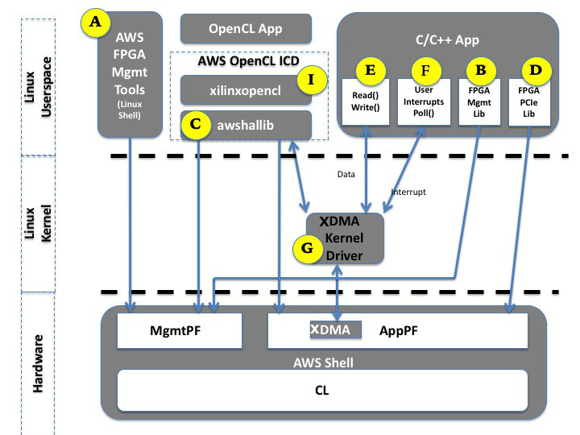

# AWS FPGA: Programmer's View for the Custom Logic

This document describes how an actual application running in Linux userspace would interface with the Custom Logic during runtime.

There are two parts required to work with AWS FPGA: Management and Runtime, and the next figure provides high level view of these components and how they relate to the underlying FPGA hardware.

1. **Management Interface**: Required for loading/clearing an AFI, checking the status of an AFI, debug of the AFI, Emulated LEDs and Emulated DipSwitches. The management interface is provided in one of three options, one or more can be used concurrently:

  **\[A\]** As linux shell commands called [FPGA Management Tools](../../sdk/management/fpga_image_tools/README.md).
  
  **\[B\]** As a C-library called [FPGA Management Lib](../../sdk/management/lib/) to be compiled with the developer's C/C++ application.
  
  **\[C\]** Pre-integrated with [OpenCL runtime library](../../sdk/SDAccel)
  
2. **Runtime code**: For reading/writing from/to the CustomLogic, handling interrupts, using the DMA, etc..  This is provided in few ways:
  
  **\[D\]** As a C-library called [FPGA PCIe Utils](../../sdk/runtime/lib/) for access the FPGA memory space behind the AppPF PCIe BARs. This library can be compiled and linked with the developer's C/C++ application.
  
  **\[E\]** A [DMA Interface](../../sdk/linux_kernel_drivers/edma/edma_README.md) using standard POSIX API like open()/read()/write() to be used in any C/C++ application. This DMA interface requires installing the [AWS EDMA kernel driver](../../sdk/linux_kernel_drivers/edma/edma_install.md) - marked as item **\[G\]**.
  
  **\[F\]** A [Userspace Interrupt/Event notification](../../sdk/linux_kernel_drivers/edma/user_defined_interrupts_README.md) using standard POSIX API like open() and Poll(), to be used in any C/C++ application. This Interrupt/Event interface requires installing the [AWS EDMA kernel driver](../../sdk/linux_kernel_drivers/edma/edma_install.md) - marked as item **\[G\]**.
  
  **\[I\]** An [openCL ICD](https://wikipedia.org/wiki/OpenCL#Implementations) library that links with openCL runtime application, like the one generated by Xilinx' SDAccel. This
  

