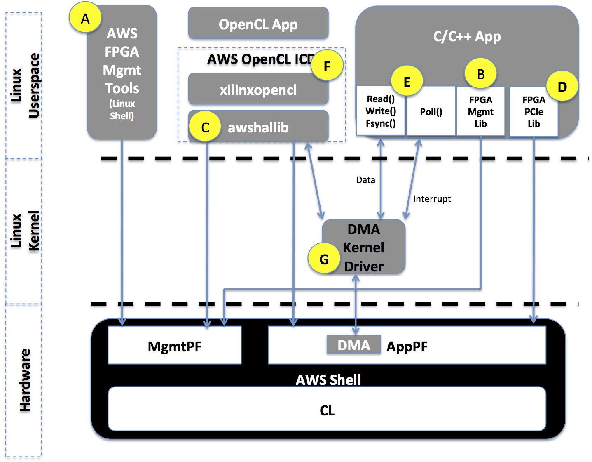

# Programmer view for AWS FPGA and the Custom Logic

This document describes how an actual application running in Linux userspace would interface with the Custom Logic during runtime.

There are two parts required to work with AWS FPGA: Management and Runtime, and the next figure provides high level view of these components and how they relate to the underlying FPGA hardware.

1. **Management Interface**: Required for loading/clearing an AFI, checking the status of an AFI, debug of the AFI, Emulated LEDs and Emulated DipSwitches. The management interface is provided in one of three options, both can be used concurrently:

  **\[A\]** As linux shell commands called [FPGA Management Tools](../../sdk/management/fpga_image_tools/README.md).
  
  **\[B\]** As a C-library called [FPGA Management Lib](../../sdk/management/lib/) to be compiled with the developer's C/C++ application.
  
  **\[C\]** Pre-integrated with [OpenCL runtime library](../../sdk/SDAccel)
  
2. **Runtime code**: For read/writing from the CustomLogic, handling interrupts, using the DMA, etc..  This is provided in few ways:
  
  **\[D\]** As a C-library called [FPGA PCIe Utils](../../sdk/runtime/lib/) for access the FPGA memory space behind the AppPF PCIe BARs. This library can compiled and linked with the developer's C/C++ application.
  
  **\[E\]** As standard POSIX API to be used in C/C++ library for DMA and user-defined interrupts, potentially requiring installation of [AWS EDMA kernel driver](../../sdk/linux_kernel_drivers/edma/edma_README.md) - marked as item **\[G\]**.
  
  **\[F\]** An [openCL ICD](https://wikipedia.org/wiki/OpenCL#Implementations) library than links with openCL runtime application, like the one generated by Xilinx SDAccel.
  
  

# 2.1: C/C++ Runtime software for AWS FPGA 

## Software access the CL
mmap() etc

## Userspace interrupts

The [User-defined interrupt guide](../../sdk/linux_kernel_drivers/edma/user_defined_interrupts_README.md) covers how to use the interrupts from user-space and all aspects of initialization, tear-down and concurrency.

Userspace interrupts do require [`edma` kernel driver](../../sdk/linux_kernel_drivers/edma/edma_install.md) to be installed.

## Using DMA

The [AWS FPGA DMA guide](../../sdk/linux_kernel_drivers/edma/edma_README.md) covers how to use the DMA from developers' user-space process and all aspects of initialization, tear-down and concurrency.

AWS FPGA DMA do require do require [`edma` kernel driver](../../sdk/linux_kernel_drivers/edma/edma_install.md) to be installed.

# 2.2: OpenCL Runtime software for AWS FPGA 
