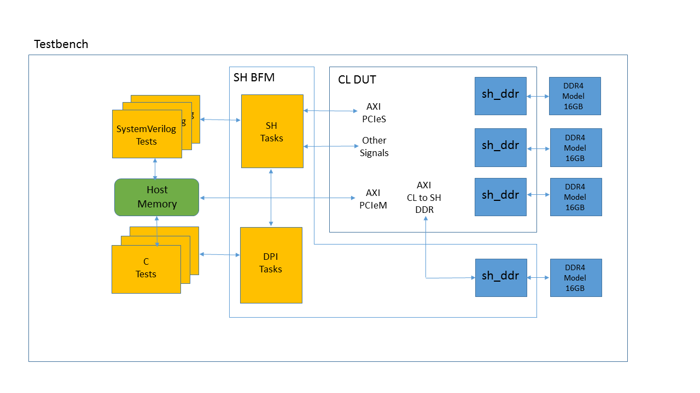
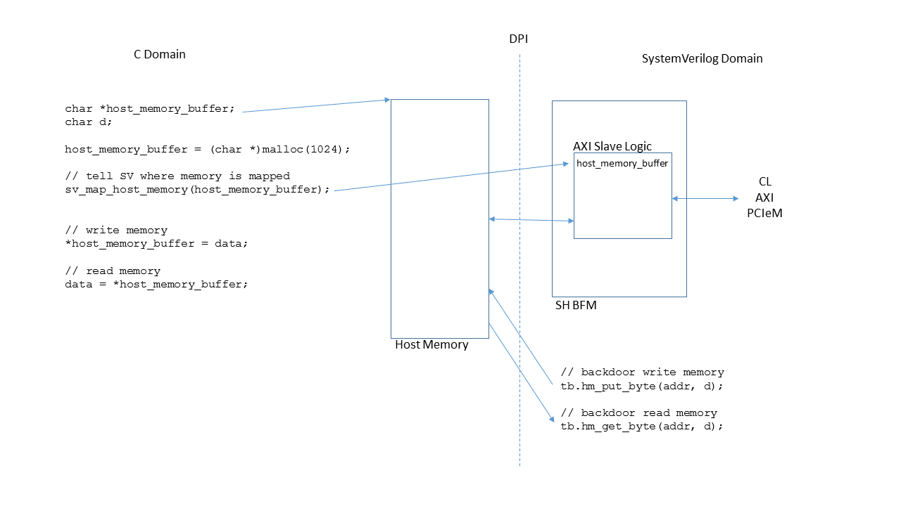

# RTL Simulation for Verilog/VHDL Custom Logic Design with AWS HDK

# Introduction

Developers' ten to simulate their designs to validate the RTL design and functionality, before hitting the build stage and registering it with AWS EC2 as Amazon FPGA Image (AFI). AWS FPGA HDK supports RTL-level simulation using Xilinx' Vivado XSIM,  MentorGraphics' Questa, and Synopsys' VCS RTL simulators. Developers can write their tests in SystemVerilog and/or C languages. If a developer choose to use the supplied C framework, he/she can use the same C code for simulation and for runtime on your FPGA-enabled instance like F1.



# Quick Start

### Have an EC2 instance or other server with Xilinx Vivado tools and an active license.

One easy way is to have a pre-installed environment is to use the [AWS FPGA Developer AMI available on AWS Marketplace](https://aws.amazon.com/marketplace/pp/B06VVYBLZZ) which comes with pre-installed Vivado tools and license.

For developers who like to work on-premises or different AMI in the cloud, AWS recommend to follow the [required license for on-premise document](./on_premise_licensing_help.md).

Please refer to the [release notes](../../RELEASE_NOTES.md) or the [supported Vivado version](../supported_vivado_versions.txt) for the exact version of Vivado tools, and the required license components.

### Install the HDK and setup environment

AWS FPGA HDK can be cloned and installed on your EC2 instance or server by calling:

```
    $ git clone https://github.com/aws/aws-fpga
    $ cd aws-fpga
    $ source hdk_setup.sh
```

### Try out one of HDK examples or write your own

```
    $ cd cl/examples/cl_hello_world/verif/scripts    # simulations are launched from the scripts subdir of the design
    $ make                                       # run the default test using the Vivado XSIM
         Running compilation flow
         Done compilation
         ...
         Vivado Simulator 2016.4_sdx
         Time resolution is 1 ps
         ...
         $finish called
    $ cd ../sim                                  # to view the test log files
```

# Writing and Running Your Own Tests for RTL simulation

## SystemVerilog Tests

One fast way to write your own test is to start with an example test from one of the examples designs and customize it for your design. All SV tests must be placed in the verif/tests sub-directory of CL design root and use the ".sv" file extension.

```
    cl_my_design                 # Custom Logic (CL) design root directory
    |-- build
    |-- design
    |-- software
    |   |--runtime
    |       `-- src                  # C source files and header files for simulation
    `-- verif
        |-- scripts              # Makefiles and filelists
        |-- sim                  # sim results directory
        |-- sv                   # additional CL-specific test bench source
        `-- tests                # test directory
```

**NOTE: All the tests are written to run on 64-bit instances/servers and 64-bit linux, Many of the test and reference Custom Logic (CL) examples use 64-bit address formats**

```
module test_peek_poke();

`define WR_INSTR_INDEX 64'h1c
`define WR_ADDR_LOW    64'h20
`define WR_ADDR_HIGH   64'h24
`define WR_DATA        64'h28
`define WR_SIZE        64'h2c

`define RD_INSTR_INDEX 64'h3c
`define RD_ADDR_LOW    64'h40
`define RD_ADDR_HIGH   64'h44
`define RD_DATA        64'h48
`define RD_SIZE        64'h4c

`define CNTL_REG       64'h08

`define WR_START_BIT   32'h00000001
`define RD_START_BIT   32'h00000002
   
   logic [63:0] pcim_address = 64'h0000_0000_1234_0000;
   
   initial begin

      tb.sh.power_up();

      tb.poke_ocl(`WR_INSTR_INDEX, 0);                   // write index
      tb.poke_ocl(`WR_ADDR_LOW, pcim_address[31:0]);     // write address low
      tb.poke_ocl(`WR_ADDR_HIGH, pcim_address[63:32]);   // write address high
      tb.poke_ocl(`WR_DATA, 32'h0000_0000);              // write data
      tb.poke_ocl(`WR_SIZE, 32'h0000_0002);              // write 32b

      tb.poke_ocl(`RD_INSTR_INDEX, 0);                   // read index
      tb.poke_ocl(`RD_ADDR_LOW, pcim_address[31:0]);     // read address low
      tb.poke_ocl(`RD_ADDR_HIGH, pcim_address[63:32]);   // read address high
      tb.poke_ocl(`RD_DATA, 32'h0000_0000);              // read data
      tb.poke_ocl(`RD_SIZE, 32'h0000_0002);              // read 32b

      tb.poke_ocl(`CNTL_REG, 32'h0003);                  // start read & write

      #500ns;   // give the hardware time to run
         
      ...
           
      tb.power_down();
      
      $finish;
   end

endmodule // test_peek_poke
```

Once your test is written, you are ready to run a simulation. The *scripts/* directory is where you must launch all simulations.

    $ cd verif/scripts
    $ make TEST={your_test_name} # compile and run using XSIM (NOTE: Do Not include .sv)
    $ cd ../sim/{your_test_name} # to view the test log files

If your have Mentor Graphics' Questa simulator, then add "SIMULATOR=questa".

    $ make TEST={your_test_name} QUESTA=1  # compile and run using Questa

```
========================================  NOTE ============================================
Use only the SV test APIs supplied with the developer's kit to stimulate your CL 
design. They were designed specifically to mimic the behavior of the actual AWS Shell logic.
If you choose to control CL signalling via another method, proper operation with Shell
logic is not guaranteed.

The AWS Shell Interface specification can be found [here](https://github.com/aws/aws-fpga/hdk/docs/AWS_Shell_Interface_Specification.md)
============================================================================================
```

## C Tests

As with the SystemVerilog (SV) testing, one fast way to write your own test is to start with an example test from one of the examples designs and customize it for your design. All C tests must be placed in the software/runtime sub-directory of CL design root and use the ".c" file extension. HW/SW simulation support is added to simulate the software tests. SV_TEST should be used for any simulation specific code in the software test. SCOPE macro is specific to VCS simulator. Below are the 'C' header and source files for cl_hello_world example.


```
test_hello_world.h

#ifndef TEST_HELLO_WORLD_H
#define TEST_HELLO_WORLD_H

#include <stdio.h>
#include <stdint.h>
#include <stdbool.h>
#include <stdarg.h>

#ifdef SV_TEST
   #ifndef VIVADO_SIM
      #include "svdpi.h"
   #endif
   #include "fpga_pci_sv.h"
#else
   #include <fpga_pci.h>
   #include <fpga_mgmt.h>
   #include <utils/lcd.h>
#endif

#ifndef SV_TEST
   extern void sv_printf(char *msg);
   extern void sv_map_host_memory(uint8_t *memory);
   extern void sv_pause(uint32_t x);
#endif

void log_printf(const char *format, ...) 
{                                        
  static char sv_msg_buffer[256];        
  va_list args;                          

  va_start(args, format);                
  vsprintf(sv_msg_buffer, format, args); 
#ifdef SV_TEST
  sv_printf(sv_msg_buffer);                
#else
  printf(sv_msg_buffer); 
#endif

  va_end(args);                          
}

#define LOW_32b(a)  ((uint32_t)((uint64_t)(a) & 0xffffffff))
#define HIGH_32b(a) ((uint32_t)(((uint64_t)(a)) >> 32L))

#endif
```

```
test_hello_world.c

#include "test_hello_world.h"
/* Constants determined by the CL */
/* a set of register offsets; this CL has only one */
/* these register addresses should match the addresses in */
/* /aws-fpga/hdk/cl/examples/common/cl_common_defines.vh */
/* SV_TEST macro should be set if SW/HW co-simulation should be enabled */

#define HELLO_WORLD_REG_ADDR UINT64_C(0x500)
#define VLED_REG_ADDR	UINT64_C(0x504)

/* use the stdout logger for printing debug information  */
#ifndef SV_TEST
const struct logger *logger = &logger_stdout;
/*
 * pci_vendor_id and pci_device_id values below are Amazon's and avaliable to use for a given FPGA slot. 
 * Users may replace these with their own if allocated to them by PCI SIG
 */
static uint16_t pci_vendor_id = 0x1D0F; /* Amazon PCI Vendor ID */
static uint16_t pci_device_id = 0xF000; /* PCI Device ID preassigned by Amazon for F1 applications */

/*
 * check if the corresponding AFI for hello_world is loaded
 */
#endif

//The MAIN will be different between Simulation and software, so a macro is defined. The macro definition can be found in the header file.
#ifdef SV_TEST
void test_main(uint32_t *exit_code) {
#else
int main(int argc, char **argv) {  
#endif
    //The statements within SCOPE ifdef below are needed for HW/SW co-simulation with VCS
    #ifdef SCOPE
      svScope scope;
      scope = svGetScopeFromName("tb");
      svSetScope(scope);
    #endif 

    int rc;
    int slot_id;

    /* initialize the fpga_pci library so we could have access to FPGA PCIe from this applications */
    rc = fpga_pci_init();
    fail_on(rc, out, "Unable to initialize the fpga_pci library");

    /* This demo works with single FPGA slot, we pick slot #0 as it works for both f1.2xl and f1.16xl */

    slot_id = 0;

#ifndef SV_TEST 
    rc = check_afi_ready(slot_id);
#endif

    fail_on(rc, out, "AFI not ready");
    
    /* Accessing the CL registers via AppPF BAR0, which maps to sh_cl_ocl_ AXI-Lite bus between AWS FPGA Shell and the CL*/

    log_printf("===== Starting with peek_poke_example =====\n");
    rc = peek_poke_example(slot_id, FPGA_APP_PF, APP_PF_BAR0);
    fail_on(rc, out, "peek-poke example failed");


    log_printf("Developers are encourged to modify the Virtual DIP Switch by calling the linux shell command to demonstrate how AWS FPGA Virtual DIP switches can be used to change a CustomLogic functionality:\n");
    log_printf("$ fpga-set-virtual-dip-switch -S (slot-id) -D (16 digit setting)\n\n");
    log_printf("In this example, setting a virtual DIP switch to zero clears the corresponding LED, even if the peek-poke example would set it to 1.\nFor instance:\n");
     
    log_printf(
        "# fpga-set-virtual-dip-switch -S 0 -D 1111111111111111\n"
        "# fpga-get-virtual-led  -S 0\n"
        "FPGA slot id 0 have the following Virtual LED:\n"
        "1010-1101-1101-1110\n"
        "# fpga-set-virtual-dip-switch -S 0 -D 0000000000000000\n"
        "# fpga-get-virtual-led  -S 0\n"
        "FPGA slot id 0 have the following Virtual LED:\n"
        "0000-0000-0000-0000\n"
    );

#ifndef SV_TEST  
    return rc;
   
out:
    return 1;
#else

out:
   *exit_code = 0;
#endif
}

/* As HW simulation test is not run on a AFI, the below function is not valid */
#ifndef SV_TEST

int check_afi_ready(int slot_id) {
    struct fpga_mgmt_image_info info = {0}; 
    int rc;

    /* get local image description, contains status, vendor id, and device id. */
    rc = fpga_mgmt_describe_local_image(slot_id, &info,0);
    fail_on(rc, out, "Unable to get AFI information from slot %d. Are you running as root?",slot_id);

    /* check to see if the slot is ready */
    if (info.status != FPGA_STATUS_LOADED) {
        rc = 1;
        fail_on(rc, out, "AFI in Slot %d is not in READY state !", slot_id);
    }

    printf("AFI PCI  Vendor ID: 0x%x, Device ID 0x%x\n",
        info.spec.map[FPGA_APP_PF].vendor_id,
        info.spec.map[FPGA_APP_PF].device_id);

    /* confirm that the AFI that we expect is in fact loaded */
    if (info.spec.map[FPGA_APP_PF].vendor_id != pci_vendor_id ||
        info.spec.map[FPGA_APP_PF].device_id != pci_device_id) {
        printf("AFI does not show expected PCI vendor id and device ID. If the AFI "
               "was just loaded, it might need a rescan. Rescanning now.\n");

        rc = fpga_pci_rescan_slot_app_pfs(slot_id);
        fail_on(rc, out, "Unable to update PF for slot %d",slot_id);
        /* get local image description, contains status, vendor id, and device id. */
        rc = fpga_mgmt_describe_local_image(slot_id, &info,0);
        fail_on(rc, out, "Unable to get AFI information from slot %d",slot_id);

        printf("AFI PCI  Vendor ID: 0x%x, Device ID 0x%x\n",
            info.spec.map[FPGA_APP_PF].vendor_id,
            info.spec.map[FPGA_APP_PF].device_id);

        /* confirm that the AFI that we expect is in fact loaded after rescan */
        if (info.spec.map[FPGA_APP_PF].vendor_id != pci_vendor_id ||
             info.spec.map[FPGA_APP_PF].device_id != pci_device_id) {
            rc = 1;
            fail_on(rc, out, "The PCI vendor id and device of the loaded AFI are not "
                             "the expected values.");
        }
    }
    
    return rc;

out:
    return 1;
}

#endif

/*
 * An example to attach to an arbitrary slot, pf, and bar with register access.
 */
int peek_poke_example(int slot_id, int pf_id, int bar_id) {
    int rc;
    /* pci_bar_handle_t is a handler for an address space exposed by one PCI BAR on one of the PCI PFs of the FPGA */

    pci_bar_handle_t pci_bar_handle = PCI_BAR_HANDLE_INIT;

    
    /* attach to the fpga, with a pci_bar_handle out param
     * To attach to multiple slots or BARs, call this function multiple times,
     * saving the pci_bar_handle to specify which address space to interact with in
     * other API calls.
     * This function accepts the slot_id, physical function, and bar number
     */
    rc = fpga_pci_attach(slot_id, pf_id, bar_id, 0, &pci_bar_handle);
    fail_on(rc, out, "Unable to attach to the AFI on slot id %d", slot_id);
    
    /* write a value into the mapped address space */
    uint32_t value = 0xefbeadde;
    uint32_t expected = 0xdeadbeef;
    rc = fpga_pci_poke(pci_bar_handle, HELLO_WORLD_REG_ADDR, value);

    fail_on(rc, out, "Unable to write to the fpga !");

    /* read it back and print it out; you should expect the byte order to be
     * reversed (That's what this CL does) */
    rc = fpga_pci_peek(pci_bar_handle, HELLO_WORLD_REG_ADDR, &value);
    fail_on(rc, out, "Unable to read read from the fpga !");
    log_printf("=====  Entering peek_poke_example =====\n");
    log_printf("register: 0x%x\n", value);
    if(value == expected) {
        log_printf("Resulting value matched expected value 0x%x. It worked!\n", expected);
    }
    else{
        log_printf("Resulting value did not match expected value 0x%x. Something didn't work.\n", expected);
    }
out:
    /* clean up */
    if (pci_bar_handle >= 0) {
        rc = fpga_pci_detach(pci_bar_handle);
        if (rc) {
            log_printf("Failure while detaching from the fpga.\n");
        }
    }

    /* if there is an error code, exit with status 1 */
    return (rc != 0 ? 1 : 0);
}

```

Once your test is written, you are ready to run a simulation. The *scripts/* directory is where you must launch all simulations.

    $ cd verif/scripts
    $ make C_TEST={your_test_name} # compile and run using XSIM (NOTE: Do Not include .c)
    $ cd ../sim/{your_test_name} # to view the test log files
    
    $ cd verif/scripts
    $ make C_TEST={your_test_name} VCS=1 # compile and run using VCS (NOTE: Do Not include .c)
    $ cd ../sim/{your_test_name} # to view the test log files

## Accessing Host Memory During Simulation
Your design may share data between host memory and logic within the CL. To verify your CL is accessing host memory, the test bench includes two types of host memory: SV and C domain host memory. If you are are only using SV to verify your CL, then use SV domain host memory. An associative array represents host memory, where the address is the key to locate a 32-bit data value.

```
   logic [31:0]        sv_host_memory[*];
```

If you are are using C to verify your CL, then use C domain host memory. Allocate a memory buffer in your C code and pass the pointer to the SV domain. The AXI BFM connected to the PCIeM port will use DPI calls to read and write the memory buffer.




Backdoor access to host memory is provided by two functions:

```
   function void hm_put_byte(input longint unsigned addr, byte d);
   function byte hm_get_byte(input longint unsigned addr);
```
Use these functions when you need to access data in either SV or C domain host memory. They take zero simulation time and are useful for initializing memory or checking results stored in memory. 


# Debugging Custom Logic using the AWS HDK

If a simulation fails, developers can debug issues by dumping waves of the simulation and then view them to determine the source of the problem.

The process for dumping and viewing waves can differ depending on the simulator being used.  To dump and view waves using the Xilinx Vivado tools included with the AWS HDK:

1. Specify scope of logic for wave dump
2. Re-run simulation to dump waves
3. View waves in Vivado using .tcl 

## Specify scope of logic for wave dump

The file `$AWS_FPGA_REPO_DIR/hdk/cl/examples/cl_dram_dma/verif/scripts/waves.tcl` specifies the scope of logic for wave dump.  The default behavior is to dump only the signals at the very top of the design:

```
    add_wave /
```

To recursively dump waves of all signal underneath the top level of the design, add `-recursive`:

```
    add_wave -recursive /
```

Note that dumping all signals of a design will increase simulation time and will result in a large file.

For more information on the syntax for `add_wave` and other tcl functions, see the [Vivado Design Suite Tcl Command Reference Guide](https://www.xilinx.com/support/documentation/sw_manuals/xilinx2013_1/ug835-vivado-tcl-commands.pdf)

## Protocol Checkers

Xilinx Protocol Checkers are instantiated on all AXI4 and AXIL interfaces in Shell BFM. By default all the tests run with protocol checkers enabled. If there is a protocol error in any one of the AXI interfaces, then the protocol checker will fire an error as below.

tb.card.fpga.sh.axl_pc_bar1_slv_inst.REP : BIT(         56) :   ERROR : Invalid state x
tb.card.fpga.sh.axl_pc_sda_slv_inst.REP : BIT(         35) :   ERROR : Invalid state x
tb.card.fpga.sh.axi_pc_mstr_inst_pcim.REP : BIT(         33) :   ERROR : Invalid state x
tb.card.fpga.sh.axi_pc_mstr_inst_pcis.REP : BIT(         35) :   ERROR : Invalid state x
tb.card.fpga.sh.axl_pc_ocl_slv_inst.REP : BIT(         35) :   ERROR : Invalid state x

Please refer to hdk/common/verif/models/xilinx_axi_pc/axi_protocol_checker_v1_1_vl_rfs.v for mapping between bit positins and the protocol errors.

## Re-run simulation to dump waves

Once `waves.tcl` has been modified, re-run the simulatio with `make` as shown at the top of this document.

## View waves in Vivado using .tcl

As mentioned above, all simulation results will be placed in `sim/<test_name>`.  If using the included CL examples, the waves database should appear as `tb.wdb`.  

To view the waves, first create a .tcl file called `open_waves.tcl` with the following commands:
```
current_fileset
open_wave_database tb.wdb
```

Then open Vivado and specify this .tcl file to execute:
```
vivado -source open_waves.tcl
```

The design hierarchy and waves should then be visible and can be inspected / debugged:


The usage of Vivado for wave debug is beyond the scope of this document.  See the [Vivado Design Suite Tutorials](https://www.xilinx.com/support/documentation/sw_manuals/xilinx2015_4/ug936-vivado-tutorial-programming-debugging.pdf) for more details.

# SV Test API Reference

## _poke_
## Description
The SV Test API task 'poke' writes 64 bits of data to the CL via the AXI PCIeS interface.
## Declaration
#### task poke(input int slot_id = 0, logic [63:0] addr, logic [63:0] data, logic [5:0] id = 6'h0, DataSize::DATA_SIZE size = DataSize::UINT32, AxiPort::AXI_PORT intf = AxiPort::PORT_DMA_PCIS);

| Argument | Description |
| --- | --- |
| slot_id | Slot ID |
| addr | Write Address |
| data | Write Data |
| id | AXI ID |
| size | Data Size |
| intf | AXI CL Port |

## _peek_
## Description
The SV Test API task 'peek' reads up to 64 bits of data from the CL via the AXI PCIeS interface.
## Declaration
#### task peek(input logic [63:0] addr, output logic [63:0] data, input logic [5:0] id = 6'h0, DataSize::DATA_SIZE size = DataSize::UINT32, AxiPort::AXI_PORT intf = AxiPort::PORT_DMA_PCIS);

| Argument | Description |
| --- | --- |
| slot_id | Slot ID |
| addr | Read Address |
| data | Read Data |
| id | AXI ID |
| size | Data Size |
| intf | AXI CL Port |

## _peek_bar1_
## Description
The SV Test API function 'task peek_bar1' reads 32 bits of data from the CL via the AXI BAR1 interface.
## Declaration
#### task peek(input int slot_id = 0, logic [63:0] addr, output logic [31:0] data, input logic [5:0] id = 6'h0);

| Argument | Description |
| --- | --- |
| slot_id | Slot ID |
| addr | Read Address |
| data | Read Data |
| id | AXI ID |

## _poke_bar1_
## Description
The SV Test API task 'poke_bar1' writes 32 bits of data to the CL via the AXI BAR1 interface.
## Declaration
#### task poke_bar1(input int slot_id = 0, logic [63:0] addr, logic [31:0] data, logic [5:0] id = 6'h0);

| Argument | Description |
| --- | --- |
| slot_id | Slot ID |
| addr | Write Address |
| data | Write Data |
| id | AXI ID |

## _peek_ocl_
## Description
The SV Test API function 'task peek_ocl' reads 32 bits of data from the CL via the AXI OCL interface.
## Declaration
#### task peek_ocl(input int slot_id = 0, logic [63:0] addr, output logic [31:0] data, input logic [5:0] id = 6'h0);

| Argument | Description |
| --- | --- |
| slot_id | Slot ID |
| addr | Read Address |
| data | Read Data |
| id | AXI ID |

## _poke_ocl_
## Description
The SV Test API task 'poke_ocl' writes 32 bits of data to the CL via the AXI OCL interface.
## Declaration
#### task poke_ocl(input int slot_id = 0, logic [63:0] addr, logic [31:0] data, logic [5:0] id = 6'h0);

| Argument | Description |
| --- | --- |
| slot_id | Slot ID |
| addr | Write Address |
| data | Write Data |
| id | AXI ID |

## _peek_sda_
## Description
The SV Test API function 'task peek_sda' reads 32 bits of data from the CL via the AXI SDA interface.
## Declaration
#### task peek_sda(input int slot_id = 0, logic [63:0] addr, output logic [31:0] data, input logic [5:0] id = 6'h0);

| Argument | Description |
| --- | --- |
| slot_id | Slot ID |
| addr | Read Address |
| data | Read Data |
| id | AXI ID |

## _poke_sda_
## Description
The SV Test API task 'poke_sda' writes 32 bits of data to the CL via the AXI OCL interface.
## Declaration
#### task poke_sda(input int slot_id = 0, logic [63:0] addr, logic [31:0] data, logic [5:0] id = 6'h0);

| Argument | Description |
| --- | --- |
| slot_id | Slot ID |
| addr | Write Address |
| data | Write Data |
| id | AXI ID |

## _peek_pcis_
## Description
The SV Test API function 'task peek_pcis' reads 512 bits of data from the CL via the AXI PCIS interface.
## Declaration
#### task peek_pcis(input int slot_id = 0, logic [63:0] addr, output logic [511:0] data, input logic [5:0] id = 6'h0);

| Argument | Description |
| --- | --- |
| slot_id | Slot ID |
| addr | Read Address |
| data | Read Data |
| id | AXI ID |

## _poke_pcis_
## Description
The SV Test API task 'poke_pcis' writes 512 bits of data to the CL via the AXI PCIE interface.
## Declaration
#### task poke_pcis(input int slot_id = 0, logic [63:0] addr, logic [511:0] data, logic [5:0] id = 6'h0);

| Argument | Description |
| --- | --- |
| slot_id | Slot ID |
| addr | Write Address |
| data | Write Data |
| id | AXI ID |

## _nsec_delay_
## Description
Wait dly nanoseconds.
## Declaration
#### task nsec_delay(input int dly = 10000);

| Argument | Description |
| --- | --- |
| dly | delay in nanoseconds |

## _set_virtual_dip_switch_
## Description
Writes virtual dip switches.
## Declaration
#### task set_virtual_dip_switch(input int slot_id=0, int dip);

| Argument | Description |
| --- | --- |
| slot_id | Slot ID |
| dip | 16bit dip switch setting |

## _get_virtual_dip_switch_
## Description
Reads virtual dip switches.
## Declaration
#### function logic [15:0] get_virtual_dip_switch(input int slot_id=0);

| Argument | Description |
| --- | --- |
| slot_id | Slot ID |

## _get_virtual_led_
## Description
Reads virtual LEDs.
## Declaration
#### function logic [15:0] get_virtual_led(input int slot_id=0);

| Argument | Description |
| --- | --- |
| slot_id | Slot ID |

## _kernel_reset_
## Description
Issues a kernel reset.
## Declaration
#### function void kernel_reset(input int slot_id=0, logic d = 1);

| Argument | Description |
| --- | --- |
| slot_id | Slot ID |
| d | reset value |

## _issue_flr_
## Description
Issues a PCIe Function Level Reset (FLR).
## Declaration
#### task issue_flr(input int slot_id=0);

| Argument | Description |
| --- | --- |
| slot_id | Slot ID |

## _que_buffer_to_cl_
## Description
Queues a buffer for the DMA to send data to the CL.
## Declaration
#### function void que_buffer_to_cl(input int slot_id = 0, int chan, logic [63:0] src_addr, logic [63:0] cl_addr, logic [27:0] len);

| Argument | Description |
| --- | --- |
| slot_id | Slot ID |
| chan | DMA channel to use (0-3) |
| src_addr | Data's Source Address |
| cl_addr | Custom Logic Address |
| len | Length of DMA in bytes |


## _que_cl_to_buffer_
## Description
Queues a buffer for the DMA to receive data from the CL.
## Declaration
#### function void que_cl_to_buffer(input int slot_id = 0, int chan, logic [63:0] dst_addr, logic [63:0] cl_addr, logic [27:0] len);

| Argument | Description |
| --- | --- |
| slot_id | Slot ID |
| chan | DMA channel to use (0-3) |
| dst_addr | Data's Destination Address |
| cl_addr | Custom Logic Address |
| len | Length of DMA in bytes |

## _start_que_to_cl_
## Description
Starts the DMA operation to the CL.
## Declaration
#### function void start_que_to_cl(input int slot_id = 0, int chan);

| Argument | Description |
| --- | --- |
| slot_id | Slot ID |
| chan | DMA channel to use (0-3) |

## _start_que_to_buffer_
## Description
Starts the DMA operation from the CL.
## Declaration
#### function void start_que_to_buffer(input int slot_id = 0, int chan);

| Argument | Description |
| --- | --- |
| slot_id | Slot ID |
| chan | DMA channel to use (0-3) |

## _is_dma_to_cl_done_
## Description
Returns non-zero if the DMA to the CL is complete.
## Declaration
#### function bit is_dma_to_cl_done(input int slot_id = 0, input int chan);

| Argument | Description |
| --- | --- |
| slot_id | Slot ID |
| chan | DMA channel to use (0-3) |

## _is_dma_to_buffer_done_
## Description
Returns non-zero if the DMA to the buffer is complete.
## Declaration
#### function bit is_dma_to_buffer_done(input int slot_id = 0, input int chan);

| Argument | Description |
| --- | --- |
| slot_id | Slot ID |
| chan | DMA channel to use (0-3) |

## _map_host_memory_
## Description
The SV Test API function 'task map_host_memory(input logic [63:0] addr)' maps host memory to 64-bit address.
## Declaration
#### task map_host_memory(input logic [63:0] addr);

| Argument | Description |
| --- | --- |
| addr | Address |

## _hm_put_byte_
## Description
The SV Test API function 'function void hm_put_byte(input longint unsigned addr, byte d)' is used to backdoor load host memory.
## Declaration
#### function void hm_put_byte(input longint unsigned addr, byte d);

| Argument | Description |
| --- | --- |
| addr | Address |
| d | data |

## _hm_get_byte_
## Description
The SV Test API function 'function void hm_get_byte(input longint unsigned addr)' is used to read data from host memory using backdoor.
## Declaration
#### function void hm_get_byte(input longint unsigned addr);

| Argument | Description |
| --- | --- |
| addr | Address |

# C Test API Reference

## _cl_poke_
## Description
The C Test API function 'extern void cl_poke(uint64_t addr, uint32_t data)' writes 32 bits of data to the CL via the AXI PCIeS interface. This function calls the SV poke function via DPI calls.
## Declaration
#### extern void cl_poke(uint64_t addr, uint32_t data);

| Argument | Description |
| --- | --- |
| addr | Write Address |
| data | Write Data |

## _cl_peek_
## Description
The C Test API function 'extern void cl_peek(uint64_t addr)' Reads 32 bits of data from the CL via the AXI PCIeS interface. This function calls the SV peek function via DPI calls.
## Declaration
#### extern void cl_peek(uint64_t addr, uint32_t data);

| Argument | Description |
| --- | --- |
| addr | Read Address |
| data | Read Data |

##_sv_map_host_memory_
## Description
The C Test API function 'extern void sv_map_host_memory(uint8_t *memory)' maps host memory to memory allocated by memory buffer. This function calls the SV map_host_memory function via DPI calls.
## Declaration
#### extern void sv_map_host_memory(uint8_t *memory);

| Argument | Description |
| --- | --- |
| *memory | pointer to memory buffer|

## _host_memory_putc_
## Description
The C Test API function 'void host_memory_putc(uint64_t addr, uint8_t data)' is used to backdoor load host memory.
## Declaration
#### void host_memory_putc(uint64_t addr, uint8_t data)

| Argument | Description |
| --- | --- |
| addr | Address |
| data | data |

## _host_memory_getc_
## Description
The C Test API function 'void host_memory_getc(uint64_t addr)' is used to backdoor load host memory.
## Declaration
#### void host_memory_putc(uint64_t addr, uint8_t data)

| Argument | Description |
| --- | --- |
| addr | Address |

## _log_printf_
## Description
The C Test API function 'void log_printf(const char *format, ...)' is used to print messages when running a simulation. The regular 'C' printf will not work when running a 'C' and 'SV' mixed language simulation. This 'C' function calls SV function sv_printf via DPI calls.
## Declaration
#### void log_printf(const char *format, ...);

| Argument | Description |
| --- | --- |
| *format | message to be printed | 

## _sv_printf_
## Description
The C Test API function 'extern void sv_printf(char *msg)' is used to send a message buffer to the SV side of simulation. 
## Declaration
#### extern void sv_printf(char *msg);

| Argument | Description |
| --- | --- |
| *msg | Character buffer | 

## _sv_pause_
## Description
The C test API function 'extern void sv_pause(uint32_t x);' is used to add delay to a simulation. 
## Declaration
#### extern void sv_pause(uint32_t x);

| Argument | Description |
| --- | --- |
| x | Delay in micro seconds | 
