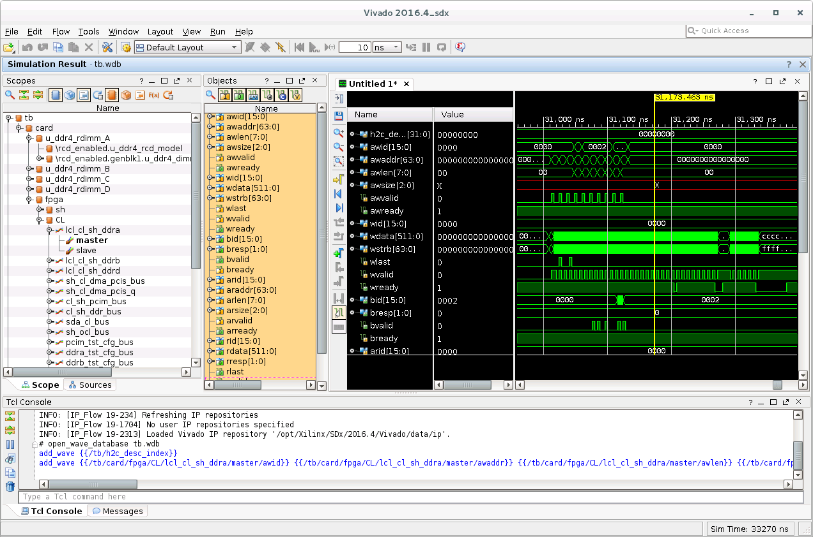

# RTL Simulation for Verilog/VHDL Custom Logic Design with AWS HDK

# Introduction

Developers tend to simulate their designs to validate the RTL design and functionality, before hitting the build stage and registering it with AWS EC2 as Amazon FPGA Image (AFI). AWS FPGA HDK comes with a shell simulation model that supports RTL-level simulation using Xilinx' Vivado XSIM,  MentorGraphics' Questa, Cadence Incisive and Synopsys' VCS RTL simulators. See table below for supported simulator versions. 

| Simulator                                  | Vivado 2019.1  | Vivado 2019.2   | Vivado 2020.1   | Vivado 2020.2  | Vivado 2021.1  | Vivado 2021.2 | 
|--------------------------------------------|----------------|-----------------|-----------------|----------------|----------------|---------------|
| Xilinx Vivado XSIM                         | Vivado v2019.1 | Vivado v2019.2  | Vivado v2020.1  | Vivado v2020.2 | Vivado v2021.1 | Vivado v2021.2 |
| Synopsys VCS                               | O-2018.09      | O-2018.09-SP2-1 | P-2019.06-SP1-1 | Q-2020.03      | R-2020.12      | R-2020.12 |
| Mentor Graphics Questa                     | 10.7c          | 2019.2          | 2019.4          | 2020.2         | 2020.4         | 2020.4 |
| Cadence Incisive Enterprise Simulator(IES) | 15.20.065      | 15.20.073       | 15.20.079       | 15.20.083      | 15.20.083      | N/A |
| Cadence Xcelium Parallel Simulator         | N/A            | N/A             | N/A             | N/A            | N/A            | 20.09.006 |


Developers can write their tests in SystemVerilog and/or C languages. If a developer chooses to use the supplied C framework, he/she can use the same C code for simulation and for runtime on your FPGA-enabled instance like F1.


# Quick Start

### Have an EC2 instance or other server with Xilinx Vivado tools and an active license.

One easy way is to have a pre-installed environment is to use the [AWS FPGA Developer AMI available on AWS Marketplace](https://aws.amazon.com/marketplace/pp/B06VVYBLZZ) which comes with pre-installed Vivado tools and license.

For developers who like to work on-premises or different AMI in the cloud, AWS recommends following the [required license for on-premise document](../../docs/on_premise_licensing_help.md).

Please refer to the [release notes](../../RELEASE_NOTES.md) or the [supported Vivado version](../../supported_vivado_versions.txt) for the exact version of Vivado tools, and the required license components.

### Install the HDK and setup environment

AWS FPGA HDK can be cloned and installed on your EC2 instance or server by calling:

```
    $ git clone https://github.com/aws/aws-fpga
    $ cd aws-fpga
    $ source hdk_setup.sh
```

### Try out one of HDK examples or write your own

```
    $ cd hdk/cl/examples/cl_hello_world/verif/scripts    # simulations are launched from the scripts subdir of the design
    $ make                                       # run the default test using the Vivado XSIM
         Running compilation flow
         Done compilation
         ...
         Vivado Simulator 2016.4_sdx
         Time resolution is 1 ps
         ...
         $finish called
    $ cd ../sim                                  # to view the test log files
```

# Writing and Running Your Own Tests for RTL simulation

## SystemVerilog Tests

One fast way to write your own test is to start with an example test from one of the examples designs and customize it for your design. All SV tests must be placed in the verif/tests sub-directory of CL design root and use the ".sv" file extension.

```
    cl_my_design                 # Custom Logic (CL) design root directory
    |-- build
    |-- design
    |-- software
    |   |--runtime               # C source files and header files for simulation
    `-- verif
        |-- scripts              # Makefiles and filelists
        |-- sim                  # sim results directory
        |-- sv                   # additional CL-specific test bench source
        `-- tests                # test directory
```

**NOTE: All the tests are written to run on 64-bit instances/servers and 64-bit linux, Many of the test and reference Custom Logic (CL) examples use 64-bit address formats**

```
module test_peek_poke();

`define WR_INSTR_INDEX 64'h1c
`define WR_ADDR_LOW    64'h20
`define WR_ADDR_HIGH   64'h24
`define WR_DATA        64'h28
`define WR_SIZE        64'h2c

`define RD_INSTR_INDEX 64'h3c
`define RD_ADDR_LOW    64'h40
`define RD_ADDR_HIGH   64'h44
`define RD_DATA        64'h48
`define RD_SIZE        64'h4c

`define CNTL_REG       64'h08

`define WR_START_BIT   32'h00000001
`define RD_START_BIT   32'h00000002

   logic [63:0] pcim_address = 64'h0000_0000_1234_0000;

   initial begin

      tb.sh.power_up();

      tb.poke_ocl(`WR_INSTR_INDEX, 0);                   // write index
      tb.poke_ocl(`WR_ADDR_LOW, pcim_address[31:0]);     // write address low
      tb.poke_ocl(`WR_ADDR_HIGH, pcim_address[63:32]);   // write address high
      tb.poke_ocl(`WR_DATA, 32'h0000_0000);              // write data
      tb.poke_ocl(`WR_SIZE, 32'h0000_0002);              // write 32b

      tb.poke_ocl(`RD_INSTR_INDEX, 0);                   // read index
      tb.poke_ocl(`RD_ADDR_LOW, pcim_address[31:0]);     // read address low
      tb.poke_ocl(`RD_ADDR_HIGH, pcim_address[63:32]);   // read address high
      tb.poke_ocl(`RD_DATA, 32'h0000_0000);              // read data
      tb.poke_ocl(`RD_SIZE, 32'h0000_0002);              // read 32b

      tb.poke_ocl(`CNTL_REG, 32'h0003);                  // start read & write

      #500ns;   // give the hardware time to run

      ...

      tb.power_down();

      $finish;
   end

endmodule // test_peek_poke
```

Once your test is written, you are ready to run a simulation. The *scripts/* directory is where you must launch all simulations.

    $ cd verif/scripts
    $ make TEST={your_test_name} # compile and run using XSIM (NOTE: Do Not include .sv)
    $ cd ../sim/{your_test_name} # to view the test log files

If your have Mentor Graphics' Questa simulator, then add "SIMULATOR=questa".

    $ make TEST={your_test_name} QUESTA=1  # compile and run using Questa

```
========================================  NOTE ============================================
Use only the SV test APIs supplied with the developer's kit to stimulate your CL
design. They were designed specifically to mimic the behavior of the actual AWS Shell logic.
If you choose to control CL signalling via another method, proper operation with Shell
logic is not guaranteed.

The AWS Shell Interface specification can be found [here](AWS_Shell_Interface_Specification.md)
============================================================================================
```

## C Tests

As with the SystemVerilog (SV) testing, one fast way to write your own test is to start with an example test from one of the examples designs and customize it for your design. All C tests must be placed in the software/runtime sub-directory of CL design root and use the ".c" file extension. HW/SW simulation support is added to simulate the software tests. SV_TEST should be used for any simulation specific code in the software test. SCOPE macro is specific to VCS simulator. Below are the 'C' header and source files for cl_hello_world example.


## Header files to be included for HW/SW co-simulation

[test_hello_world.c](../cl/examples/cl_hello_world/software/runtime/test_hello_world.c)

```
For HW/SW simulation the below header files need to be included.
SV_TEST macro should be defined in HW makefile to enable HW simulation of test_hello_world.c

fpga_pci_sv.h is the SV wrapper for C functions.

sh_dpi_tasks.c is the C file which has common functions to be used between C and SV.

#ifdef SV_TEST
   #include "fpga_pci_sv.h"
#else
   #include <fpga_pci.h>
   #include <fpga_mgmt.h>
#endif

#include <sh_dpi_tasks.h>

```

## Code changes to enable HW/SW co-simulation
Logger will not work for HW simulation, so use the SV_TEST macro to exclude that. pci_vendor_id and pci_device_id are not used for HW simulation as well, so should be excluded.

```
#ifndef SV_TEST
const struct logger *logger = &logger_stdout;
/*
 * pci_vendor_id and pci_device_id values below are Amazon's and avaliable to use for a given FPGA slot.
 * Users may replace these with their own if allocated to them by PCI SIG
 */
static uint16_t pci_vendor_id = 0x1D0F; /* Amazon PCI Vendor ID */
static uint16_t pci_device_id = 0xF000; /* PCI Device ID preassigned by Amazon for F1 applications */

/*
 * check if the corresponding AFI for hello_world is loaded
 */
#endif
```

Use cosim_printf function instead of printf

```
cosim_printf("===== Starting with peek_poke_example =====\n");

```

test_main should be used for HW simulation as shown below.

```
#ifdef SV_TEST
void test_main(uint32_t *exit_code) {
#else
int main(int argc, char **argv) {
#endif
```
Also SCOPE should be defined for HW simulation with VCS and QUESTA simulators.

```
    //The statements within SCOPE ifdef below are needed for HW/SW co-simulation with VCS
    #ifdef SCOPE
      svScope scope;
      scope = svGetScopeFromName("tb");
      svSetScope(scope);
    #endif

```

Checking for AFI ready is not required for HW/simulation as in simulation the hardware is directly accessed.

```
#ifndef SV_TEST
    rc = check_afi_ready(slot_id);
#endif
```
Test exit should be codes as below for HW/SW co-simulation.

```
#ifndef SV_TEST
    return rc;

out:
    return 1;
#else

out:
   *exit_code = 0;
#endif

```

[test_dram_dma_hwsw_cosim.c](../cl/examples/cl_dram_dma/software/runtime/test_dram_dma_hwsw_cosim.c)

```
For HW/SW simulation the below header files need to be included.

SV_TEST macro should be defined in HW makefile to enable HW simulation of test_dram_dma.c

For test_dram_dma test the below two functions are used for DMA transfers from host and to host.

//This function on the SV side sets up the string buffer and does Host to cl transfer.
sv_fpga_start_buffer_to_cl(slot_id, channel, buffer_size, write_buffer, (0x10000000 + channel*MEM_16G));

//This function on the SV side sets up the string buffer and does CL to Host transfer.
sv_fpga_start_cl_to_buffer(slot_id, channel, buffer_size, (0x10000000 + channel*MEM_16G));

//This function updates the buffer on 'C' side.
int send_rdbuf_to_c(char* rd_buf)

For HW/SW simulation the below header files need to be included.
SV_TEST macro should be defined in HW makefile to enable HW simulation of test_dram_dma.c

```

Once your test is written, you are ready to run a simulation. The *scripts/* directory is where you must launch all simulations.

```
    $ cd verif/scripts
    $ make C_TEST={your_test_name} # compile and run using XSIM (NOTE: Do Not include .c)
    $ cd ../sim/{your_test_name} # to view the test log files

    $ cd verif/scripts
    $ make C_TEST={your_test_name} VCS=1 # compile and run using VCS (NOTE: Do Not include .c)
    $ cd ../sim/{your_test_name} # to view the test log files

    $ cd verif/scripts
    $ make C_TEST={your_test_name} QUESTA=1 # compile and run using QUESTA (NOTE: Do Not include .c)
    $ cd ../sim/{your_test_name} # to view the test log files
```
## Accessing Host Memory During Simulation
Your design may share data between host memory and logic within the CL. To verify your CL is accessing host memory, the test bench includes two types of host memory: SV and C domain host memory. If you are are only using SV to verify your CL, then use SV domain host memory. An associative array represents host memory, where the address is the key to locate a 32-bit data value.

```
   logic [31:0]        sv_host_memory[*];
```

If you are are using C to verify your CL, then use C domain host memory. Allocate a memory buffer in your C code and pass the pointer to the SV domain. The AXI BFM connected to the PCIeM port will use DPI calls to read and write the memory buffer.


Backdoor access to host memory is provided by two functions:

```
   function void hm_put_byte(input longint unsigned addr, byte d);
   function byte hm_get_byte(input longint unsigned addr);
```
Use these functions when you need to access data in either SV or C domain host memory. They take zero simulation time and are useful for initializing memory or checking results stored in memory.


# Debugging Custom Logic using the AWS HDK

If a simulation fails, developers can debug issues by dumping waves of the simulation and then view them to determine the source of the problem.

The process for dumping and viewing waves can differ depending on the simulator being used.  To dump and view waves using the Xilinx Vivado tools included with the AWS HDK:

1. Specify scope of logic for wave dump
2. Re-run simulation to dump waves
3. View waves in Vivado using .tcl

## Specify scope of logic for wave dump

The file `$AWS_FPGA_REPO_DIR/hdk/cl/examples/cl_dram_dma/verif/scripts/waves.tcl` specifies the scope of logic for wave dump.  The default behavior is to dump only the signals at the very top of the design:

```
    add_wave /
```

To recursively dump waves of all signal underneath the top level of the design, add `-recursive`:

```
    add_wave -recursive /
```

Note that dumping all signals of a design will increase simulation time and will result in a large file.

For more information on the syntax for `add_wave` and other tcl functions, see the [Vivado Design Suite Tcl Command Reference Guide](https://www.xilinx.com/support/documentation/sw_manuals/xilinx2013_1/ug835-vivado-tcl-commands.pdf)

## Protocol Checkers

Xilinx Protocol Checkers are instantiated on all AXI4 and AXIL interfaces in Shell BFM. By default all the tests run with protocol checkers enabled. If there is a protocol error in any one of the AXI interfaces, then the protocol checker will fire an error as below.

tb.card.fpga.sh.axl_pc_bar1_slv_inst.REP : BIT(         56) :   ERROR : Invalid state x
tb.card.fpga.sh.axl_pc_sda_slv_inst.REP : BIT(         35) :   ERROR : Invalid state x
tb.card.fpga.sh.axi_pc_mstr_inst_pcim.REP : BIT(         33) :   ERROR : Invalid state x
tb.card.fpga.sh.axi_pc_mstr_inst_pcis.REP : BIT(         35) :   ERROR : Invalid state x
tb.card.fpga.sh.axl_pc_ocl_slv_inst.REP : BIT(         35) :   ERROR : Invalid state x

Please refer to hdk/common/verif/models/xilinx_axi_pc/axi_protocol_checker_v1_1_vl_rfs.v for mapping between bit positins and the protocol errors.

## Re-run simulation to dump waves

Once `waves.tcl` has been modified, re-run the simulatio with `make` as shown at the top of this document.

## View waves in Vivado using .tcl

As mentioned above, all simulation results will be placed in `sim/<test_name>`.  If using the included CL examples, the waves database should appear as `tb.wdb`.

To view the waves, first create a .tcl file called `open_waves.tcl` with the following commands:
```
current_fileset
open_wave_database tb.wdb
```

Then open Vivado and specify this .tcl file to execute:
```
vivado -source open_waves.tcl
```

The design hierarchy and waves should then be visible and can be inspected / debugged:



The usage of Vivado for wave debug is beyond the scope of this document.  See the [Vivado Design Suite Tutorials](https://www.xilinx.com/support/documentation/sw_manuals/xilinx2015_4/ug936-vivado-tutorial-programming-debugging.pdf) for more details.

# SV Test API Reference

## _poke_
## Description
The SV Test API task 'poke' writes 64 bits of data to the CL via the AXI PCIeS interface.
## Declaration
#### task poke(input int slot_id = 0, logic [63:0] addr, logic [63:0] data, logic [5:0] id = 6'h0, DataSize::DATA_SIZE size = DataSize::UINT32, AxiPort::AXI_PORT intf = AxiPort::PORT_DMA_PCIS);

| Argument | Description |
| --- | --- |
| slot_id | Slot ID |
| addr | Write Address |
| data | Write Data |
| id | AXI ID |
| size | Data Size |
| intf | AXI CL Port |

## _poke_pcis_wc_
## Description
The SV Test API task 'poke' writes 64 bits of data to the CL via the AXI PCIeS interface.
## Declaration
#### task poke_pcis_wc(input logic [63:0] addr, logic [31:0] data [$], logic [5:0]  id = 6'h0, logic [2:0]  size = 3'd6);

| Argument | Description |
| --- | --- |
| slot_id | Slot ID |
| addr | Write Address |
| data [$] | DW array for Write Data|
| id | AXI ID |
| size | Data Size |
| intf | AXI CL Port |

## _peek_
## Description
The SV Test API task 'peek' reads up to 64 bits of data from the CL via the AXI PCIeS interface.
## Declaration
#### task peek(input logic [63:0] addr, output logic [63:0] data, input logic [5:0] id = 6'h0, DataSize::DATA_SIZE size = DataSize::UINT32, AxiPort::AXI_PORT intf = AxiPort::PORT_DMA_PCIS);

| Argument | Description |
| --- | --- |
| slot_id | Slot ID |
| addr | Read Address |
| data | Read Data |
| id | AXI ID |
| size | Data Size |
| intf | AXI CL Port |

## _peek_bar1_
## Description
The SV Test API function 'task peek_bar1' reads 32 bits of data from the CL via the AXI BAR1 interface.
## Declaration
#### task peek(input int slot_id = 0, logic [63:0] addr, output logic [31:0] data, input logic [5:0] id = 6'h0);

| Argument | Description |
| --- | --- |
| slot_id | Slot ID |
| addr | Read Address |
| data | Read Data |
| id | AXI ID |

## _poke_bar1_
## Description
The SV Test API task 'poke_bar1' writes 32 bits of data to the CL via the AXI BAR1 interface.
## Declaration
#### task poke_bar1(input int slot_id = 0, logic [63:0] addr, logic [31:0] data, logic [5:0] id = 6'h0);

| Argument | Description |
| --- | --- |
| slot_id | Slot ID |
| addr | Write Address |
| data | Write Data |
| id | AXI ID |

## _peek_ocl_
## Description
The SV Test API function 'task peek_ocl' reads 32 bits of data from the CL via the AXI OCL interface.
## Declaration
#### task peek_ocl(input int slot_id = 0, logic [63:0] addr, output logic [31:0] data, input logic [5:0] id = 6'h0);

| Argument | Description |
| --- | --- |
| slot_id | Slot ID |
| addr | Read Address |
| data | Read Data |
| id | AXI ID |

## _poke_ocl_
## Description
The SV Test API task 'poke_ocl' writes 32 bits of data to the CL via the AXI OCL interface.
## Declaration
#### task poke_ocl(input int slot_id = 0, logic [63:0] addr, logic [31:0] data, logic [5:0] id = 6'h0);

| Argument | Description |
| --- | --- |
| slot_id | Slot ID |
| addr | Write Address |
| data | Write Data |
| id | AXI ID |

## _peek_sda_
## Description
The SV Test API function 'task peek_sda' reads 32 bits of data from the CL via the AXI SDA interface.
## Declaration
#### task peek_sda(input int slot_id = 0, logic [63:0] addr, output logic [31:0] data, input logic [5:0] id = 6'h0);

| Argument | Description |
| --- | --- |
| slot_id | Slot ID |
| addr | Read Address |
| data | Read Data |
| id | AXI ID |

## _poke_sda_
## Description
The SV Test API task 'poke_sda' writes 32 bits of data to the CL via the AXI OCL interface.
## Declaration
#### task poke_sda(input int slot_id = 0, logic [63:0] addr, logic [31:0] data, logic [5:0] id = 6'h0);

| Argument | Description |
| --- | --- |
| slot_id | Slot ID |
| addr | Write Address |
| data | Write Data |
| id | AXI ID |

## _peek_pcis_
## Description
The SV Test API function 'task peek_pcis' reads 512 bits of data from the CL via the AXI PCIS interface.
## Declaration
#### task peek_pcis(input int slot_id = 0, logic [63:0] addr, output logic [511:0] data, input logic [5:0] id = 6'h0);

| Argument | Description |
| --- | --- |
| slot_id | Slot ID |
| addr | Read Address |
| data | Read Data |
| id | AXI ID |

## _poke_pcis_
## Description
The SV Test API task 'poke_pcis' writes 512 bits of data to the CL via the AXI PCIE interface.
## Declaration
#### task poke_pcis(input int slot_id = 0, logic [63:0] addr, logic [511:0] data, logic [5:0] id = 6'h0, logic [63:0] strb);

| Argument | Description |
| --- | --- |
| slot_id | Slot ID |
| addr | Write Address |
| data | Write Data |
| id | AXI ID |

## _nsec_delay_
## Description
Wait dly nanoseconds.
## Declaration
#### task nsec_delay(input int dly = 10000);

| Argument | Description |
| --- | --- |
| dly | delay in nanoseconds |

## _set_virtual_dip_switch_
## Description
Writes virtual dip switches.
## Declaration
#### task set_virtual_dip_switch(input int slot_id=0, int dip);

| Argument | Description |
| --- | --- |
| slot_id | Slot ID |
| dip | 16bit dip switch setting |

## _get_virtual_dip_switch_
## Description
Reads virtual dip switches.
## Declaration
#### function logic [15:0] get_virtual_dip_switch(input int slot_id=0);

| Argument | Description |
| --- | --- |
| slot_id | Slot ID |

## _get_virtual_led_
## Description
Reads virtual LEDs.
## Declaration
#### function logic [15:0] get_virtual_led(input int slot_id=0);

| Argument | Description |
| --- | --- |
| slot_id | Slot ID |

## _kernel_reset_
## Description
Issues a kernel reset.
## Declaration
#### function void kernel_reset(input int slot_id=0, logic d = 1);

| Argument | Description |
| --- | --- |
| slot_id | Slot ID |
| d | reset value |

## _issue_flr_
## Description
Issues a PCIe Function Level Reset (FLR).
## Declaration
#### task issue_flr(input int slot_id=0);

| Argument | Description |
| --- | --- |
| slot_id | Slot ID |

## _que_buffer_to_cl_
## Description
Queues a buffer for the DMA to send data to the CL.
## Declaration
#### function void que_buffer_to_cl(input int slot_id = 0, int chan, logic [63:0] src_addr, logic [63:0] cl_addr, logic [27:0] len);

| Argument | Description |
| --- | --- |
| slot_id | Slot ID |
| chan | DMA channel to use (0-3) |
| src_addr | Data's Source Address |
| cl_addr | Custom Logic Address |
| len | Length of DMA in bytes |


## _que_cl_to_buffer_
## Description
Queues a buffer for the DMA to receive data from the CL.
## Declaration
#### function void que_cl_to_buffer(input int slot_id = 0, int chan, logic [63:0] dst_addr, logic [63:0] cl_addr, logic [27:0] len);

| Argument | Description |
| --- | --- |
| slot_id | Slot ID |
| chan | DMA channel to use (0-3) |
| dst_addr | Data's Destination Address |
| cl_addr | Custom Logic Address |
| len | Length of DMA in bytes |

## _start_que_to_cl_
## Description
Starts the DMA operation to the CL.
## Declaration
#### function void start_que_to_cl(input int slot_id = 0, int chan);

| Argument | Description |
| --- | --- |
| slot_id | Slot ID |
| chan | DMA channel to use (0-3) |

## _start_que_to_buffer_
## Description
Starts the DMA operation from the CL.
## Declaration
#### function void start_que_to_buffer(input int slot_id = 0, int chan);

| Argument | Description |
| --- | --- |
| slot_id | Slot ID |
| chan | DMA channel to use (0-3) |

## _is_dma_to_cl_done_
## Description
Returns non-zero if the DMA to the CL is complete.
## Declaration
#### function bit is_dma_to_cl_done(input int slot_id = 0, input int chan);

| Argument | Description |
| --- | --- |
| slot_id | Slot ID |
| chan | DMA channel to use (0-3) |

## _is_dma_to_buffer_done_
## Description
Returns non-zero if the DMA to the buffer is complete.
## Declaration
#### function bit is_dma_to_buffer_done(input int slot_id = 0, input int chan);

| Argument | Description |
| --- | --- |
| slot_id | Slot ID |
| chan | DMA channel to use (0-3) |

## _map_host_memory_
## Description
The SV Test API function 'task map_host_memory(input logic [63:0] addr)' maps host memory to 64-bit address.
## Declaration
#### task map_host_memory(input logic [63:0] addr);

| Argument | Description |
| --- | --- |
| addr | Address |

## _hm_put_byte_
## Description
The SV Test API function 'function void hm_put_byte(input longint unsigned addr, byte d)' is used to backdoor load host memory.
## Declaration
#### function void hm_put_byte(input longint unsigned addr, byte d);

| Argument | Description |
| --- | --- |
| addr | Address |
| d | data |

## _hm_get_byte_
## Description
The SV Test API function 'function void hm_get_byte(input longint unsigned addr)' is used to read data from host memory using backdoor.
## Declaration
#### function void hm_get_byte(input longint unsigned addr);

| Argument | Description |
| --- | --- |
| addr | Address |

# C Test API Reference

## _cl_poke_
## Description
The C Test API function 'extern void cl_poke(uint64_t addr, uint32_t data)' writes 32 bits of data to the CL via the AXI PCIeS interface. This function calls the SV poke function via DPI calls.
## Declaration
#### extern void cl_poke(uint64_t addr, uint32_t data);

| Argument | Description |
| --- | --- |
| addr | Write Address |
| data | Write Data |

## _cl_peek_
## Description
The C Test API function 'extern void cl_peek(uint64_t addr)' Reads 32 bits of data from the CL via the AXI PCIeS interface. This function calls the SV peek function via DPI calls.
## Declaration
#### extern void cl_peek(uint64_t addr, uint32_t data);

| Argument | Description |
| --- | --- |
| addr | Read Address |
| data | Read Data |

## _sv_map_host_memory_
## Description
The C Test API function 'extern void sv_map_host_memory(uint8_t *memory)' maps host memory to memory allocated by memory buffer. This function calls the SV map_host_memory function via DPI calls.
## Declaration
#### extern void sv_map_host_memory(uint8_t *memory);

| Argument | Description |
| --- | --- |
| *memory | pointer to memory buffer|

## _host_memory_putc_
## Description
The C Test API function 'void host_memory_putc(uint64_t addr, uint8_t data)' is used to backdoor load host memory.
## Declaration
#### void host_memory_putc(uint64_t addr, uint8_t data)

| Argument | Description |
| --- | --- |
| addr | Address |
| data | data |

## _host_memory_getc_
## Description
The C Test API function 'void host_memory_getc(uint64_t addr)' is used to backdoor load host memory.
## Declaration
#### void host_memory_putc(uint64_t addr, uint8_t data)

| Argument | Description |
| --- | --- |
| addr | Address |

## _log_printf_
## Description
The C Test API function 'void log_printf(const char *format, ...)' is used to print messages when running a simulation. The regular 'C' printf will not work when running a 'C' and 'SV' mixed language simulation. This 'C' function calls SV function sv_printf via DPI calls.
## Declaration
#### void log_printf(const char *format, ...);

| Argument | Description |
| --- | --- |
| *format | message to be printed |

## _sv_printf_
## Description
The C Test API function 'extern void sv_printf(char *msg)' is used to send a message buffer to the SV side of simulation.
## Declaration
#### extern void sv_printf(char *msg);

| Argument | Description |
| --- | --- |
| *msg | Character buffer |

## _sv_pause_
## Description
The C test API function 'extern void sv_pause(uint32_t x);' is used to add delay to a simulation.
## Declaration
#### extern void sv_pause(uint32_t x);

| Argument | Description |
| --- | --- |
| x | Delay in micro seconds |

## _sv_fpga_start_buffer_to_cl_
## Description
The C test API function 'extern "DPI-C" task sv_fpga_start_buffer_to_cl;' is used to do DMA data transfer from Host to CL.
## Declaration
#### extern void sv_fpga_start_buffer_to_cl(uint32_t slot_id, uint32_t chan, uint32_t buf_size, const char *wr_buffer, uint64_t cl_addr);

| Argument | Description |
| --- | --- |
| slot_id | Slot ID |
| chan | DMA channel |
| buf_size | Size of the buffer |
| wr_buffer | Data to be transferred |
| cl_addr | Destination CL address |

## _sv_fpga_start_cl_to_buffer_
## Description
The C test API function 'extern "DPI-C" task sv_fpga_start_cl_to_buffer;' is used to do DMA data transfer from Host to CL.
## Declaration
#### extern void sv_fpga_start_cl_to_buffer(uint32_t slot_id, uint32_t chan, uint32_t buf_size, uint64_t cl_addr);

| Argument | Description |
| --- | --- |
| slot_id | Slot ID |
| chan | DMA channel |
| buf_size | Size of the buffer |
| wr_buffer | Data to be transferred |
| cl_addr | Destination CL address |


## _set_chk_clk_freq_
The SV test API function 'function void set_chk_clk_freq(input int slot_id = 0, logic chk_freq = 1'b1);' is used to enable frequency checks in shell model.
## Declaration
#### function void set_chk_clk_freq(input int slot_id = 0, logic chk_freq = 1'b1);

| Argument | Description |
| --- | --- |
| slot_id | Slot ID |
| chk_freq | enable bit|

## _chk_prot_err_stat_
The SV test API function 'function logic chk_prot_err_stat(input int slot_id = 0);' is used to check protocol error status.
## Declaration
#### function logic chk_clk_err_cnt(input int slot_id = 0);
| Argument | Description |
| --- | --- |
| slot_id | Slot ID |

## _get_global_counter_0_
The SV test API function 'function logic [63:0] get_global_counter_0(input int slot_id = 0);' is used to get global counter_0 value.
## Declaration
#### function logic [63:0] get_global_counter_0(input int slot_id = 0);
| Argument | Description |
| --- | --- |
| slot_id | Slot ID |

## _get_global_counter_1_
The SV test API function 'function logic [63:0] get_global_counter_1(input int slot_id = 0);' is used to get global counter_1 value.
## Declaration
#### function logic [63:0] get_global_counter_1(input int slot_id = 0);
| Argument | Description |
| --- | --- |
| slot_id | Slot ID |
