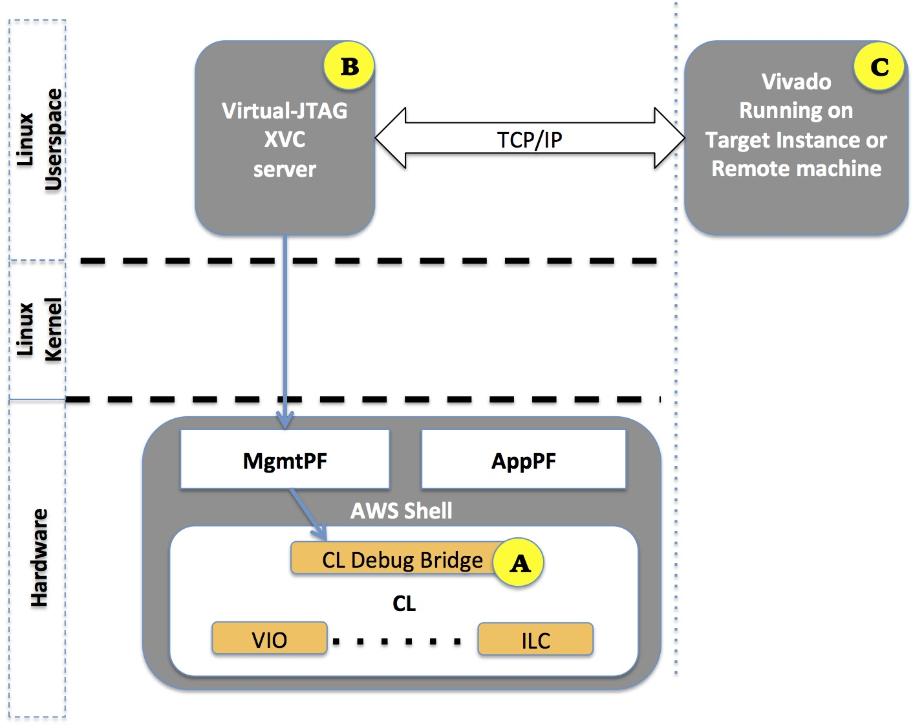
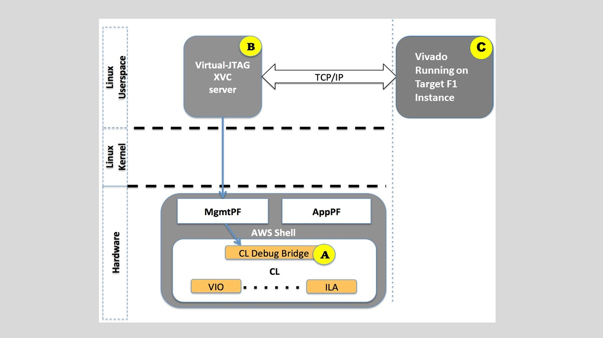
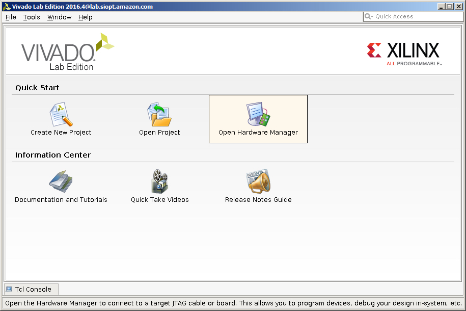
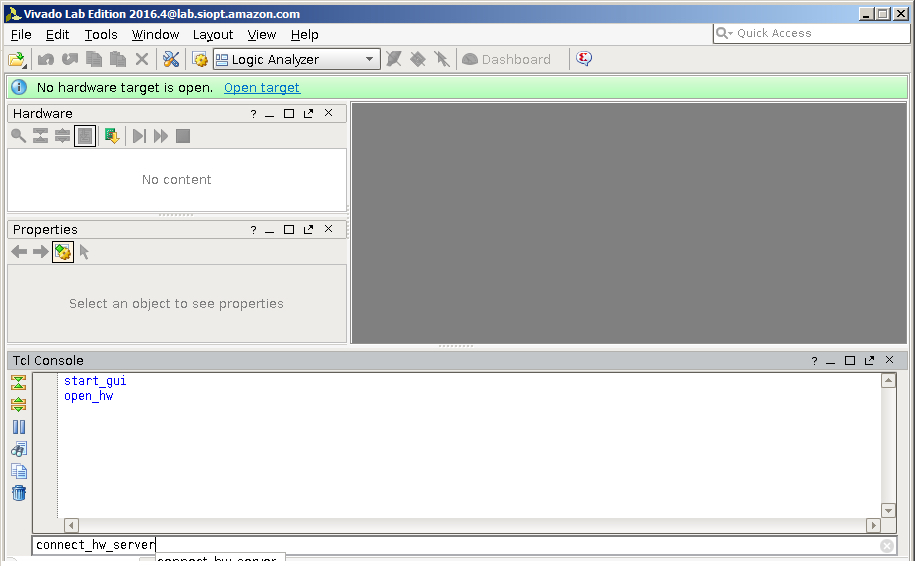
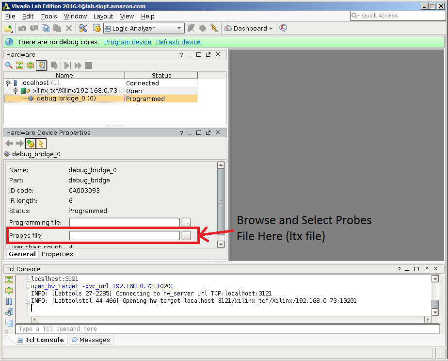
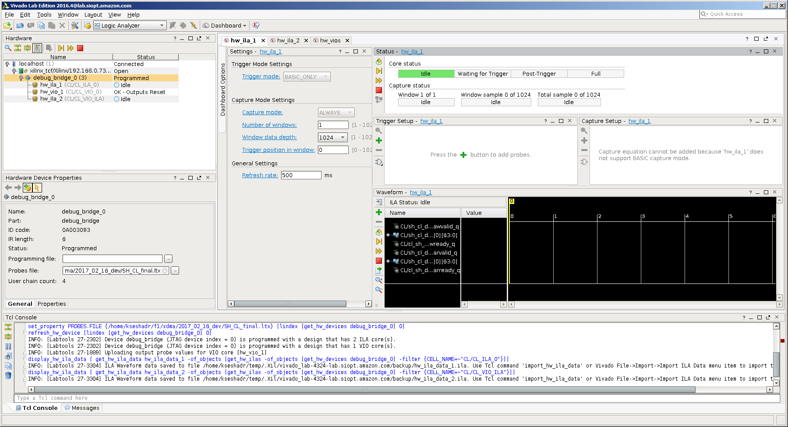
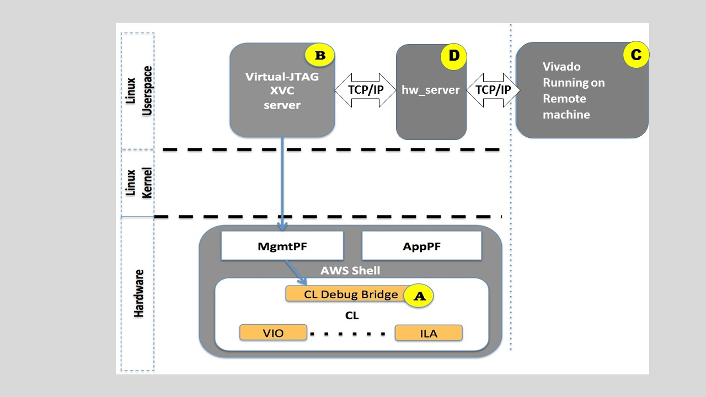

# Virtual JTAG for Real-time FPGA Debug

## Table of Contents

1. [Overview](#overview)

2. [Embedding Debug Cores in CL/AFI](#embeddingDebugCores)

3. [Enabling Debug on FPGA-enabled EC2 Instance, using XVC](#startVJtag)

4. [Connecting Xilinx Hardware Manager(Vivado Lab Edition) running on local F1 instance to the Debug Target FPGA-enabled EC2 Instance](#connectToTargetLocally)

5. [Connecting Xilinx Hardware Manager(Vivado Lab Edition) running on remote machine to the Debug Target FPGA-enabled EC2 Instance](#connectToTargetRemotely)

6. [Frequently Asked Questions](#faq)


<a name="overview"></a>
# Overview

EC2 FPGA platforms support Virtual JTAG capability by emulating JTAG over PCIe.

To take advantage of this capability [AWS FPGA Management Tools](./../../sdk/userspace/fpga_mgmt_tools/README.md)
enables running an in-target service (in Linux userspace) implementing Xilinx Virtual Cable (XVC) protocol
which allows (local or remote) Vivado to connect to a target FPGA for debug leveraging standard 
Xilinx standard debug cores like
[Integrated Logic Analyzer - ILA](https://www.xilinx.com/products/intellectual-property/ila.html),
[Virtual Input/Output - VIO](https://www.xilinx.com/products/intellectual-property/vio.html), and others.

Traditionally, a physical JTAG connection is used to debug FPGAs.  AWS has developed a virtual JTAG, leveraging Xilinx XVC, for a debug flow that enables debug in the cloud.

There are three main components which enable XVC debug on AWS FPGA enabled instances like F1, shown in the following figure:

- **[A]** [Debug cores](#embeddingDebugCores)  CL Debug Bridge, Xilinx ILA, VIO, etc., inside the FPGA CustomLogic (CL) portion. It is the developer's responsibility to instance these cores in the CL design. Refer to the [CL Hello World Example](../cl/examples/cl_hello_world/) for an example.

- **[B]** [Virtual-JTAG service](#startVJtag) acting as XVC Server, running on target F1 instance (or any other EC2 instance with Xilinx FPGA).  

- **[C]** Vivado [Local](#connectToTargetLocally) or [Remote](#connectToTargetRemotely) application for interactive debug.


  
  
  
<a name="embeddingDebugCores"></a>
# Embedding Debug Cores in CL 

The Custom Logic (CL) is required to include the [CL Debug Bridge](../common/shell_v071417d3/design/ip/cl_debug_bridge/sim/cl_debug_bridge.v)
provided by AWS as part of the HDK, and any required standard Xilinx debug IP components like ILAs and VIOs. 

The following list describes the steps to successfully setup debug in a CL:  

**Step 1 (Required):**	Instance the CL Debug Bridge.
The CL Debug Bridge must be instantiated at the top-level of the CL.
The nets connecting to the CL Debug Bridge must have the same names as the port names of the CL Debug Bridge, except the clock.
The clock to the CL Debug Bridge should be one of the various input CL clocks (clk_main_a0 and all the clk_xtra\_\*).
When the net names are correct, these nets will connect automatically to the top level of the CL.
The following code snippet shows the instance for the CL Debug Bridge.

```
cl_debug_bridge CL_DEBUG_BRIDGE (
      .clk(clk_main_a0),
      .drck(drck),
      .shift(shift),
      .tdi(tdi),	
      .update(update),
      .sel(sel),
      .tdo(tdo),
      .tms(tms),
      .tck(tck),
      .runtest(runtest),
      .reset(reset),
      .capture(capture),
      .bscanid(bscanid)
   );
```  
  
  
**Step 2 (Optional):**	Instance Xilinx' [Integrated Logic Analyzer (ILA)](https://www.xilinx.com/products/intellectual-property/ila.html). An ILA IP should be created using Vivado IP Catalog and it should be customized according to the desired probes. The ILA can be instanced at any level in the hierarchy inside the CL and the nets requiring debug have to be connected with the probe input ports of the ILA. The clock to the ILA should be the same clock of the clock domain to which the nets under debug belong to. A separate ILA is required for nets belonging to different clock domains. (Please see [Xilinx UG908](https://www.xilinx.com/support/documentation/sw_manuals/xilinx2016_4/ug908-vivado-programming-debugging.pdf) for further details)

**Step 3 (Optional):**	Instance Xilinx' [Virtual Input/Output (VIO)](https://www.xilinx.com/products/intellectual-property/vio.html). A VIO IP should be created using Vivado IP Catalog and it should be customized as needed. The VIO can be instanced at any level in the hierarchy inside the CL and the input/output nets should be connected as desired. The clock to the VIO should be the same clock of the clock domain to which the VIO output/input probe signals belong to. A separate VIO is required for different clock domains. (Please see [Xilinx UG908](https://www.xilinx.com/support/documentation/sw_manuals/xilinx2016_4/ug908-vivado-programming-debugging.pdf) for further details)

**Step 4 (Required):**	Xilinx Vivado implementation tools perform the connections and wiring between the debug IP components (ILAs/VIOs) and the CL Debug Bridge. Care should be taken to set `set_param chipscope.enablePRFlow true` in the tcl command during synthesis and implementation. This is automatically included if AWS CL Build scripts are delivered with this HDK.

<a name="startVJtag"></a>
# Starting Virtual JTAG (XVC) Debug Server on the Target FPGA-enabled EC2 Instance 

To start debugging a given FPGA slot, which has the [CL debug cores](#embeddingDebugCores), the developer needs to call the FPGA Management Tool `$ fpga-start-virtual-jtag` from Linux shell on the target instance (i.e. AWS EC2 F1 instance). This management tool starts Xilinx's Virtual Cable (XVC) service for a given FPGA slot, listening to a given TCP port.

``` 

$ sudo fpga-start-virtual-jtag -P 10201 -S 0
Starting Virtual JTAG XVC Server for FPGA slot id 0, listening to TCP port 10201.
Press CTRL-C to stop the service.

```

You could call `sudo fpga-start-virtual-jtag -?` for further details on the available options and general help using this tool.
  
  

<a name="connectToTargetLocally"></a>
# Connecting Xilinx Hardware Manager (Vivado Lab Edition) running on local F1 instance to the Debug Target FPGA-enabled EC2 Instance 

Xilinx Hardware Manager (Vivado Lab Edition) running on the target instance (i.e. the F1 itself). The TCP port on which the Virtual JTAG XVC Server is listening must be accessible to the host running Xilinx Hardware Management (See [FAQ](#faq) for configuring Linux firewall and AWS EC2 Network Security Groups). 



To connect the debug Xilinx Hardware Manager to Virtual JTAG XVC server on the target, the following should be called on the machine hosting Vivado:

1)	Launch Vivado Lab Edition (or full featured Vivado) 

2)	Select “Open HW Manager” as shown in the next figure:
  
  

  
  
  

3)	Start Vivado hw_server using the following command in Vivado's .tcl console
`> connect_hw_server`
  
  
  
  
   
   

4)	Connect to the target instance Virtual JTAG XVC server using the following command in Vivado's tcl console. 

`> open_hw_target -xvc_url <hostname or IP address>:10201`

**NOTES:**

- Since you are running Vivado's Lab Edition on the same instance as the target instance, use IP address 127.0.0.1, which is the localhost.

-  If the above command fails, its most likely that either the virtual jtag server is not running, the IP/Port are wrong, or a firewall/security-group rule is blocking the connection. See the [FAQ](#faq) section in the end of this document.


Upon successful connection, Vivado's Hardware panel will be populated with a debug bridge instance. 
 
5)	Select the debug bridge instance from the Vivado Hardware panel

6)      You will need a "Probes file" in the next step.  A "Probes file" with an ".ltx" extension is generated during the build process and written to the checkpoints directory.   

7)	In the Hardware Device Properties window select the appropriate “Probes file” for your design by clicking the icon next to the “Probes file” entry, selecting the file, and clicking “OK”. This will refresh the hardware device and it should now show the debug cores present in your design.  Note the Probes file is written out during the design implementation, and is typically has the extension ".ltx".

  

   
     
     
Vivado can now be used to debug your design: the next figure shows how a CL design with two ILAs and one VIO would look in Vivado Lab Edition Hardware Manager, once the steps 1-6 mentioned earlier are followed

  

## Other considerations

The connection Vivado and the target instance can be terminated by closing the XVC server from Vivado using the right click menu. If the target FPGA PCIe connection is lost, a new AFI is loaded or the Virtual JTAG Server application stops running, the connection to the FPGA and associated debug cores will also be lost. 

**NOTE:** Xilinx Hardware Manager (Vivado Lab Edition) should not be connected to the target Virtual JTAG XVC Server when the AFI is not in READY state. If the AFI going to go through `fpga-clear-image` or `fpga-load-local-image`, Vivado should be disconnected, and the Virtual JTAG XVC Server should be terminated by killing the process the runs the JTAG XVC Server.
 
  
<a name="connectToTargetRemotely"></a>
# Connecting Xilinx Hardware Manager (Vivado Lab Edition) running on a remote machine to the Debug Target FPGA-enabled EC2 Instance 




Xilinx Hardware Manager (Vivado Lab Edition) running on a remote machine. The TCP port on which the hw_server and the Virtual JTAG XVC Server is listening must be accessible to the host running Xilinx Hardware Management (See [FAQ](#faq) for configuring Linux firewall and AWS EC2 Network Security Groups).
Note: Running the hw_server locally on the F1 instance ensures superior performance between Vivado running on the remote machine to connect and debug the design running on the F1 instance. 

To connect the debug Xilinx Hardware Manager to Virtual JTAG XVC server on the target, the following should be called on the machine hosting Vivado:

1)	Launch Vivado Lab Edition (or full featured Vivado) 

2)	Select “Open HW Manager” as shown in the next figure:
  
  

  
  
  

3)	Start Vivado hw_server using the following command in Vivado's .tcl console

`> connect_hw_server -url <hostname or IP address>:3121`
  
  
  
  
   
 
  

4)	Connect to the target instance Virtual JTAG XVC server using the following command in Vivado's tcl console. 

`> open_hw_target -xvc_url <hostname or IP address>:10201`

**NOTES:**

-  If the above command fails, its most likely that either the virtual jtag server is not running, the IP/Port are wrong, or a firewall/security-group rule is blocking the connection. See the [FAQ](#faq) section in the end of this document.


Upon successful connection, Vivado's Hardware panel will be populated with a debug bridge instance. 
 
5)	Select the debug bridge instance from the Vivado Hardware panel

6)      You will need a "Probes file" in the next step.  A "Probes file" with an ".ltx" extension is generated during the build process and written to the checkpoints directory.   

7)	In the Hardware Device Properties window select the appropriate “Probes file” for your design by clicking the icon next to the “Probes file” entry, selecting the file, and clicking “OK”. This will refresh the hardware device and it should now show the debug cores present in your design.  Note the Probes file is written out during the design implementation, and is typically has the extension ".ltx".

  

   
     
     
Vivado can now be used to debug your design: the next figure shows how a CL design with two ILAs and one VIO would look in Vivado Lab Edition Hardware Manager, once the steps 1-6 mentioned earlier are followed

  

## Other considerations

The connection Vivado and the target instance can be terminated by closing the XVC server from Vivado using the right click menu. If the target FPGA PCIe connection is lost, a new AFI is loaded or the Virtual JTAG Server application stops running, the connection to the FPGA and associated debug cores will also be lost. 

**NOTE:** Xilinx Hardware Manager (Vivado Lab Edition) should not be connected to the target Virtual JTAG XVC Server when the AFI is not in READY state. If the AFI going to go through `fpga-clear-image` or `fpga-load-local-image`, Vivado should be disconnected, and the Virtual JTAG XVC Server should be terminated by killing the process the runs the JTAG XVC Server.
   
    
<a name="faq"></a>
# Frequently Asked Questions 
  
  
  
**Q: Do I need to run Vivado or Hardware Manager on the target EC2 instance to debug?**  

No, you may run Vivado on a "remote" host as long as your instance/VPC has the right permissions to allow the "remote" host to access the correct TCP port.
  
  
**Q: How do I configure Linux firewalls and EC2 network security groups to enable remote debug?**
 
 
**Q: Can I have a secure connection (i.e. SSL/TLS) to the target FPGA-enable EC2 Instance running Virtual JTAG service?**

You may use the ssh "port forwarding" option (-L) to forward connections from the F1 instance via the SSH client, then to a destination server. You can now use this destination server in the Vivado Hardware Manager running on a remote machine to connect to the hw_server and Virtual JTAG server running on the F1 instance.  

 
**Q: Do I need a Vivado license to use Virtual JTAG and Xilinx' VIO / LIA debug capabilities?**

No, you need the Vivado Lab Edition which does not require a license.
  
  
  
**Q: How do I stop the Virtual JTAG service on the target instance?**
  
  
  
**Q: Can I debug multiple FPGAs on same target EC2 instance concurrently?**

Yes, you must start the the  `$ fpga-start-virtual-jtag` with a different Slot/Port for each FPGA.  You can launch multiple Vivado sessions, and have each session connect to the corresponding TCP port associated with the FPGA.


**Q: What are some of the best practices I should be aware when working with Virtual JTAG?**

If you are running Vivado on a remote machine trying to connect to Virtual JTAG - we recommend running the hw_server on the F1 instance - to ensure optimal performance between Vivado and the Virtual JTAG server.


**Q: Can other instances running on the same F1 server access the Virtual JTAG of my instance?**

No, other customer instances running on the same F1 server do not have access to the Virtual JTAG of your instance.

**Q: I am getting this error:**

```
% fpga-start-virtual-jtag -P 10201 -S 0
Starting Virtual JTAG XVC Server for FPGA slot id 0, listening to TCP port 10201
Press CTRL-C to stop the service.
Error: (1) internal-error
```

This could mean there is already a server running with thtat TCP port.  Either find this process and kill it, or choose a different TCP port.


**Q: What is XVC and where can I learn about it?**

Xilinc Virtual Cable (XVC) is a protocol for transferring JTAG commands over TCP/IP network connection between a debug tool (like Vivado Lab Edition Hardware Manager) and a debug target.

More information including a link to the full specification for XVC version 1.0 is available [here](https://www.xilinx.com/products/intellectual-property/xvc.html).  
