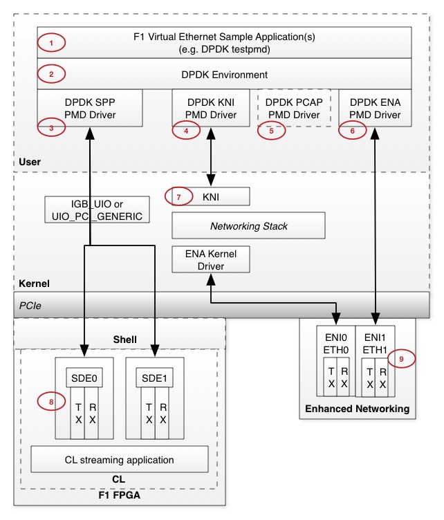

# Virtual Ethernet Architecture

The Virtual Ethernet architecture is built upon DPDK (http://dpdk.org). DPDK is an open source set of libraries and drivers for fast packet processing, and runs mostly in Linux user-space.

The following diagram shows the high level architecture for the Virtual Ethernet sample application(s) and Bringup/Debug tools.

## User Space

**\[1\]** **F1 Virtual Ethernet Sample Applications(s)**: The Virtual Ethernet sample application(s) use the DPDK testpmd application for simple and efficient port-to-port forwarding.  You can use this as a starting point for your custom applications.

**\[2\]** **DPDK Environment**: The DPDK Environment Abstraction Layer (EAL) that provides the fast packet processing infrastructure in user space.
  
**\[3\]** **DPDK SPP PMD Driver**: The AWS Streaming Packet Port (SPP) poll-mode driver that interfaces to the Streaming Data Engine (SDE).

**\[4\]** **DPDK KNI PMD Driver**: An optional driver that may be used for Linux kernel Ethernet frame ingress/egress.

**\[5\]** **DPDK PCAP PMD Driver**: An optional driver that may be used for PCAP Ethernet frame ingress/egress.

**\[6\]** **DPDK ENA PMD Driver**: The AWS Enhanced Network Adapter (ENA) poll-mode driver that interfaces to the Enhanced Network Interface (ENI).

## Kernel

**\[7\]** **KNI**: The optional DPDK Kernel Network Interface (KNI) provides a path from DPDK in user space to the Linux kernel for Linux kernel Ethernet frame ingress/egress.  DPDK applications that want to handle network control plane protocols like DHCP and ARP within the Linux kernel may leverage the DPDK KNI interface for this purpose.

## Hardware

**\[8\]** **SDE**: The Streaming Data Engine that supports the AXI-4 streaming interface to the FPGA custom logic (CL).

**\[9\]** **ENI**: The sample application setup scripts will configure the data-plane end-to-end traffic to use the ENI eth1 interface.  ENI eth0 will be reserved for your SSH connections, and other control-plane traffic. 

# Application Guide

The above Virtual Ethernet architecture supports your development phases with sample applications that include loopback paths for bringup and debug of the Virtual Ethernet application and custom CL, all the way to end-to-end application integration with live traffic.

Please refer to the [Application Guide](./doc/Virtual_Ethernet_Application_Guide.md) for details.

# Hardware Guide

More details about the Streaming Data Engine itself are covered in the [Hardware Guide](./doc/SDE_HW_Guide.md).
