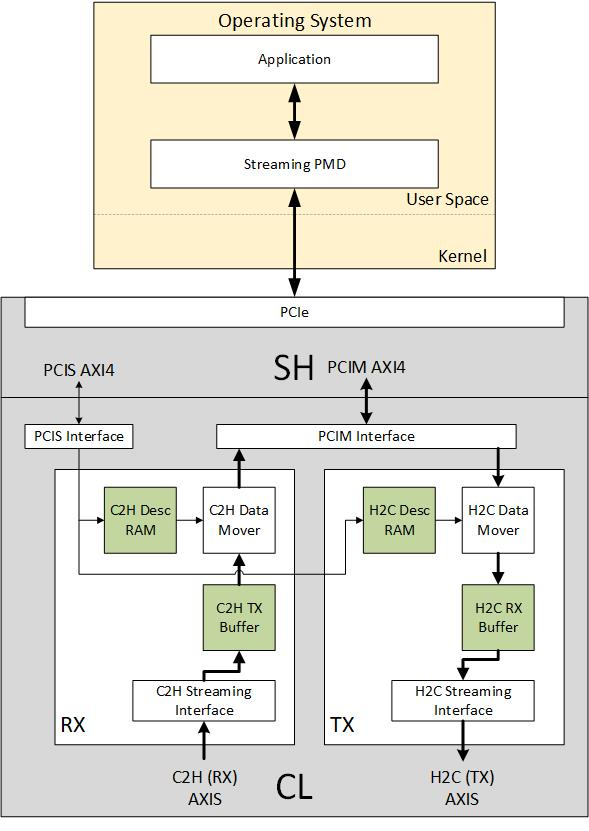

# SDE Hardware Guide

# Table of Contents:

* [Overview](#Overview)

* [Feature List](#FeatureList)

* [Architecture](#Architecture)

* [Designing with the SDE](#DesignCLwSDE)

   * [IOs](#IOs)

   * [Design Configuration parameters](#DesignParam)
    
   * [PF and Address Range](#PF_AddressRange)
   
   * [CSR Description and Address Mapping](#CSRRange)

   * [Descriptors and Write-Back Metadata](#Descriptors)
   
   * [Credit Mechanism](#Credit)
   
   * [Write-Back Mechanism](#WBM)
   
   * [Data Flow Model](#DataFlow)
   
   * [Error Conditions](#Error)
  
   * [Implementation - Maximum Clock Frequency](#MaxClockFreq)

   * [Implementation - Resource Utilization](#ResourceUtil)

* [Example Design](#ExampleDesign)

* [FAQ](#FAQ)

# Overview

The Streaming Data Engine (SDE) provides high-performance packet streaming connectivity between the Custom Logic (CL) and the host application. The SDE provides a streaming interface to the CL and uses the shell's PCIM AXI4 interface to move packets between the CL and the host application. The SDE is a parametrizable, soft IP block that is intended to be instanciated within the CL. Each instance of the SDE provides two AXI streaming compliant interfaces viz. one Card-to-Host (C2H) and one Host-to-Card (H2C) channel.

# Feature List
1. High Performance PPS for C2H and H2C.
2. 12GB/s Bandwidth per channel for C2H and H2C (4KB packet at 250MHz).
3. AXI Stream compliant on the CL facing side.
4. AXI Stream supports parametrizable data widths 64, 128, 256 and 512 bits (Current version supports 512 bits only).
5. AXI4 complaint on the shell facing side.
6. AXI4 supports parametrizable data widths 64, 128, 256 and 512 bits (Current version supports 512 bits only).
7. User bits on the RX and TX streaming interfaces.
8. Multiple descriptor types (Normal and Compact).
9. Multiple descriptors per packet.
10. Write-back for credits and metadata.
11. Multiple write-back metadata types (Normal and compact)
12. One instance of the streaming data engine can be configured at compile-time to provide the following channel combinations  
* One full-duplex streaming channel (one C2H and one H2C). 
* One Streaming C2H Channel only (No H2C Channel)
* One Streaming H2C Channel only (No C2H Channel)

# Architecture

The SDE uses shell's PCIM AXI4 interface to move packets between the AXI Streaming interface and the host. It implements a store and forward mechanism. For C2H, the packets received from the AXI Streaming interface is stored in the C2H packet buffer and are then transmitted on the PCIM AXI4 interface. For H2C, the packets received from the PCIM AXI4 interface are stored in the H2C packet buffer and are then transmitted on the AXI Streaming interface. 

SDE uses descriptors to perform the data movement and the bit-fields of the descriptors are defined to contain all required information for data transfer like buffer physical addresses, length etc. To achieve minimum latency, the SDE implements a descriptor RAM that can be written by software using the PCIS interface utilizing write-combine using  PF0-BAR4. The SDE implements a credit based mechanism to allow the software to track the descriptor utilization. 

In order to minimize latency and reduce the complexity of the software/driver, all the information that is polled by the driver/software (for example, descriptor credits, write-back ring write pointer, etc...) is stored in a contiguous host memory range. The SDE is architected to update these variables together by writing to the physical memory location using the PCIM interface.

# Designing with the SDE

## IOs
* PCIM AXI4 Master Interface: SDE uses this interface to write data to the host. 
* PCIS AXI4 Slave Interface: Software uses this interface to write descriptors and configuration data to the SDE. 
* H2C AXI Stream Master Interface: SDE uses this interface to transmit H2C packets to the CL.
* C2H AXI Stream Slave Interface: SDE uses this interface to receive C2H packets from the CL.
* Clocks and Reset: SDE uses a single clock and a single synchronous active-low reset. 

## Design Configuration parameters
The SDE can be parameterized when the SDE is instanced in the CL. These configuration parameters are static parameters and are expected to be set when the SDE is instanced in the CL. Some important parameters are summarized below.
* C2H_ONLY: Disable SDE H2C logic (Can be set to 1 if only the C2H channel is required).
* H2C_ONLY: Disable SDE C2H logic (Can be set to 1 if only the C2H channel is required).
* C2H_DESC_TYPE & H2C_DESC_TYPE: Descriptor Type (0 - Regular, 1 - Compact) for C2H and H2C respectively.
* C2H_DESC_RAM_DEPTH & H2C_DESC_RAM_DEPTH: Descriptor RAM depth. The maximum number of descriptors for C2H and H2C respectively.
* C2H_BUF_DEPTH & H2C_BUF_DEPTH: Buffer RAM depth.

Full List of Parameters are listed in table below. **Supported values for each parameter are listed in Supported Configurations column.**

| **Name**             | **Default** | **Supported Configurations** | **Description**                                                                                                                                                                                      |
|----------------------|-------------|------------------------------|------------------------------------------------------------------------------------------------------------------------------------------------------------------------------------------------------|
| C2H_ONLY             | 0           | 0, 1 | This should be set to 1 if only C2H is required and H2C is not required. NOTE: If C2H_ONLY = 1, H2C_ONLY should be 0.                                                                                |
| H2C_ONLY             | 0           | 0, 1 | This should be set to 1 if only H2C is required and C2H is not required. NOTE: If H2C_ONLY = 1, C2H_ONLY should be 0.                                                                                |
| PCIS_DATA_WIDTH      | 512         | Default only| PCIS AXI4 Data Bus Width                                                                                                                                                                             |
| PCIS_ID_WIDTH        | 16          | Default only | PCIS AXI4 ID Width                                                                                                                                                                                   |
| PCIS_LEN_WIDTH       | 8           | Default only | PCIS AXI4 AWLEN and ARLEN Width                                                                                                                                                                      |
| PCIS_ADDR_WIDTH      | 64          | Default only | PCIS AXI4 AWADDR and ARADDR Width                                                                                                                                                                    |
| PCIM_DATA_WIDTH      | 512         | Default only | PCIM AXI4 Data Bus Width                                                                                                                                                                             |
| PCIM_ID_WIDTH        | 3           | Default only | PCIM AXI4 ID Width                                                                                                                                                                                   |
| PCIM_LEN_WIDTH       | 8           | Default only | PCIM AXI4 AWLEN and ARLEN Width                                                                                                                                                                      |
| PCIM_ADDR_WIDTH      | 64          | Default only | PCIM AXI4 AWADDR and ARADDR Width                                                                                                                                                                    |
| C2H_DESC_TYPE        | 0           | 0, 1 | Descriptor Type (0 – Regular, 1 – Compact)                                                                                                                                                           |
| C2H_DESC_RAM_DEPTH   | 64          | 64, 128 | Descriptor RAM Depth. This is the maximum number of descriptors                                                                                                                                      |
| C2H_BUF_DEPTH        | 512         | 64, 128, 256, 512 | C2H Buffer RAM Depth. This is the maximum number of data slices that the buffer can hold. C2H buffer width is equal to PCIM_DATA_WIDTH. C2H Buffer size is (C2H_BUF_DEPTH\*PCIM_DATA_WIDTH/8) bytes. |
| C2H_AXIS_DATA_WIDTH  | 512         | Default only | AXIS Data Width                                                                                                                                                                                      |
| C2H_USER_BIT_WIDTH   | 64          | Default only | User Bit Width                                                                                                                                                                                       |
| H2C_DESC_TYPE        | 0           | 0, 1 | Descriptor Type (0 – Regular, 1 – Compact)                                                                                                                                                           |
| H2C_DESC_RAM_DEPTH   | 64          | 64, 128 | Descriptor RAM Depth. This is the maximum number of descriptors                                                                                                                                      |
| H2C_BUF_DEPTH        | 512         | 64, 128, 256, 512 | H2C Buffer RAM Depth. This is the maximum number of data slices that the buffer can hold. Buffer width is equal to PCIM_DATA_WIDTH. H2C Buffer size is (H2C_BUF_DEPTH\*PCIM_DATA_WIDTH/8) bytes.     |
| H2C_AXIS_DATA_WIDTH  | 512         | Default only | AXIS Data Width                                                                                                                                                                                      |
| H2C_USER_BIT_WIDTH   | 64          | Default only | User Bit Width                                                                                                                                                                                       |
| H2C_PKT_SIZE_BYTES   | 64          | Default only | H2C Small Packet Size in Bytes                                                                                                                                                                       |
| C2H_PCIM_DM_AWID     | 0           | Default only | AWID for C2H Data Mover PCIM AXI4 Write Accesses                                                                                                                                                     |
| C2H_PCIM_WB_AWID     | 1           | Default only | AWID for C2H Write-Back PCIM AXI4 Write Accesses                                                                                                                                                     |
| H2C_PCIM_WB_AWID     | 2           | Default only | AWID for C2H Write-Back PCIM AXI4 Write Accesses                                                                                                                                                     |
| C2H_PCIM_DESC_ARID   | 0           | Default only | ARID for C2H Descriptor PCIM AXI4 Read Accesses                                                                                                                                                      |
| H2C_PCIM_DESC_ARID   | 1           | Default only | ARID for H2C Descriptor PCIM AXI4 Read Accesses                                                                                                                                                      |
| H2C_PCIM_DM_ARID     | 2           | Default only | ARID for C2H Data Mover PCIM AXI4 Read Accesses                                                                                                                                                      |
| PCIM_NUM_OT_RD       | 64          | Default only | PCIM Number of Outstanding Reads. This should be 64 when using the AWS shell in order to maximize H2C performance.                                                                                   |
| H2C_PCIM_MAX_RD_SIZE | 0           | Default only | H2C Maximum AXI Read request size (0 – 512B, 1 – 1KB, 2 – 2KB, 3 – 4KB). This should be 0 when using the AWS shell in order to maximize H2C performance.                                             |
| C2H_PCIM_MAX_WR_SIZE | 0           | Default only | C2H Maximum AXI Write request size (0 – 512B, 1 – 1KB, 2 – 2KB, 3 – 4KB). This should be 3 when using the AWS shell in order to maximize C2H performance.                                            |

### PF and Address Mapping
SDE implements a 16KB address space on the PCIS interface and therefore can be accessed using the PF0-BAR4. SDE uses the lower 16 bits of the address bus of the PCIS interface.  The SDE address window should be 16KB aligned. The following table describes address mapping within SDE.

| **Address Range** | **Size (Bytes)** | **Name**                | **Access Type**            | **Description**                                                                                                                                                                                                                                                                                                                                                                                                  |
|-------------------|------------------|-------------------------|----------------------------|------------------------------------------------------------------------------------------------------------------------------------------------------------------------------------------------------------------------------------------------------------------------------------------------------------------------------------------------------------------------------------------------------------------|
| 0x0000 – 0x0FFC   | 4K               | C2H Descriptor RAM      | Write Only (write-combine) | Software should use this address range when writing the C2H Descriptors. Software should only use 64 byte aligned addresses in this range to write partial or full descriptors. SDE will write the descriptors into the descriptor RAM in a FIFO pattern. Only write accesses of 1DW, 4DW or 8DW are allowed to this address range. Read accesses should not be performed and are not supported in this address range. |
| 0x1000 – 0x1FFC   | 4K               | H2C Descriptor RAM      | Write Only (write-combine) | Software should use this address range when writing the H2C Descriptors. Software should only use 64 byte aligned addresses in this range to write partial or full descriptors. SDE will write the descriptors into the descriptor RAM in a FIFO pattern. Only write accesses of 1DW, 4DW or 8DW are allowed to this address range. Read accesses should not be performed and are not supported in this address range. |
| 0x2000 – 0x2FFC   | 4K               | RSVD | Do not use | Reserved for future use                                                                                      |
| 0x3000 – 0x3FFC   | 4K               | CSRs                    | Read-Write (DW accesses)   | Software should use this address range when accessing CSRs. Software should use only 4 byte aligned address of the registers to access CSRs implemented in this range. Only 1 DW read or 1 DW write accesses are allowed in this range.                                                                                                                                                                                   |

### CSR Description and Address Mapping
-----------------

The CSR address space starts at the CSR base address and is organized as shown
below

| **Address Range** | **Size (Bytes)** | **Name**  | **Description**                          |
|-------------------|------------------|-----------|------------------------------------------|
| 0x3000 – 0x31FC   | 512              | PCIS CSRs | PCIS slave Config and Status Registers   |
| 0x3200 – 0x33FC   | 512              | PCIM CSRs | PCIM arbiter Config and Status Registers |
| 0x3400 – 0x39FC   | 1536             | C2H CSRs  | C2H Config and Status Registers          |
| 0x3A00 – 0x3FFC   | 1536             | H2C CSRs  | H2C Config and Status Registers          |

PCIS CSRs
---------

1. **Software Reset Register**

    Address – PCIS_BASE_ADDR + 0x3000

    CSR Offset – CSR_BASE_ADDR + 0x000

    PCIS CSR Offset – PCIS_CSR_BASE_ADDR + 0x000

| **Field Name** | **Bit Range** | **Type** | **Default Value** | **Description**                                                                                                  |
|----------------|---------------|----------|-------------------|------------------------------------------------------------------------------------------------------------------|
| SW_RST         | 0             | RW       | 0x0               | Software Reset. When Set, reset is asserted to all the functional blocks of the SDE except the PCIS Slave Block. |
| RSVD           | 31:1          | RO       | 0x0               | Reserved                                                                                                         |

2. **SDE Info Register**

    Address – PCIS_BASE_ADDR + 0x3004

    CSR Offset – CSR_BASE_ADDR + 0x004

    PCIS CSR Offset – PCIS_CSR_BASE_ADDR + 0x004

| **Field Name** | **Bit Range** | **Type** | **Default Value** | **Description**                         |
|----------------|---------------|----------|-------------------|-----------------------------------------|
| C2H_PRESENT    | 0             | RO       | 0x0               | 1 = C2H Instanced 0 = C2H Not Instanced |
| RSVD           | 15:1          | RO       | 0x0               | Reserved                                |
| H2C_PRESENT    | 16            | RO       | 0x0               | 1 = H2C Instanced 0 = H2C Not Instanced |
| RSVD           | 31:17         | RO       | 0x0               | Reserved                                |

PCIM CSRs
---------

RSVD for future Use

C2H CSRs
--------

 **C2H CSR Address Mapping**

| **Address Range** | **Size (Bytes)** | **Name**            | **Description**                            |
|-------------------|------------------|---------------------|--------------------------------------------|
| 0x3400 – 0x34FC   | 256              | C2H Global CSRs     | C2H Global Config and Status Registers     |
| 0x3500 – 0x35FC   | 256              | C2H Descriptor CSRs | C2H Descriptor Config and Status Registers |
| 0x3600 – 0x36FC   | 256              | C2H Data Mover CSRs | C2H Data Mover Config and Status Registers |
| 0x3700 – 0x37FC   | 256              | C2H Write-back CSRs | C2H Write-Back Config and Status Registers |
| 0x3800 – 0x38FC   | 256              | C2H Buffer CSRs     | C2H Buffer Config and Status Registers     |
| 0x3900 – 0x39FC   | 256              | C2H AXIS CSRs       | C2H AXI-Stream Config and Status Registers |

C2H Global CSRs
------------------

RSVD for future use.

C2H Descriptor CSRs
-------------------

1. **Descriptor Credit Consumed Counter**

    Address – PCIS_BASE_ADDR + 0x3500

    CSR Offset – CSR_BASE_ADDR + 0x500

    C2H CSR Offset – C2H_CSR_BASE_ADDR + 0x100

| **Field Name** | **Bit Range** | **Type** | **Default Value** | **Description**                                       |
|----------------|---------------|----------|-------------------|-------------------------------------------------------|
| CDT_CONSUMED   | 31:0          | RW0C     | 0x0               | Descriptor Credit Consumed Counter. Write 0 to clear. |

2. **Descriptor Credit Limit Counter**

    Address – PCIS_BASE_ADDR + 0x3504

    CSR Offset – CSR_BASE_ADDR + 0x504

    C2H CSR Offset – C2H_CSR_BASE_ADDR + 0x104

| **Field Name** | **Bit Range** | **Type** | **Default Value**  | **Description**                                                                                                           |
|----------------|---------------|----------|--------------------|---------------------------------------------------------------------------------------------------------------------------|
| CDT_LIMIT      | 31:0          | RW0C     | C2H_DESC_RAM_DEPTH | Descriptor Credit Limit Counter. Write 0 to clear. When cleared, the value of the counter is reset to C2H_DESC_RAM_DEPTH. |

3. **Completed Descriptors Counter**

    Address – PCIS_BASE_ADDR + 0x3508

    CSR Offset – CSR_BASE_ADDR + 0x508

    C2H CSR Offset – C2H_CSR_BASE_ADDR + 0x108

| **Field Name** | **Bit Range** | **Type** | **Default Value** | **Description**                                 |
|----------------|---------------|----------|-------------------|-------------------------------------------------|
| COMP_COUNT     | 31:0          | RW0C     | 0x0               | Completed Descriptor Counter. Write 0 to clear. |

4. **Descriptor FIFO Pointers**

    Address – PCIS_BASE_ADDR + 0x350C

    CSR Offset – CSR_BASE_ADDR + 0x50C

    C2H CSR Offset – C2H_CSR_BASE_ADDR + 0x10C

| **Field Name**  | **Bit Range** | **Type** | **Default Value** | **Description**                   |
|-----------------|---------------|----------|-------------------|-----------------------------------|
| FIFO_WR_PTR     | 14:0          | RO       | 0x0               | Descriptor FIFO Write Pointer     |
| FIFO_WR_PTR_MSB | 15            | RO       | 0x0               | Descriptor FIFO Write Pointer MSB |
| FIFO_RD_PTR     | 30:16         | RO       | 0x0               | Descriptor FIFO Read Pointer      |
| FIFO_RD_PTR_MSB | 31            | RO       | 0x0               | Descriptor FIFO Read Pointer MSB  |

5. **Descriptor RAM Address**

    Address – PCIS_BASE_ADDR + 0x3510

    CSR Offset – CSR_BASE_ADDR + 0x510

    C2H CSR Offset – C2H_CSR_BASE_ADDR + 0x110

| **Field Name**  | **Bit Range** | **Type** | **Default Value** | **Description**                                                                                                                                       |
|-----------------|---------------|----------|-------------------|-------------------------------------------------------------------------------------------------------------------------------------------------------|
| DESC_RAM_ADDR   | 15:0          | RW       | 0x0               | Descriptor RAM Address                                                                                                                                |
| DESC_RAM_DW_IDX | 19:16         | RWC      | 0x0               | Descriptor RAM Data DW Index. This bitfield is cleared when this register is written. This will auto-increment when DESC_RAM_DATA is read or written. |
| RSVD            | 31:20         | RO       | 0x0               | Reserved                                                                                                                                              |

6. **Descriptor RAM Data**

    Address – PCIS_BASE_ADDR + 0x3514

    CSR Offset – CSR_BASE_ADDR + 0x514

    C2H CSR Offset – C2H_CSR_BASE_ADDR + 0x114

| **Field Name**   | **Bit Range** | **Type** | **Default Value** | **Description**                                                                                                                                                                                                                                                                                                           |
|------------------|---------------|----------|-------------------|---------------------------------------------------------------------------------------------------------------------------------------------------------------------------------------------------------------------------------------------------------------------------------------------------------------------------|
| DESC_RAM_DATA_DW | 31:0          | RW       | 0x0               | Descriptor RAM Data. When writing the descriptor RAM, SDE initiates a write to the descriptor RAM after all the DWs that make up the descriptor are written to this register. When reading the descriptor RAM, SDE initiates a read from the descriptor RAM when this register is read and when the DESC_RAM_DW_IDX is 0. |

7. **Descriptor RAM Status**

    Address – PCIS_BASE_ADDR + 0x3518

    CSR Offset – CSR_BASE_ADDR + 0x518

    C2H CSR Offset – C2H_CSR_BASE_ADDR + 0x118

| **Field Name**    | **Bit Range** | **Type** | **Default Value** | **Description**                                                                           |
|-------------------|---------------|----------|-------------------|-------------------------------------------------------------------------------------------|
| DESC_OFLOW        | 0             | RW1C     | 0x0               | Desc RAM Overflow Indicates that a descriptor was written when the descriptor RAM is full |
| DESC_OOO_ERROR    | 1             | RW1C     | 0x0               | Desc Out of Order Error                                                                   |
| DESC_UNALIN_ERROR | 2             | RW1C     | 0x0               | Desc Unaligned Address Error                                                              |
| DESC_FULL         | 3             | RO       | 0x0               | Desc RAM Full                                                                             |
| DESC_EMPTY        | 4             | RO       | 0x0               | Desc RAM Empty                                                                            |
| RSVD              | 31:5          | RO       | 0x0               | Reserved                                                                                  |

8. **Descriptor Info**

    Address – PCIS_BASE_ADDR + 0x3520

    CSR Offset – CSR_BASE_ADDR + 0x520

    C2H CSR Offset – C2H_CSR_BASE_ADDR + 0x120

| **Field Name** | **Bit Range** | **Type** | **Default Value** | **Description**                                      |
|----------------|---------------|----------|-------------------|------------------------------------------------------|
| DESC_TYPE      | 0             | RO       | 0x0               | Descriptor/Write-Back Type 0 – Regular 1 – Compact   |
| RSVD           | 15:1          | RO       | 0x0               | RSVD                                                 |
| DESC_RAM_DEPTH | 31:16         | RO       | 0x0               | Descriptor RAM Depth. Maximum Number of descriptors. |

C2H Data Mover CSRs
-------------------

1. **Data Mover Config Register 0**

    Address – PCIS_BASE_ADDR + 0x3600

    CSR Offset – CSR_BASE_ADDR + 0x600

    C2H CSR Offset – C2H_CSR_BASE_ADDR + 0x200

| **Field Name** | **Bit Range** | **Type** | **Default Value** | **Description** |
|----------------|---------------|----------|-------------------|-----------------|
| RSVD           | 31:0          | RW       | 0x0               | Reserved        |

2. **Data Mover Status Register**

    Address – PCIS_BASE_ADDR + 0x3604

    CSR Offset – CSR_BASE_ADDR + 0x604

    C2H CSR Offset – C2H_CSR_BASE_ADDR + 0x204

| **Field Name**  | **Bit Range** | **Type** | **Default Value** | **Description**              |
|-----------------|---------------|----------|-------------------|------------------------------|
| DM_BRESP_ERR    | 0             | RW1C     | 0x0               | Data Mover Bresp Error       |
| DM_DESC_LEN_ERR | 1             | RW1C     | 0x0               | Descriptor Length equal to 0 |
| RSVD            | 31:2          | RO       | 0x0               | Reserved                     |

C2H Write-Back CSRs
-------------------

1. **Write-Back Config Register 0**

    Address – PCIS_BASE_ADDR + 0x3700

    CSR Offset – CSR_BASE_ADDR + 0x700

    C2H CSR Offset – C2H_CSR_BASE_ADDR + 0x300

| **Field Name**  | **Bit Range** | **Type** | **Default Value** | **Description**                                                                                                                                                                                      |
|-----------------|---------------|----------|-------------------|------------------------------------------------------------------------------------------------------------------------------------------------------------------------------------------------------|
| DESC_CNT_WB_EN  | 0             | RW       | 0x0               | Descriptor Count Write-Back Trigger Enable. When set, SDE schedules a status counter write-back when descriptor count increments                                                                     |
| PKT_CNT_WB_EN   | 1             | RW       | 0x0               | Packet Count Write-Back Trigger Enable. When set, SDE schedules a status counter write-back when packet count increments.                                                                            |
| DESC_CDT_WB_EN  | 2             | RW       | 0x0               | Descriptor Credit Write-Back Trigger Enable. When set, SDE schedules a status counter write-back when descriptor credit “limit” increments.                                                          |
| MD_PTR_EN       | 3             | RW       | 0x0               | Metadata Pointer Write-Back Trigger Enable. When this bit is not set, SDE will not perform ring occupancy check (ring full condition) i.e the SDE will disregard the Metadata Read Pointer register. |
| DESC_CDT_WC_EN  | 4             | RW       | 0x0               | Descriptor Credit “Limit” Write-Back Coalesce Enable                                                                                                                                                 |
| DESC_CNT_WC_EN  | 5             | RW       | 0x0               | Descriptor Count Write-Back Coalesce Enable                                                                                                                                                          |
| PKT_CNT_WC_EN   | 6             | RW       | 0x0               | Packet Count Write-Back Coalesce Enable                                                                                                                                                              |
| MD_WR_PTR_WC_EN | 7             | RW       | 0x0               | Metadata Write Pointer Write-Back Coalesce Enable                                                                                                                                                    |
| WC_CNT_MINUS1   | 13:8          | RW       | 0x0               | Write-Back Coalesce Count Minus 1. Number of writes to coalesce.                                                                                                                                     |
| RSVD            | 31:14         | RO       | 0x0               | Reserved                                                                                                                                                                                             |

2. **Status Counters Base Address Low**

    Address – PCIS_BASE_ADDR + 0x3704

    CSR Offset – CSR_BASE_ADDR + 0x704

    C2H CSR Offset – C2H_CSR_BASE_ADDR + 0x304

| **Field Name**    | **Bit Range** | **Type** | **Default Value** | **Description**                                                                                                               |
|-------------------|---------------|----------|-------------------|-------------------------------------------------------------------------------------------------------------------------------|
| STATUS_WB_ADDR_LO | 31:0          | RW       | 0x0               | Status Counters Base Address [31:0] This address should be 64B aligned. The least significant 6 bits of the address should 0. |

3. **Status Write-Back Address High**

    Address – PCIS_BASE_ADDR + 0x3708

    CSR Offset – CSR_BASE_ADDR + 0x708

    C2H CSR Offset – C2H_CSR_BASE_ADDR + 0x308

| **Field Name**    | **Bit Range** | **Type** | **Default Value** | **Description**                      |
|-------------------|---------------|----------|-------------------|--------------------------------------|
| STATUS_WB_ADDR_HI | 15:0          | RW       | 0x0               | Status Counters Base Address [47:32] |
| RSVD              | 31:16         | RO       | 0x0               | Reserved                             |

4. **Write-Back Coalesce Timeout Count**

    Address – PCIS_BASE_ADDR + 0x370C

    CSR Offset – CSR_BASE_ADDR + 0x70C

    C2H CSR Offset – C2H_CSR_BASE_ADDR + 0x30C

| **Field Name** | **Bit Range** | **Type** | **Default Value** | **Description**                        |
|----------------|---------------|----------|-------------------|----------------------------------------|
| WC_TO_TICK_CNT | 19:0          | RW       | 0x0               | Write-Back Coalesce Timeout Tick Count |
| WC_TO_CNT      | 23:20         | RW       | 0x0               | Write-Back Coalesce Timeout Count      |
| RSVD           | 31:24         | RO       | 0x0               | Reserved                               |

5. **Metadata Ring Base Address Low**

    Address – PCIS_BASE_ADDR + 0x3718

    CSR Offset – CSR_BASE_ADDR + 0x718

    C2H CSR Offset – C2H_CSR_BASE_ADDR + 0x318

| **Field Name** | **Bit Range** | **Type** | **Default Value** | **Description**                                                                                                             |
|----------------|---------------|----------|-------------------|-----------------------------------------------------------------------------------------------------------------------------|
| MD_WB_ADDR_LO  | 31:0          | RW       | 0x0               | Metadata Ring Base Address [31:0] This address should be 64B aligned. The least significant 6 bits of the address should 0. |

6. **Metadata Ring Base Address High**

    Address – PCIS_BASE_ADDR + 0x371C

    CSR Offset – CSR_BASE_ADDR + 0x71C

    C2H CSR Offset – C2H_CSR_BASE_ADDR + 0x31C

| **Field Name** | **Bit Range** | **Type** | **Default Value** | **Description**                    |
|----------------|---------------|----------|-------------------|------------------------------------|
| MD_WB_ADDR_HI  | 15:0          | RW       | 0x0               | Metadata Ring Base Address [47:32] |
| RSVD           | 31:16         | RO       | 0x0               | Reserved                           |

7. **Metadata Ring Size**

    Address – PCIS_BASE_ADDR + 0x3720

    CSR Offset – CSR_BASE_ADDR + 0x720

    C2H CSR Offset – C2H_CSR_BASE_ADDR + 0x320

| **Field Name**     | **Bit Range** | **Type** | **Default Value** | **Description**                                                                                                                                                                                                                                                                                                                         |
|--------------------|---------------|----------|-------------------|-----------------------------------------------------------------------------------------------------------------------------------------------------------------------------------------------------------------------------------------------------------------------------------------------------------------------------------------|
| MD_RING_SIZE_BYTES | 31:0          | RW       | 0x0               | Metadata Ring Size (in Bytes). Should be integer multiple of Metadata Size (in Bytes). The maximum number of descriptors in the ring is 65536 and minimum number of descriptors in the ring is 2. For Regular Type metadata, the maximum Metadata ring size is 1MB. For Compact Type metadata, the maximum Metadata ring size is 512KB. |

8. **Metadata Ring Read Pointer**

    Address – PCIS_BASE_ADDR + 0x3724

    CSR Offset – CSR_BASE_ADDR + 0x724

    C2H CSR Offset – C2H_CSR_BASE_ADDR + 0x324

| **Field Name** | **Bit Range** | **Type** | **Default Value** | **Description**            |
|----------------|---------------|----------|-------------------|----------------------------|
| MD_RD_PTR      | 15:0          | RW       | 0x0               | Metadata Ring Read Pointer |
| RSVD           | 31:16         | RO       | 0x0               | Reserved                   |

9. **Metadata Ring Write Pointer**

    Address – PCIS_BASE_ADDR + 0x3728

    CSR Offset – CSR_BASE_ADDR + 0x728

    C2H CSR Offset – C2H_CSR_BASE_ADDR + 0x328

| **Field Name** | **Bit Range** | **Type** | **Default Value** | **Description**                                |
|----------------|---------------|----------|-------------------|------------------------------------------------|
| MD_WR_PTR      | 15:0          | RW0C     | 0x0               | Metadata Ring Write Pointer. Write 0 to clear. |
| RSVD           | 31:16         | RO       | 0x0               | Reserved                                       |

10. **Write Back Status Register**

    Address – PCIS_BASE_ADDR + 0x372C

    CSR Offset – CSR_BASE_ADDR + 0x72C

    C2H CSR Offset – C2H_CSR_BASE_ADDR + 0x32C

| **Field Name**     | **Bit Range** | **Type** | **Default Value** | **Description**                                |
|--------------------|---------------|----------|-------------------|------------------------------------------------|
| WB_STS_BRESP_ERROR | 0             | RW1C     | 0x0               | Write Back BRESP Error for Status Write-Back   |
| WB_MD_BRESP_ERROR  | 1             | RW1C     | 0x0               | Write Back BRESP Error for Metadata Write-Back |
| RSVD               | 31:2          | RO       | 0x0               | Reserved                                       |

11. **Status DW Register**

    Address – PCIS_BASE_ADDR + 0x3730

    CSR Offset – CSR_BASE_ADDR + 0x730

    C2H CSR Offset – C2H_CSR_BASE_ADDR + 0x330

| **Field Name** | **Bit Range** | **Type** | **Default Value** | **Description**  |
|----------------|---------------|----------|-------------------|------------------|
| DESC_ERROR     | 0             | RO       | 0x0               | Descriptor Error |
| DM_ERROR       | 1             | RO       | 0x0               | Data Mover Error |
| WB_ERROR       | 2             | RO       | 0x0               | Write Back Error |
| RSVD           | 31:3          | RO       | 0x0               | Reserved         |

C2H Buffer CSRs
-------------------

1. **Buffer Config Register 0**

    Address – PCIS_BASE_ADDR + 0x3800

    CSR Offset – CSR_BASE_ADDR + 0x800

    C2H CSR Offset – C2H_CSR_BASE_ADDR + 0x400

| **Field Name** | **Bit Range** | **Type** | **Default Value** | **Description** |
|----------------|---------------|----------|-------------------|-----------------|
| RSVD           | 31:0          | RW       | 0x0               | Reserved        |

2. **Buffer Status Register**

    Address – PCIS_BASE_ADDR + 0x3804

    CSR Offset – CSR_BASE_ADDR + 0x804

    C2H CSR Offset – C2H_CSR_BASE_ADDR + 0x404

| **Field Name** | **Bit Range** | **Type** | **Default Value** | **Description** |
|----------------|---------------|----------|-------------------|-----------------|
| BUF_FULL       | 0             | RO       | 0x0               | Buffer Full     |
| BUF_EMPTY      | 1             | RO       | 0x0               | Buffer Empty    |
| AUX_FIFO_FULL  | 2             | RO       | 0x0               | Aux FIFO Full   |
| AUX_FIFO_EMPTY | 3             | RO       | 0x0               | Aux FIFO Empty  |
| RSVD           | 31:4          | RO       | 0x0               | Reserved        |

3. **Buffer Input Packet Count Register**

    Address – PCIS_BASE_ADDR + 0x3808

    CSR Offset – CSR_BASE_ADDR + 0x808

    C2H CSR Offset – C2H_CSR_BASE_ADDR + 0x408

| **Field Name** | **Bit Range** | **Type** | **Default Value** | **Description**    |
|----------------|---------------|----------|-------------------|--------------------|
| IN_PKT_CNT     | 31:0          | RW0C     | 0x0               | Input Packet Count |

4. **Buffer Output Packet Count Register**

    Address – PCIS_BASE_ADDR + 0x380C

    CSR Offset – CSR_BASE_ADDR + 0x80C

    C2H CSR Offset – C2H_CSR_BASE_ADDR + 0x40C

| **Field Name** | **Bit Range** | **Type** | **Default Value** | **Description**     |
|----------------|---------------|----------|-------------------|---------------------|
| OUT_PKT_CNT    | 31:0          | RW0C     | 0x0               | Output Packet Count |

5. **Buffer Pointer Register**

    Address – PCIS_BASE_ADDR + 0x3810

    CSR Offset – CSR_BASE_ADDR + 0x810

    C2H CSR Offset – C2H_CSR_BASE_ADDR + 0x410

| **Field Name** | **Bit Range** | **Type** | **Default Value** | **Description**                        |
|----------------|---------------|----------|-------------------|----------------------------------------|
| BUF_WR_PTR     | 15:0          | RO       | 0x0               | Buffer Write Pointer (RAM entry based) |
| BUF_RD_ADDR    | 31:16         | RO       | 0x0               | Buffer Read Address (Byte based)       |

6. **Aux RAM Pointers**

    Address – PCIS_BASE_ADDR + 0x3814

    CSR Offset – CSR_BASE_ADDR + 0x814

    C2H CSR Offset – C2H_CSR_BASE_ADDR + 0x414

| **Field Name**     | **Bit Range** | **Type** | **Default Value** | **Description**           |
|--------------------|---------------|----------|-------------------|---------------------------|
| AUX_RAM_WR_PTR     | 14:0          | RO       | 0x0               | Aux RAM Write Pointer     |
| AUX_RAM_WR_PTR_MSB | 15            | RO       | 0x0               | Aux RAM Write Pointer MSB |
| AUX_RAM_RD_PTR     | 30:16         | RO       | 0x0               | Aux RAM Read Pointer      |
| AUX_RAM_RD_PTR_MSB | 31            | RO       | 0x0               | Aux RAM Read Pointer MSB  |

7. **Number of Bytes in Buffer Register**

    Address – PCIS_BASE_ADDR + 0x3818

    CSR Offset – CSR_BASE_ADDR + 0x818

    C2H CSR Offset – C2H_CSR_BASE_ADDR + 0x418

| **Field Name** | **Bit Range** | **Type** | **Default Value** | **Description**                                                                                                                                                                 |
|----------------|---------------|----------|-------------------|---------------------------------------------------------------------------------------------------------------------------------------------------------------------------------|
| NUM_BYTES      | 15:0          | RO       | 0x0               | Number of Bytes in Buffer When Aux FIFO is valid, this is the number of bytes until end of current packet When Aux FIFO is not valid, this is the number of bytes in the buffer |
| RSVD           | 31:16         | RO       | 0x0               | Reserved                                                                                                                                                                        |

C2H AXI-Stream CSRs
-------------------

1. **Packet Count**

    Address – PCIS_BASE_ADDR + 0x3900

    CSR Offset – CSR_BASE_ADDR + 0x900

    C2H CSR Offset – C2H_CSR_BASE_ADDR + 0x500

| **Field Name** | **Bit Range** | **Type** | **Default Value** | **Description**                                                                                              |
|----------------|---------------|----------|-------------------|--------------------------------------------------------------------------------------------------------------|
| PKT_CNT        | 31:0          | RW0C     | 0x0               | Number of packets transmitted on the AXIS interface. Increments after transmitting an EOP. Write 0 to clear. |

H2C CSRs
--------

H2C CSR Address Mapping
-------------------

| **Range**       | **Size (Bytes)** | **Name**            | **Description**                            |
|-----------------|------------------|---------------------|--------------------------------------------|
| 0x3A00 – 0x3AFC | 256              | H2C Global CSRs     | H2C Global Config and Status Registers     |
| 0x3B00 – 0x3BFC | 256              | H2C Descriptor CSRs | H2C Descriptor Config and Status Registers |
| 0x3C00 – 0x3CFC | 256              | H2C Data Mover CSRs | H2C Data Mover Config and Status Registers |
| 0x3D00 – 0x3DFC | 256              | H2C Write-back CSRs | H2C Write-Back Config and Status Registers |
| 0x3E00 – 0x3EFC | 256              | H2C Buffer CSRs     | H2C Buffer Config and Status Registers     |
| 0x3F00 – 0x3FFC | 256              | H2C AXIS CSRs       | H2C AXI-Stream Config and Status Registers |

H2C Global CSRs
-------------------

RSVD for future use

H2C Descriptor CSRs
-------------------

1. **Descriptor Credit Consumed Counter**

    Address – PCIS_BASE_ADDR + 0x3B00

    CSR Offset – CSR_BASE_ADDR + 0xB00

    H2C CSR Offset – H2C_CSR_BASE_ADDR + 0x100

| **Field Name** | **Bit Range** | **Type** | **Default Value** | **Description**                                       |
|----------------|---------------|----------|-------------------|-------------------------------------------------------|
| CDT_CONSUMED   | 31:0          | RW0C     | 0x0               | Descriptor Credit Consumed Counter. Write 0 to clear. |

2. **Descriptor Credit Limit Counter**

    Address – PCIS_BASE_ADDR + 0x3B04

    CSR Offset – CSR_BASE_ADDR + 0xB04

    H2C CSR Offset – H2C_CSR_BASE_ADDR + 0x104

| **Field Name** | **Bit Range** | **Type** | **Default Value**  | **Description**                                                                                                           |
|----------------|---------------|----------|--------------------|---------------------------------------------------------------------------------------------------------------------------|
| CDT_LIMIT      | 31:0          | RW0C     | H2C_DESC_RAM_DEPTH | Descriptor Credit Limit Counter. Write 0 to clear. When cleared, the value of the counter is reset to H2C_DESC_RAM_DEPTH. |

3. **Completed Descriptors Counter**

    Address – PCIS_BASE_ADDR + 0x3B08

    CSR Offset – CSR_BASE_ADDR + 0xB08

    H2C CSR Offset – H2C_CSR_BASE_ADDR + 0x108

| **Field Name** | **Bit Range** | **Type** | **Default Value** | **Description**                                 |
|----------------|---------------|----------|-------------------|-------------------------------------------------|
| COMP_COUNT     | 31:0          | RW0C     | 0x0               | Completed Descriptor Counter. Write 0 to clear. |

4. **Descriptor FIFO Pointers**

    Address – PCIS_BASE_ADDR + 0x3B0C

    CSR Offset – CSR_BASE_ADDR + 0xB0C

    H2C CSR Offset – H2C_CSR_BASE_ADDR + 0x10C

| **Field Name**  | **Bit Range** | **Type** | **Default Value** | **Description**                   |
|-----------------|---------------|----------|-------------------|-----------------------------------|
| FIFO_WR_PTR     | 14:0          | RO       | 0x0               | Descriptor FIFO Write Pointer     |
| FIFO_WR_PTR_MSB | 15            | RO       | 0x0               | Descriptor FIFO Write Pointer MSB |
| FIFO_RD_PTR     | 30:16         | RO       | 0x0               | Descriptor FIFO Read Pointer      |
| FIFO_RD_PTR_MSB | 31            | RO       | 0x0               | Descriptor FIFO Read Pointer MSB  |

5. **Descriptor RAM Address**

    Address – PCIS_BASE_ADDR + 0x3B10

    CSR Offset – CSR_BASE_ADDR + 0xB10

    H2C CSR Offset – H2C_CSR_BASE_ADDR + 0x110

| **Field Name**  | **Bit Range** | **Type** | **Default Value** | **Description**                                                                                                                                       |
|-----------------|---------------|----------|-------------------|-------------------------------------------------------------------------------------------------------------------------------------------------------|
| DESC_RAM_ADDR   | 15:0          | RW       | 0x0               | Descriptor RAM Address                                                                                                                                |
| DESC_RAM_DW_IDX | 19:16         | RWC      | 0x0               | Descriptor RAM Data DW Index. This bitfield is cleared when this register is written. This will auto-increment when DESC_RAM_DATA is read or written. |
| RSVD            | 31:20         | RO       | 0x0               | Reserved                                                                                                                                              |

6. **Descriptor RAM Data**

    Address – PCIS_BASE_ADDR + 0x3B14

    CSR Offset – CSR_BASE_ADDR + 0xB14

    H2C CSR Offset – H2C_CSR_BASE_ADDR + 0x114

| **Field Name**   | **Bit Range** | **Type** | **Default Value** | **Description**                                                                                                                                                                                                                                                                                                           |
|------------------|---------------|----------|-------------------|---------------------------------------------------------------------------------------------------------------------------------------------------------------------------------------------------------------------------------------------------------------------------------------------------------------------------|
| DESC_RAM_DATA_DW | 31:0          | RW       | 0x0               | Descriptor RAM Data. When writing the descriptor RAM, SDE initiates a write to the descriptor RAM after all the DWs that make up the descriptor are written to this register. When reading the descriptor RAM, SDE initiates a read from the descriptor RAM when this register is read and when the DESC_RAM_DW_IDX is 0. |

7. **Descriptor RAM Status**

    Address – PCIS_BASE_ADDR + 0x3B18

    CSR Offset – CSR_BASE_ADDR + 0xB18

    H2C CSR Offset – H2C_CSR_BASE_ADDR + 0x118

| **Field Name**    | **Bit Range** | **Type** | **Default Value** | **Description**                                                                           |
|-------------------|---------------|----------|-------------------|-------------------------------------------------------------------------------------------|
| DESC_OFLOW        | 0             | RW1C     | 0x0               | Desc RAM Overflow Indicates that a descriptor was written when the descriptor RAM is full |
| DESC_OOO_ERROR    | 1             | RW1C     | 0x0               | Desc Out of Order Error                                                                   |
| DESC_UNALIN_ERROR | 2             | RW1C     | 0x0               | Desc Unaligned Address Error                                                              |
| DESC_FULL         | 3             | RO       | 0x0               | Desc RAM Full                                                                             |
| DESC_EMPTY        | 4             | RO       | 0x0               | Desc RAM Empty                                                                            |
| RSVD              | 31:1          | RO       | 0x0               | Reserved                                                                                  |

8. **Descriptor Info**

    Address – PCIS_BASE_ADDR + 0x3B20

    CSR Offset – CSR_BASE_ADDR + 0xB20

    H2C CSR Offset – H2C_CSR_BASE_ADDR + 0x120

| **Field Name** | **Bit Range** | **Type** | **Default Value** | **Description**                                      |
|----------------|---------------|----------|-------------------|------------------------------------------------------|
| DESC_TYPE      | 0             | RO       | 0x0               | Descriptor/Write-Back Type 0 – Regular 1 – Compact   |
| RSVD           | 15:1          | RO       | 0x0               | RSVD                                                 |
| DESC_RAM_DEPTH | 31:16         | RO       | 0x0               | Descriptor RAM Depth. Maximum Number of descriptors. |

H2C Data Mover CSRs
-------------------

1. **Data Mover Config Register 0**

    Address – PCIS_BASE_ADDR + 0x3C00

    CSR Offset – CSR_BASE_ADDR + 0xC00

    H2C CSR Offset – H2C_CSR_BASE_ADDR + 0x200

| **Field Name** | **Bit Range** | **Type** | **Default Value** | **Description** |
|----------------|---------------|----------|-------------------|-----------------|
| RSVD           | 31:0          | RW       | 0x0               | Reserved        |

2. **Data Mover Status Register**

    Address – PCIS_BASE_ADDR + 0x3C04

    CSR Offset – CSR_BASE_ADDR + 0xC04

    H2C CSR Offset – H2C_CSR_BASE_ADDR + 0x204

| **Field Name**  | **Bit Range** | **Type** | **Default Value** | **Description**              |
|-----------------|---------------|----------|-------------------|------------------------------|
| DM_RRESP_ERR    | 0             | RW1C     | 0x0               | Data Mover Rresp Error       |
| DM_DESC_LEN_ERR | 1             | RW1C     | 0x0               | Descriptor Length equal to 0 |
| RSVD            | 31:2          | RO       | 0x0               | Reserved                     |

H2C Write-Back CSRs
-------------------

1. **Write-Back Config Register 0**

    Address – PCIS_BASE_ADDR + 0x3D00

    CSR Offset – CSR_BASE_ADDR + 0xD00

    H2C CSR Offset – H2C_CSR_BASE_ADDR + 0x300

| **Field Name** | **Bit Range** | **Type** | **Default Value** | **Description**                                                                                                                             |
|----------------|---------------|----------|-------------------|---------------------------------------------------------------------------------------------------------------------------------------------|
| DESC_CNT_WB_EN | 0             | RW       | 0x0               | Descriptor Count Write-Back Trigger Enable. When set, SDE schedules a status counter write-back when descriptor count increments            |
| PKT_CNT_WB_EN  | 1             | RW       | 0x0               | Packet Count Write-Back Trigger Enable. When set, SDE schedules a status counter write-back when packet count increments.                   |
| DESC_CDT_WB_EN | 2             | RW       | 0x0               | Descriptor Credit Write-Back Trigger Enable. When set, SDE schedules a status counter write-back when descriptor credit “limit” increments. |
| RSVD           | 3             | RO       | 0x0               | Reserved                                                                                                                                    |
| DESC_CDT_WC_EN | 4             | RW       | 0x0               | Descriptor Credit “Limit” Write-Back Coalesce Enable                                                                                        |
| DESC_CNT_WC_EN | 5             | RW       | 0x0               | Descriptor Count Write-Back Coalesce Enable.                                                                                                |
| PKT_CNT_WC_EN  | 6             | RW       | 0x0               | Packet Count Write-Back Coalesce Enable                                                                                                     |
| RSVD           | 7             | RO       | 0x0               | Reserved                                                                                                                                    |
| WC_CNT_MINUS1  | 13:8          | RW       | 0x0               | Write-Back Coalesce Count Minus 1. Number of writes to coalesce.                                                                            |
| RSVD           | 31:14         | RO       | 0x0               | Reserved                                                                                                                                    |

2. **Status Counters Base Address Low**

    Address – PCIS_BASE_ADDR + 0x3D04

    CSR Offset – CSR_BASE_ADDR + 0xD04

    H2C CSR Offset – H2C_CSR_BASE_ADDR + 0x304

| **Field Name**    | **Bit Range** | **Type** | **Default Value** | **Description**                                                                                                               |
|-------------------|---------------|----------|-------------------|-------------------------------------------------------------------------------------------------------------------------------|
| STATUS_WB_ADDR_LO | 31:0          | RW       | 0x0               | Status Counters Base Address [31:0] This address should be 64B aligned. The least significant 6 bits of the address should 0. |

3. **Status Write-Back Address High**

    Address – PCIS_BASE_ADDR + 0x3D08

    CSR Offset – CSR_BASE_ADDR + 0xD08

    H2C CSR Offset – H2C_CSR_BASE_ADDR + 0x308

| **Field Name**    | **Bit Range** | **Type** | **Default Value** | **Description**                      |
|-------------------|---------------|----------|-------------------|--------------------------------------|
| STATUS_WB_ADDR_HI | 15:0          | RW       | 0x0               | Status Counters Base Address [47:32] |
| RSVD              | 31:16         | RO       | 0x0               | Reserved                             |

4. **Write-Back Coalesce Timeout Count**

    Address – PCIS_BASE_ADDR + 0x3D0C

    CSR Offset – CSR_BASE_ADDR + 0xD0C

    H2C CSR Offset – H2C_CSR_BASE_ADDR + 0x30C

| **Field Name** | **Bit Range** | **Type** | **Default Value** | **Description**                        |
|----------------|---------------|----------|-------------------|----------------------------------------|
| WC_TO_TICK_CNT | 19:0          | RW       | 0x0               | Write-Back Coalesce Timeout Tick Count |
| WC_TO_CNT      | 23:20         | RW       | 0x0               | Write-Back Coalesce Timeout Count      |
| RSVD           | 31:24         | RO       | 0x0               | Reserved                               |

5. **Write Back Status Register**

    Address – PCIS_BASE_ADDR + 0x3D10

    CSR Offset – CSR_BASE_ADDR + 0xD10

    H2C CSR Offset – H2C_CSR_BASE_ADDR + 0x310

| **Field Name**     | **Bit Range** | **Type** | **Default Value** | **Description**                              |
|--------------------|---------------|----------|-------------------|----------------------------------------------|
| WB_STS_BRESP_ERROR | 0             | RW1C     | 0x0               | Write Back BRESP Error for Status Write-Back |
| RSVD               | 31:1          | RO       | 0x0               | Reserved                                     |

6. **Status DW Register**

    Address – PCIS_BASE_ADDR + 0x3D14

    CSR Offset – CSR_BASE_ADDR + 0xD14

    H2C CSR Offset – H2C_CSR_BASE_ADDR + 0x314

| **Field Name** | **Bit Range** | **Type** | **Default Value** | **Description**  |
|----------------|---------------|----------|-------------------|------------------|
| DESC_ERROR     | 0             | RO       | 0x0               | Descriptor Error |
| DM_ERROR       | 1             | RO       | 0x0               | Data Mover Error |
| WB_ERROR       | 2             | RO       | 0x0               | Write Back Error |
| RSVD           | 31:3          | RO       | 0x0               | Reserved         |

H2C Buffer CSRs
-------------------

1.  **Buffer Config Register 0**

    Address – PCIS_BASE_ADDR + 0x3E00

    CSR Offset – CSR_BASE_ADDR + 0xE00

    H2C CSR Offset – H2C_CSR_BASE_ADDR + 0x400

| **Field Name** | **Bit Range** | **Type** | **Default Value** | **Description** |
|----------------|---------------|----------|-------------------|-----------------|
| RSVD           | 31:0          | RW       | 0x0               | Reserved        |

2. **Buffer Status Register**

    Address – PCIS_BASE_ADDR + 0x3E04

    CSR Offset – CSR_BASE_ADDR + 0xE04

    H2C CSR Offset – H2C_CSR_BASE_ADDR + 0x404

| **Field Name** | **Bit Range** | **Type** | **Default Value** | **Description** |
|----------------|---------------|----------|-------------------|-----------------|
| BUF_FULL       | 0             | RO       | 0x0               | Buffer Full     |
| BUF_EMPTY      | 1             | RO       | 0x0               | Buffer Empty    |
| AUX_FIFO_FULL  | 2             | RO       | 0x0               | Aux FIFO Full   |
| AUX_FIFO_EMPTY | 3             | RO       | 0x0               | Aux FIFO Empty  |
| RSVD           | 31:4          | RO       | 0x0               | Reserved        |

3. **Buffer Input Packet Count Register**

    Address – PCIS_BASE_ADDR + 0x3E08

    CSR Offset – CSR_BASE_ADDR + 0xE08

    H2C CSR Offset – H2C_CSR_BASE_ADDR + 0x408

| **Field Name** | **Bit Range** | **Type** | **Default Value** | **Description**    |
|----------------|---------------|----------|-------------------|--------------------|
| IN_PKT_CNT     | 31:0          | RW0C     | 0x0               | Input Packet Count |

4. **Buffer Output Packet Count Register**

    Address – PCIS_BASE_ADDR + 0x3E0C

    CSR Offset – CSR_BASE_ADDR + 0xE0C

    H2C CSR Offset – H2C_CSR_BASE_ADDR + 0x40C

| **Field Name** | **Bit Range** | **Type** | **Default Value** | **Description**     |
|----------------|---------------|----------|-------------------|---------------------|
| OUT_PKT_CNT    | 31:0          | RW0C     | 0x0               | Output Packet Count |

5. **Buffer Pointer Register**

    Address – PCIS_BASE_ADDR + 0x3E10

    CSR Offset – CSR_BASE_ADDR + 0xE10

    H2C CSR Offset – H2C_CSR_BASE_ADDR + 0x410

| **Field Name** | **Bit Range** | **Type** | **Default Value** | **Description**                        |
|----------------|---------------|----------|-------------------|----------------------------------------|
| BUF_WR_PTR     | 15:0          | RO       | 0x0               | Buffer Write Pointer (RAM entry based) |
| BUF_RD_ADDR    | 31:16         | RO       | 0x0               | Buffer Read Address (Byte based)       |

6. **Aux RAM Pointers**

    Address – PCIS_BASE_ADDR + 0x3E14

    CSR Offset – CSR_BASE_ADDR + 0xE14

    H2C CSR Offset – H2C_CSR_BASE_ADDR + 0x414

| **Field Name**     | **Bit Range** | **Type** | **Default Value** | **Description**           |
|--------------------|---------------|----------|-------------------|---------------------------|
| AUX_RAM_WR_PTR     | 14:0          | RO       | 0x0               | Aux RAM Write Pointer     |
| AUX_RAM_WR_PTR_MSB | 15            | RO       | 0x0               | Aux RAM Write Pointer MSB |
| AUX_RAM_RD_PTR     | 30:16         | RO       | 0x0               | Aux RAM Read Pointer      |
| AUX_RAM_RD_PTR_MSB | 31            | RO       | 0x0               | Aux RAM Read Pointer MSB  |

7. **Number of Entries in Buffer Register**

    Address – PCIS_BASE_ADDR + 0x3E18

    CSR Offset – CSR_BASE_ADDR + 0xE18

    H2C CSR Offset – H2C_CSR_BASE_ADDR + 0x418

| **Field Name**   | **Bit Range** | **Type** | **Default Value** | **Description**                      |
|------------------|---------------|----------|-------------------|--------------------------------------|
| NUM_FREE_ENTRIES | 15:0          | RO       | 0x0               | Number of Free Entries in Buffer RAM |
| RSVD             | 31:16         | RO       | 0x0               | Reserved                             |

8. **Data Mover Buffer Pointer Register**

    Address – PCIS_BASE_ADDR + 0x3E1C

    CSR Offset – CSR_BASE_ADDR + 0xE1C

    H2C CSR Offset – H2C_CSR_BASE_ADDR + 0x41C

| **Field Name**    | **Bit Range** | **Type** | **Default Value** | **Description**                     |
|-------------------|---------------|----------|-------------------|-------------------------------------|
| DM_BUF_WR_PTR     | 14:0          | RO       | 0x0               | Data Mover Buffer Write Pointer     |
| DM_BUF_WR_PTR_MSB | 15            | RO       | 0x0               | Data Mover Buffer Write Pointer MSB |
| DM_AUX_WR_PTR     | 30:16         | RO       | 0x0               | Data Mover Aux RAM Read Pointer     |
| DM_AUX_WR_PTR_MSB | 31            | RO       | 0x0               | Data Mover Aux RAM Read Pointer MSB |

H2C AXI-Stream CSRs
-------------------

1. **Packet Count**

    Address – PCIS_BASE_ADDR + 0x3F00

    CSR Offset – CSR_BASE_ADDR + 0xF00

    H2C CSR Offset – H2C_CSR_BASE_ADDR + 0x500

| **Field Name** | **Bit Range** | **Type** | **Default Value** | **Description**                                                                                        |
|----------------|---------------|----------|-------------------|--------------------------------------------------------------------------------------------------------|
| PKT_CNT        | 31:0          | RW0C     | 0x0               | Number of packets received on the AXIS interface. Increments after receiving an EOP. Write 0 to clear. |

### Descriptors and Write-Back Metadata
Descriptors are used to provide all required information for the data transfer. The software/driver is
expected to provide this information to the SDE. SDE supports two types of descriptors – Normal and
compact type. The choice of the descriptor type is static and has to be chosen during the design of the
application when the SDE is instanced in the CL. The normal type descriptor is 256 bit wide and the
compact type descriptor is 128 bit wide. The advantage of using the compact descriptor is the reduction
in the BRAM use for the descriptor RAM in the SDE.
Write-Back Metadata is used to provide all the required information about a completed data transfer. SDE
provides this data to the software/driver by writing to a write-back metadata ring stored in host memory.
Write-Back Metadata is only used for C2H transfers. SDE supports two types of write-back metadata –
Normal and compact type. The choice of the write-back metadata type is static and has to be chosen
during the design of the application when the SDE is instanced in the CL. The normal type write-back
metadata is 128 bit wide and the compact type write-back metadata is 64 bit wide. The type of the write-
back metadata will be the same as the descriptor type chosen.

#### C2H Descriptor and Metadata

#### C2H Descriptor

| **Field**            |                 | **Normal Type**    |                   |                     | **Compact Type**   |                   |
|----------------------|-----------------|--------------------|-------------------|---------------------|--------------------|-------------------|
|                      | **Bit-Width**   | **High Bit Index** | **Low Bit Index** | **Bit-Width** | **High Bit Index** | **Low Bit Index** |
| **Length (Bytes)**   | 32              | 31                 | 0                 | 32            | 31                 | 0                 |
| **Physical Address** | 64              | 95                 | 32                | 48            | 79                 | 32                |
| **RSVD**             | 32              | 127                | 96                | 48            | 127                | 80                |
| **Total**            | 128             |                    | 128               |               |                    |                   |

Description of Fields
1) Physical Address: Destination physical address for the data. This is the host guest physical address
used by the SDE to write the packet. For compact descriptor type, this address is 48 bits wide.
2) Length: Number of bytes for the data transfer. The minimum length is 1 byte.
3) RSVD: These bits are used to adjust the total length of the descriptor to 128 bits and unused in
the SDE. SDE does not store these bits in the descriptor RAM.

#### C2H Write-Back Metadata

| **Field**          |                 | **Normal Type**    |                   |               | **Compact Type**   |                   |
|--------------------|-----------------|--------------------|-------------------|---------------|--------------------|-------------------|
|                    | **Bit-Width**   | **High Bit Index** | **Low Bit Index** | **Bit-Width** | **High Bit Index** | **Low Bit Index** |
| **Length (Bytes)** | 32              | 31                 | 0                 | 32            | 31                 | 0                 |
| **Valid**          | 1               | 32                 | 32                | 1             | 32                 | 32                |
| **EOP**            | 1               | 33                 | 33                | 1             | 33                 | 33                |
| **RSVD**           | 30              | 63                 | 34                | 30            | 63                 | 34                |
| **User Bits**      | 64              | 127                | 64                | NA            | NA                 | NA                |
| **Total**          | 128             |                    | 64                |               |                    |                   |

Description of Fields

1.  Valid: This is set to 1 when the SDE writes the write-back metadata.

2.  EOP: This indicates that the EOP was received on the AXI Streaming interface
    during the data transfer for this descriptor.

3.  Length: Number of bytes of data transferred for this descriptor.

4.  User Bits: These bits are sampled on the user bus of the AXI Streaming
    Interface when the EOP is asserted.

5.  RVSD: These bits are used to adjust the total length of the write-back
    metadata to 128 bits and are unused in the SDE.

### H2C Descriptor

| **Field**            |                 | **Normal Type**    |                   |               | **Compact Type** |                   |
|----------------------|-----------------|--------------------|-------------------|---------------|------------------|-------------------|
|                      | **Bit-Width**   | **High Bit Index** | **Low Bit Index** | **Bit-Width** | **High Bit Index** | **Low Bit Index** |
| **Length (Bytes)**   | 32              | 31                 | 0                 | 32            | 31                 | 0                 |
| **Physical Address** | 64              | 95                 | 32                | 48            | 79                 | 32                |
| **EOP**              | 1               | NA                 | 96                | 1             | NA                 | 80                |
| **SPB**              | 1               | NA                 | 97                | 1             | NA                 | 81                |
| **RSVD**             | 94              | 191                | 98                | 46            | 127                | 82                |
| **User Bits**        | 64              | 255                | 192               | NA            | NA                 | NA                |
| **Total**            | 256             |                    | 128               |               |                    |                   |

Descriptions of Fields

1.  Physical Address: Source physical address for the data. This is the host
    guest physical address used by the SDE to read the packet. For compact
    descriptor type, this address is 48 bits wide. This field is not used when
    SPB = 1.

2.  Length: Number of bytes for the data transfer. The minimum length is 1 byte.

3.  EOP: If bit is set, the SDE will assert the “last” signal on the last beat
    of the transfer on the AXI Streaming interface.

4.  SPB: This bit indicates if the source of the packet is Small Packet Buffer
    or PCIM. If this bit is set, the SDE data mover will read the packets from
    SPB instead of the PCIM.

5.  User Bits: These bits are driven on the user bus of the AXI Streaming
    Interface when the EOP is asserted.

6.  RSVD: These bits are used to adjust the total length of the descriptor to
    256 bits and unused in the SDE. SDE does not store these bits in the
    descriptor RAM.

## Credit Mechanism

SDE architecture implements a credit mechanism for descriptors and for small packet buffer. In this section, the description is provided for descriptors but the mechanism is identical for descriptors and small packet buffer.
The credit mechanism contains two counters “consumed” and “limit”. The difference between these two counters is the number of available credits based on which the software can write the descriptors. These counters are implemented as 32 bit rolling counters. These counters are present in both the SDE and the software. However, the SDE updates the software’s copy of the “limit” counter after the SDE reads a descriptor from the descriptor RAM. 

1)	“consumed”: This counter is implemented in the SDE and the software. This counter is initialized to 0. When the software writes the descriptor, software will increment its copy of this counter. When the SDE receives this descriptor into the descriptor RAM, the SDE will increment its copy of this counter. 

2)	“limit”: This counter is implemented in the SDE. The counter is also present in the software but the software will not change the value. software will only use this counter to determine number of available credits. This counter is initialized to the number of available credits. When the SDE completes a descriptor, it will increment its copy of this counter. It will also update the software’s copy of this counter using the PCIM interface.

3)	“available”: This is difference between the “consumed” and the “limit” counters. The software will compute this locally and will use this value to determine how many descriptors can be written.  

## Write-Back Mechanism

### Status Counter Write-Back

 SDE is architect-ed to update some status counters and C2H metadata to host memory locations. 
software should store status counters on contiguous host memory locations.  In order to minimize bandwidth usage, SDE updates all status counters using a single AXI write transaction on PCIM. All these status counters are 32 bits wide (DW) and software should configure the status counters’ host memory base address in the SDE during initialization. SDE updates the following counters periodically

1)	Status DW (Offset 0x0)
a.	Bit 0 – Descriptor Error
b.	Bit 1 – Data Mover Error
c.	Bit 2 – Write Back Error
d.	Bit 31:3 – RSVD
2)	Descriptor Credit “Limit” Counter (Offset 0x4)
3)	Number of completed Descriptors (Offset 0x8)
4)	Packet count on the AXIS interface (Offset 0xC)
5)	Metadata buffer write pointer (C2H Only) (Offset 0x10)

 The Status DW contains bits that denote error conditions in the SDE. When errors are detected, the SDE will update SW’s copy of the Status DW. The SW should poll its copy of the status DW periodically and take recovery action when it reads non-zero values in the Status DW. Each bit corresponds to a functional block that reported the error and SW should read the respective functional block’s status register to determine the exact error. After recovery action is taken, the SW should clear the error flag from the functional block’s status register. When cleared, the SDE will also update SW’s copy of the Status DW. The Status DW should not be written by SW.

 In order to conserve bandwidth and allow for maximum bandwidth usage by the data mover, SDE is architect-ed to coalesce updates to the status counters except the Status DW. SDE maintains one coalesce counter for each status counter and will coalesce the respective status counter. The number writes to coalesce is configurable using CSRs. SDE also implements a configurable timeout mechanism to update the status counters if the required number of writes are not coalesced in the timeout window.

###	C2H Metadata Write-Back

 SDE writes C2H metadata to a circular buffer that is stored in host memory. The mechanism contains two pointers – read and write. The pointers are present in the SDE and the software and they are used to determine if the circular buffer is full and empty respectively. These pointers are implemented using counters initialized to 0 and roll over when their respective values are equal to the number of metadata entries minus 1. 

 The software should configure the circular buffer’s base address and circular buffer size during initialization. The software should also clear SDE’s copy of the read pointer and write pointer during initialization.

  1)	Read pointer: software increments the read pointer when it reads the write-back metadata and software periodically updates SDE’s copy of the read pointer using CSR memory writes. The SDE uses its copy to determine if there is room in the circular buffer before writing metadata. In order to provide as much bandwidth to descriptor writes, software should keep the frequency of updating the SDE’s copy low. 
  
  When posting descriptors, the software can optionally ensure that there is room in the metadata ring. If no free entries are available in the metadata ring, the SDE will keep waiting until software updates the read-pointer. This will eventually backpressure the data mover. 
The software should consider that the metadata ring is full when the value of write pointer plus 1 is equal to the read pointer. 

  2)	Write pointer: SDE uses the write-pointer, metadata ring base address and ring size to determine the address to where the metadata has to be written. SDE increments the write pointer after the SDE writes the metadata to host location and SDE updates software’s copy of the write pointer by writing to host memory. The software can use the write pointer value to determine how many valid metadata entries are present in the circular buffer. 

## Data Flow Model

###	C2H

1)	APP: Application requests the software to move packets from the CL by calling software provided APIs.

2)	CL: The CL streams data into the SDE’s buffer. 

3)	Software: When enough descriptor credits and metadata entries are available, software will write the descriptor (physical address of packet buffer and length) to the SDE’s desc RAM using PF0-BAR4 and write-combine.

4)	SDE: When the software writes the descriptors, the SDE will increment the “consumed”. SDE’s data mover will read the descriptor from the desc RAM. When the SDE’s data mover reads the descriptor, SDE increments the descriptor credit “limit” counter and also schedules an update to the software’s copy of this counter using PCIM.

5)	Software: Software will read the “limit” and compute number of available credits to figure out if more descriptors can be written.

6)	SDE: If there is enough data (as requested in the desc) or if there is an EOP, SDE Data Mover initiates data transfer by issuing writes to host on PCIM. If there is not enough data and if an EOP is not received, data mover will wait. 

7)	SDE: After the data mover completes the data transfer and if metadata ring is not full, SDE writes the metadata (valid bit, byte count, EOP and any user bits) to the metadata ring using PCIM. SDE increments its copy of the metadata ring write-pointer and will also schedule an update to software’s copy of the metadata ring write-pointer.

8)	SDE: The SDE increments the “number of completed descriptors” counter and metadata write pointer. The SDE also schedules an update to software’s copy of these counters.

9)	Software: Software will poll the valid bit of the metadata to figure out that the data transfer is complete.

10)	Software: After reading the metadata, software clears the valid bit of the metadata that was read. Software will increment read pointer and when required, will update SDE’s copy of the metadata ring read pointer. Note if software ensures that metadata entries are available before posting the descriptor, metadata pointers can be disabled and the software is not required to update SDE’s copy of the read pointer.

###	H2C

1)	APP: Application requests the software to move packets to the CL using software provided APIs.

2)	Software: When enough descriptor credits are available, software will write the descriptor (physical address of packet buffer, length, EOP and SPB bits) to the SDE’s desc RAM using PF0-BAR4 and write-combine.

3)	SDE: When the software writes the descriptors, the SDE will increment the “consumed”. SDE’s data mover will read the descriptor from the desc RAM. When the SDE’s data mover reads the descriptor, SDE increments the descriptor credit “limit” counter and also schedules an update to the software’s copy of this counter using PCIM.

4)	Software: Software will read the “limit” and compute number of available credits to figure out if more descriptors can be written.

5)	SDE: If there is enough room in the SDE buffer (as requested by the descriptor), SDE Data Mover initiates data transfer by issuing reads from host DRAM on PCIM. When the descriptor specifies the source of the packet as the small-pkt buffer, the data mover will read from small-pkt buffer instead of using PCIM. If there is not enough room in the buffer, data mover will wait.

6)	SDE: Data mover writes the received PCIM read data to the buffer to be streamed to the CL (for non-small packet buffer case). 

7)	SDE: SDE implements a master streaming interface that reads data from the buffer and streams it to the CL.

8)	SDE: After the data mover completes the data transfer, SDE increments the “number of completed descriptors” counter and also schedules an update to the software’s copy of this counter using PCIM.

9)	Software: Software will poll its copy of “number of completed descriptors” to figure out that data transfer is complete.

10)	Software: Software can also poll its copy of “packet count” to figure out that a packet has been transmitted on the AXI-Stream interface.

## Error Conditions

### C2H Error Conditions

1.  Descriptor RAM Overflow: Occurs when the descriptor RAM is full and SW
    writes a new descriptor

2.  Descriptor Out of Order Error: If a descriptor write is split into multiple
    writes, each write should use incrementing address. If this condition is
    violated, the out of order error is set.

3.  Descriptor Unaligned Error: Occurs when a non-64B aligned address is used
    for writing descriptors.

4.  Data Mover BRESP Error: Occurs when a non-zero BRESP is received on the PCIM
    interface for data writes

5.  Data Mover Descriptor Length Error: Occurs when data mover encounters a
    descriptor with length equal to 0.

6.  Write Back BRESP Error: Occurs when a non-zero BRESP is received on the PCIM
    interface for write-back writes.

### H2C Error Conditions

1.  Descriptor RAM Overflow: Occurs when the descriptor RAM is full and SW
    writes a new descriptor

2.  Descriptor Out of Order Error: If a descriptor write is split into multiple
    writes, each write should use incrementing address. If this condition is
    violated, the out of order error is set.

3.  Descriptor Unaligned Error: Occurs when a non-64B aligned address is used
    for writing descriptors.

4.  Data Mover RRESP Error: Occurs when a non-zero RRESP is received on the PCIM
    interface for data reads

5.  Data Mover Descriptor Length Error: Occurs when data mover encounters a
    descriptor with length equal to 0.

6.  Write Back BRESP Error: Occurs when a non-zero BRESP is received on the PCIM
    interface for write-back writes.

### Implementation - Maximum Clock Frequency
The SDE can be implemented at a maximum frequency of 250MHz

### Implementation - Resource Utilization
The resource utilization for the SDE implemented at 250MHz when using 64 descriptor RAM depth and 32KB buffers for C2H and H2C each. 

| Total LUTs | Logic LUTs | LUTRAMs | SRLs |  FFs  | RAMB36 | RAMB18 | URAM | DSP48 Blocks| 
|------------|------------|---------|------|-------|--------|--------|------|-------------|
| 37056      | 36568      | 488     | 0    | 23282 | 16     | 3      | 0    | 0           |

## Example Design
AWS provides an example CL called CL_SDE. CL_SDE instances the SDE and some utility and test blocks to demonstrate the functionality of the SDE. See [CL_SDE](../../../../hdk/cl/examples/cl_sde/) for details.

## FAQ

### Q: What is the maximum number of full duplex channels per instance of SDE?
One instance of SDE will provide one full duplex channel (one C2H and one H2C). 

### Q: My application does not need C2H. I only need H2C. How can this be done?
Design parameters C2H_ONLY and H2C_ONLY can be used to get what is required and avoid unwanted logic. For example, if only C2H is required, C2H_ONLY should be 1 so that H2C logic is avoided. 

### Q. My application needs more than one full duplex channel. How can this be achieved? 
With the current version of the SDE, if more than 1 full duplex channel is needed, multiple SDEs have to be instanced and AXI crossbars have to be used to connect the PCIS and PCIM buses to/from the corresponding SDEs. Similarly, if more than 1 C2H or more than 1 H2C channel is required, multiple SDEs have to be used.

### Q. Is there a maximum number of SDEs that can be instanced in a CL?
There is no theoritecal maximum. There is a practical limitation based on the number of resources in the CL. 

### Q. What kind of software/Driver is required to use the SDE. 
A userspace or kernel poll-mode driver is required to use the SDE.

### Q. Does AWS have any example Driver/Application? 
AWS provides DPDK based Virtual Ethernet application described [here](./Virtual_Ethernet_Application_Guide.md).

### Q. Does SDE supports interrupts?
Interrupts are not supported by the SDE.

### Q. My application needs more descriptors in the SDE? How can I achieve this? 
Parameters C2H_DESC_RAM_DEPTH and H2C_DESC_RAM_DEPTH can be used to increase the number of descriptors that can be stored in the SDE. Note that this will increase BRAM usage in the SDE. 

### Q. How can I change the size of the H2C and C2H buffers? 
Parameters C2H_BUF_DEPTH and H2C_BUF_DEPTH can be used to change the size of the main packet buffers for C2H and H2C respectively. 

### Q. What is the guideline for choosing buffer sizes?
The H2C buffer should be sized according to the bandwidth requirements. Having a very small H2C buffer will cause the SDE to reduce the effective number of outstanding PCIM reads leading to host DRAM latencies getting manifested on the H2C AXI-S interface, leading to reduced H2C bandwidth. AWS has observed that 32KB buffer is sufficient to maximize H2C throughput assuming average DRAM latency of 2us and PCI-E BW of 16GB/s. 
The C2H buffer should be sized according to CL resource availability and latency requirements. Assuming 4KB PCIM writes, AWS recommends at least a size of 16KB C2H buffer to maximize C2H BW. 

### Q. My application needs more than / less than 64 user bits. How can this be achieved? 
In the current version of the SDE, User bit width cannot be changed. Therefore, parameters C2H_USER_BIT_WIDTH and H2C_USER_BIT_WIDTH should not be changed. If more user bits are required, they will have to be embedded in the payload of the packet (For example, preamble or appended at the end of the packet). 

### Q. Can I use write-combine to write multiple descriptors per clock? 
Traditional Write-combine, explained [here](https://github.com/awslabs/aws-fpga-app-notes/tree/master/Using-PCIe-Write-Combining), routinely causes the CPU to generate out of order writes to the descriptor address range. SDE does not support out of order writes to the descriptor range. Therefore, x86 intrinsic load/store instructions should be used to write descriptors in order. 

### Q. What is the maximum throughput of the SDE? 
The maximum throughput for H2C is 12 GB/s and the maximum throughput for C2h is 12.4 GB/s. 

### Q. What is the minimum packet size required for maximum throughput? 
4KB is the minimum packet size required for maximum throughput.

### Q. My application uses PCIS and PCIM interfaces for other purposes in the CL. Can I still use the SDE? 
Yes, the SDE can still be used. However, appropriate AXI Crossbars/Fabric needs to be used in the CL in order to provide connectivity for PCIS and PCIM buses to the SDE. Additionally, address and ARID/AWIDs should be appropriately configured/parametrized in the software and the SDE respectively.

### Q. My accelerator/CL cannot transmit/receive data at 512bits per clock. Can SDE transmit/receive less than 512 bits per clock on the H2C/C2H Streaming Interfaces? 
The current version of the SDE can only transmit/receive data at 512 bits per clock. The CL developer can use Xilinx AXI-S width converters to achieve width conversion from any bit width to 512 bits. 

### Q. What is the guideline for choosing between Regular and Compact Descriptor/Metadata types?
Regular Descriptor/Metadata will provide 64 bits for host address and also provide 64 bits for User bits. Compact Descriptor/Metadata will provide only 48 bits for host address and does not provide any user bits. Using the compact type will save PCIS bandwidth for descriptor writes, save PCIM bandwidth for Metadata writes and save BRAM space in the SDE. 
Therefore, the compact type should be chosen when user bits are not required and also to maximize bandwidth usage for packet data and to save BRAM utilization in the CL.

### Q. How many clocks and resets does the SDE use?
The SDE uses only one clock. The SDE uses only one reset that is synchronized to the aforementioned clock.

### Q. Can the SDE be implemented at a clock frequency greater than 250MHz?
AWS only supports SDE implemented at a maximum of 250MHz. 

### Q. Should the SDE be constrained to a single SLR? 
AWS recommends that the all the logic in the SDE be constrained to a single SLR. Additionally, AWS recommends adding pipelining on the PCIM and PCIS interfaces from the shell leading up to the SDE.

