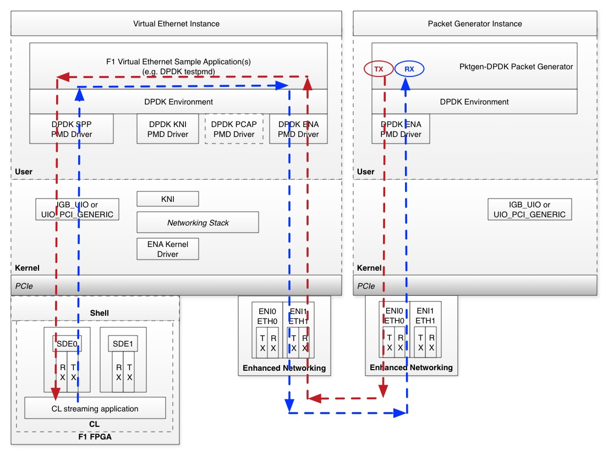

# Virtual Ethernet Application Guide

## Table of Contents:

* [Overview](#Overview)

* [Example Workflows](#ExampleWorkflows)

   * ["Hello World" Loopback](#HelloWorldLoopback)
   
   * ["End-to-End" PacketGen Traffic](#EndToEndPktGen)
   
* [FAQ](#FAQ)


<a name="Overview"></a>
## Overview

The Virtual Ethernet architecture ([here](../README.md)) supports your development phases with sample applications that include loopback paths for bringup and debug of the Virtual Ethernet application and custom CL, all the way to end-to-end application integration with live traffic.

## Virtual Ethernet Application Setup and Use
The distinct phases of Virtual Ethernet Application setup and use are:

* Software installation and build 
* System setup and device binding (e.g. FPGA and ENI)
* Application setup and start

The next sections walk through the setup and usage phases including example workflows.

<a name="ExampleWorkflows"></a>
## Example Workflows

<a name="HelloWorldLoopback"></a>
### "Hello World" DPDK testpmd loopback mode, auto-start
This example maximizes PPS for 64B packets with a single vCPU using the DPDK testpmd application to drive the DPDK SPP PMD and the FPGA SDE IP.  This may be used for streaming CL bringup and performance measurements in an isolated loopback environment.  It runs testpmd in auto-start mode, sends the first burst of TX packets (32 packets by default), and displays packet statistics every 3 seconds (including PPS).  To exit the example, use `ctrl-c`.

Software installation and build phase

```
cd $(SDK_DIR)/apps/virtual-ethernet/scripts
sudo ./virtual_ethernet_install.py <install_dir>
```

System setup and device bind phase, e.g. on instance boot

```
sudo fpga-load-local-image -S <fpga-slot> -I <SDE loopback CL AGFI>
cd $(SDK_DIR)/apps/virtual-ethernet/scripts
sudo ./virtual_ethernet_setup.py <install_dir>/dpdk <fpga-slot>
```

Testpmd application setup and start phase

```
cd <install_dir>/dpdk
sudo ./x86_64-native-linuxapp-gcc/app/testpmd -l 0-1  -- --port-topology=loop --auto-start --tx-first --stats-period=3
```

Please refer to [DPDK testpmd](#testpmd) for a quick reference guide on the supported testpmd features and the link to the full testpmd documentation.

<a name="EndToEndPktGen"></a>
### "End-to-End" PacketGen Traffic

This example maximizes PPS for 64B packets with a single vCPU using two instances to test end-to-end traffic flows.

In the below diagram, the `red` line shows the Ethernet frame path from the **Packet Generator Instance** into the CL streaming application in the **Virtual Ethernet Instance**.  The `blue` line shows the Ethernet frame path from the CL streaming application in the **Virtual Ethernet Instance** to the **Packet Generator Instance**.  For best performance, the **Virtual Ethernet Instance** and the **Packet Generator Instance** should be created in the same VPC and placement group.



* **Virtual Ethernet Instance**

    * This workflow sets up the DPDK testpmd application for port-to-port forwarding through the DPDK ENA PMD, the DPDK SPP PMD and SDE. It then runs testpmd in auto-start mode and displays packet statistics every 3 seconds (including PPS).  To exit testpmd, use `ctrl-c`.

* **Traffic Generator Instance**
    * The Traffic Generator instance uses pktgen-dpdk to send max PPS towards the Virtual Ethernet instance.
    
* **Network Interface Setup**
    * This example workflow places the PacketGen traffic on `eth1`, and reserves `eth0` for your SSH sessions and other control plane traffic.
    * An additional network interface can be attached via the EC2 "Attach Network Interface" workflow.  Your new `eth1` network interface is automatically initialized if you are using Amazon Linux.  If you are using CentOS, please refer to these additional [steps](#CentosEthCfg).  The ENI `DBDF` (e.g. the PCI Domain:Bus:Device.Function) for your new ENI interface is retrieved using this [command](#EniDbdf). 

#### Virtual Ethernet instance

Software installation and build phase

```
cd $(SDK_DIR)/apps/virtual-ethernet/scripts
sudo ./virtual_ethernet_install.py <install_dir>
```

System setup and device bind phase, e.g. on instance boot

```
sudo fpga-load-local-image -S <fpga-slot> -I <SDE loopback CL AGFI>
cd $(SDK_DIR)/apps/virtual-ethernet/scripts
sudo ./virtual_ethernet_setup.py <install_dir>/dpdk <fpga-slot> --eni_dbdf <ENI DBDF> --eni_ethdev <ENI ethdev>
```

Testpmd application setup and start phase

```
cd <install_dir>/dpdk
./x86_64-native-linuxapp-gcc/app/testpmd -l 0-1  -- --port-topology=chained --auto-start --stats-period=3 --forward-mode=spp-eni-addr-swap
```

The `spp-eni-addr-swap` testpmd forwarding mode swaps the Ethernet MAC and IP addresses so the Packet Generator instance can receive the loopback Ethernet frames.

Please refer to [DPDK testpmd](#testpmd) for a quick reference guide on the supported testpmd features and the link to the full testpmd documentation.

#### Packet Generator Instance

Software installation and build phase

```
cd $(SDK_DIR)/apps/virtual-ethernet/scripts
sudo ./virtual_ethernet_pktgen_install.py <install_dir>
```

System setup and device bind phase, e.g. on instance boot

```
cd $(SDK_DIR)/apps/virtual-ethernet/scripts
sudo ./virtual_ethernet_pktgen_setup.py <install_dir> --eni_dbdf <ENI DBDF> --eni_ethdev <ENI ethdev>
```

Packet Generator setup and start phase:

A sample Packet Generator `pktgen-ena.pkt` script is provided.   You will need to modify it to work with your F1 instances.

```
cat $(SDK_DIR)/apps/virtual-ethernet/scripts/pktgen-ena.pkt 
set 0 dst mac 12:DD:AB:C2:D3:B8  # set this to Virtual Ethernet instance eth1 mac address
set 0 src ip 172.31.63.86/24     # set this to the Packet Generator instance eth1 IP address
set 0 dst ip 172.31.58.142       # set this to the Virtual Ethernet instance eth1 IP address
set 0 sport 54321
set 0 dport 51234
set 0 type ipv4
set 0 proto udp
set 0 size 64
start 0
```

```
cd <install_dir>/pktgen-dpdk
./app/x86_64-native-linuxapp-gcc/pktgen -l 0,1 -n 4 --proc-type auto --log-level 7 --socket-mem 2048 --file-prefix pg -b 00:03.0 -- -T -P -m [1].0 -f $(SDK_DIR)/apps/virtual-ethernet/scripts/pktgen-ena.pkt
```

Also provided is a sample Packet Generator `pktgen-ena-range.pkt` script.  This script will need to be modified to work with your F1 instances.  `pktgen-ena-range.pkt` varies the source and destination UDP ports but leaves the size at 64B to show PPS performance using multiple UDP flows.

<a name="FAQ"></a>
## FAQ

### Q: What is the AGFI ID for the SDE loopback CL?

The AGFI ID for the SDE loopback CL is found in the `CL_SDE Example Metadata` section at the bottom of the `CL_SDE README` [here](../../../../hdk/cl/examples/cl_sde).

<a name="testpmd"></a>
### Q: Where can I find DPDK testpmd feature documentation?

The full documentation for DPDK testpmd features is found [here](http://dpdk.org/doc/guides/testpmd_app_ug/index.html).

Note that not all of the DPDK testpmd features are supported by the SPP and ENI PMDs.  SPP supports a limited subset of the DPDK Ethernet upper API (e.g. DPDK eth_dev_ops) to the DPDK application(s) (e.g. testpmd) for purposes of passing through streaming packets to/from the SDE. 

The application examples use testpmd auto-start mode.  testpmd also supports an interactive mode that may be used during debug and test sessions.  Interactive mode is especially useful when running testpmd within the `gdb` debugger.  Below is a quick reference guide for some of the supported testpmd interactive mode commands that may be used with the application examples.

For interactive mode, the command line will need to be modified as follows.

For the ["Hello World" Loopback](#HelloWorldLoopback) example:

./x86_64-native-linuxapp-gcc/app/testpmd -l 0-1  -- --port-topology=loop --auto-start --tx-first --stats-period=3

Change the command line as follows:

./x86_64-native-linuxapp-gcc/app/testpmd -l 0-1  -- --port-topology=loop -i

You should now be in interactive mode with a `testpmd>` prompt.  

* show port info all
    * Shows the port info for all of the active DPDK ports (e.g. shows DPDK port `0` to driver name `net_spp` mapping)
* start tx_first
    * Sends the first burst of TX packets.  This is required for loopback mode.
* show port stats all
    * Shows the common port stats accross all of the active DPDK ports
* show port xstats all
    * Shows common and PMD-specific `extra` stats.  For SPP, this is where TX and RX `spp_errors` is visible.
* stop
    * Stops packet forwarding and prints the packet forwarding statistics.

### Q: Can I map multiple ENIs to a SPP?

The simple ["End-to-End" PacketGen Traffic](#EndToEndPktGen) example uses a one-to-one mapping between SPP and ENI as configured via testpmd.  Your custom applications(s) may map multiple ENIs to a SPP as long as your application follows the DPDK threading model (e.g. ‘lockless’) and the CL supports Ethernet frames from multiple ENIs.

### Q: Can I map different ENIs to different SPP queues?

The simple ["End-to-End" PacketGen Traffic](#EndToEndPktGen) example uses a one-to-one mapping between SPP and ENI as configured via testpmd.  Multiple SPP queues are not yet supported.

### Q: What performance should I expect?

The goal of SPP on F1 is to sustain line rate network bandwidth for all network configurations supported on the AWS FPGA instances.

### Q: How does packet drop and flow control work? 

Packet drop and flow control characteristics are application specific, since you are free to use the DPDK drivers and environment in the best way that suits your specific application.  

As an example, let’s assume we have a packet forwarding topology that directly connects an ENI to an SPP that does not drop any remaining TX packets after partial TX packet burst has been submitted to ENI.  Since the application is in control of the packet processing, it can flow off the SPP RX side by asking for fewer RX packets in the next call to the SPP RX packet burst API.  If the ENI TX backpressure condition persists, the application may stop calling the SPP RX packet burst API.  At this point, SPP will stop processing RX descriptors, the C2H buffer in the SDE will become full (see the SDE HW Guide [here](./SDE_HW_Guide.md)), and this will backpressure the AXI-Stream interface (e.g. the SDE will de-assert the ‘ready’ signal on the C2H AXI-Stream interface).  This may then backpressure the SPP TX side, which is again under application control.  If the SPP TX side backpressure condition persists, the application may stop processing ENI RX packets and this will eventually cause packet drops on the ENI RX side facing the network.

### Q: How are SDE errors reported?

On each call to the SPP TX/RX packet burst APIs, the DPDK SPP PMD checks the SDE write-back TX/RX status.  If the SDE write-back status is non-zero, the SPP PMD takes the following steps:

* Log-info the TX/RX channel SPP driver status variables and the SDE status write-back variables
* Log-info the specific SDE error info from the SDE block that encountered the error
* Log-info the descriptor ring entries
* Increments the TX/RX sde_error stat
* Log-error and return from the TX/RX status checking method.
* Return 0 packets processed from the SPP TX/RX packet burst APIs (e.g. the DPDK TX/RX packet burst APIs return a uint16_t that indicates the number of packets that were processed in the current call).

Your application should periodically check to see if the TX/RX sde_error stat is non-zero (e.g. by calling the eth_dev_ops xstats_get API for error checking in the `slow-path`).  If the TX/RX sde_error stat is non-zero, your application should take the following error recovery steps:

* Quiesce all calls to TX/RX packet burst (e.g. discontinue calling `rte_eth_dev tx/rx_pkt_burst`)
* Release all of the SPP queues (e.g. call `eth_dev_ops tx/rx_queue_release`)
* Remove the SPP PCI device (e.g. call `rte_pci_driver remove`)
* Reload the AGFI using `fpga-load-local-image` to ensure the CL is fully reset

At this point, the DPDK SPP driver and SDE may be re-initialized as normal.  The SDE is reset during the SPP PCI device probe initialization step, and the TX/RX queues are re-initialized during the TX/RX queue setup phase.

### Q: What is the minimal packet size supported by AWS FPGA virtual ethernet IP? 

FPGA CL must generate packets with 64Byte or more to meet the Ethernet minimum frame size requirement.

### Q: What is the maximal packet size? 

It is the maximal packet size offered by ENI on your instance (including the 4-byte CRC).

### Q: Should I calculate the Ethernet frame CRC32? 

No, SPP relies on the ENI to check CRC on receive and calculate it on transmit.

### Q: What MAC address should I use for SPP? 

The SPP MAC address is normally unused for testpmd port based forwarding and defaults to all zeroes.  The default SPP MAC address may be changed if needed using the testpmd ‘mac_addr set’ command when using the testpmd application, or by your custom application using the DPDK APIs.

Note that the SPP and SDE do not perform any modifications to the TX packets (e.g. from the application to the CL), or the RX packets (e.g. from the CL to the application).  The SDE does not perform any packet filtering (e.g. based on the packet destination MAC address).

### Q: How many TX and RX descriptors are supported?

The number of supported TX and RX descriptors per SPP queue pair is parameterized within the SDE block and reported by the SDE to SPP via registers within the SDE block (see the SDE H2C and C2H channels [here](./SDE_HW_Guide.md)).  SPP defines a minimum and the maximum number of descriptors between 64 and 32K.  The number of TX and RX descriptors implemented in the SDE and requested by the DPDK application in the SPP queue setup phase must be equal, and a power of 2.

### Q: How do I configure SPP to use SDE regular or compact descriptors?

The SDE may be built with regular or compact descriptor types (see the C2H_DESC_TYPE and H2C_DESC_TYPE in the Design Parameters section [here](./SDE_HW_Guide.md)).  The SPP PMD also supports regular or compact descriptor types at compile time via the SPP_USE_COMPACT_DESCS define within spp_defs.h.  The default descriptor type for the SDE and SPP is `regular` to support the full 64-bit DMA addressing.  If there is a mismatch between the SDE and SPP descriptor type build options, the SPP driver will log an error similar to the following:

Mismatched build options: SDE descriptor type is `regular`, SPP PMD decriptor type is `compact`.

```
PMD: spp_dev_cap_get(): SDE C2H Desc Info(0x00400000), type=regular, is not supported
```

Mismatched build options: SDE descriptor type is `compact`, SPP PMD decriptor type is `regular`.

```
PMD: spp_dev_cap_get(): SDE C2H Desc Info(0x00800001), type=compact, is not supported
```

### Q: What operating systems are supported?

The Virtual Ethernet application is tested and supported for Linux operating systems (Amazon Linux, CentOS and Ubuntu).

<a name="CentosEthCfg"></a>
### Q: I am using the CentOS AMI.  How do I setup the additional ENI/eth1 interface for the ["End-to-End" PacketGen Traffic](#EndToEndPktGen) example?

An additional network interface can be attached via the EC2 "Attach Network Interface" workflow.  Your new `eth1` network interface is automatically initialized if you are using Amazon Linux.  If you are using CentOS, please execute the following steps:

Add the `GATEWAYDEV=eth0` to the `/etc/sysconfig/network` file.

```
cd /etc/sysconfig
echo "GATEWAYDEV=eth0" >> network 
```

Use the `ifconfig` command to show the `eth1` MAC address (e.g. the `ether 12:1e:7e:0b:70:2e` in the below example).

```
ifconfig eth1
eth1: flags=4098<BROADCAST,MULTICAST>  mtu 1500
        ether 12:1e:7e:0b:70:2e  txqueuelen 1000  (Ethernet)
```

Create an `eth1` specific config file using the `eth0` config file as a template.

```
cd network-scripts
cp cp ifcfg-eth0 ifcfg-eth1
vi ifcfg-eth1
DEVICE=eth0              # change to eth1
HWADDR=12:67:cd:53:d3:b0 # change to the eth1 MAC address from the above ifconfig command
```

Initialize the `eth1` interface using `ifup` and then show the `eth1` configuration using `ifconfig`.

```
ifup eth1
Determining IP information for eth1... done.
ifconfig eth1
eth1: flags=4163<UP,BROADCAST,RUNNING,MULTICAST>  mtu 9001
        inet 172.31.59.192  netmask 255.255.240.0  broadcast 172.31.63.255
        inet6 fe80::101e:7eff:fe0b:702e  prefixlen 64  scopeid 0x20<link>
        ether 12:1e:7e:0b:70:2e  txqueuelen 1000  (Ethernet)
        RX packets 10  bytes 1052 (1.0 KiB)
        RX errors 0  dropped 0  overruns 0  frame 0
        TX packets 12  bytes 1416 (1.3 KiB)
        TX errors 0  dropped 0 overruns 0  carrier 0  collisions 0
```

At this point, the `eth1` interface is ready for the setup script(s) that are described in the ["End-to-End" PacketGen Traffic](#EndToEndPktGen) example.

<a name="EniDbdf"></a>
### Q: How do I retrieve the ENI DBDF for the additional ENI/eth1 interface that is used in the ["End-to-End" PacketGen Traffic](#EndToEndPktGen) example?

The ENI DBDF for the `eth1` interface can be retrieved as follows using a grep for `1d0f:ec20` through the `lspci` command ouput.

```
lspci -D | grep "1d0f:ec20"
0000:00:03.0 Ethernet controller: Device 1d0f:ec20    # this is eth0
0000:00:04.0 Ethernet controller: Device 1d0f:ec20    # this is eth1.  The DBDF is 0000:00:04.0
```

### Q: How do I update DPDK and SPP with the Vendor/Device ID for my CL?

Within `<install_dir>/dpdk/drivers/net/spp` there is a file called `spp_ethdev.c`.  Your Vendor and Device ID should be added to the following table in `spp_ethdev.c` and then DPDK should be recompiled.

```
static const struct rte_pci_id pci_id_spp_map[] = {
        { RTE_PCI_DEVICE(PCI_VENDOR_ID_AMAZON, PCI_DEVICE_ID_SDE_LOOPBACK_CL) },
        { RTE_PCI_DEVICE(<Your Vendor ID>, <Your Device ID>) },
        { .device_id = 0 },
};
```

Rebuild DPDK as follows:

```
cd <install dir>/dpdk/x86_64-native-linuxapp-gcc
make
```

Within `<install dir>/dpdk/usertools` there is a file called `dpdk-devbind.py`.  Your Vendor and Device ID should be added to the following table in `dpdk-devbind.py`.

```
aws_fpga_sde = {'Class': '05', 'Vendor': '1d0f', 'Device': 'f002',
              'SVendor': None, 'SDevice': None}
<your tag> = {'Class': '05', 'Vendor': '<Your Vendor ID>', 'Device': '<Your Device ID>',
              'SVendor': None, 'SDevice': None}
              
network_devices = [network_class, cavium_pkx, avp_vnic, aws_fpga_sde, <your tag>]
```

You should then run the `virtual_ethernet_setup.py` script which will re-run the `dpdk-devbind.py` script to bind DPDK and SPP to your Vendor and Device Id.
